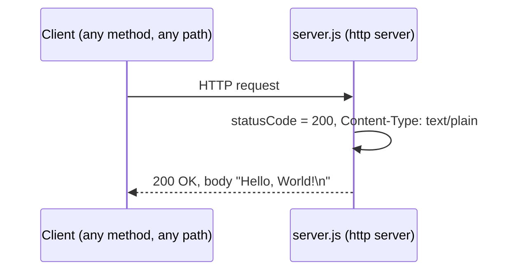
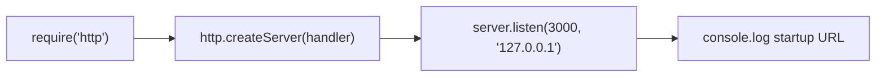

# hao-backprop-test

A minimal, single-file Node.js HTTP server that answers **every** request with a fixed `Hello, World!` greeting (`Source: server.js:36-40`). It exists as a lightweight **test target for backprop integration** (`Source: original README stub, commit 760423c:L1-L2`).

## Table of Contents

- [Overview](#overview)
- [Prerequisites](#prerequisites)
- [Installation / Setup](#installation--setup)
- [Running the Server](#running-the-server)
- [API Documentation](#api-documentation)
- [Code Explanation](#code-explanation)
- [Deployment Guide](#deployment-guide)
- [Project Structure](#project-structure)
- [License](#license)
- [Notes & Caveats](#notes--caveats)

## Overview

`hao-backprop-test` is a deliberately minimal Node.js application whose only job is to start an HTTP server that responds to any incoming request with the plain-text body `Hello, World!\n` (`Source: server.js:36-40`). The project serves as a **backprop integration test target** — a tiny, predictable server that external tooling can start, call, and validate against (`Source: original README stub, commit 760423c:L1-L2`).

The entire runtime lives in one file, `server.js`, which uses only the Node.js built-in `http` module and has **zero third-party dependencies** (`Source: server.js:9`, `Source: package-lock.json:6-11`).

Key characteristics:

- **Single endpoint, catch-all behavior** — every HTTP method and every URL path returns the same `200 OK` response (`Source: server.js:36-40`).
- **Loopback-only** — the server binds to `127.0.0.1`, so it is reachable only from the local machine (`Source: server.js:16`).
- **Fixed port** — it listens on port `3000` (`Source: server.js:22`).
- **No dependencies** — there is nothing to install (`Source: package-lock.json:6-11`).

## Prerequisites

- **Node.js** — any actively maintained release (a current or Active LTS version). The server relies solely on the stable built-in `http` module, so no specific version is required (`Source: server.js:9`). The project declares no `engines` field, so no minimum version is enforced (`Source: package.json:1-11`).
- **No package-manager dependencies** — the project has an empty dependency tree, so there is nothing to install from npm (`Source: package-lock.json:6-11`).

> Because the server uses only Node's built-in `http` module and the project declares no `engines` constraint, any actively maintained Node.js release will work (`Source: server.js:9`, `Source: package.json:1-11`).

## Installation / Setup

1. Clone the repository:

   ```bash
   git clone <repository-url>
   cd hao-backprop-test
   ```

2. (Optional) Install dependencies:

   ```bash
   npm install
   ```

   This step is effectively a **no-op**: the project declares no dependencies and the lockfile records an empty package tree, so `npm install` installs nothing (`Source: package.json:1-11`, `Source: package-lock.json:6-11`).

There is no build step and nothing to compile — `package.json` defines only a `test` script and no build script (`Source: package.json:6-8`).

## Running the Server

Start the server directly with Node.js:

```bash
node server.js
```

On successful startup, the server prints exactly this line to the console (`Source: server.js:51-53`):

```text
Server running at http://127.0.0.1:3000/
```

> **Note:** Start the server with `node server.js`, **not** `npm start` — there is no `start` script defined (`Source: package.json:6-8`).

### Quick verification

With the server running, issue a request from another terminal:

```bash
curl http://127.0.0.1:3000/
```

Expected output:

```text
Hello, World!
```

## API Documentation

The server exposes a single **catch-all endpoint**: it does not inspect the request method or path and always returns the same response (`Source: server.js:36-40`).

### Endpoint contract

| Property         | Value                              |
| ---------------- | ---------------------------------- |
| Method(s)        | **ANY** (GET, POST, PUT, DELETE, …) |
| Path(s)          | **ANY** (all paths)                |
| Status           | `200 OK`                           |
| `Content-Type`   | `text/plain`                       |
| `Content-Length` | `14`                               |
| Body             | `Hello, World!\n`                  |

`Source: server.js:36-40`

### Example request / response

```bash
$ curl -i http://127.0.0.1:3000/
HTTP/1.1 200 OK
Content-Type: text/plain
Content-Length: 14

Hello, World!
```

Because the request handler does not inspect the request, the **same** response is returned for any method and path — for example, `POST http://127.0.0.1:3000/any/random/path` yields an identical `200 OK` / `text/plain` / `Hello, World!\n` response (`Source: server.js:36-40`):

```bash
$ curl -i -X POST http://127.0.0.1:3000/any/random/path
HTTP/1.1 200 OK
Content-Type: text/plain
Content-Length: 14

Hello, World!
```

> Node's HTTP server also emits standard `Date`, `Connection`, and `Keep-Alive` headers alongside those shown above; the contract fields relevant to this endpoint are `Content-Type`, `Content-Length`, and the body (`Source: Node.js HTTP module documentation — https://nodejs.org/api/http.html`; the server uses this built-in module at `Source: server.js:9`).

### Request / response sequence



## Code Explanation

The entire server is defined in `server.js`. The walkthrough below follows the file by line range. The source file also contains JSDoc comment blocks that document these same elements inline (`Source: server.js:1-7, 11-14, 18-20, 24-35, 42-50`).

- **Import the HTTP module** — the file requires Node's built-in `http` module; there are no third-party imports (`Source: server.js:9`).

  ```js
  const http = require('http');
  ```

- **Configuration constants** — `hostname` is set to the loopback address `127.0.0.1`, and `port` is hardcoded to `3000` (`Source: server.js:16, 22`).

  ```js
  const hostname = '127.0.0.1';
  const port = 3000;
  ```

- **Request handler (catch-all)** — `http.createServer` receives a handler that sets the status code to `200`, sets the `Content-Type` header to `text/plain`, and ends the response with the body `Hello, World!\n`. The request object is never inspected, which is why every method and path receive the same response (`Source: server.js:36-40`).

  ```js
  const server = http.createServer((req, res) => {
    res.statusCode = 200;
    res.setHeader('Content-Type', 'text/plain');
    res.end('Hello, World!\n');
  });
  ```

- **Start listening and log startup** — `server.listen` binds to the configured port and hostname, and its callback logs the startup URL once the server is ready to accept connections (`Source: server.js:51-53`).

  ```js
  server.listen(port, hostname, () => {
    console.log(`Server running at http://${hostname}:${port}/`);
  });
  ```

### Startup flow



## Deployment Guide

This server is intentionally minimal, and its network binding is fixed in code. Keep the following constraints in mind before deploying:

- **Loopback-only bind** — the server binds to `127.0.0.1`, so it accepts connections only from the local machine. It is **not** reachable from other hosts without a code change (`Source: server.js:16`).
- **Hardcoded port** — the server always listens on port `3000`. There is no environment-variable or command-line override; changing the port requires editing `server.js` (`Source: server.js:22`).

> There is **no environment-variable configuration** for host or port — both are hardcoded constants (`Source: server.js:16, 22`).

### Process-execution options

You can run the server as a process in several ways, all **without modifying any code**:

- **Foreground** — run it directly and keep the terminal attached:

  ```bash
  node server.js
  ```

- **Background** — detach it from the current shell:

  ```bash
  node server.js &
  # or, to keep it running after logout:
  nohup node server.js &
  ```

- **Process manager** — use a supervisor such as PM2 for automatic restarts and log management:

  ```bash
  pm2 start server.js
  ```

- **Container** — run it inside a container that exposes port `3000`. Note that because the server binds to `127.0.0.1`, it serves only loopback traffic inside the container; reaching it from outside the container would require binding to a container-reachable interface, which is a code change (`Source: server.js:16, 22`).

## Project Structure

```text
hao-backprop-test/
├── server.js          # The runnable HTTP server (de-facto entry point)
├── package.json       # Project metadata; no dependencies, no start script
├── package-lock.json  # Lockfile; empty dependency tree
└── README.md          # This documentation
```

`Source: server.js:1-53`, `Source: package.json:1-11`, `Source: package-lock.json:6-11`

The repository also contains a few unrelated test artifacts that are **not** part of the server and require no action: `LoginTest.java`, `industry.csv`, `test.py.txt`, and `test.txt.txt` (`Source: repository root directory listing`).

## License

This project is licensed under the **MIT** license (`Source: package.json:10`).

## Notes & Caveats

The following are documented as **facts** about the current repository state; they are intentionally left unchanged:

- **Package name vs. project title** — `package.json` declares the package name as `hello_world`, while the project/title is `hao-backprop-test` (`Source: package.json:2`, `Source: original README stub, commit 760423c:L1`).
- **`main` points to a non-existent file** — `package.json` declares `main` as `index.js`, but there is no `index.js` in the repository; the runnable entry point in practice is `server.js` (`Source: package.json:5`).
- **No `start` script** — there is no `npm start` script, so start the server with `node server.js` (`Source: package.json:6-8`).
- **`npm test` fails by design** — the only script defined is `test`, which runs `echo "Error: no test specified" && exit 1` and therefore exits non-zero; there are no tests (`Source: package.json:7`).
- **Hardcoded host and port** — `hostname` (`127.0.0.1`) and `port` (`3000`) are hardcoded constants; changing either requires editing `server.js` (`Source: server.js:16, 22`).
