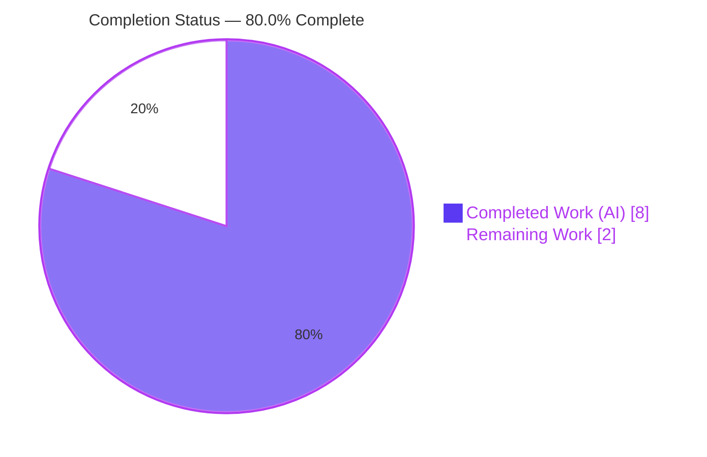
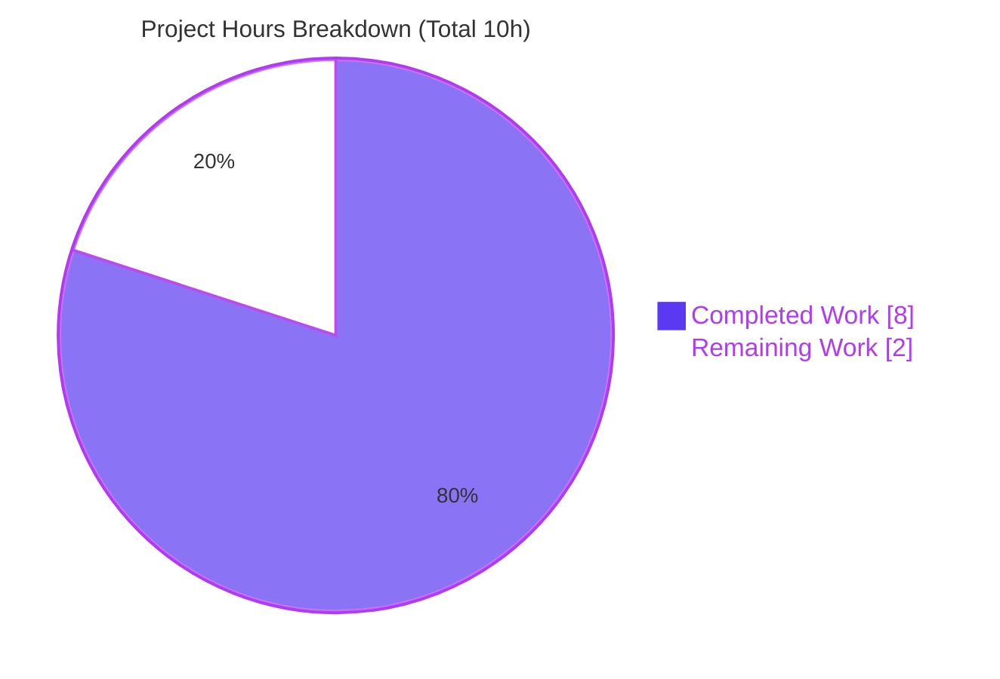
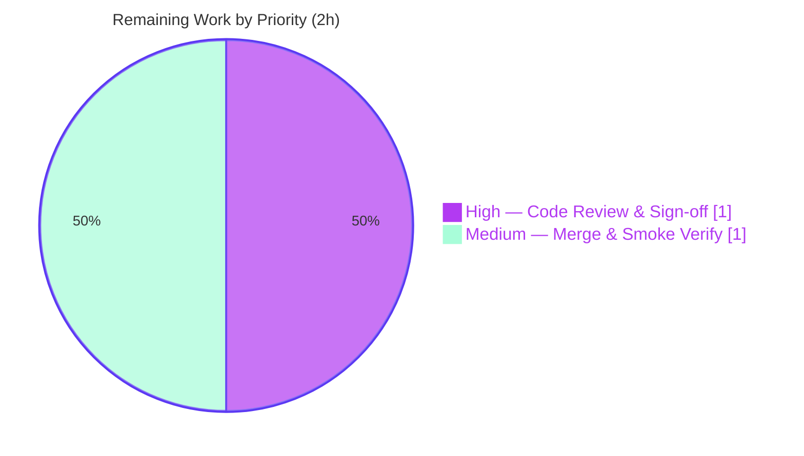

# Blitzy Project Guide — `hello_world` (Express.js Two-Endpoint Server)

> **Repository:** `hao-backprop-test` · **Branch:** `blitzy-1cacf83c-b1da-43d7-9490-124e4e9e2d5b` · **HEAD:** `f5a75bd`
> **Brand legend:** **Completed / AI Work** = Dark Blue `#5B39F3` · **Remaining / Not Completed** = White `#FFFFFF` · Headings/Accents = Violet-Black `#B23AF2` · Highlight = Mint `#A8FDD9`

---

## 1. Executive Summary

### 1.1 Project Overview

This project adds the Express.js web framework to an existing single-file Node.js tutorial server and exposes a second HTTP endpoint. The server (`server.js`) previously used only Node's built-in `http` module and returned one fixed response for every request. Per the Agent Action Plan (AAP), it was refactored in place into an Express application serving two distinct routes: `GET /` preserving the original `Hello, World!` greeting byte-for-byte, and a new `GET /good-evening` returning `Good evening`. Target users are developers following the tutorial; the business impact is enabling multi-route hosting via an idiomatic framework. Technical scope is intentionally minimal — three authored files, one new runtime dependency, and an unchanged `127.0.0.1:3000` binding.

### 1.2 Completion Status

The project is **80.0% complete**. All AAP-specified code deliverables (FR-1, FR-2, FR-3), the AAP-mandated design/explainability artifacts, and the autonomous validation are implemented, committed, and independently verified. The remaining **20%** is exclusively human path-to-production activity (code review/sign-off and merge + clean-environment smoke verification) — not outstanding engineering work.



| Metric | Value |
|--------|-------|
| **Total Hours** | 10 |
| **Completed Hours (AI + Manual)** | 8 (AI: 8 · Manual: 0) |
| **Remaining Hours** | 2 |
| **Percent Complete** | **80.0%** |

*Completion formula (PA1, AAP-scoped): Completed 8h ÷ Total 10h = **80.0%**.*

### 1.3 Key Accomplishments

- ✅ **FR-1 — Express.js added** as the project's first runtime dependency (`express@^5.2.1` in `package.json`, pinned to `5.2.1` in `package-lock.json`, lockfileVersion 3, 67-package tree).
- ✅ **FR-2 — New `GET /good-evening` endpoint** returns `Good evening\n` (HTTP 200, `text/plain`, 13 bytes).
- ✅ **FR-3 — Existing `GET /` endpoint preserved** byte-for-byte: `Hello, World!\n` (HTTP 200, `text/plain`, 14 bytes); `127.0.0.1:3000` binding and startup log unchanged.
- ✅ **Minimal-change compliance** — exactly the 3 in-scope files modified (`server.js`, `package.json`, `package-lock.json`); zero out-of-scope files touched; `README.md` untouched.
- ✅ **Clean dependency tree** — `npm ls` resolves to `express@5.2.1` with zero missing/unmet/extraneous packages; `npm ci` reproduces the full 67-package tree.
- ✅ **Zero known vulnerabilities** — `npm audit` reports 0 issues across the audited tree.
- ✅ **Runtime validated end-to-end** — server starts cleanly, both endpoints return exact expected payloads with `X-Powered-By: Express`, undefined paths return Express's default 404, clean shutdown.
- ✅ **Explainability artifacts** — 7-entry decision log (D-1…D-7) and a bidirectional traceability matrix (100% source→target coverage) authored in the AAP.

### 1.4 Critical Unresolved Issues

| Issue | Impact | Owner | ETA |
|-------|--------|-------|-----|
| *None — no critical unresolved issues identified* | All five production-readiness gates passed; zero code defects; no stubs/placeholders; no fixes were required | — | — |

> **Transparency note:** `npm test` prints `Error: no test specified` and exits 1. This is **not** a defect — it is the pre-existing placeholder script that the AAP explicitly mandates be preserved as-is (adding a test harness and modifying this script are both out of scope per AAP §0.2.4 / §0.6.2). It does not block validation or release.

### 1.5 Access Issues

| System/Resource | Type of Access | Issue Description | Resolution Status | Owner |
|-----------------|----------------|-------------------|-------------------|-------|
| *None identified* | — | Public npm registry (`registry.npmjs.org`) only; no private registries, credentials, service accounts, or third-party API keys are required. Repository write access is already confirmed (agent commits landed on the branch). | N/A | — |

**No access issues identified.**

### 1.6 Recommended Next Steps

1. **[High]** Perform human code review and sign-off of the two feature commits (`3f7af14`, `819922e`) — verify contract preservation and minimal-change compliance.
2. **[Medium]** Merge the branch and run a clean-environment smoke verification (fresh clone → `npm ci` → `node server.js` → curl both endpoints + a 404 path).
3. **[Low]** *(Optional, out of current AAP scope)* If the project is to grow beyond a tutorial, plan a minimal automated test harness (e.g., `supertest`) and a productionization story (process manager, request logging, health check) in a future iteration.

---

## 2. Project Hours Breakdown

### 2.1 Completed Work Detail

| Component | Hours | Description |
|-----------|-------|-------------|
| FR-1 · Express.js dependency & lockfile | 2 | Verified current stable version (`5.2.1`, Node ≥ 18, MIT) via registry research; added `dependencies` block (`express@^5.2.1`); ran install; regenerated & pinned `package-lock.json` (lockfileVersion 3, 849 lines); verified the 67-package transitive tree resolves cleanly. |
| FR-3 · Preserve `GET /` + `http`→Express refactor | 2 | Refactored the server bootstrap from the native `http` module to an Express app; registered `GET /` preserving byte-for-byte `Hello, World!\n`; set explicit `text/plain` (decision D-7); preserved `127.0.0.1:3000` binding and the startup log line. |
| FR-2 · `GET /good-evening` endpoint | 1 | Chose kebab-case route path (decision D-3); implemented handler returning `Good evening\n` with HTTP 200 and `text/plain`. |
| Solution design & explainability artifacts | 2 | Full repository scope discovery, integration analysis, 7-entry decision log (D-1…D-7) with alternatives/rationale/risk, and a bidirectional traceability matrix (100% coverage). |
| Autonomous validation & QA (5 gates) | 1 | Dependency resolution, syntax compilation (`node --check`), test-harness scan, runtime end-to-end (both endpoints + 404 + byte-length payload checks), and in-scope-file integrity validation. |
| **Total Completed** | **8** | |

### 2.2 Remaining Work Detail

| Category | Hours | Priority |
|----------|-------|----------|
| Code Review & Sign-off (verify the 2-commit diff, contract preservation, minimal-change compliance) | 1 | High |
| Merge & Deployment Smoke Verification (merge branch; fresh clone → `npm ci` → `node server.js` → curl `/`, `/good-evening`, and a 404 path) | 1 | Medium |
| **Total Remaining** | **2** | |

### 2.3 Hours Reconciliation & Out-of-Scope Exclusions

- **Reconciliation:** Section 2.1 (8h completed) + Section 2.2 (2h remaining) = **10h total**, matching the Section 1.2 metrics table and the Section 7 pie chart. Remaining hours (2h) are identical across Sections 1.2, 2.2, and 7.
- **Out-of-scope enhancements (0 hours, excluded per AAP §0.6.2):** automated test harness, modifying the `npm test` placeholder, `.gitignore`, CI/CD, containerization, process manager / health checks / monitoring, environment-based configuration, route extraction into modules, and resolving the `package.json` `main: index.js` quirk. These are intentionally excluded from the work universe and carry no hours.

---

## 3. Test Results

The project has **no automated framework test suite by design** — this is mandated by the AAP (§0.2.4 "New test files: None"; §0.6.2), and the `npm test` script is a documented placeholder. Consequently, the substantive verification for this project is the **runtime functional validation and static/dependency checks executed by Blitzy's autonomous validation gates** (independently re-run and confirmed on the host). All results below originate from Blitzy's autonomous validation logs for this project.

| Test Category | Framework / Tool | Total | Passed | Failed | Coverage % | Notes |
|---------------|------------------|-------|--------|--------|-----------|-------|
| Runtime Endpoint Functional Verification | `curl` (Blitzy autonomous runtime gate) | 3 | 3 | 0 | 100% of defined routes (2/2) + 404 | `GET /` → 200 `text/plain` 14B `Hello, World!\n`; `GET /good-evening` → 200 `text/plain` 13B `Good evening\n`; `GET /nonexistent` → 404 (Express default) |
| Syntax Compilation | `node --check` | 1 | 1 | 0 | n/a | `server.js` valid; exit 0; no build system (plain JS) |
| Dependency Resolution & Audit | `npm ci` / `npm ls` / `npm audit` | 3 | 3 | 0 | n/a | `added 67 packages`; clean tree (`hello_world@1.0.0 → express@5.2.1`); **0 vulnerabilities** |
| Automated Unit/Integration Suite | none (by design) | 0 | 0 | 0 | n/a | No `.test`/`.spec`/`test*.js` files; no jest/mocha/vitest installed; adding tests out of scope; `npm test` is a documented placeholder |
| **Totals** | | **7** | **7** | **0** | | **100% pass rate** across executed checks |

> **Integrity note:** No fabricated tests. Every check above was executed by Blitzy's autonomous validation and independently re-confirmed. The absence of a framework test suite is an intentional, AAP-mandated scope decision — not a gap in delivery.

---

## 4. Runtime Validation & UI Verification

**Runtime Health**

- ✅ **Operational** — `node server.js` starts cleanly and logs exactly `Server running at http://127.0.0.1:3000/`.
- ✅ **Operational** — process binds to the loopback interface `127.0.0.1:3000`; clean shutdown on `Ctrl+C`, port released, no stray processes.

**Endpoint / API Verification**

- ✅ **Operational** — `GET /` → `HTTP 200`, `Content-Type: text/plain; charset=utf-8`, `Content-Length: 14`, body `Hello, World!\n` (FR-3 preserved byte-for-byte).
- ✅ **Operational** — `GET /good-evening` → `HTTP 200`, `Content-Type: text/plain; charset=utf-8`, `Content-Length: 13`, body `Good evening\n` (FR-2).
- ✅ **Operational** — `X-Powered-By: Express` present on both routes, confirming Express is the active server (FR-1 at runtime).
- ✅ **Operational (expected)** — `GET /nonexistent` → `HTTP 404` (Express default), matching AAP decision D-1.

**External API Integrations**

- ➖ **Not applicable** — the server has no external service, database, or third-party API integrations at runtime.

**UI Verification**

- ➖ **Not applicable** — the feature exposes only `text/plain` HTTP responses with no markup, styling, or client-side rendering. Per AAP §0.5.3, the repository defines no user interface; there are no screens, components, or design tokens to verify.

---

## 5. Compliance & Quality Review

The matrix cross-maps each AAP deliverable and governing rule to its validation outcome. **No fixes were required** during autonomous validation — every item passed on first attempt.

| # | AAP Deliverable / Rule | Benchmark | Status | Evidence / Progress |
|---|------------------------|-----------|--------|---------------------|
| 1 | FR-1 · Add Express.js dependency | `express@^5.2.1` declared & pinned; installs cleanly | ✅ Pass | `package.json` dependencies block; `package-lock.json` pins `5.2.1`; `npm ci` "added 67 packages"; `npm ls` clean |
| 2 | FR-2 · `GET /good-evening` returns "Good evening" | Route returns `Good evening\n`, 200, `text/plain` | ✅ Pass | `server.js` `app.get('/good-evening', …)`; runtime 200/13B verified |
| 3 | FR-3 · Preserve `GET /` "Hello world" | Byte-for-byte `Hello, World!\n`, 200, `text/plain` | ✅ Pass | `server.js` `app.get('/', …)`; runtime 200/14B verified; binding & startup log preserved |
| 4 | Rule · Make minimal changes | Only in-scope files touched | ✅ Pass | Feature diff = exactly `server.js`, `package.json`, `package-lock.json` (+863 / -7); no out-of-scope edits |
| 5 | Rule · Backward compatibility | Root response contract unchanged | ✅ Pass | Payload, `Content-Type`, status, and `127.0.0.1:3000` binding all identical to baseline |
| 6 | Rule · Explainability | Decision log + traceability matrix | ✅ Pass | 7-entry decision log (D-1…D-7); bidirectional traceability matrix (100% coverage) in AAP §0.7 |
| 7 | Rule · "Do not touch!" `README.md` | `README.md` unchanged | ✅ Pass | `README.md` byte-identical to baseline |
| 8 | Quality · Syntax / compilation | Valid JS; valid JSON manifests | ✅ Pass | `node --check` exit 0; `package.json` / `package-lock.json` valid JSON |
| 9 | Quality · Security (dependencies) | No known vulnerabilities | ✅ Pass | `npm audit` → 0 vulnerabilities |
| 10 | Quality · Zero placeholders/stubs | Production-ready in-scope code | ✅ Pass | No TODO/FIXME/stub/NotImplemented in in-scope files |

**Fixes applied during autonomous validation:** None. **Outstanding compliance items:** None (human sign-off pending — see Section 2.2).

---

## 6. Risk Assessment

Overall risk profile is **LOW** across all four categories. No High/Critical risks; nothing blocks release for the AAP's tutorial scope. Items are framed as forward-looking guidance should the project expand beyond a loopback tutorial.

| Risk | Category | Severity | Probability | Mitigation | Status |
|------|----------|----------|-------------|------------|--------|
| T1 · No automated regression test suite (zero tests by design) | Technical | Low | Low | Manual `curl` smoke test verifies both endpoints; add `supertest` tests if the project grows | Accepted (out of scope) |
| T2 · Express 5 default 404 for undefined paths / non-GET methods (behavior change vs. old catch-all) | Technical | Low | Low | Intentional; documented in AAP decision log (D-1/D-4/D-6) | Accepted / Documented |
| T3 · `package.json` `main: "index.js"` references a non-existent file | Technical | Low | Low | Launch via `node server.js`; fix is out of scope | Accepted |
| S1 · Transitive dependency surface (67 packages) | Security | Low | Low | `npm audit` clean (0 vulns) at validation; schedule periodic audit / Dependabot when productionizing | Mitigated |
| S2 · No auth / rate limiting / input validation | Security | Low | Low | Bound to `127.0.0.1` loopback, not internet-exposed; hardening out of scope | Accepted (out of scope) |
| S3 · `X-Powered-By: Express` header discloses framework | Security | Low | Low | `app.disable('x-powered-by')` if hardening desired (out of scope) | Accepted |
| O1 · No process manager / auto-restart / health-check endpoint | Operational | Low | Low | Use pm2/systemd/container when productionizing | Accepted (out of scope) |
| O2 · No structured logging / monitoring (single startup log) | Operational | Low | Low | Add request-logging middleware (e.g., `morgan`) if productionizing | Accepted (out of scope) |
| O3 · Fixed loopback binding `127.0.0.1:3000` | Operational | Low | Low | Intentional per AAP; make host/port env-configurable if external access is needed later | Accepted / Documented |
| I1 · `node_modules` untracked + no `.gitignore`; install reproducibility depends on registry access | Integration | Low | Low | `package-lock.json` pins the exact tree (lockfileVersion 3); `npm ci` is reproducible; verify registry access during smoke test | Mitigated by lockfile |
| I2 · No external service integrations at runtime | Integration | Very Low | — | Nothing to integrate (no DB/API/credentials) | N/A |

---

## 7. Visual Project Status

**Project Hours Breakdown** (Completed = Dark Blue `#5B39F3` · Remaining = White `#FFFFFF`):



**Remaining Work by Priority** (2h total):



**Remaining Hours by Category (bar view):**

| Category | Hours | Priority |
|----------|-------|----------|
| Code Review & Sign-off | 1 | High |
| Merge & Deployment Smoke Verification | 1 | Medium |
| **Total** | **2** | |

> **Integrity check:** "Remaining Work" = **2h** in the pie chart equals the Remaining Hours in Section 1.2 and the sum of the Section 2.2 "Hours" column. "Completed Work" = **8h** equals the Section 2.1 total.

---

## 8. Summary & Recommendations

**Achievements.** All three Agent Action Plan requirements are delivered and independently verified at runtime: Express.js was added as the first runtime dependency (FR-1), a new `GET /good-evening` endpoint returns `Good evening` (FR-2), and the original `GET /` `Hello, World!` response is preserved byte-for-byte (FR-3). The change is textbook minimal — three files, +863/-7 lines — with the loopback binding, startup log, and response contract all intact. Dependency resolution is clean, `npm audit` reports zero vulnerabilities, and no fixes were required during validation.

**Remaining gaps.** The project is **80.0% complete** (8h of 10h). The outstanding 2h is entirely human path-to-production: (1) code review & sign-off of the two feature commits, and (2) merge plus a clean-environment smoke verification. There is **no outstanding engineering work** and no known defect.

**Critical path to production.** Review the diff → merge the branch → fresh clone → `npm ci` → `node server.js` → curl `/`, `/good-evening`, and a 404 path. Because the binding, dependency tree, and payloads are all deterministic and already verified, this path is low-risk and fast.

**Success metrics.** Endpoint correctness (2/2 routes return exact payloads), byte-for-byte backward compatibility on `GET /`, clean install (`added 67 packages`, 0 vulnerabilities), and valid syntax — all met.

**Production readiness assessment.** For the AAP's tutorial scope, the codebase is **production-ready pending human sign-off**. If the project is later promoted beyond a loopback tutorial, the Section 6 items (automated tests, process manager, logging/monitoring, env-configurable binding, security hardening) should be planned as a separate, out-of-scope iteration.

| Metric | Value |
|--------|-------|
| Percent Complete | 80.0% |
| Completed / Total Hours | 8 / 10 |
| Remaining Hours | 2 |
| Open Critical Issues | 0 |
| Known Vulnerabilities | 0 |
| Feature Requirements Met | 3 / 3 (FR-1, FR-2, FR-3) |

---

## 9. Development Guide

All commands below were executed and verified on the validation host (Windows, Node v20.20.2, npm 10.8.2). They are equally valid on macOS/Linux (use native `curl`).

### 9.1 System Prerequisites

- **Node.js ≥ 18** (Express 5 engine requirement; validated on **v20.20.2**).
- **npm** (validated on **10.8.2**; ships with Node).
- **Git** (to clone the repository).
- **curl** (for endpoint verification; on Windows PowerShell use `curl.exe`, since `curl` is an alias for `Invoke-WebRequest`).
- Network access to `registry.npmjs.org` for dependency installation.

### 9.2 Environment Setup

No environment variables are required — the server binds to the fixed loopback address `127.0.0.1:3000` and reads no configuration. No `.env` file, database, or external service is needed.

```bash
# Clone and enter the project
git clone <repository-url>
cd hao-backprop-test
```

### 9.3 Dependency Installation

```bash
# Reproducible install from the committed lockfile (preferred)
npm ci
# Expected: "added 67 packages in ~Ns", exit code 0
```

```bash
# Alternative if no lockfile is present:
npm install
```

Verify the dependency tree and security posture:

```bash
npm ls express       # Expected: hello_world@1.0.0 -> express@5.2.1
npm audit            # Expected: found 0 vulnerabilities
```

### 9.4 Application Startup

```bash
node server.js
# Expected console output:
# Server running at http://127.0.0.1:3000/
```

The process runs in the foreground. Stop it with `Ctrl+C` (port 3000 is released on exit).

> Note: do **not** use `npm start` — no `start` script is defined. Launch via `node server.js`. (`package.json` `main: index.js` is a harmless pre-existing quirk; the app entry point is `server.js`.)

### 9.5 Verification Steps

Optionally validate syntax without running the server:

```bash
node --check server.js   # Expected: exit code 0 (no output)
```

With the server running, verify both endpoints and the 404 behavior:

```bash
curl -i http://127.0.0.1:3000/
# HTTP/1.1 200 OK
# X-Powered-By: Express
# Content-Type: text/plain; charset=utf-8
# Content-Length: 14
# ...
# Hello, World!

curl -i http://127.0.0.1:3000/good-evening
# HTTP/1.1 200 OK
# X-Powered-By: Express
# Content-Type: text/plain; charset=utf-8
# Content-Length: 13
# ...
# Good evening

curl -s -o /dev/null -w "%{http_code}\n" http://127.0.0.1:3000/nonexistent
# 404
```

### 9.6 Example Usage

```bash
# Plain body only (no headers)
curl http://127.0.0.1:3000/              # -> Hello, World!
curl http://127.0.0.1:3000/good-evening  # -> Good evening
```

Windows PowerShell equivalent (if not using `curl.exe`):

```powershell
Invoke-WebRequest -Uri http://127.0.0.1:3000/ -UseBasicParsing | Select-Object -ExpandProperty Content
```

### 9.7 Troubleshooting

- **`npm test` fails with "Error: no test specified" (exit 1).** Expected and intentional — this is the documented placeholder script; modifying it is out of AAP scope. It does not indicate a defect.
- **`EADDRINUSE: address already in use 127.0.0.1:3000`.** Another process holds port 3000. Stop that process before starting the server. (Changing the port is out of AAP scope — the loopback `:3000` binding is the contracted behavior.)
- **`npm ci` fails / network error.** Ensure access to `registry.npmjs.org`. `npm ci` requires the committed `package-lock.json` (present) and a reachable registry.
- **`Cannot find module 'express'`.** Dependencies aren't installed — run `npm ci` (or `npm install`) from the project root first.
- **Windows: `curl` returns an object instead of headers.** `curl` is aliased to `Invoke-WebRequest`; use `curl.exe` for the exact flags above, or `Invoke-WebRequest`.

---

## 10. Appendices

### A. Command Reference

| Command | Purpose | Verified Result |
|---------|---------|-----------------|
| `npm ci` | Reproducible install from lockfile | exit 0, "added 67 packages" |
| `npm install` | Install (fallback when no lockfile) | resolves `express@5.2.1` |
| `npm ls express` | Show dependency resolution | `express@5.2.1`, exit 0 |
| `npm audit` | Security audit | 0 vulnerabilities |
| `node --check server.js` | Static syntax validation | exit 0 |
| `node server.js` | Start the server (foreground) | logs startup line on `:3000` |
| `curl -i http://127.0.0.1:3000/` | Verify `GET /` | 200, `text/plain`, `Hello, World!` |
| `curl -i http://127.0.0.1:3000/good-evening` | Verify `GET /good-evening` | 200, `text/plain`, `Good evening` |

### B. Port Reference

| Port | Host | Service | Notes |
|------|------|---------|-------|
| 3000 | 127.0.0.1 (loopback) | Express HTTP server | Fixed binding; not externally reachable; unchanged from baseline |

### C. Key File Locations

| File | Role | Disposition |
|------|------|-------------|
| `server.js` | Express app + two GET routes + listener | UPDATED (feature) |
| `package.json` | Manifest; declares `express@^5.2.1` | UPDATED (feature) |
| `package-lock.json` | Locks `express@5.2.1` + transitive tree (lockfileVersion 3) | UPDATED / regenerated |
| `node_modules/` | Installed dependencies (67 packages) | Generated artifact; untracked (not committed) |
| `README.md` | "Do not touch!" note | Unchanged (out of scope) |
| `blitzy/documentation/` | Blitzy Project Guide & Technical Specifications | Documentation (non-feature) |

### D. Technology Versions

| Technology | Version | Notes |
|------------|---------|-------|
| Node.js | v20.20.2 | Satisfies Express 5 engine `node >= 18` |
| npm | 10.8.2 | Ships with Node 20 |
| Express | 5.2.1 | Pinned in lockfile; declared as `^5.2.1`; MIT license |
| package-lock.json | lockfileVersion 3 | 67 `node_modules` package entries |

### E. Environment Variable Reference

| Variable | Required | Default | Notes |
|----------|----------|---------|-------|
| *(none)* | No | — | The server reads no environment variables; host/port are hard-coded to `127.0.0.1:3000` per the AAP. |

### F. Developer Tools Guide

- **Runtime:** `node server.js` (foreground; `Ctrl+C` to stop).
- **Static check:** `node --check server.js` (no build system — plain JavaScript, no transpilation/bundling).
- **Dependency inspection:** `npm ls`, `npm audit`, `npm outdated`.
- **HTTP inspection:** `curl -i` (headers + body) or `curl -s` (body only); `curl.exe` on Windows PowerShell.
- **Version control:** feature commits are `3f7af14` (FR-1) and `819922e` (FR-2/FR-3); documentation commits are `5eb673e` and `f5a75bd`.

### G. Glossary

| Term | Definition |
|------|------------|
| **AAP** | Agent Action Plan — the authoritative specification for this feature. |
| **FR-1 / FR-2 / FR-3** | The three functional requirements: add Express; add `GET /good-evening`; preserve `GET /`. |
| **Lockfile** | `package-lock.json` — pins exact dependency versions for reproducible installs. |
| **Loopback binding** | `127.0.0.1` — local-only network interface; not reachable from other hosts. |
| **`text/plain` contract** | The preserved response `Content-Type`, set explicitly (decision D-7) because Express `res.send(<string>)` would otherwise default to `text/html`. |
| **Path-to-production** | Standard human activities (review, merge, smoke test) required to deploy the delivered code. |

---

*Prepared by the Blitzy autonomous project-assessment agent. Completion percentage (80.0%) is computed strictly from AAP-scoped and path-to-production hours (PA1 methodology). All figures are reconciled across Sections 1.2, 2.1, 2.2, and 7.*