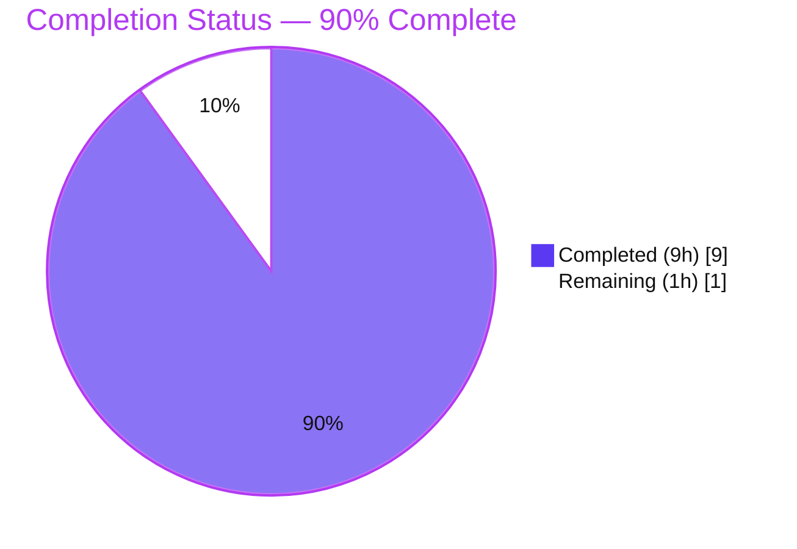
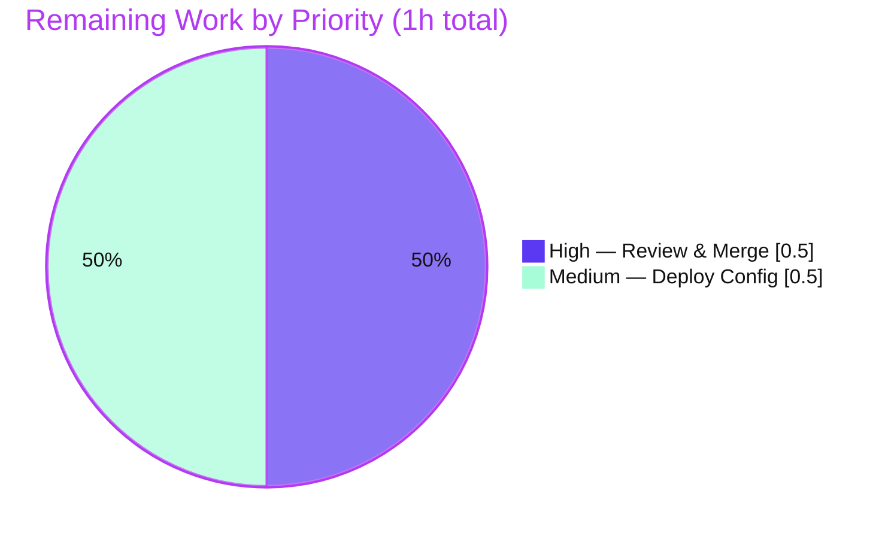

# Blitzy Project Guide — `hello_world` (Express.js Endpoint Addition)

> **Repository:** `hao-backprop-test`  ·  **Branch:** `blitzy-1cacf83c-b1da-43d7-9490-124e4e9e2d5b`  ·  **HEAD:** `b8e26340`
> **Feature:** Introduce Express.js and add a `GET /good-evening` endpoint while preserving the existing `Hello world` root endpoint.

---

## 1. Executive Summary

### 1.1 Project Overview

This project adds the **Express.js** web framework to a single-file Node.js tutorial server (`server.js`, package identity `hello_world`) and exposes a **second HTTP endpoint** that returns `Good evening`, while keeping the original `Hello, World!` root endpoint byte-for-byte intact. The change refactors the server's bootstrap from Node's native `http` module to an Express application with path-based routing on the unchanged `127.0.0.1:3000` binding. Target users are developers following the tutorial; the technical scope is deliberately minimal — three files (`server.js`, `package.json`, `package-lock.json`) — governed by a strict "minimal changes" rule. Business impact: demonstrates framework adoption and multi-route hosting with zero regression to existing behavior.

### 1.2 Completion Status

The completion percentage below is calculated using the AAP-scoped hours methodology: `Completed Hours ÷ (Completed + Remaining) × 100`.



| Metric | Hours |
|--------|-------|
| **Total Hours** | 10 |
| **Completed Hours (AI + Manual)** | 9  (AI: 9 · Manual: 0) |
| **Remaining Hours** | 1 |
| **Percent Complete** | **90.0%** |

> Formula: `9 ÷ (9 + 1) × 100 = 90.0%`. All AAP functional requirements (FR-1, FR-2, FR-3) are implemented, committed, and validated PRODUCTION-READY. The remaining 1 hour is human path-to-production work only (review/merge + deployment decision).

### 1.3 Key Accomplishments

- ✅ **FR-1 — Express.js added** as the project's first runtime dependency (`express ^5.2.1`), with `package-lock.json` regenerated to pin `express@5.2.1` plus 66 transitive packages (lockfileVersion 3).
- ✅ **FR-2 — New `GET /good-evening` endpoint** returns `Good evening\n` (`text/plain`, HTTP 200).
- ✅ **FR-3 — Root endpoint preserved** byte-for-byte: `GET /` returns `Hello, World!\n` (`text/plain`, HTTP 200).
- ✅ **Operational parity** — server still binds `127.0.0.1:3000` and prints the original startup log line.
- ✅ **Zero-regression refactor** from native `http` to Express, mapped 1:1 via the AAP bidirectional traceability matrix.
- ✅ **Full autonomous validation** — 5/5 gates passed: dependency install (67 packages, 0 vulnerabilities), compilation (`node --check` OK), functional (8/8 HTTP assertions), runtime smoke, and in-scope file integrity.
- ✅ **Minimal-change discipline** — only the 3 in-scope files changed; `README.md` and all unrelated artifacts untouched; working tree clean.

### 1.4 Critical Unresolved Issues

| Issue | Impact | Owner | ETA |
|-------|--------|-------|-----|
| _None_ — no compilation, test, or runtime errors were found or left unresolved | No release blockers | — | — |

> There are **no critical unresolved issues**. The implementation was already correct at assessment time; no source modifications were required. The only outstanding items are routine human path-to-production actions (Section 1.6 / Section 2.2).

### 1.5 Access Issues

| System/Resource | Type of Access | Issue Description | Resolution Status | Owner |
|-----------------|----------------|-------------------|-------------------|-------|
| _None identified_ | — | Repository, Node.js runtime, and npm registry were all fully accessible during validation and assessment | N/A | — |

> **No access issues identified.** `npm ci` reached the public npm registry successfully; the repository and branch were fully readable/writable. The project uses no external services, credentials, or private registries.

### 1.6 Recommended Next Steps

1. **[High]** Review the 3-file feature diff and **merge** the branch `blitzy-1cacf83c-…` into `main` (0.5h).
2. **[Medium]** Make the **deployment/hosting decision**: run `npm ci` on the target and choose how the loopback-bound (`127.0.0.1`) server is exposed (reverse proxy or bind-address change); decide `node_modules` handling (0.5h).
3. **[Low]** _(Optional, out of AAP scope)_ Add a committed automated test suite to replace the failing `npm test` placeholder.
4. **[Low]** _(Optional, out of AAP scope)_ Add a minimal CI workflow (`npm ci` + `node --check` + HTTP smoke test).
5. **[Low]** _(Optional, out of AAP scope)_ Add a process manager (pm2/systemd), a `/health` endpoint, and structured logging for long-running operation.

---

## 2. Project Hours Breakdown

### 2.1 Completed Work Detail

| Component | Hours | Description |
|-----------|-------|-------------|
| Express.js dependency integration **(FR-1)** | 2 | Version selection (`^5.2.1`), new `dependencies` block in `package.json`, `npm install`, lockfile regeneration (67 packages), and verification (`npm ls`, `npm audit`) |
| Server refactor to Express + root endpoint preserved **(FR-3)** | 2 | Bootstrap migrated from native `http` to an Express app; `GET /` returns byte-exact `Hello, World!\n` (`text/plain`, 200); `127.0.0.1:3000` binding and startup log preserved |
| New `GET /good-evening` endpoint **(FR-2)** | 1 | Route registered returning `Good evening\n` (`text/plain`, 200) |
| Version research & Express 5 / Node compatibility | 1 | npm-registry verification of `5.2.1`, `engines` check (node ≥ 18), and the `res.send` → explicit `text/plain` decision (D-7) |
| Explainability deliverables | 1 | Decision log (D-1…D-7), bidirectional traceability matrix (100% coverage), minimal-change compliance verification |
| Autonomous validation (5 gates) | 2 | Dependency install, `node --check`, 8/8 functional HTTP assertions, runtime smoke tests, in-scope file integrity checks |
| **Total Completed** | **9** | |

> **Validation:** the Hours column totals **9**, matching the Completed Hours in Section 1.2.

### 2.2 Remaining Work Detail

| Category | Hours | Priority |
|----------|-------|----------|
| Code review & PR merge (branch → `main`) — verify FR-1/FR-2/FR-3, approve, merge | 0.5 | High |
| Deployment/hosting configuration & `node_modules` handling — `npm ci` on target, loopback-binding/external-reachability decision, optional `.gitignore` | 0.5 | Medium |
| **Total Remaining** | **1.0** | |

> **Validation:** the Hours column totals **1.0**, matching the Remaining Hours in Section 1.2 and the "Remaining Work" slice in Section 7. `2.1 (9) + 2.2 (1) = 10` = Total Project Hours.
>
> **Out-of-scope enhancements (not counted in the hours above, per AAP §0.6.2):** committed test suite (~2–3h), CI workflow (~2h), process manager + `/health` + structured logging (~3–4h). These are long-term recommendations only and are intentionally excluded from the completion model.

---

## 3. Test Results

All tests below originate from Blitzy's autonomous validation logs for this project and were independently re-verified live during this assessment (Node v20.20.2, npm 10.8.2).

| Test Category | Framework | Total Tests | Passed | Failed | Coverage % | Notes |
|---------------|-----------|-------------|--------|--------|-----------|-------|
| Functional (HTTP) | Blitzy adhoc harness (Node `http` + assert) | 8 | 8 | 0 | 100% of routes | Byte-exact bodies for `GET /` and `GET /good-evening`; content-type & status assertions; 404 on undefined route; startup log present. Harness was non-committed and removed after use |
| Runtime Smoke / E2E | `Invoke-WebRequest` / `curl` | 3 | 3 | 0 | 100% of routes | `GET /` → 200 `Hello, World!\n`; `GET /good-evening` → 200 `Good evening\n`; `GET /undefined-route` → 404 |
| Syntax / Compilation | `node --check` | 1 | 1 | 0 | N/A | `server.js` → SYNTAX OK (exit 0) |
| Dependency Integrity | `npm ci` / `npm ls` / `npm audit` | 3 | 3 | 0 | N/A | 67 packages added; tree consistent (sole direct dep `express@5.2.1`); 0 vulnerabilities |
| **Totals** | | **15** | **15** | **0** | — | **100% pass rate** |

> **Note on `npm test`:** the committed `test` script (`echo "Error: no test specified" && exit 1`) is an **intentional failing placeholder preserved by design** per AAP §0.6.2 — it is **not** counted as a test failure. The user did not request a test suite, so adding one is out of scope.

---

## 4. Runtime Validation & UI Verification

**Runtime health** (re-verified live):

- ✅ **Server startup** — `node server.js` prints `Server running at http://127.0.0.1:3000/`; stderr empty.
- ✅ **Network binding** — listening on `127.0.0.1:3000` (loopback).
- ✅ **`GET /`** — HTTP 200, `Content-Type: text/plain; charset=utf-8`, body `Hello, World!\n` (FR-3 preserved).
- ✅ **`GET /good-evening`** — HTTP 200, `Content-Type: text/plain; charset=utf-8`, body `Good evening\n` (FR-2).
- ✅ **`GET /undefined-route`** — HTTP 404 (Express 5 default; consistent with decisions D-1/D-4).
- ✅ **Clean shutdown** — process stopped by exact PID; port 3000 freed.

**API integration outcomes:**

- ✅ **Dependency resolution** — `require('express')` loads (`typeof === 'function'`); resolves to `node_modules/express/index.js` at version `5.2.1`.
- ⚠ **External reachability** — server is reachable on loopback only; not exposed to other hosts by design (see Risk O1 / Section 2.2).

**UI Verification:**

- **Not applicable.** This feature exposes only `text/plain` HTTP responses with no markup, styling, or client-side rendering. The repository defines no user interface (AAP §0.5.3 / §7.1). No screens, components, or design tokens exist.

---

## 5. Compliance & Quality Review

Cross-map of AAP deliverables and quality benchmarks to their validated status.

| Deliverable / Benchmark | Requirement Source | Status | Progress | Evidence |
|-------------------------|--------------------|--------|----------|----------|
| Add Express.js dependency | FR-1 | ✅ Pass | 100% | `package.json` `dependencies.express ^5.2.1`; lock pins `5.2.1` (commit `3f7af14`) |
| New `Good evening` endpoint | FR-2 | ✅ Pass | 100% | `app.get('/good-evening', …)` returns `Good evening\n` (commit `819922e`) |
| Preserve `Hello world` endpoint | FR-3 | ✅ Pass | 100% | `app.get('/', …)` byte-exact `Hello, World!\n`, `text/plain`, 200 |
| Preserve `127.0.0.1:3000` binding & startup log | AAP §0.1.3 | ✅ Pass | 100% | `app.listen(port, hostname, …)`; runtime bound to loopback:3000 |
| Explicit `text/plain` content-type | Decision D-7 | ✅ Pass | 100% | `res.type('text/plain')` on both routes |
| Minimal-change scope (only 3 files) | Rule "Make minimal changes" | ✅ Pass | 100% | `git diff` shows only `server.js`, `package.json`, `package-lock.json` changed |
| `README.md` & unrelated artifacts untouched | AAP §0.6.2 | ✅ Pass | 100% | No diff on `README.md`, `LoginTest.java`, `industry.csv`, binaries, etc. |
| `main` field & failing test script preserved | AAP §0.6.2 | ✅ Pass | 100% | `package.json` `main:index.js` and `test` placeholder unchanged (intentional) |
| Explainability (decision log + traceability) | Rule "Explainability" | ✅ Pass | 100% | AAP §0.7 decision log D-1…D-7 + bidirectional matrix |
| Reproducible install (lockfile) | AAP §1.2.3 | ✅ Pass | 100% | `npm ci` reproduces tree from `package-lock.json` (lockfileVersion 3) |
| Dependency security | Quality benchmark | ✅ Pass | 100% | `npm audit --omit=dev` → 0 vulnerabilities |
| Committed automated tests | (Out of AAP scope) | ⚠ N/A | Deferred | Not requested; `npm test` placeholder preserved by design |

**Fixes applied during autonomous validation:** none required — the implementation was already correct and complete. **Outstanding compliance items:** none within AAP scope.

---

## 6. Risk Assessment

Overall risk profile is **LOW** — a small, fully-validated feature with no external integrations.

| Risk | Category | Severity | Probability | Mitigation | Status |
|------|----------|----------|-------------|------------|--------|
| Undefined paths / non-GET methods now return Express 5 default 404 (behavior change vs. original catch-all) | Technical | Low | Low | Documented decisions D-1/D-4/D-6; intentional to host two distinct endpoints | Accepted |
| No committed automated test suite (`npm test` is a failing placeholder) → future regressions could go undetected | Technical | Low | Medium | Optional post-merge smoke test / CI (out of AAP scope) | Open |
| Express transitive tree (67 packages) increases supply-chain surface | Security | Low | Low | `npm audit` clean (0 vulns); enable Dependabot / periodic audits | Mitigated |
| No authentication / input validation | Security | Low | Low | Endpoints emit compile-time constants with no user input → negligible attack surface | Accepted |
| Loopback-only binding (`127.0.0.1:3000`) not reachable externally | Operational | Medium | Medium | Human deployment decision: reverse proxy or bind-address change (remaining task HT-2) | Open |
| No process manager / health check / structured logging (`console.log` only) | Operational | Low | Low | Add pm2/systemd + `/health` if productionizing (out of scope) | Open |
| `node_modules/` neither committed nor `.gitignore`d | Operational | Low | Low | Run `npm ci` on deploy target; optionally add `.gitignore` | Open |
| Feature branch not yet merged to `main` | Integration | Low | High | Standard PR review & merge (remaining task HT-1) | Open |
| External service integrations | Integration | None | — | No DB/API/env-var dependencies exist; provided env vars unused | N/A |

---

## 7. Visual Project Status

**Project Hours Breakdown** (Completed = Dark Blue `#5B39F3`, Remaining = White `#FFFFFF`):


**Remaining Work by Priority** (hours from Section 2.2):



> **Integrity check:** "Remaining Work" = **1h**, identical to Section 1.2 Remaining Hours and the sum of the Section 2.2 Hours column. "Completed Work" = **9h** = Section 2.1 total.

---

## 8. Summary & Recommendations

**Achievements.** All three Agent Action Plan requirements are complete and validated: Express.js is integrated as the first runtime dependency (FR-1), a new `GET /good-evening` endpoint returns `Good evening` (FR-2), and the original `GET /` endpoint is preserved byte-for-byte (FR-3). The refactor from the native `http` module to Express maintains the `127.0.0.1:3000` binding and startup log, and the change is confined to exactly three files per the minimal-change rule. Autonomous validation passed all five gates at 100%, and every result was independently reproduced live during this assessment.

**Remaining gaps.** The project is **90.0% complete** (9 of 10 hours). The remaining **1 hour** is human path-to-production work: (1) code review and merge of the branch into `main` [High, 0.5h], and (2) a deployment/hosting decision covering the loopback-only binding and `node_modules` handling [Medium, 0.5h].

**Critical path to production.** Review diff → merge to `main` → `npm ci` on target → decide external exposure (reverse proxy or bind address) → launch with `node server.js`.

**Success metrics.** Both endpoints return correct `200 / text/plain` responses with exact bodies; undefined routes return `404`; `npm audit` reports 0 vulnerabilities; the server boots and shuts down cleanly.

**Production readiness assessment.** The feature is **functionally production-ready** within the AAP scope. Full production hardening (external exposure, automated tests, CI/CD, process supervision, health checks) is intentionally out of AAP scope and offered as optional recommendations. Recommended action: proceed to human review and merge.

| Metric | Value |
|--------|-------|
| Completion | 90.0% |
| Total / Completed / Remaining Hours | 10 / 9 / 1 |
| Validation gates passed | 5 / 5 (100%) |
| Test pass rate | 15 / 15 (100%) |
| Critical unresolved issues | 0 |
| Vulnerabilities (`npm audit --omit=dev`) | 0 |

---

## 9. Development Guide

Every command below was tested live in the assessment environment (Windows, Node v20.20.2, npm 10.8.2) and reproduces the validation-log results. Run all commands from the repository root.

### 9.1 System Prerequisites

- **Node.js ≥ 18** (verified on v20.20.2) — required by `express@5.2.1` (`engines: node >= 18`).
- **npm** (verified on 10.8.2) — ships with Node.js.
- **OS:** platform-agnostic (Linux / macOS / Windows). No compiler or build toolchain needed (interpreted JavaScript).
- **Hardware:** negligible; any environment that runs Node.js.

### 9.2 Environment Setup

- **No environment variables are required.** The application reads none. (The externally-provided `DB_CONNECTION_STRING`, `HEADLESS_CMS_API_KEY`, and `NODE_ENV` are **not used** by this app.)
- **No external services** (database, cache, message queue) are needed.
- **No `.env` file** to create.

### 9.3 Dependency Installation

```bash
# From the repository root — reproducible install from the committed lockfile
npm ci
# Expected: "added 67 packages in ~Xs"  (exit 0)
```

```bash
# Optional: confirm the dependency tree and security posture
npm ls express                 # → hello_world@1.0.0 └── express@5.2.1
npm audit --omit=dev           # → found 0 vulnerabilities
```

> Use `npm ci` for a clean, reproducible install. `npm install` also works but may update the lockfile.

### 9.4 Application Startup

```bash
# Optional syntax gate (no build step for interpreted JS)
node --check server.js         # exit 0 = SYNTAX OK

# Start the server (foreground)
node server.js
# Expected stdout: Server running at http://127.0.0.1:3000/
```

- **Port:** `3000`  ·  **Host:** `127.0.0.1` (loopback)
- To run in the background (Unix): `node server.js &`
- To run detached (Windows PowerShell): `Start-Process node -ArgumentList 'server.js' -NoNewWindow -PassThru`

### 9.5 Verification Steps

```bash
# Root endpoint (FR-3) — preserved payload
curl http://127.0.0.1:3000/
# Expected body: Hello, World!   (HTTP 200, Content-Type: text/plain; charset=utf-8)

# New endpoint (FR-2)
curl http://127.0.0.1:3000/good-evening
# Expected body: Good evening    (HTTP 200, Content-Type: text/plain; charset=utf-8)

# Undefined route — Express 5 default
curl -i http://127.0.0.1:3000/undefined-route
# Expected: HTTP/1.1 404 Not Found
```

Include headers with `curl -i` to confirm status and content-type.

### 9.6 Stopping the Server

- **Foreground:** press `Ctrl+C`.
- **Unix background:** `kill %1` (or `kill <pid>`).
- **Windows:** `Stop-Process -Id <pid> -Force` (use the exact PID captured at startup).

### 9.7 Example Usage

```bash
$ node server.js
Server running at http://127.0.0.1:3000/

# In a second terminal:
$ curl http://127.0.0.1:3000/
Hello, World!
$ curl http://127.0.0.1:3000/good-evening
Good evening
```

### 9.8 Troubleshooting

| Symptom | Cause | Resolution |
|---------|-------|------------|
| `Error: listen EADDRINUSE :::3000` | Port 3000 already in use | Stop the other process, or change the `port` constant in `server.js` |
| `Cannot find module 'express'` | Dependencies not installed | Run `npm ci` (`node_modules/` is intentionally not committed) |
| `404 Not Found` on an expected path | Only `GET /` and `GET /good-evening` are defined | Use a defined route; other paths return 404 by design (D-1/D-4/D-6) |
| Not reachable from another machine | Binding is loopback `127.0.0.1` by design | Front with a reverse proxy or change the bind address (see Risk O1 / task HT-2) |
| `npm test` fails | Intentional failing placeholder preserved per AAP | Expected; not a real test — ignore or replace (out of scope) |

---

## 10. Appendices

### Appendix A — Command Reference

| Command | Purpose | Verified Result |
|---------|---------|-----------------|
| `npm ci` | Reproducible dependency install from lockfile | added 67 packages, exit 0 |
| `npm ls express` | Confirm dependency tree | `express@5.2.1` (sole direct dep) |
| `npm audit --omit=dev` | Security audit of runtime deps | 0 vulnerabilities |
| `node --check server.js` | Syntax/compilation gate | exit 0 (SYNTAX OK) |
| `node server.js` | Start the server | logs `Server running at http://127.0.0.1:3000/` |
| `curl http://127.0.0.1:3000/` | Verify root endpoint | `Hello, World!` (200, text/plain) |
| `curl http://127.0.0.1:3000/good-evening` | Verify new endpoint | `Good evening` (200, text/plain) |

### Appendix B — Port Reference

| Port | Host | Protocol | Purpose |
|------|------|----------|---------|
| 3000 | 127.0.0.1 (loopback) | HTTP | Express application (both endpoints) |

### Appendix C — Key File Locations

| File | Role | Status |
|------|------|--------|
| `server.js` | Express app; registers `GET /` and `GET /good-evening`; `app.listen(3000,'127.0.0.1')` | Modified (commit `819922e`) |
| `package.json` | Manifest; declares `express ^5.2.1` | Modified (commit `3f7af14`) |
| `package-lock.json` | Lockfile; pins `express@5.2.1` + 66 transitive (lockfileVersion 3) | Regenerated (commit `3f7af14`) |
| `node_modules/` | Installed dependencies | Generated (untracked; run `npm ci`) |
| `README.md`, `LoginTest.java`, `industry.csv`, `test.py.txt`, `test.txt.txt`, `100Pages.pdf`, `demo.jpg`, `sample.doc` | Unrelated / inert artifacts | Untouched (out of scope) |

### Appendix D — Technology Versions

| Component | Version | Notes |
|-----------|---------|-------|
| Node.js | v20.20.2 | Satisfies `express` `engines` (node ≥ 18) |
| npm | 10.8.2 | — |
| Express | 5.2.1 | MIT license; matches project license |
| Lockfile format | lockfileVersion 3 | npm v7+ format |
| Dependency count | 67 packages | `express` + 66 transitive |

### Appendix E — Environment Variable Reference

| Variable | Used by App? | Notes |
|----------|--------------|-------|
| `DB_CONNECTION_STRING` | ❌ No | Provided by environment but unused (no database) |
| `HEADLESS_CMS_API_KEY` | ❌ No | Provided by environment but unused (no CMS) |
| `NODE_ENV` | ❌ No | Not referenced by `server.js` |

> The application requires **no** environment variables to build or run.

### Appendix F — Developer Tools Guide

| Tool | Command | When to Use |
|------|---------|-------------|
| Syntax check | `node --check server.js` | Before starting, to confirm no syntax errors |
| Dependency tree | `npm ls` | Diagnose missing/extraneous/invalid packages |
| Security audit | `npm audit --omit=dev` | Verify runtime dependency vulnerabilities |
| HTTP probe | `curl -i <url>` | Inspect status codes and headers of responses |
| Diff review | `git diff 508d41a HEAD -- server.js package.json package-lock.json` | Review the exact feature changes |

### Appendix G — Glossary

| Term | Definition |
|------|------------|
| **FR-1 / FR-2 / FR-3** | The AAP's three functional requirements: add Express (FR-1), add `/good-evening` (FR-2), preserve `Hello world` root (FR-3) |
| **Loopback (`127.0.0.1`)** | Network address reachable only from the same host; not exposed to other machines |
| **Lockfile** | `package-lock.json` — pins exact dependency versions for reproducible installs |
| **Transitive dependency** | A package installed because another dependency requires it (66 pulled in by `express`) |
| **`text/plain`** | Content-Type header indicating an unformatted plain-text response body |
| **Path-to-production** | Standard activities (review, merge, deploy) required to ship a validated deliverable |
| **AAP** | Agent Action Plan — the authoritative project directive |