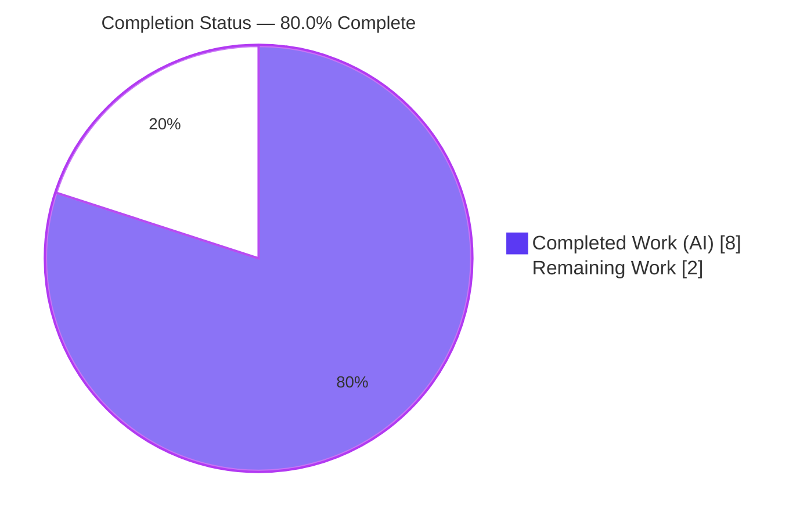
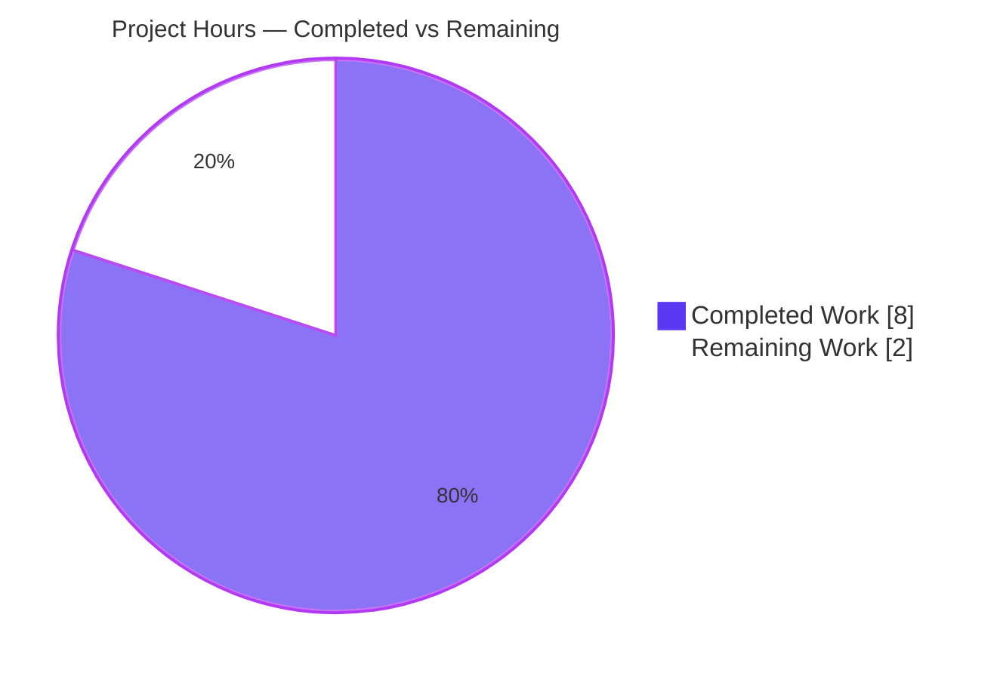
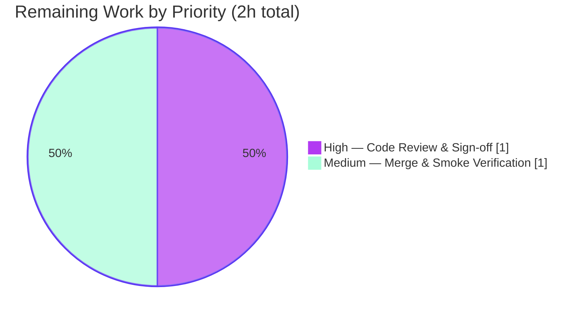

# Blitzy Project Guide — `hello_world` (Express.js Two-Endpoint Server)

> Repository: `hao-backprop-test` · Branch: `blitzy-1cacf83c-b1da-43d7-9490-124e4e9e2d5b` · HEAD: `819922e`
> Brand legend: **Completed / AI Work** = Dark Blue `#5B39F3` · **Remaining / Not Completed** = White `#FFFFFF` · Headings/Accents = Violet-Black `#B23AF2` · Highlight = Mint `#A8FDD9`

---

## 1. Executive Summary

### 1.1 Project Overview

This project adds the Express.js web framework to an existing single-file Node.js tutorial server and exposes a second HTTP endpoint. The server (`server.js`) previously used only Node's built-in `http` module and returned one fixed response for every request. Per the Agent Action Plan (AAP), it was refactored in place to an Express application that serves two distinct routes: `GET /` preserving the original `Hello, World!` greeting byte-for-byte, and a new `GET /good-evening` returning `Good evening`. The target users are developers following the tutorial; the business impact is enabling multi-route hosting via an idiomatic framework. Technical scope is intentionally minimal — three authored files, one new runtime dependency, and an unchanged `127.0.0.1:3000` binding.

### 1.2 Completion Status

The project is **80.0% complete**. All AAP-specified code deliverables (FR-1, FR-2, FR-3) are implemented, committed, and independently validated. The remaining 20% is exclusively human path-to-production activity (code review/sign-off and merge + clean-environment smoke verification) — not any outstanding engineering work.



| Metric | Hours |
|--------|-------|
| **Total Hours** | 10 |
| **Completed Hours (AI + Manual)** | 8 (AI: 8 · Manual: 0) |
| **Remaining Hours** | 2 |
| **Percent Complete** | **80.0%** |

*Completion formula (PA1, AAP-scoped): Completed 8h ÷ Total 10h = 80.0%.*

### 1.3 Key Accomplishments

- ✅ **FR-1 — Express.js added** as the project's first runtime dependency (`express@^5.2.1` in `package.json`, pinned to `5.2.1` in `package-lock.json`, lockfileVersion 3).
- ✅ **FR-2 — New `GET /good-evening` endpoint** returns `Good evening\n` (HTTP 200, `text/plain`).
- ✅ **FR-3 — Existing `GET /` endpoint preserved** byte-for-byte: `Hello, World!\n` (HTTP 200, `text/plain`); `127.0.0.1:3000` binding and startup log unchanged.
- ✅ **Minimal-change compliance** — exactly the 3 in-scope files modified (`server.js`, `package.json`, `package-lock.json`); zero out-of-scope files touched.
- ✅ **Clean dependency tree** — `npm ls express` resolves to `express@5.2.1` with zero missing/unmet/extraneous packages; full 67-package transitive tree intact.
- ✅ **Zero known vulnerabilities** — `npm audit` reports 0 issues across 67 audited dependencies.
- ✅ **Runtime validated end-to-end** — server starts cleanly, both endpoints return exact expected payloads, undefined paths return Express's default 404, clean shutdown.
- ✅ **Explainability artifacts** — 7-entry decision log (D-1…D-7) and a bidirectional traceability matrix (100% source→target coverage) authored in the AAP.

### 1.4 Critical Unresolved Issues

| Issue | Impact | Owner | ETA |
|-------|--------|-------|-----|
| *None — no critical unresolved issues identified* | All five production-readiness gates passed; zero code defects; no stubs/placeholders | — | — |

> Transparency note: `npm test` prints `Error: no test specified` and exits 1. This is **not** a defect — it is the pre-existing placeholder script that the AAP explicitly mandates be preserved as-is (adding a test harness and modifying this script are both out of scope per AAP 0.2.4/0.6.2). It does not block validation or release.

### 1.5 Access Issues

| System/Resource | Type of Access | Issue Description | Resolution Status | Owner |
|-----------------|----------------|-------------------|-------------------|-------|
| *None identified* | — | Public npm registry only; no private registries, credentials, service accounts, or third-party API keys are required. Repository write access is already confirmed (agent commits landed on branch). | N/A | — |

**No access issues identified.**

### 1.6 Recommended Next Steps

1. **[High]** Perform human code review and sign-off of the two agent commits (`3f7af14`, `819922e`) — verify contract preservation and minimal-change compliance.
2. **[Medium]** Merge the branch to `main` and run a clean-environment smoke verification (fresh clone → `npm install` → `node server.js` → curl both endpoints + 404 path).
3. **[Low]** *(Optional, out of current AAP scope)* Decide whether the project should grow beyond a tutorial; if so, plan a minimal test harness and a process manager/monitoring story in a future iteration.

---

## 2. Project Hours Breakdown

### 2.1 Completed Work Detail

| Component | Hours | Description |
|-----------|-------|-------------|
| FR-1 · Express.js dependency & lockfile | 2 | Verified current stable version (`5.2.1`, Node ≥ 18, MIT) via registry research; added `dependencies` block (`express@^5.2.1`); ran install; regenerated & pinned `package-lock.json` (lockfileVersion 3, 849 lines); verified 67-package transitive tree resolves cleanly. |
| FR-3 · Preserve `GET /` + `http`→Express refactor | 2 | Refactored the server bootstrap from the native `http` module to an Express app; registered `GET /` preserving byte-for-byte `Hello, World!\n`; set explicit `text/plain` (decision D-7); preserved `127.0.0.1:3000` binding and startup log line. |
| FR-2 · `GET /good-evening` endpoint | 1 | Chose kebab-case route path (decision D-3); implemented handler returning `Good evening\n` with HTTP 200 and `text/plain`. |
| Solution design & explainability artifacts | 2 | Full repository scope discovery (11 files), integration analysis, 7-entry decision log (D-1…D-7) with alternatives/rationale/risk, and a bidirectional traceability matrix (100% coverage). |
| Autonomous validation & QA (5 gates) | 1 | Dependency resolution, syntax compilation (`node --check`), test-harness scan, runtime end-to-end (both endpoints + 404 + byte/hex payload checks), and in-scope-file integrity validation. |
| **Total Completed** | **8** | |

### 2.2 Remaining Work Detail

| Category | Hours | Priority |
|----------|-------|----------|
| Code Review & Sign-off (verify the 2-commit diff, contract preservation, minimal-change compliance) | 1 | High |
| Merge & Deployment Smoke Verification (merge to `main`; fresh clone → `npm install` → `node server.js` → curl `/`, `/good-evening`, and a 404 path) | 1 | Medium |
| **Total Remaining** | **2** | |

> Out-of-scope enhancements (automated test harness, CI/CD, containerization, process manager/health checks, `.gitignore`, env-based config, resolving the `main: index.js` quirk) are **excluded** from the work universe per AAP §0.6.2 and carry **no hours** in this accounting.

### 2.3 Hours Reconciliation

- Section 2.1 total (Completed) = **8h**
- Section 2.2 total (Remaining) = **2h**
- Section 2.1 + Section 2.2 = **10h** = Total Project Hours (Section 1.2) ✅
- Completion = 8 ÷ 10 = **80.0%** ✅

---

## 3. Test Results

All results below originate from Blitzy's autonomous validation logs and were independently reproduced during this assessment on Node.js v20.20.2 / npm 10.8.2.

| Test Category | Framework | Total Tests | Passed | Failed | Coverage % | Notes |
|---------------|-----------|-------------|--------|--------|-----------|-------|
| Automated Unit | *(none — no harness in repo)* | 0 | 0 | 0 | N/A | Repository contains no `*.test.*` / `*.spec.*` / `test/` files. Adding a test harness is out of scope (AAP 0.2.4/0.6.2). `npm test` is a placeholder that fails by design; it is not a real test. |
| Syntax / Compilation | `node --check` | 1 | 1 | 0 | N/A | `node --check server.js` → exit 0 (zero syntax errors). |
| Dependency Resolution | `npm ls` / `npm ls --all` | 1 | 1 | 0 | N/A | `express@5.2.1`; zero missing/unmet/extraneous/invalid across the full 67-package tree. |
| Security Audit | `npm audit` | 1 | 1 | 0 | N/A | 0 vulnerabilities (info/low/moderate/high/critical all 0) across 67 dependencies. |
| Runtime / API (functional) | Manual HTTP (Invoke-WebRequest/curl) | 3 | 3 | 0 | N/A | `GET /` → 200 `Hello, World!`; `GET /good-evening` → 200 `Good evening`; `GET /nonexistent` → 404. |

**Summary:** 6 autonomous validation checks executed, 6 passed, 0 failed. No real automated unit-test suite exists in the repository (by AAP design); functional behavior is verified via runtime HTTP checks.

---

## 4. Runtime Validation & UI Verification

**Runtime health** (reproduced live during this assessment):

- ✅ **Operational** — `node server.js` starts cleanly and logs `Server running at http://127.0.0.1:3000/` (no stderr).
- ✅ **Operational** — `GET /` → HTTP 200, `Content-Type: text/plain; charset=utf-8`, body `Hello, World!\n` (byte-for-byte identical to the original payload — FR-3 preserved).
- ✅ **Operational** — `GET /good-evening` → HTTP 200, `Content-Type: text/plain; charset=utf-8`, body `Good evening\n` (FR-2).
- ✅ **Operational** — `GET /nonexistent` → HTTP 404 (documented Express default per decisions D-1/D-4).
- ✅ **Operational** — Process stops cleanly on termination.

**API integration outcomes:**

- ✅ **Operational** — Express `app.get()` route dispatch functioning for both literal paths.
- ✅ **Operational** — `require('express')` loads; `app.listen(port, hostname, …)` binds successfully on loopback.

**UI verification:**

- **Not applicable** — this project exposes only `text/plain` HTTP responses with no markup, styling, or client-side rendering. The AAP (§0.5.3) and its UI applicability assessment independently confirm there is no user interface of any kind.

---

## 5. Compliance & Quality Review

AAP deliverables cross-mapped to Blitzy quality/compliance benchmarks:

| Benchmark / AAP Requirement | Status | Progress | Notes |
|------------------------------|--------|----------|-------|
| FR-1 — Add Express.js dependency | ✅ Pass | 100% | `express@^5.2.1` declared; `5.2.1` pinned in lockfile; installed and resolving. |
| FR-2 — New `GET /good-evening` endpoint | ✅ Pass | 100% | Returns `Good evening\n` (200, `text/plain`). |
| FR-3 — Preserve `GET /` "Hello world" | ✅ Pass | 100% | Byte-for-byte `Hello, World!\n`; binding + startup log unchanged. |
| Minimal-change rule | ✅ Pass | 100% | Only the 3 in-scope files modified; 8 out-of-scope files verified unchanged. |
| Backward-compatibility of root contract | ✅ Pass | 100% | HTTP 200 + `text/plain` + exact payload preserved. |
| Explicit `text/plain` content-type (D-7) | ✅ Pass | 100% | `res.type('text/plain')` on both routes. |
| Explainability (decision log + traceability) | ✅ Pass | 100% | 7 decisions logged; bidirectional matrix at 100% coverage. |
| Syntax / compilation cleanliness | ✅ Pass | 100% | `node --check` exit 0. |
| Dependency integrity | ✅ Pass | 100% | `npm ls --all` clean; no unmet/extraneous. |
| Security (dependency audit) | ✅ Pass | 100% | `npm audit` → 0 vulnerabilities. |
| Reproducible install (lockfile) | ✅ Pass | 100% | lockfileVersion 3 pins exact versions. |
| `README.md` "Do not touch!" respected | ✅ Pass | 100% | Left unchanged (out of scope). |

**Fixes applied during autonomous validation:** None required — the prior agent's implementation was already correct and complete; zero code defects were found and the Blitzy issue-resolution workflow was not triggered.

**Outstanding compliance items:** None within AAP scope. (Human review/sign-off and merge remain as path-to-production gates — see Section 2.2.)

---

## 6. Risk Assessment

| Risk | Category | Severity | Probability | Mitigation | Status |
|------|----------|----------|-------------|------------|--------|
| No automated test suite (`npm test` is a by-design placeholder) | Technical | Low | Medium | Add a minimal harness (e.g., supertest) *if* the project outgrows the tutorial; out of current AAP scope | Accepted (by design) |
| Express 5.x is a recent major (breaking changes vs 4.x) | Technical | Low | Low | Only literal-path routing is used, which is unaffected by Express 5 breaking changes (decision D-5) | Mitigated |
| `package.json` `main: index.js` points to a non-existent file | Technical | Low | Low | Irrelevant — app runs via `node server.js`; fix only if packaged as an importable module | Accepted (pre-existing) |
| No authentication/authorization on endpoints | Security | Low | Low | Both routes are public, read-only static greetings with no sensitive data | Accepted (by scope) |
| Supply-chain surface expanded 0 → 67 transitive packages | Security | Low | Low | `npm audit` currently 0 vulnerabilities; lockfile pins exact versions; run `npm audit` periodically | Monitored (clean) |
| No process manager / health check / structured logging | Operational | Low | Medium | Wrap with pm2/systemd + monitoring for long-lived production hosting; out of current AAP scope | Accepted (out of scope) |
| `node_modules` not committed; deploy relies on `npm install` from lockfile | Operational | Low | Low | Lockfile guarantees reproducibility; covered by the clean-install smoke test (Section 2.2) | Monitored |
| Only external dependency is the npm registry (no DB/API/creds) | Integration | Low | Low | Lockfile pins the tree; offline installs possible via npm cache | Mitigated |
| Undefined paths / non-GET methods now return 404 (was: greeting for every path) | Integration | Low | Low | Intentional, documented deviation (D-1/D-4/D-6); confirm no consumer relied on the old catch-all | Accepted (documented) |

**Overall risk posture:** LOW across all four categories, consistent with a trivial, fully-validated, loopback-only tutorial server.

---

## 7. Visual Project Status

**Project hours breakdown** (Completed = Dark Blue `#5B39F3`, Remaining = White `#FFFFFF`):



**Remaining hours by priority** (from Section 2.2):



> Integrity: "Remaining Work" = **2h** matches Section 1.2 (Remaining Hours = 2) and the Section 2.2 Hours sum (1 + 1 = 2).

---

## 8. Summary & Recommendations

**Achievements.** The AAP has been fully implemented. All three functional requirements are satisfied and independently validated: Express.js (`5.2.1`) is installed as the first runtime dependency, a new `GET /good-evening` endpoint returns `Good evening`, and the original `GET /` endpoint still returns `Hello, World!` byte-for-byte on the unchanged `127.0.0.1:3000` binding. The change is minimal and surgical — exactly three files modified across two clean commits, with zero out-of-scope edits, zero code defects, and zero known dependency vulnerabilities.

**Remaining gaps.** No engineering gaps remain within AAP scope. The outstanding **2 hours** are purely human path-to-production activity: (1) code review and sign-off of the diff, and (2) merge to `main` plus a clean-environment install/run smoke verification.

**Critical path to production.** Review → merge → clean-install smoke test. Each step is lightweight given the tiny, fully-validated surface.

**Success metrics (all met):** FR-1/FR-2/FR-3 satisfied; byte-for-byte backward compatibility; clean compile; clean dependency tree; 0 vulnerabilities; both endpoints live with exact payloads.

**Production-readiness assessment.** The codebase is **production-ready** from an implementation standpoint. Per the AAP-scoped hours methodology the project stands at **80.0% complete**, with the final 20% representing the human review-and-merge gate rather than any remaining code work. Recommendation: proceed to review and merge.

| Metric | Value |
|--------|-------|
| Completion (AAP-scoped) | 80.0% |
| Functional requirements satisfied | 3 of 3 |
| Files changed | 3 (all in-scope) |
| Code defects found | 0 |
| Dependency vulnerabilities | 0 |
| Remaining effort | 2 hours (human path-to-production) |

---

## 9. Development Guide

### 9.1 System Prerequisites

- **Node.js 20 LTS** (validated on `v20.20.2`). Express 5 requires Node ≥ 18.
- **npm 10.x** (validated on `10.8.2`) — bundled with Node 20.
- **Operating system:** OS-agnostic (validated on Windows Server 2022; works on macOS/Linux equally).
- **Network:** access to `registry.npmjs.org` for the first dependency install (offline installs possible from a warm npm cache).
- **Disk:** negligible source footprint; `node_modules/` (~a few MB) is created by install.
- **HTTP client for verification:** `curl`, or PowerShell `Invoke-WebRequest`, or any browser.

### 9.2 Environment Setup

No environment variables and no external services (no database, cache, or message queue) are required. Host and port are hardcoded to `127.0.0.1:3000`.

```bash
# Clone the repository and enter it
git clone <repository-url>
cd hao-backprop-test
```

### 9.3 Dependency Installation

```bash
# Installs express@5.2.1 and its transitive tree from the committed lockfile
npm install
```

Expected output (fresh clone): a summary line such as `added 66 packages`. On an already-installed tree you will see:

```
up to date in 696ms
```

Verify the dependency resolved correctly:

```bash
npm ls express
```

Expected:

```
hello_world@1.0.0 <path>
`-- express@5.2.1
```

### 9.4 Application Startup

```bash
node server.js
```

Expected console output (server runs in the foreground):

```
Server running at http://127.0.0.1:3000/
```

Stop the server with `Ctrl+C`.

> Windows/PowerShell tip: to run in the background for scripted verification —
> `Start-Process -FilePath node -ArgumentList "server.js" -NoNewWindow -PassThru`
> (capture the returned process and stop it later with `Stop-Process -Id <pid> -Force`).

### 9.5 Verification Steps

```bash
# 1) Syntax check (no build step; plain JS)
node --check server.js            # exit 0 = OK

# 2) Endpoint checks (server must be running)
curl http://127.0.0.1:3000/               # -> Hello, World!
curl http://127.0.0.1:3000/good-evening   # -> Good evening
curl -i http://127.0.0.1:3000/nonexistent # -> HTTP/1.1 404 Not Found

# 3) Security audit (optional)
npm audit                          # -> found 0 vulnerabilities
```

PowerShell equivalents for the endpoint checks:

```powershell
(Invoke-WebRequest -Uri "http://127.0.0.1:3000/" -UseBasicParsing).Content
(Invoke-WebRequest -Uri "http://127.0.0.1:3000/good-evening" -UseBasicParsing).Content
```

### 9.6 Example Usage

| Request | Response Status | Content-Type | Body |
|---------|-----------------|--------------|------|
| `GET /` | 200 | `text/plain; charset=utf-8` | `Hello, World!\n` |
| `GET /good-evening` | 200 | `text/plain; charset=utf-8` | `Good evening\n` |
| `GET /nonexistent` | 404 | (Express default) | (Express default 404 body) |

### 9.7 Troubleshooting

- **`Error: Cannot find module 'express'`** — dependencies are not installed. Run `npm install` in the repository root.
- **`EADDRINUSE: address already in use 127.0.0.1:3000`** — port 3000 is occupied. Stop the other process, or temporarily change the `port` constant in `server.js`.
- **`npm test` prints `Error: no test specified` and exits 1** — this is expected/by-design (a preserved placeholder script). It is not part of the run sequence and is not a bug.
- **`node_modules/` missing after a fresh clone** — expected; it is not committed. Run `npm install` to regenerate it from the committed lockfile.

---

## 10. Appendices

### A. Command Reference

| Command | Purpose |
|---------|---------|
| `npm install` | Install `express` + transitive tree from the lockfile |
| `npm ls express` | Confirm `express@5.2.1` resolved |
| `node --check server.js` | Syntax-check the server without running it |
| `node server.js` | Start the HTTP server on `127.0.0.1:3000` |
| `npm audit` | Report dependency vulnerabilities (currently 0) |
| `curl http://127.0.0.1:3000/` | Exercise the root endpoint |
| `curl http://127.0.0.1:3000/good-evening` | Exercise the new endpoint |

### B. Port Reference

| Port | Host | Purpose |
|------|------|---------|
| 3000 | 127.0.0.1 (loopback) | HTTP server listening address (hardcoded; unchanged from the original) |

### C. Key File Locations

| Path | Role | Disposition |
|------|------|-------------|
| `server.js` | Express application; both route handlers + listener | UPDATED (commit 819922e) |
| `package.json` | Package manifest; declares `express@^5.2.1` | UPDATED (commit 3f7af14) |
| `package-lock.json` | Pins `express@5.2.1` + 66 transitive packages (lockfileVersion 3) | UPDATED/regenerated (commit 3f7af14) |
| `node_modules/` | Installed dependency tree | Generated by `npm install` (not committed) |
| `README.md` | Project note ("Do not touch!") | UNCHANGED (out of scope) |

### D. Technology Versions

| Technology | Version | Source |
|------------|---------|--------|
| Node.js | 20.20.2 | Runtime (target: Node 20 LTS) |
| npm | 10.8.2 | Bundled with Node 20 |
| Express.js | 5.2.1 | `package.json` `^5.2.1`; lockfile-pinned `5.2.1` |
| Lockfile format | lockfileVersion 3 | `package-lock.json` |

### E. Environment Variable Reference

*Not applicable.* This project uses no environment variables; host (`127.0.0.1`) and port (`3000`) are hardcoded, and there are no external services or secrets.

### F. Developer Tools Guide

| Tool | Use |
|------|-----|
| `node --check` | Fast syntax validation (no execution) |
| `npm ls` / `npm ls --all` | Inspect the dependency tree and detect unmet/extraneous packages |
| `npm audit` | Continuous supply-chain vulnerability monitoring |
| `curl` / `Invoke-WebRequest` | Manual endpoint verification |
| `git log` / `git diff` | Review the two agent commits (`3f7af14`, `819922e`) during sign-off |

### G. Glossary

| Term | Definition |
|------|------------|
| **AAP** | Agent Action Plan — the authoritative specification of project scope and requirements. |
| **FR-1 / FR-2 / FR-3** | The three functional requirements: add Express; add `/good-evening`; preserve `/`. |
| **Path-to-production** | Standard human activities (review, merge, deploy smoke) required to move validated code to production. |
| **lockfileVersion 3** | The npm lockfile schema used by `package-lock.json` for reproducible installs. |
| **Loopback binding** | Listening on `127.0.0.1`, reachable only from the local host (not externally exposed). |

---

*Generated by the Blitzy Platform assessment agent. All hours, percentages, and test results are AAP-scoped and cross-section reconciled (Total 10h = Completed 8h + Remaining 2h; 80.0% complete).*