# Technical Specification

# 1. Introduction

## 1.1 Executive Summary

The `hao-backprop-test` repository is a small, mixed-language code snapshot whose only human-facing document describes it as a "test project for backprop integration" and instructs "Do not touch!" (`README.md`). It is best understood as a controlled test fixture rather than a cohesive production application. The entire repository is a flat collection of eight files with no subdirectories, no third-party dependencies, and no build or runtime wiring connecting its individual language artifacts.

**Project overview.** The repository combines one runnable component with several reference and placeholder artifacts:

| Artifact | File(s) | Nature |
|---|---|---|
| Node.js HTTP server | `server.js` | Executable "Hello, World!" server |
| Node.js package metadata | `package.json`, `package-lock.json` | Declares package `hello_world` v1.0.0 with zero dependencies |
| Java entry-point stub | `LoginTest.java` | Unfinished, non-compilable skeleton |
| Industry vocabulary | `industry.csv` | 43-value controlled reference list |
| Placeholder files | `test.py.txt`, `test.txt.txt` | Empty and inert |

**Core business problem.** The repository does not implement a conventional line-of-business capability. Its declared purpose, per `README.md`, is to act as a minimal, predictable target for an external process named "backprop." The need it addresses is therefore the availability of a lightweight, dependency-free artifact against which integration, file-traversal, or tooling behavior can be exercised repeatably and deterministically.

**Key stakeholders and users.** No end-user-facing application exists in the repository. Its stakeholders are the technical actors implied by its metadata and self-description:

| Stakeholder | Evidence in repository | Role |
|---|---|---|
| Repository author | `package.json` author field (`hxu`) | Owns and maintains the snapshot |
| Backprop integration process | `README.md` description | External consumer / test driver |
| Local developer or automated harness | `server.js` loopback server on `127.0.0.1:3000` | Runs and probes the artifact |

**Expected business impact and value proposition.** The value of the repository is operational rather than commercial. It provides a deterministic, zero-setup surface — a single HTTP endpoint that always responds with `Hello, World!`, plus stable reference data and named placeholder paths — that can be cloned and exercised without installing any dependencies (confirmed by the empty dependency tree in `package-lock.json`). The explicit "Do not touch!" instruction in `README.md` reinforces that this value depends on the artifact remaining stable and unchanged so that integration runs against it are repeatable.

## 1.2 System Overview

This overview characterizes the repository's context, its high-level composition and technical approach, and the criteria by which correct operation of the artifact can be judged. Every statement is grounded in the eight files that constitute the repository; no external configuration, documentation, or dependency metadata was found beyond what is described below.

### 1.2.1 Project Context

**Business context and market positioning.** The repository is positioned as an internal test artifact, not as a market-facing product. `README.md` names the project `hao-backprop-test` and describes it as a "test project for backprop integration," and the Java package namespace `com.blitzyTest` in `LoginTest.java` independently signals a testing context. No marketing, product, pricing, or market-positioning material is present anywhere in the repository.

**Current system limitations.** The repository is not documented as replacing or upgrading any predecessor system, and none is referenced. What is directly observable is that the snapshot is deliberately minimal and partly unfinished:

- The Node.js manifest declares its entry point as `index.js` (the `main` field in `package.json`), but no `index.js` file exists; the only runnable Node.js file is `server.js`.
- The `npm test` script is a placeholder that fails by design: `echo "Error: no test specified" && exit 1`.
- `LoginTest.java` is a non-compilable skeleton whose `main` method contains only a stray `Web` token and no logic.
- `test.py.txt` and `test.txt.txt` are empty placeholder files with no content.

**Integration with the existing enterprise landscape.** The repository has no external integrations. `package-lock.json` records an empty dependency tree, `server.js` imports only the Node.js built-in `http` module, and searches for configuration, CI/CD, infrastructure, or deployment artifacts returned nothing. The server binds exclusively to loopback (`127.0.0.1:3000`), so it is not exposed to a network or to enterprise systems. The only external relationship is the "backprop" process referenced in `README.md`, which consumes this repository as a test target rather than being wired into it.

### 1.2.2 High-Level Description

**Primary system capabilities.** The single executable capability is an HTTP server. `server.js` creates a server that responds to every request with HTTP status `200`, a `text/plain` content type, and the fixed body `Hello, World!`. The remaining files do not execute: `industry.csv` is static reference data, `LoginTest.java` is an unfinished stub, and the two `.txt` files are empty.

**Major system components.**

| Component | File(s) | Responsibility |
|---|---|---|
| HTTP server | `server.js` | Serve a fixed `Hello, World!` response on `127.0.0.1:3000` |
| Package definition | `package.json`, `package-lock.json` | Identify the `hello_world` package and pin an empty dependency set |
| Java stub | `LoginTest.java` | Placeholder `main` entry point in `com.blitzyTest` (not functional) |
| Reference data | `industry.csv` | Controlled vocabulary of 43 industry categories |
| Placeholders | `test.py.txt`, `test.txt.txt` | Named, empty file paths |

The following diagram summarizes the repository's composition and the only observed interaction paths:

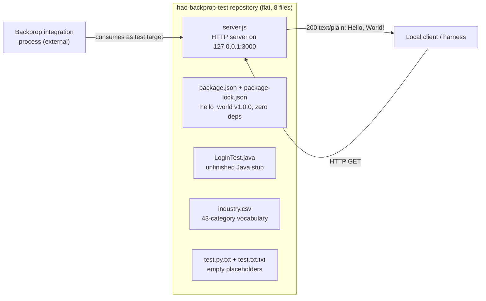

**Core technical approach.** The repository favors radical minimalism. The Node.js component relies solely on the standard-library `http` module, with no frameworks and no installed packages, so it runs with only a Node.js runtime present. The artifacts are intentionally independent — three unrelated language surfaces (JavaScript, Java, and `.py`/`.txt` placeholders) coexist without cross-language calls or a shared build — which is consistent with a repository used to exercise file traversal and cross-language handling rather than to deliver a unified runtime system.

### 1.2.3 Success Criteria

The repository defines no formal service-level agreements (SLAs), key performance indicators (KPIs), or measurable business objectives. Searches for tests, monitoring, and roadmap artifacts returned nothing, and the only test script is a placeholder that fails by design. In the absence of declared metrics, the criteria below are the observable, verifiable behaviors that define correct operation of the artifact as written.

**Measurable objectives (observable proxies).**

| Objective | Evidence / verification |
|---|---|
| Node.js server starts and listens on `127.0.0.1:3000` | `server.listen(port, hostname, ...)` in `server.js`, which logs the startup URL |
| Every request returns HTTP 200 with body `Hello, World!` | Request handler in `server.js` (statusCode `200`, `text/plain`) |
| Zero-dependency install | Empty `packages` tree in `package-lock.json` |

**Critical success factors.** Determinism (a single, fixed response path with no branching), reproducibility (no dependencies to resolve before running), and stability (the "Do not touch!" instruction in `README.md` preserves the fixture unchanged) are the factors that make the repository useful as an integration target.

**Key performance indicators (KPIs).** None are defined in the repository. No performance thresholds, latency budgets, throughput targets, or monitoring instrumentation are present in any file. Any performance expectations would have to be supplied by the external consumer, not by this repository.

## 1.3 Scope

The scope below reflects what is actually present and functional in the repository, as opposed to what individual file names might suggest. Because the repository is a small test fixture, the in-scope surface is intentionally narrow and most conventional application functionality is out of scope.

### 1.3.1 In-Scope

**Core features and functionalities.**

- *Must-have capabilities:*
  - A runnable Node.js HTTP server (`server.js`) that returns a fixed `Hello, World!` response on `127.0.0.1:3000`.
  - Node.js package identity with a pinned, empty dependency set (`package.json`, `package-lock.json`).
  - A controlled industry-category vocabulary provided as static reference data (`industry.csv`).
  - A Java entry-point skeleton (`LoginTest.java`) and two named placeholder files (`test.py.txt`, `test.txt.txt`) that exist as file-tree artifacts.
- *Primary user workflow:* Start the server (for example, `node server.js`) and issue an HTTP request to `http://127.0.0.1:3000/`, receiving `200 OK` with the body `Hello, World!`. This is the only end-to-end runtime workflow present.
- *Essential integrations:* None beyond the Node.js built-in `http` module; there are no third-party or external service integrations.
- *Key technical requirements:* A Node.js runtime that provides the built-in `http` module. No database, framework, environment configuration, or network exposure beyond loopback is required.

**Implementation boundaries.**

| Boundary dimension | In-scope definition |
|---|---|
| System boundary | A single Node.js process bound to loopback `127.0.0.1:3000`, plus static and inert files on disk |
| User groups | Local developer and the external "backprop" test/integration process (`README.md`) |
| Geographic / market coverage | None — loopback only; not networked, deployed, or region-scoped |
| Data domains | The industry-classification vocabulary in `industry.csv` (43 categories) is the only data domain present |

### 1.3.2 Out-of-Scope

The following are explicitly not implemented in the repository. Some are suggested by file names (for example, `LoginTest.java`) but are not realized in code.

- *Excluded features and capabilities:*
  - Authentication or login logic — despite the name `LoginTest.java`, the class contains no login functionality (only a stray `Web` token).
  - Any HTTP routing, request parsing, or business logic beyond the single fixed response in `server.js`.
  - Data persistence, databases, or programmatic consumption of `industry.csv` (no code in the repository reads the file).
  - Automated testing — the `npm test` script intentionally fails and no test files exist.
  - HTTPS/TLS, sessions, or any security controls.
  - A build pipeline, bundling, containerization, or dependency management (the dependency tree is empty).
  - Cross-language integration between the JavaScript, Java, and placeholder artifacts.
  - Any behavior for `test.py.txt` and `test.txt.txt`, which are empty.
- *Future-phase considerations:* No roadmap, changelog, backlog, or planned-features document exists. The incomplete `LoginTest.java` stub and the `package.json` `main` field pointing to a missing `index.js` indicate unrealized intent, but no future phases are documented in the repository.
- *Integration points not covered:* No external services, APIs, message brokers, or enterprise systems. No configuration, CI/CD, or infrastructure definitions are present, so no deployment or integration environment is in scope.
- *Unsupported use cases:* Production or public-network use (`README.md` states "Do not touch!" and the server binds to loopback only); real authentication or full web-application behavior; and use of the industry vocabulary as a live validation source.

## 1.4 References

The following repository files and locations were examined directly as evidence for this section. No external (web) sources were used; the analysis is grounded entirely in the repository contents.

**Files**

- `README.md` — Established the project identity (`hao-backprop-test`), its self-description as a "test project for backprop integration," and the "Do not touch!" instruction.
- `package.json` — Established the Node.js package identity (`hello_world` v1.0.0), the `main` entry point (`index.js`, which is absent), the intentionally failing `test` script, the author (`hxu`), and the MIT license; confirmed no declared dependencies.
- `package-lock.json` — Confirmed lockfile version 3 with an empty dependency tree (zero installed modules).
- `server.js` — Established the only executable capability: a Node.js `http` server bound to `127.0.0.1:3000` that returns HTTP 200 `text/plain` `Hello, World!` for every request and logs its startup URL.
- `LoginTest.java` — Established the unfinished, non-compilable Java stub in package `com.blitzyTest` (a `main` method containing only a stray `Web` token).
- `industry.csv` — Established the controlled-vocabulary reference list of 43 industry categories under the `Industry` header.
- `test.py.txt` — Confirmed an empty placeholder file with no content.
- `test.txt.txt` — Confirmed an empty placeholder file with no content.

**Folders**

- `` (repository root) — Confirmed the flat structure of exactly eight files with no subdirectories, and the absence of configuration, CI/CD, infrastructure, test, and roadmap artifacts.

# 2. Product Requirements

## 2.1 Feature Catalog

This catalog decomposes the `hao-backprop-test` repository into discrete, individually testable features. Because the repository is a small, flat, mixed-language test fixture rather than a conventional line-of-business application (see Section 1.1 Executive Summary and Section 1.2 System Overview), the feature set is intentionally narrow and is derived **strictly** from the eight files that actually exist in the repository. No features have been inferred beyond what the source artifacts demonstrably provide.

Five features (F-001 through F-005) map to seven of the eight files. `README.md` is not modeled as a feature; it is the project's identity and governance document (`# hao-backprop-test` / "test project for backprop integration. Do not touch!") and is treated as a cross-cutting constraint in Section 2.6. Conventional product capabilities such as authentication, routing, persistence, and automated testing are explicitly **out of scope** and are documented as such in Section 1.3.2.

Feature status labels reflect the observed maturity of each artifact: three artifacts are functionally complete as written, one is an unfinished skeleton, and two are empty placeholders.

### 2.1.1 Feature Inventory and Metadata Summary

The following two tables summarize the metadata for every feature. Each attribute set is split across two tables to respect the four-column limit.

**Table 2.1.1-A — Feature Identity, Category, and Priority**

| Feature ID | Feature Name | Category | Priority |
|---|---|---|---|
| F-001 | HTTP "Hello, World!" Response Service | Core Runtime Service | Critical |
| F-002 | Node.js Package Identity & Zero-Dependency Baseline | Packaging & Build Metadata | High |
| F-003 | Industry Classification Reference Vocabulary | Static Reference Data | Medium |
| F-004 | Java Login Entry-Point Stub | Language Stub / Placeholder | Low |
| F-005 | Named Placeholder File Artifacts | File-Tree Placeholder | Low |

**Table 2.1.1-B — Feature Status and Source Evidence**

| Feature ID | Status | Source Artifact(s) | Related Spec Section |
|---|---|---|---|
| F-001 | Completed | `server.js` | 1.2.2, 1.3.1 |
| F-002 | Completed | `package.json`, `package-lock.json` | 1.2.2, 1.3.1 |
| F-003 | Completed | `industry.csv` | 1.2.2, 1.3.1 |
| F-004 | In Development | `LoginTest.java` | 1.2.1, 1.3.2 |
| F-005 | Proposed | `test.py.txt`, `test.txt.txt` | 1.2.1, 1.3.2 |

Status rationale: F-004 is marked *In Development* because `LoginTest.java` is a non-compilable skeleton (its `main` body contains only a stray `Web` token). F-005 is marked *Proposed* because both files exist as named paths but are 0 bytes with no defined content or behavior.

### 2.1.2 F-001: HTTP "Hello, World!" Response Service

| Attribute | Value |
|---|---|
| Unique ID | F-001 |
| Feature Name | HTTP "Hello, World!" Response Service |
| Feature Category | Core Runtime Service |
| Priority Level | Critical |
| Status | Completed |

**Description**

- **Overview:** `server.js` creates a Node.js HTTP server that binds to `127.0.0.1:3000` and responds to every incoming request with HTTP status `200`, a `Content-Type` of `text/plain`, and the fixed body `Hello, World!\n`. On startup it logs `Server running at http://127.0.0.1:3000/`. This is the only executable, end-to-end runtime capability in the repository.
- **Business Value:** Provides a deterministic, zero-setup HTTP endpoint that serves as a stable, repeatable target for the external "backprop" integration process referenced in `README.md`, and as a lightweight smoke-test surface for a local developer or automated harness.
- **User Benefits:** A local operator can start the service with a single command (`node server.js`) and receive an identical, predictable response for any request, without installing any dependencies or configuring anything.
- **Technical Context:** The implementation depends only on the Node.js built-in `http` module. A single request handler produces the response with no routing, no request parsing, no branching, and no error handling; the listener binds to loopback only.

**Dependencies**

| Dependency Type | Detail |
|---|---|
| Prerequisite Features | None. `server.js` executes independently; F-002 provides the surrounding package identity but is not required to run the server. |
| System Dependencies | A Node.js runtime that provides the built-in `http` module. No runtime version is pinned (no `engines` field in `package.json`; no `.nvmrc`/`.node-version` file). |
| External Dependencies | None. `package-lock.json` records an empty dependency tree; `server.js` imports no third-party packages. |
| Integration Requirements | The external "backprop" process consumes the running server as a test target (`README.md`). Because the server binds to loopback, any consumer must run on the same host; there is no inbound integration wiring or network exposure. |

### 2.1.3 F-002: Node.js Package Identity and Zero-Dependency Baseline

| Attribute | Value |
|---|---|
| Unique ID | F-002 |
| Feature Name | Node.js Package Identity & Zero-Dependency Baseline |
| Feature Category | Packaging & Build Metadata |
| Priority Level | High |
| Status | Completed |

**Description**

- **Overview:** `package.json` declares the npm package `hello_world` at version `1.0.0` (description "Hello world in Node.js", author `hxu`, license `MIT`, `main` set to `index.js`, and a `test` script that deliberately fails). `package-lock.json` (`lockfileVersion` 3) pins an empty dependency tree containing only the root package.
- **Business Value:** Guarantees a reproducible, dependency-free installation — there is nothing to resolve or download — which underpins the determinism and reproducibility identified as critical success factors in Section 1.2.3.
- **User Benefits:** `npm install` / `npm ci` complete without fetching any packages; the package carries a clear identity, version, and license.
- **Technical Context:** The `main` field points to `index.js`, which does not exist in the repository (the only runnable file is `server.js`) — a documented inconsistency. The `test` script (`echo "Error: no test specified" && exit 1`) fails by design, so there is no automated test coverage.

**Dependencies**

| Dependency Type | Detail |
|---|---|
| Prerequisite Features | None. |
| System Dependencies | An npm / Node.js toolchain to read the manifest and lockfile (e.g., for `npm install`, `npm ci`, or `npm test`). |
| External Dependencies | None — the `dependencies` and `devDependencies` sets are absent, and the lockfile installs zero modules. |
| Integration Requirements | None. The manifest is self-contained; it does not reference `server.js`, `industry.csv`, `LoginTest.java`, or the placeholder files. |

### 2.1.4 F-003: Industry Classification Reference Vocabulary

| Attribute | Value |
|---|---|
| Unique ID | F-003 |
| Feature Name | Industry Classification Reference Vocabulary |
| Feature Category | Static Reference Data |
| Priority Level | Medium |
| Status | Completed |

**Description**

- **Overview:** `industry.csv` is a single-column CSV whose header is `Industry`, followed by 43 curated industry-category values ranging from `Accounting/Finance` (first) to `Other` (last, a catch-all).
- **Business Value:** Supplies a canonical, stable controlled vocabulary that could support classification, form population, filtering, or validation workflows; within this repository it functions as static reference data and as a deterministic file-traversal target.
- **User Benefits:** Consumers obtain a ready-made, curated list of industry categories — including an explicit `Other` fallback — without having to author one.
- **Technical Context:** The file is well-formed static data (749 bytes; header plus 43 non-empty rows). No code in the repository reads or parses it; it is standalone reference data.

**Dependencies**

| Dependency Type | Detail |
|---|---|
| Prerequisite Features | None. |
| System Dependencies | None. Any CSV/text reader could consume the file, but no in-repository component does. |
| External Dependencies | None. |
| Integration Requirements | None. The vocabulary is not wired into `server.js` or any other artifact; it is consumed, if at all, only by an external reader such as the "backprop" traversal process. |

### 2.1.5 F-004: Java Login Entry-Point Stub

| Attribute | Value |
|---|---|
| Unique ID | F-004 |
| Feature Name | Java Login Entry-Point Stub |
| Feature Category | Language Stub / Placeholder |
| Priority Level | Low |
| Status | In Development |

**Description**

- **Overview:** `LoginTest.java` declares `package com.blitzyTest` and a `public class LoginTest` with a standard `public static void main(String[] args)` method whose body contains only a stray `Web` token. As written it is not valid, compilable Java.
- **Business Value:** Represents an unrealized, placeholder entry point that contributes an additional language surface (Java) to the mixed-language fixture, consistent with the repository's use as a cross-language traversal/handling target.
- **User Benefits:** None are realized — the class cannot compile or run in its current state.
- **Technical Context:** The `com.blitzyTest` package namespace signals a testing context (Section 1.2.1). Despite the file name, no login logic exists (Section 1.3.2). The stub is disconnected from `server.js` and every other artifact.

**Dependencies**

| Dependency Type | Detail |
|---|---|
| Prerequisite Features | None. |
| System Dependencies | A Java/JDK toolchain would be required to compile and run the class; however, the source is non-compilable as written, so this dependency cannot currently be satisfied. |
| External Dependencies | None. |
| Integration Requirements | None. The stub has no cross-language calls or shared build with the Node.js or CSV artifacts. |

### 2.1.6 F-005: Named Placeholder File Artifacts

| Attribute | Value |
|---|---|
| Unique ID | F-005 |
| Feature Name | Named Placeholder File Artifacts |
| Feature Category | File-Tree Placeholder |
| Priority Level | Low |
| Status | Proposed |

**Description**

- **Overview:** `test.py.txt` and `test.txt.txt` are two files that exist at the repository root and are each 0 bytes (empty), with no content, code, or metadata.
- **Business Value:** Provide named, inert file-tree entries that can act as deterministic traversal/handling targets for external tooling (such as the "backprop" process) that inspects repository contents.
- **User Benefits:** None beyond their presence as named paths; they encode no logic, configuration, or data.
- **Technical Context:** Both files are confirmed empty. They do not participate in execution, packaging, or documentation, and nothing in the repository references them.

**Dependencies**

| Dependency Type | Detail |
|---|---|
| Prerequisite Features | None. |
| System Dependencies | None. |
| External Dependencies | None. |
| Integration Requirements | None. Their only relationship to the wider system is passive: they may be enumerated by an external file-traversal consumer, but no component reads them. |

## 2.2 Functional Requirements

This section enumerates the testable functional requirements for each feature. Requirement identifiers follow the format `F-XXX-RQ-YYY`. Priority uses the MoSCoW scale (Must-Have / Should-Have / Could-Have), and Complexity is rated High / Medium / Low. Every requirement is expressed with an acceptance criterion that can be objectively verified against the artifact. Per-feature technical specifications and validation rules are given as compact two-column tables to keep each table within the four-column limit.

Because the repository defines no service-level agreements, key performance indicators, or latency/throughput targets anywhere (confirmed in Section 1.2.3), all "Performance Criteria" entries state that no target is defined and, where meaningful, provide an observable proxy grounded in the code.

### 2.2.1 F-001 — HTTP "Hello, World!" Response Service

**Requirement Details**

| Requirement ID | Description | Priority | Complexity |
|---|---|---|---|
| F-001-RQ-001 | Start an HTTP server that binds and listens on loopback `127.0.0.1`, port `3000` | Must-Have | Low |
| F-001-RQ-002 | Respond to every request with status `200`, `Content-Type: text/plain`, body `Hello, World!\n` | Must-Have | Low |
| F-001-RQ-003 | Use only the Node.js built-in `http` module (no third-party packages) | Must-Have | Low |
| F-001-RQ-004 | Produce a deterministic, stateless response regardless of method, path, query, or repetition | Should-Have | Low |

**Acceptance Criteria**

| Requirement ID | Acceptance Criterion |
|---|---|
| F-001-RQ-001 | After running `node server.js`, a TCP connection to `127.0.0.1:3000` succeeds and the console prints exactly `Server running at http://127.0.0.1:3000/` |
| F-001-RQ-002 | A request to any path returns HTTP `200`, header `Content-Type: text/plain`, and body `Hello, World!\n` (14 bytes) |
| F-001-RQ-003 | The source imports only `http`; the server runs with no `npm install` performed and no `node_modules` present |
| F-001-RQ-004 | Requests differing in method (`GET`/`POST`/`DELETE`), path, or query string all return byte-identical bodies and the same handler-set status and content type |

**Technical Specifications**

| Aspect | Specification |
|---|---|
| Input Parameters | None influence the output. The handler ignores the request method, URL/path, query string, headers, and body. Startup takes no CLI arguments or environment variables; hostname and port are hard-coded constants (`127.0.0.1`, `3000`). |
| Output / Response | HTTP `200`; `Content-Type: text/plain`; body `Hello, World!\n` (14 bytes). The handler explicitly sets only `statusCode` and the content-type header; Node's `http` layer adds default `Date`, `Connection`, `Keep-Alive`, and `Content-Length` headers. |
| Performance Criteria | None defined in the repository. Observable proxy: the handler performs no I/O or computation, returning a constant response per request. |
| Data Requirements | None. No persistent state, data store, or runtime file reads. |

**Validation Rules**

| Category | Specification |
|---|---|
| Business Rules | The response is a fixed constant with no conditional logic; its stability is governed by the "Do not touch!" instruction in `README.md`. |
| Data Validation | None. Request input is neither parsed nor validated; it is accepted and ignored. |
| Security Requirements | None implemented — no authentication, authorization, TLS/HTTPS, input sanitization, or rate limiting. Loopback-only binding (`127.0.0.1`) is the sole implicit exposure control. |
| Compliance Requirements | None defined. The only compliance-relevant metadata is the MIT license declared in `package.json`/`package-lock.json`. |

### 2.2.2 F-002 — Node.js Package Identity and Zero-Dependency Baseline

**Requirement Details**

| Requirement ID | Description | Priority | Complexity |
|---|---|---|---|
| F-002-RQ-001 | Declare package identity: `name` `hello_world`, `version` `1.0.0`, `license` `MIT`, `author` `hxu`, `main` `index.js` | Must-Have | Low |
| F-002-RQ-002 | Pin an empty dependency tree in the lockfile | Must-Have | Low |
| F-002-RQ-003 | Provide a `test` npm script that exits non-zero by design | Could-Have | Low |

**Acceptance Criteria**

| Requirement ID | Acceptance Criterion |
|---|---|
| F-002-RQ-001 | `package.json` fields equal the stated values |
| F-002-RQ-002 | `package-lock.json` (`lockfileVersion` 3) contains only the root (`""`) package entry with no installed modules; `npm ci` installs zero packages |
| F-002-RQ-003 | Running `npm test` prints `Error: no test specified` and exits with code `1` |

**Technical Specifications**

| Aspect | Specification |
|---|---|
| Input Parameters | npm CLI commands (`install`/`ci`/`test`) that read the manifest and lockfile. No runtime inputs. |
| Output / Response | Declarative package metadata; `npm test` emits the fixed error string and a non-zero exit code. |
| Performance Criteria | None defined. Observable proxy: a zero-dependency install completes without any network fetches. |
| Data Requirements | The manifest and lockfile JSON documents themselves; no external data. |

**Validation Rules**

| Category | Specification |
|---|---|
| Business Rules | `main` is declared as `index.js` even though `index.js` is absent (the only runnable file is `server.js`) — a known, documented inconsistency (Section 2.6), not an enforced rule. |
| Data Validation | Both files must be well-formed JSON for npm to parse them; both parse successfully. |
| Security Requirements | The empty dependency tree eliminates third-party supply-chain surface. No other controls are present. |
| Compliance Requirements | The MIT license is declared in both `package.json` and `package-lock.json`. |

### 2.2.3 F-003 — Industry Classification Reference Vocabulary

**Requirement Details**

| Requirement ID | Description | Priority | Complexity |
|---|---|---|---|
| F-003-RQ-001 | Provide a single-column CSV whose header is `Industry`, followed by category values | Must-Have | Low |
| F-003-RQ-002 | Contain 43 category values, first `Accounting/Finance` and last `Other` | Should-Have | Low |
| F-003-RQ-003 | Include an `Other` catch-all category | Should-Have | Low |

**Acceptance Criteria**

| Requirement ID | Acceptance Criterion |
|---|---|
| F-003-RQ-001 | Line 1 of `industry.csv` equals `Industry`; each subsequent line is a non-empty category label |
| F-003-RQ-002 | Exactly 43 non-empty data rows exist; the first is `Accounting/Finance` and the last is `Other` |
| F-003-RQ-003 | The value `Other` is present in the list |

**Technical Specifications**

| Aspect | Specification |
|---|---|
| Input Parameters | None (static file). |
| Output / Response | On read, yields 44 lines total (1 header + 43 values), one category per line as UTF-8 text (file size 749 bytes). |
| Performance Criteria | None defined; the dataset is small (749 bytes). |
| Data Requirements | A single column named `Industry`; free-text category labels, several containing `/` separators (e.g., `Accounting/Finance`, `Government/Military`). |

**Validation Rules**

| Category | Specification |
|---|---|
| Business Rules | Represents an allowed/controlled vocabulary of industry categories, with `Other` acting as the fallback bucket. |
| Data Validation | No programmatic validation exists in the repository; values are not enforced or de-duplicated by code. As observed, all 43 data rows are non-empty and well-formed. |
| Security Requirements | None — static, non-executable data. |
| Compliance Requirements | None defined. |

### 2.2.4 F-004 — Java Login Entry-Point Stub

**Requirement Details**

| Requirement ID | Description | Priority | Complexity |
|---|---|---|---|
| F-004-RQ-001 | Provide a Java source declaring `package com.blitzyTest`, `public class LoginTest`, and a `public static void main(String[] args)` entry-point signature | Must-Have | Low |

**Acceptance Criteria**

| Requirement ID | Acceptance Criterion |
|---|---|
| F-004-RQ-001 | `LoginTest.java` exists at the repository root and declares the `com.blitzyTest` package, the `LoginTest` class, and the `main(String[] args)` signature exactly |

> **Known gap (tracked in Section 2.6):** The class does **not** compile — its `main` body contains only a stray `Web` token — so any compile-and-run requirement is intentionally *not* satisfied. No functional login behavior is present despite the file name.

**Technical Specifications**

| Aspect | Specification |
|---|---|
| Input Parameters | The `main(String[] args)` signature accepts arguments, but the body ignores them; no runtime input is handled. |
| Output / Response | None — the method body produces no output and will not compile. |
| Performance Criteria | Not applicable (non-executable). |
| Data Requirements | None. |

**Validation Rules**

| Category | Specification |
|---|---|
| Business Rules | None implemented; the file name implies login intent that is not realized (Section 1.3.2). |
| Data Validation | None. |
| Security Requirements | None — no login/authentication logic exists despite the class name. |
| Compliance Requirements | None defined. |

### 2.2.5 F-005 — Named Placeholder File Artifacts

**Requirement Details**

| Requirement ID | Description | Priority | Complexity |
|---|---|---|---|
| F-005-RQ-001 | Provide the files `test.py.txt` and `test.txt.txt` at the repository root | Must-Have | Low |
| F-005-RQ-002 | Keep both files empty (no content) | Must-Have | Low |

**Acceptance Criteria**

| Requirement ID | Acceptance Criterion |
|---|---|
| F-005-RQ-001 | Both `test.py.txt` and `test.txt.txt` exist at the repository root |
| F-005-RQ-002 | The byte length of each file is `0` |

**Technical Specifications**

| Aspect | Specification |
|---|---|
| Input Parameters | None. |
| Output / Response | None (empty files). |
| Performance Criteria | Not applicable. |
| Data Requirements | None — 0 bytes each. |

**Validation Rules**

| Category | Specification |
|---|---|
| Business Rules | None; the files carry no defined purpose beyond existing as named paths. |
| Data Validation | None; emptiness is the only observable property. |
| Security Requirements | None. |
| Compliance Requirements | None defined. |

## 2.3 Feature Relationships

This section documents only the relationships that are actually evident in the source and metadata. The defining characteristic of this repository is that its features are almost entirely **independent**: every feature's dependency analysis in Section 2.1 lists "Prerequisite Features: None," there are no cross-language calls, and no feature imports or reads another. The single intra-repository association is a loose packaging relationship between F-002 and F-001. The one element that conceptually unifies the artifacts is the external "backprop" process, which — per `README.md` — consumes the repository as a test target, but this relationship is external and is not wired anywhere in the code.

### 2.3.1 Feature Dependency Map

The diagram below shows the features (inside the repository boundary), the external actors that exercise them, and the only observed relationships. Solid arrows denote active runtime interactions; dashed arrows denote loose or descriptive associations that are not enforced by code.

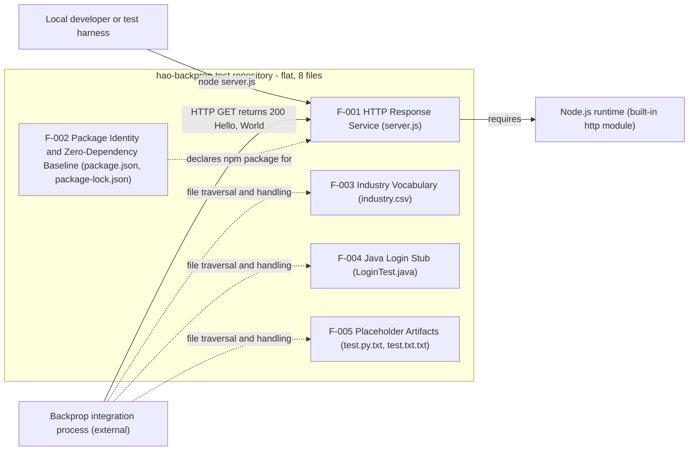

Key observations from the map:

- **No feature is a prerequisite of another.** F-003 (vocabulary), F-004 (Java stub), and F-005 (placeholders) are isolated within the repository — nothing in the code reads or invokes them; their only association is being enumerated by an external traversal consumer.
- **F-002 → F-001 is a loose association, not a hard dependency.** `package.json` nominally packages the Node.js surface, but its `main` field points to a missing `index.js` rather than to `server.js`, so the manifest does not actually reference the runnable file, and `server.js` runs without the manifest.
- **The only runtime dependency that crosses the repository boundary** is F-001's reliance on the Node.js built-in `http` module.

This diagram complements the repository-composition flowchart in Section 1.2.2, which shows the same artifacts from a system-overview perspective.

### 2.3.2 Integration Points

| Integration Point | Provided By | Consumed By | Nature |
|---|---|---|---|
| Loopback HTTP endpoint `http://127.0.0.1:3000/` | F-001 (`server.js`) | Local harness; external "backprop" process | Live request/response; every request returns the fixed `200` `Hello, World!` payload |
| npm manifest / lockfile entry | F-002 (`package.json`, `package-lock.json`) | npm CLI (`install`, `ci`, `test`) | Declarative packaging entry point; drives zero-dependency install and the by-design failing test |
| Repository file tree | F-003, F-004, F-005 (static files) | External "backprop" traversal process (`README.md`) | Passive enumeration/handling of named paths; no code-level API |

There are no other integration points. Consistent with Sections 1.2.1 and 1.3.2, the repository contains no databases, message brokers, external APIs, configuration, or CI/CD wiring, and the HTTP server binds to loopback only, so it is not exposed beyond the local host.

### 2.3.3 Shared Components and Common Services

There are **no shared code components, libraries, or common services** among the features. Each feature is fully self-contained: there is no shared module, utility layer, service abstraction, or common data access path, and `server.js` imports only the Node.js standard library. The only elements common across features are environmental rather than code-level:

| Common Element | Shared By | Nature |
|---|---|---|
| Repository root (flat, 8 files) | All features | The common container that the external consumer traverses |
| Node.js runtime | F-001 (execution) and F-002 (npm tooling) | Shared execution/tooling environment; no shared application code |
| MIT license identity | F-002 (declared) | License metadata declared once in `package.json`/`package-lock.json` |

Notably, `industry.csv` (F-003) is **not** a shared data component: no feature reads it. The features therefore do not form a layered or service-oriented architecture; they are a co-located set of largely unrelated artifacts, which is consistent with the repository's identity as a cross-language test fixture (Section 1.2).

## 2.4 Implementation Considerations

This section records the technical constraints, performance requirements, scalability considerations, security implications, and maintenance requirements for each feature, grounded strictly in the observed code and metadata. Two points apply across all features: (1) the repository defines no SLAs, KPIs, latency, or throughput targets (Section 1.2.3), so no performance thresholds are asserted here; and (2) the "Do not touch!" instruction in `README.md` is the governing maintenance constraint — the artifacts are meant to remain stable so that integration runs against them stay repeatable.

### 2.4.1 F-001 — HTTP "Hello, World!" Response Service

| Consideration | Detail |
|---|---|
| Technical Constraints | Hostname `127.0.0.1` and port `3000` are hard-coded constants (no environment/CLI configuration); a single request handler has no routing, request parsing, or error handling; depends solely on the Node.js built-in `http` module; no runtime version is pinned. |
| Performance Requirements | None defined. The handler performs no I/O or computation and returns a fixed response, so per-request work is constant; throughput is bounded by a single Node.js process on one host. |
| Scalability Considerations | Not designed to scale — one process, one hard-coded port, loopback-only bind, with no clustering or load balancing. Only a single instance can bind port `3000` per host; determinism is prioritized over throughput. |
| Security Implications | No authentication, authorization, TLS/HTTPS, input validation, or rate limiting; no secrets are handled. Loopback binding limits exposure to the local host, and the artifact is explicitly not intended for production or public-network use (Section 1.3.2). |
| Maintenance Requirements | Minimal — 15 lines with zero dependencies means no dependency upgrades are ever required. Stability is governed by "Do not touch!". If the manifest is ever used to launch the app, the `package.json` `main` → missing `index.js` mismatch (F-002) should be reconciled to point at `server.js`. |

### 2.4.2 F-002 — Node.js Package Identity and Zero-Dependency Baseline

| Consideration | Detail |
|---|---|
| Technical Constraints | `main` references a non-existent `index.js`; the `test` script fails by design; `lockfileVersion` 3 implies an npm 7+ format; no `engines` field means no Node version constraint is expressed. |
| Performance Requirements | None defined. A zero-dependency install completes without network fetches, keeping install time and footprint minimal. |
| Scalability Considerations | Not applicable to declarative metadata; the empty dependency tree keeps installation deterministic and lightweight regardless of environment. |
| Security Implications | The empty dependency tree eliminates third-party supply-chain exposure; the MIT license is declared; there are no install hooks or scripts beyond the by-design failing `test`, so no arbitrary code executes during install. |
| Maintenance Requirements | Very low. If the package is ever launched via its manifest (`npm start` / `main`), reconcile `main` with the actual entry point (`server.js`) or add an `index.js`; replace the placeholder `test` script if real automated tests are introduced. |

### 2.4.3 F-003 — Industry Classification Reference Vocabulary

| Consideration | Detail |
|---|---|
| Technical Constraints | A plain single-column CSV with no schema enforcement; not consumed by any code in the repository; several values contain `/` characters, so a future consumer must treat each line as a single field rather than splitting on `/`. |
| Performance Requirements | None defined; at 749 bytes (header + 43 rows) the file is trivially fast to read in full. |
| Scalability Considerations | A small static list; growth occurs only through manual editing, so there is no runtime scaling concern. |
| Security Implications | Static, non-executable reference data with no PII; it presents no injection surface unless a future external consumer mishandles it. |
| Maintenance Requirements | Manual curation to add or remove categories while preserving the `Industry` header and the `Other` catch-all. Because no automated validation exists, edits are unguarded and rely on reviewer discipline. |

### 2.4.4 F-004 — Java Login Entry-Point Stub

| Consideration | Detail |
|---|---|
| Technical Constraints | The class is non-compilable (its `main` body contains only a stray `Web` token); there is no Java build configuration in the repository (no `pom.xml`/`build.gradle`); it is isolated from the Node.js surface. |
| Performance Requirements | Not applicable — the artifact is non-executable. |
| Scalability Considerations | Not applicable. |
| Security Implications | Despite the file name, no login or authentication logic exists, so there is no security surface; the name could nonetheless mislead readers, which is why the absence of login functionality is called out as out-of-scope in Section 1.3.2. |
| Maintenance Requirements | Making the stub functional would require removing the stray token, implementing a valid `main`, and introducing a Java build toolchain. In its current fixture role, maintenance consists only of preserving the file unchanged under "Do not touch!". |

### 2.4.5 F-005 — Named Placeholder File Artifacts

| Consideration | Detail |
|---|---|
| Technical Constraints | Both files are 0 bytes; the double extensions (`.py.txt`, `.txt.txt`) are literal file names rather than active Python/text sources; nothing processes them. |
| Performance Requirements | Not applicable — empty, inert files. |
| Scalability Considerations | Not applicable. |
| Security Implications | None; the files are empty and inert, with no executable content. |
| Maintenance Requirements | None beyond preserving their presence and emptiness. If content is ever added, a concrete purpose and handling rules would need to be defined, since none exist today. |

## 2.5 Requirements Traceability Matrix

The matrix below traces every functional requirement defined in Section 2.2 to the feature it belongs to, the source artifact that provides the evidence, and the related specification sections. A second table confirms that every one of the repository's eight files is accounted for by a feature or by governance documentation.

### 2.5.1 Requirement-to-Source Traceability

| Requirement ID | Feature | Source Evidence | Related Spec Sections |
|---|---|---|---|
| F-001-RQ-001 | F-001 | `server.js` (`server.listen` on `127.0.0.1:3000`; startup log) | 1.2.2, 1.2.3, 2.2.1 |
| F-001-RQ-002 | F-001 | `server.js` (`statusCode` 200; `text/plain`; `Hello, World!\n`) | 1.2.3, 1.3.1, 2.2.1 |
| F-001-RQ-003 | F-001 | `server.js` (`require('http')`); `package-lock.json` (empty tree) | 1.2.2, 2.2.1 |
| F-001-RQ-004 | F-001 | `server.js` (single handler, no branching) | 1.2.3, 2.2.1 |
| F-002-RQ-001 | F-002 | `package.json` (`name`/`version`/`license`/`author`/`main`) | 1.1, 2.2.2 |
| F-002-RQ-002 | F-002 | `package-lock.json` (root-only `packages` tree) | 1.2.3, 1.3.1, 2.2.2 |
| F-002-RQ-003 | F-002 | `package.json` (`scripts.test`) | 1.2.1, 1.3.2, 2.2.2 |
| F-003-RQ-001 | F-003 | `industry.csv` (header `Industry`) | 1.3.1, 2.2.3 |
| F-003-RQ-002 | F-003 | `industry.csv` (43 data rows; first/last values) | 1.1, 1.3.1, 2.2.3 |
| F-003-RQ-003 | F-003 | `industry.csv` (`Other` value) | 2.2.3 |
| F-004-RQ-001 | F-004 | `LoginTest.java` (package/class/`main` signature) | 1.2.1, 1.3.2, 2.2.4 |
| F-005-RQ-001 | F-005 | `test.py.txt`, `test.txt.txt` (presence) | 1.3.1, 2.2.5 |
| F-005-RQ-002 | F-005 | `test.py.txt`, `test.txt.txt` (0 bytes) | 1.2.1, 1.3.2, 2.2.5 |

### 2.5.2 File-to-Feature Coverage

Every file in the flat, eight-file repository is accounted for. `README.md` is intentionally mapped to governance rather than a feature (see Section 2.6).

| Repository File | Mapped Feature | Requirement(s) |
|---|---|---|
| `server.js` | F-001 | F-001-RQ-001 … F-001-RQ-004 |
| `package.json` | F-002 | F-002-RQ-001, F-002-RQ-003 |
| `package-lock.json` | F-002 | F-002-RQ-002 |
| `industry.csv` | F-003 | F-003-RQ-001 … F-003-RQ-003 |
| `LoginTest.java` | F-004 | F-004-RQ-001 |
| `test.py.txt` | F-005 | F-005-RQ-001, F-005-RQ-002 |
| `test.txt.txt` | F-005 | F-005-RQ-001, F-005-RQ-002 |
| `README.md` | Governance (not a feature) | See Section 2.6 (Assumptions & Constraints) |

**Coverage summary:** 5 features, 13 functional requirements, tracing to 7 source files; the 8th file (`README.md`) provides project identity and the "Do not touch!" governance constraint. No requirement lacks a source artifact, and no in-scope file is left unmapped.

## 2.6 Assumptions, Constraints, and Requirement Versioning

This section captures the assumptions the requirements rest on, the constraints and known defects that bound them, and the versioning basis for the requirement set. All items are grounded in observed evidence; where a limitation is a defect rather than a design choice, it is labeled as such.

### 2.6.1 Assumptions

| Assumption | Basis |
|---|---|
| A Node.js runtime providing the built-in `http` module is available wherever `server.js` runs. | `server.js` imports only `http`; no runtime is bundled and no version is pinned. |
| The external "backprop" process is the intended consumer/driver and is out of scope for this repository. | `README.md` ("test project for backprop integration"); Section 1.2.1. |
| Consumers co-locate with the server on a single local host. | The server binds loopback `127.0.0.1:3000`, so it is not reachable off-host. |
| The artifacts are preserved unchanged as a stable fixture. | `README.md` ("Do not touch!"); determinism/stability are the critical success factors in Section 1.2.3. |
| An npm CLI is available if package scripts are exercised. | `package.json` `scripts.test`; `package-lock.json` (`lockfileVersion` 3). |

### 2.6.2 Constraints and Known Defects

| Constraint / Known Defect | Impact | Evidence |
|---|---|---|
| "Do not touch!" governance constraint | Artifacts must remain stable; changes are discouraged to keep integration runs repeatable | `README.md` |
| `main` points to a non-existent `index.js` (defect) | Launching via the manifest entry point would fail; the runnable file is `server.js` | `package.json`; absence of `index.js` |
| `npm test` fails by design | No automated test coverage exists | `package.json` `scripts.test` (`echo "Error: no test specified" && exit 1`) |
| `LoginTest.java` is non-compilable (defect) | No functional Java; login behavior is absent despite the name | `LoginTest.java` (stray `Web` token) |
| `test.py.txt` / `test.txt.txt` are empty | No behavior or data provided | Both files are 0 bytes |
| No Node.js version pin | Runtime version is unconstrained; behavior assumes a compatible Node.js | No `engines` field; no `.nvmrc`/`.node-version` |
| Loopback-only, single fixed port | Not network-exposed; only one instance can bind port `3000` per host | `server.js` (`127.0.0.1`, `3000`) |
| No configuration, secrets, CI/CD, containerization, or databases | No deployment or integration environment is defined | Sections 1.2.1, 1.3.2 |
| No security controls | No authentication, authorization, TLS/HTTPS, or input validation | `server.js`; Section 1.3.2 |
| Cross-language artifacts are unintegrated | JavaScript, Java, and placeholder files do not interoperate | Section 1.2.2; Section 2.3 |

### 2.6.3 Requirement Versioning

The repository declares a single package version, `1.0.0`, in both `package.json` and `package-lock.json`, and it contains no changelog, roadmap, or version history (confirmed out-of-scope in Section 1.3.2). Accordingly, the requirements in this section are recorded at a single baseline and there are no prior revisions to reconcile.

| Requirement Set | Baseline Version | Basis |
|---|---|---|
| All F-001 … F-005 requirements | v1.0 | Aligned to package version `1.0.0`; no changelog or requirement history exists in the repository |

Any future change to a requirement should be treated as a new revision and, if the code changes accordingly, be accompanied by a corresponding bump to the package version — subject to the "Do not touch!" governance constraint recorded in Section 2.6.2.

## 2.7 References

**Repository files examined for this section**

- `server.js` - Established F-001: the Node.js HTTP server bound to `127.0.0.1:3000`, the fixed `200` / `text/plain` / `Hello, World!\n` response to every request, sole reliance on the built-in `http` module, and the startup log line.
- `package.json` - Established F-002: package identity (`hello_world` `1.0.0`, author `hxu`, MIT license), the `main` → `index.js` inconsistency, the by-design failing `test` script, and the absence of dependencies and an `engines` field.
- `package-lock.json` - Established F-002: the empty (root-only) dependency tree and `lockfileVersion` 3.
- `industry.csv` - Established F-003: the single-column controlled vocabulary with header `Industry`, 43 category values (first `Accounting/Finance`, last `Other`), and the `Other` catch-all.
- `LoginTest.java` - Established F-004: the `com.blitzyTest` package, `LoginTest` class, and `main` signature, plus the non-compilable stray `Web` token and absence of login logic.
- `test.py.txt` - Established F-005: an empty (0-byte) named placeholder file.
- `test.txt.txt` - Established F-005: an empty (0-byte) named placeholder file.
- `README.md` - Established the project identity (`hao-backprop-test`), the "test project for backprop integration" purpose, and the "Do not touch!" governance constraint.

**Repository folder examined**

- Repository root (`/`) - Confirmed the flat structure of eight files with no application subdirectories (only a `.git` version-control directory), grounding the file-to-feature coverage in Section 2.5.2.

**Technical specification sections cross-referenced**

- `1.1 Executive Summary` - Corroborated the fixture identity, stakeholder set, and the 43-value vocabulary characterization.
- `1.2 System Overview` (including `1.2.1 Project Context`, `1.2.2 High-Level Description`, `1.2.3 Success Criteria`) - Corroborated the component inventory, loopback-only operation, the absence of external integrations, and the absence of SLAs/KPIs.
- `1.3 Scope` (including `1.3.1 In-Scope` and `1.3.2 Out-of-Scope`) - Corroborated the in-scope artifact set, the primary runtime workflow, and the explicitly excluded capabilities (authentication, routing, persistence, automated testing, security controls).

**Verification performed**

- Direct terminal inspection of the repository confirmed file byte sizes, the 43 non-empty vocabulary rows, the emptiness (0 bytes) of both placeholder files, and the absence of `index.js`, an `engines` field, and any `.nvmrc`/`.node-version` version pin.
- A runtime smoke test (`node server.js`) empirically confirmed the startup log and identical `200` / `text/plain` / `Content-Length: 14` responses to `GET`, `POST`, and `DELETE` requests across differing paths, validating the F-001 acceptance criteria.
- No external web sources were used; all claims derive from the repository and the cross-referenced specification sections above.

# 3. Technology Stack

## 3.1 Programming Languages

This section documents the technologies actually present in the `hao-backprop-test` repository. Because the repository is a deliberately minimal, test-oriented fixture (as established in Sections 1.2 and 1.3), its technology stack is defined as much by what is intentionally **absent** — web frameworks, third-party dependencies, databases, containerization, and CI/CD — as by the few technologies that are present. Every entry in Section 3 is grounded in a file that exists in the repository. The "Default Technology Stack" proposed as a greenfield fallback (for example AWS, Docker, Terraform, Flask, MongoDB, Auth0, React, TypeScript) is **not** present anywhere in this repository and is therefore not documented as part of its stack.

The repository contains three distinct language surfaces that do not interoperate: a functional JavaScript (Node.js) component, a non-compilable Java stub, and inert data/placeholder files. Only the JavaScript surface is executable, and the three surfaces coexist without any cross-language calls or a shared build (Section 1.2.2). The following diagram summarizes the language composition and the only runtime dependency edge:

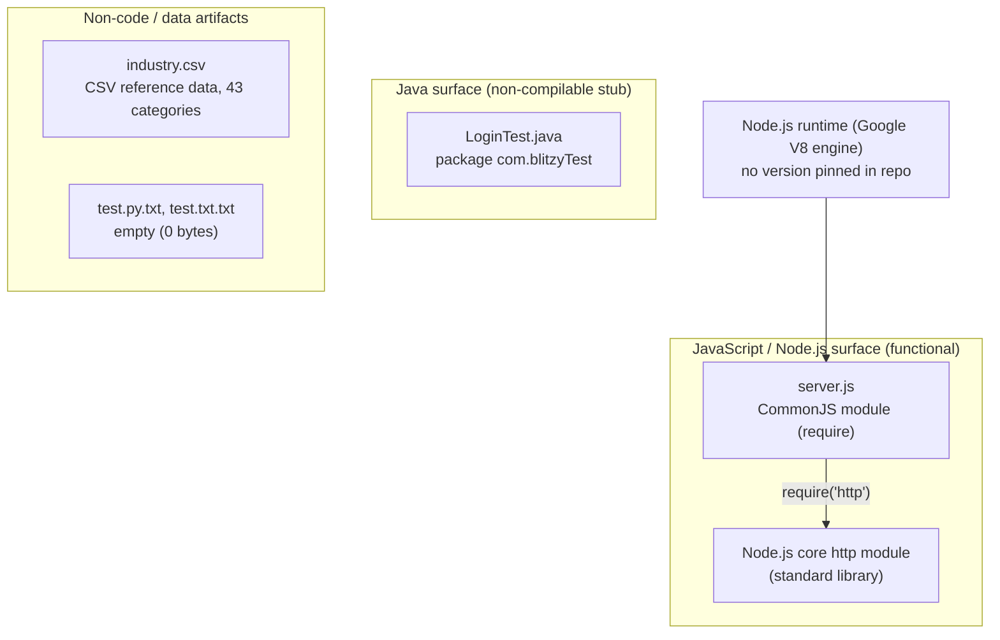

### 3.1.1 Language Inventory by Component

| Language | Component / File | Role | Status |
|---|---|---|---|
| JavaScript (Node.js, CommonJS) | `server.js` | HTTP "Hello, World!" server — the only runnable program | Functional |
| Java | `LoginTest.java` | `main` entry-point skeleton in package `com.blitzyTest` | Non-compilable stub |
| — (data format, not a language) | `industry.csv` | CSV controlled-vocabulary reference data (43 categories) | Static, non-executable |
| — (placeholders) | `test.py.txt`, `test.txt.txt` | Empty (0-byte) named placeholder files | Inert |

### 3.1.2 JavaScript (Node.js, CommonJS)

JavaScript executed on the Node.js runtime is the primary — and only functional — programming language in the repository. `server.js` is authored against the **CommonJS** module system, importing a single dependency with `const http = require('http')`, and it uses only long-stable Node.js core APIs (`http.createServer`, `server.listen`) to serve a fixed `Hello, World!` response on `127.0.0.1:3000`.

**Version and version constraints.** The repository pins **no** JavaScript/Node.js language version. There is no `engines` field in `package.json`, and no `.nvmrc` or `.node-version` file exists, so the language level is unconstrained by the repository (consistent with Sections 2.4.1 and 2.6.2). Because `server.js` relies exclusively on the CommonJS `require` mechanism and standard-library `http` APIs that have been stable across Node.js major versions, the file runs unchanged on any maintained Node.js line. As external context only (not a repository constraint): as of mid-2026 the supported Node.js release lines are Node.js 24 (Active LTS) and Node.js 22 (Maintenance LTS), with Node.js 26 as the Current line; Node.js is built on Google's V8 engine.

**Selection rationale.** JavaScript on Node.js is the natural minimal choice for a zero-dependency HTTP smoke-test target: Node's built-in `http` module delivers a complete HTTP server with no installation step, which maximizes the determinism and reproducibility that Section 1.2.3 identifies as the repository's critical success factors.

### 3.1.3 Java (Entry-Point Stub)

`LoginTest.java` declares package `com.blitzyTest` and the standard Java SE entry-point signature `public static void main(String[] args)`. It is present as a skeleton only: its `main` body contains a stray `Web` token and no logic, so it is **not valid, compilable Java** (Sections 1.2.1 and 2.4.4). Despite the file name, it implements no login or authentication behavior (Section 1.3.2).

**Version and version constraints.** No Java language level or JDK version is declared, and there is **no Java build configuration** in the repository — `pom.xml` and `build.gradle` are both absent (verified). The class is therefore neither versioned nor buildable as written. Its role is purely that of a language-surface placeholder within the test fixture; it delivers no functionality and does not interoperate with the JavaScript component.

### 3.1.4 Clarifications, Constraints, and Non-Languages

Two artifacts are frequently misread as source code and are clarified here to keep the language inventory accurate:

- **No Python is present.** The `.py` in `test.py.txt` is part of a literal `.txt` file name, not a Python module. `test.py.txt` and `test.txt.txt` are both 0-byte, inert placeholders, and the repository contains no `.py` sources, `requirements.txt`, or `pyproject.toml`. Python is therefore not part of the stack.
- **CSV is data, not a language.** `industry.csv` is a single-column CSV file (a data serialization format) holding a 43-value controlled vocabulary; it is static reference data with no executable behavior and is not consumed by any code in the repository (Sections 1.3.1 and 2.4.3).

**Cross-component constraints and dependencies.** The only hard runtime dependency for the functional surface is the availability of a Node.js runtime providing the built-in `http` module (Assumption in Section 2.6.1). There are no cross-language dependencies — the JavaScript, Java, and data/placeholder surfaces are fully independent — and no repository-level version pins constrain any language or runtime.

## 3.2 Frameworks & Libraries

The defining characteristic of this repository's stack is the **complete absence of application frameworks and third-party libraries**. The single functional component, `server.js`, is built directly on the Node.js standard library, and the `package.json`/`package-lock.json` pair declares an empty dependency tree (Sections 2.4.2 and 3.3). The only "framework-level" building block in use is the Node.js core `http` module, which ships with the runtime rather than being installed as a dependency.

| Category | Technology in use | Version | Present? |
|---|---|---|---|
| Node.js standard library | `http` core module | Bundled with the Node.js runtime (not independently versioned) | Yes — sole building block |
| Web / application framework | none (no Express, Fastify, Koa, or similar) | n/a | No |
| Frontend / UI framework | none (no React, Vue, Angular, or CSS framework) | n/a | No |
| Testing framework | none (`npm test` is a placeholder that fails by design) | n/a | No |
| Java framework / build tooling | none (no Spring, no `pom.xml`/`build.gradle`) | n/a | No |

### 3.2.1 The Node.js Standard Library `http` Module (Sole Building Block)

`server.js` constructs its HTTP server entirely from the Node.js built-in `http` module via `const http = require('http')`, then `http.createServer(...)` and `server.listen(3000, '127.0.0.1', ...)`. Because `http` is a **core module**, it is provided by the Node.js runtime itself and requires no installation, no registry fetch, and no lockfile entry.

**Versioning.** The `http` module is not independently versioned; its behavior is bound to the version of the Node.js runtime that executes it. Since the repository pins no Node.js version (no `engines` field; Section 3.1.2), the effective `http` API is whatever the host runtime provides. The APIs used (`createServer`, request/response handling, `listen`) are long-stable and behave consistently across all maintained Node.js lines.

### 3.2.2 Web/Application Frameworks — None Adopted

No web or application framework is present. There is no Express, Fastify, Koa, Hapi, or NestJS in the JavaScript surface, and no Spring or comparable framework in the Java surface. This is a deliberate design point rather than an omission: Section 1.3.2 explicitly places "a build pipeline, bundling, containerization, or dependency management" out of scope, and the server implements no routing, request parsing, middleware, or templating — every request receives the same fixed response (Section 2.4.1).

### 3.2.3 Supporting Libraries — None

No supporting libraries of any kind are declared or vendored: no utility libraries, no logging/monitoring libraries, no HTTP clients, no ORMs or database drivers, no test runners, and no build/bundling toolchains. The `node_modules` dependency tree is empty (Section 3.3). The only runtime facility beyond the `http` core module is the built-in `console.log` used to print the startup URL, which is likewise part of the Node.js standard library.

### 3.2.4 Compatibility Requirements and Justification

**Compatibility requirements.** Because the code depends only on Node.js core APIs and the CommonJS module system, the sole compatibility requirement is a functioning Node.js runtime that exposes the built-in `http` module (Section 2.6.1). There are no framework-version compatibility constraints, no peer-dependency graphs, and no transitive-dependency version ranges to reconcile.

**Justification for the zero-framework approach.** Relying exclusively on the standard library is the choice that best serves this repository's stated goals. It (1) guarantees a zero-install, deterministic runtime with nothing to resolve before `node server.js` executes; (2) eliminates framework and library upgrade churn, keeping maintenance effort minimal (Section 2.4.1); and (3) removes third-party supply-chain exposure entirely (Section 3.3). These properties directly support the determinism, reproducibility, and stability that Section 1.2.3 identifies as the critical success factors for the artifact's role as a repeatable integration target.

## 3.3 Open Source Dependencies

The repository has **no open-source or third-party runtime dependencies**. `package.json` declares neither a `dependencies` nor a `devDependencies` object (verified — no dependency-related keys are present), and `package-lock.json` records an empty package graph containing only the root project. This zero-dependency baseline is one of the repository's defining features (Section 2.4.2) and its most consequential security property (Section 3.3.4).

### 3.3.1 Declared Dependencies — None

There are no installable open-source libraries in either language surface. The complete dependency inventory is empty:

| Manifest field | Value observed |
|---|---|
| `dependencies` | absent (no runtime dependencies) |
| `devDependencies` | absent (no development dependencies) |
| `peerDependencies` / `optionalDependencies` / `bundledDependencies` | absent |
| `packages` tree in `package-lock.json` | contains only the root entry `""` — no installed modules |

The single module `server.js` imports is the Node.js core `http` module (Section 3.2.1), which is part of the runtime and is therefore **not** an open-source package dependency.

### 3.3.2 Package Manifest, Registry, and Lockfile Facts

The Node.js packaging metadata identifies the project and pins its (empty) dependency set deterministically:

| Attribute | Value | Source |
|---|---|---|
| Package name | `hello_world` | `package.json`, `package-lock.json` |
| Package version | `1.0.0` | `package.json`, `package-lock.json` |
| Lockfile format | `lockfileVersion: 3` | `package-lock.json` |
| Package registry | npm public registry (`registry.npmjs.org`, the npm default) — **unused**, no `.npmrc` override present | npm defaults |
| Declared license | MIT | `package.json`, `package-lock.json` |

The lockfile records only the root package and no dependencies:

```json
"lockfileVersion": 3,
"packages": { "": { "name": "hello_world", "version": "1.0.0", "license": "MIT" } }
```

**Lockfile version significance.** `lockfileVersion: 3` is the npm lockfile format introduced for npm v7 and used by default from **npm v9 onward** (it is backward compatible to npm v7 and omits the legacy `dependencies` block). Its presence indicates the lockfile was generated by npm v7-or-newer tooling (an npm v9-class CLI). This matches the reading already recorded in Section 2.4.2 ("`lockfileVersion` 3 implies an npm 7+ format"). No specific npm version is pinned by the repository itself.

**Registry usage.** Because the dependency tree is empty and no `.npmrc` is present, no package registry is actually contacted: `npm install` resolves to a no-op that installs zero modules. The npm public registry (`registry.npmjs.org`) is noted only as the tooling default that *would* apply if dependencies were ever added.

### 3.3.3 Licensing

The project declares the permissive **MIT** license in both `package.json` and `package-lock.json`. Because there are no third-party dependencies, there are no transitive-license obligations to track — the license surface is limited to the project's own MIT declaration.

### 3.3.4 Security Implications of the Zero-Dependency Posture

The empty dependency tree is a strong security posture for a test fixture and is called out as such in Section 2.4.2:

- **No supply-chain exposure.** With zero direct or transitive open-source dependencies, there is no third-party code to introduce known vulnerabilities, and nothing for software-composition-analysis (SCA) tooling to flag.
- **No install-time code execution.** There are no `preinstall`/`postinstall` or other lifecycle hooks; the only script is the `test` placeholder that fails by design (`echo "Error: no test specified" && exit 1`), so no arbitrary code runs during `npm install`.
- **Deterministic installs.** The pinned `lockfileVersion: 3` lockfile with an empty tree makes installation fully reproducible and network-free, reinforcing the reproducibility success factor from Section 1.2.3.

The residual runtime security surface is therefore not in dependencies but in the runtime itself — an out-of-date Node.js runtime could carry its own CVEs. Since the repository pins no Node.js version, keeping the executing runtime on a supported line (Section 3.1.2) is the relevant mitigation.

## 3.4 Third-Party Services

The repository integrates with **no third-party services of any kind**. It defines no external APIs, no authentication providers, no monitoring or observability tooling, and no cloud services. `server.js` makes no outbound network calls, holds no API keys or secrets, and binds exclusively to loopback (`127.0.0.1:3000`), so it is neither reachable from nor dependent on any external system (Sections 1.2.1 and 2.6.2). The provided "Default Technology Stack" entries in this category (for example Auth0 and AWS) are **not** present.

### 3.4.1 External Services Summary

| Service category | Status | Evidence |
|---|---|---|
| External APIs / integrations | None | `server.js` imports only `http`; no HTTP client, SDK, or outbound request; empty dependency tree (Section 3.3) |
| Authentication services | None | No Auth0/OAuth/OIDC/identity SDK; `LoginTest.java` is a non-functional stub with no auth logic (Sections 1.3.2, 2.4.4) |
| Monitoring / observability tools | None | No APM, metrics, or tracing libraries; only `console.log` prints the startup URL (Sections 1.2.3, 3.2.3) |
| Cloud services | None | No AWS/GCP/Azure SDKs or configuration; no cloud credentials; loopback-only bind (Section 2.6.2) |
| Message brokers / queues | None | No broker clients or configuration present (Section 1.3.2) |

### 3.4.2 The "backprop" Integration Relationship

The only external relationship documented anywhere in the repository is described in `README.md`, which identifies the project as a "test project for backprop integration." As established in Section 1.2.1, this relationship is **inverted** relative to a normal service integration: the external "backprop" process *consumes this repository as a test target* rather than the repository calling out to a backprop service. There is no client code, endpoint URL, credential, or configuration in the repository that wires the code to backprop — the linkage exists only at the level of intent expressed in `README.md`, and the backprop process is out of scope for this repository (Section 2.6.1).

### 3.4.3 Integration and Security Implications

Because there are no third-party integrations, the repository has **no external integration requirements to satisfy** and no inter-service contracts to version or secure. From a security standpoint this eliminates several entire risk classes: there are no third-party credentials or secrets to leak, no outbound-egress attack surface, no dependency on external-service availability, and no data leaving the local host. The absence of authentication, TLS/HTTPS, and rate limiting noted in Section 2.4.1 is acceptable precisely because the loopback-only binding keeps the server unreachable from any network and the artifact is explicitly not intended for production or public-network use (Section 1.3.2).

## 3.5 Databases & Storage

The repository uses **no database and no caching or storage service**. The functional server is entirely stateless, and the only "data at rest" is a set of static files on the local filesystem. There are no database drivers, ORMs, connection strings, or storage SDKs anywhere in the repository (Sections 1.3.2 and 2.6.2). The "Default Technology Stack" database entry (MongoDB) is **not** present.

### 3.5.1 Databases — None

No primary or secondary database exists. `server.js` opens no database connection, and the empty dependency tree (Section 3.3) contains no database client (no MongoDB, PostgreSQL, MySQL, SQLite, or Redis driver). The server maintains no state between requests: every request receives the same fixed `Hello, World!` response computed in-process with no reads or writes (Section 2.4.1).

### 3.5.2 Data Persistence Model (Static Flat Files)

The repository's only persistence mechanism is **static files stored on the local filesystem**, none of which are written or read at runtime by the server. These files are managed through version control (Section 3.6) rather than any database or storage engine.

| Stored artifact | Format | Role | Runtime access |
|---|---|---|---|
| `industry.csv` | CSV (single column, 43 categories) | Controlled-vocabulary reference data — the only structured data domain (Section 1.3.1) | None — not read by any code (Section 2.4.3) |
| `100Pages.pdf`, `demo.jpg`, `sample.doc` | PDF / JPEG / DOC binaries | Inert sample/test artifacts on disk | None — not processed by any code |
| `test.py.txt`, `test.txt.txt` | Empty text (0 bytes) | Placeholder file-tree entries | None |

The industry vocabulary is the single identifiable **data domain** in the system, but because no code consumes it, it functions as documentation-grade reference data rather than a live datastore (Section 2.4.3). Any future consumer would read the whole file and treat each line as one field, since several values contain `/` characters.

### 3.5.3 Caching — None

No caching layer of any kind is present: no in-memory cache, no HTTP response cache, and no external cache service (for example Redis or Memcached). None is required — the server performs no I/O or computation whose results would benefit from caching, returning a constant response with fixed per-request work (Section 2.4.1).

### 3.5.4 Storage Services — None

No object-store or cloud-storage service is integrated (no S3, GCS, Azure Blob, or comparable SDK/configuration). All bytes the repository owns live as ordinary files in the working tree on local disk. Consequently there are no bucket credentials, storage endpoints, retention policies, or persistence-tier configuration to manage or secure — consistent with the loopback-only, zero-external-integration posture documented in Sections 3.4 and 2.6.2.

## 3.6 Development & Deployment

The development and deployment footprint is intentionally minimal. The functional component runs directly from source with a single command and no build step, and the repository defines **no build system, no containerization, and no CI/CD pipeline** (Sections 1.3.2 and 2.6.2). Version control (Git) is the only development infrastructure actually present. The "Default Technology Stack" delivery entries (Docker, Terraform, GitHub Actions) are **not** present.

The diagram below contrasts the toolchain that is present with the delivery stages that are deliberately absent:

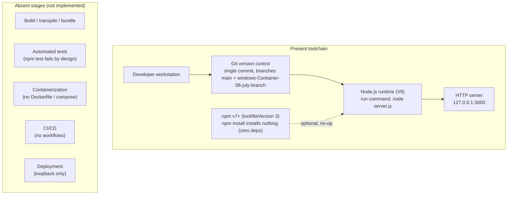

### 3.6.1 Development Tools

| Tool | Purpose | Version (observed / context) |
|---|---|---|
| Node.js runtime | Executes `server.js` (provides the core `http` module and V8 engine) | Not pinned by the repository (no `engines`); run on a supported line (Section 3.1.2) |
| npm | Package manager; produced `package-lock.json`; defines the `test` script | Not pinned; `lockfileVersion: 3` indicates npm v7+ (npm v9-class) tooling (Section 3.3.2) |
| Git | Version control (the only development infrastructure present) | Repository is Git-tracked with a single commit (`508d41a`, "Add files via upload") and branches including `main` and `windows-Container-06-july-branch` |
| Java toolchain (JDK) | *Would* be required to compile `LoginTest.java` | Not present or declared; with no build configuration, the stub cannot be built as-is (Section 3.1.3) |

No editor/IDE configuration, linter, formatter, `.editorconfig`, or environment-variable file (`.env`) is present in the repository.

### 3.6.2 Build System

There is **no build system**. The JavaScript component requires no compilation, transpilation, or bundling — there is no TypeScript (no `tsconfig.json`), no Babel/webpack/rollup/esbuild configuration, and no Makefile. The application "builds" trivially by running its source directly:

```bash
node server.js
```

The only npm script is a placeholder that fails by design (`"test": "echo \"Error: no test specified\" && exit 1"`), so it provides neither a build nor real test coverage (Sections 2.4.2 and 2.6.2). The Java surface likewise has no build system: `pom.xml` and `build.gradle` are both absent, so `LoginTest.java` is not part of any compile step.

### 3.6.3 Containerization

There is **no containerization**. No `Dockerfile`, `docker-compose.yml`, or other container/orchestration manifest exists in the repository (verified absent). The server is expected to run as an ordinary Node.js process on a host, not inside a container image.

### 3.6.4 CI/CD

There is **no CI/CD pipeline**. No `.github/workflows/`, `.gitlab-ci.yml`, or other continuous-integration/continuous-delivery configuration exists (verified absent). Combined with the failing `test` placeholder, this means there is no automated build, test, or deployment gating — consistent with the repository's role as a hand-managed, "Do not touch!" fixture (Section 2.6.2).

### 3.6.5 Runtime and Deployment Model

The deployment model is a single local Node.js process. `server.js` binds to loopback `127.0.0.1:3000`, so the server is reachable only from the same host and only one instance can bind the fixed port per host (Section 2.4.1). There is no deployment automation, no environment/configuration management, and no network exposure beyond loopback.

One packaging defect affects launch via the manifest: `package.json` sets `main` to `index.js`, but no `index.js` exists — the runnable entry point is `server.js` (Sections 2.4.2 and 2.6.2). Consequently the reliable run command is `node server.js` directly, rather than a manifest-driven `npm start`. Reconciling `main` with the actual entry point (or adding an `index.js`) is the recommended remediation if manifest-based launching is ever required.

## 3.7 References

The following repository files, folders, web sources, and cross-referenced specification sections were used as evidence for Section 3.

**Repository files inspected**

- `README.md` — established the project identity (`hao-backprop-test`), the "test project for backprop integration" purpose, and the "Do not touch!" governance constraint.
- `package.json` — established package identity (`hello_world` v1.0.0), MIT license, the `main`→`index.js` reference, the failing `test` script, and the absence of `dependencies`/`devDependencies`/`engines`.
- `package-lock.json` — established `lockfileVersion: 3`, the empty `packages` tree (zero installed modules), and the MIT license.
- `server.js` — established the JavaScript/Node.js surface: CommonJS `require('http')`, loopback bind to `127.0.0.1:3000`, and the fixed `Hello, World!` response (the sole runnable program and only use of the core `http` module).
- `LoginTest.java` — established the Java surface: package `com.blitzyTest`, the standard `main` signature, and the non-compilable stray-`Web`-token stub with no build configuration.
- `industry.csv` — established the single structured data domain: a 43-category CSV controlled vocabulary, unreferenced by any code.
- `test.py.txt`, `test.txt.txt` — established the empty (0-byte) placeholder files and confirmed no Python source exists.
- `100Pages.pdf`, `demo.jpg`, `sample.doc` — established the inert binary artifacts stored on the local filesystem (storage-at-rest, not processed by code).

**Repository folders inspected**

- `` (repository root) — established the flat, single-level file layout with no application subdirectories, confirming the absence of framework/build/CI/CD/container/IaC directories.
- `.git/` — established version-control state (single commit `508d41a`; branches `main` and `windows-Container-06-july-branch`); its internal contents were not documented.

**Verified absences (evidence of what is *not* in the stack)**

- Confirmed absent: `index.js`, `tsconfig.json`, `.nvmrc`, `.node-version`, `Dockerfile`, `docker-compose.yml`, `pom.xml`, `build.gradle`, `Makefile`, `.github/`, `.gitlab-ci.yml`, `requirements.txt`, `pyproject.toml`, `go.mod`, `Cargo.toml`, `.env` — grounding the "no frameworks / no dependencies / no database / no containerization / no CI/CD / no Node version pin" findings.

**Web sources**

- [web] npm official documentation, "package-lock.json" (docs.npmjs.com, npm v9 CLI) — confirmed the `lockfileVersion` mapping: version 3 is the format used by npm v9 (introduced for npm v7), backward compatible to npm v7.
- [web] Node.js release information (nodejs.org release notes and endoflife.date, mid-2026) — confirmed external Node.js support context: Node.js 24 (Active LTS), 22 (Maintenance LTS), and 26 (Current); used only as recommendation context since the repository pins no version.

**Cross-referenced Technical Specification sections**

- `1.2 System Overview` — corroborated the minimal, multi-language test-fixture identity, the loopback-only server, and the "three unrelated language surfaces" observation.
- `1.3 Scope` — corroborated in-scope components and the explicit out-of-scope list (no build/containerization/dependency management, no database, no security controls).
- `2.4 Implementation Considerations` — corroborated the `http`-only dependency, the `lockfileVersion` 3 = npm 7+ reading, the empty-dependency supply-chain benefit, and the no-Java-build-config finding.
- `2.6 Assumptions, Constraints, and Requirement Versioning` — corroborated the no-version-pin, no-CI/CD, no-container, no-database, and no-security-controls constraints, and the `main`→missing `index.js` defect.

# 4. Process Flowchart

## 4.1 System Workflows

This section documents the executable process flows of the `hao-backprop-test` repository, grounded strictly in the eight source files it contains. As established in Sections 1.2, 1.3, and 2.1, the repository is a small, flat, mixed-language test fixture rather than a line-of-business application. Consequently it exposes exactly **one** end-to-end runtime workflow — the HTTP request/response cycle served by `server.js` (feature F-001) — surrounded by declarative npm packaging (F-002) and passive, non-executing file-tree artifacts (F-003 `industry.csv`, F-004 `LoginTest.java`, F-005 placeholders).

Where a conventional application would exhibit multi-step business transactions, orchestrated services, event pipelines, or batch jobs, this repository has **no such implementation**. In keeping with the requirement to report only observed behavior, the flowcharts below model what the code actually does, and each category the prompt anticipates but that is absent (event processing, batch sequences, multi-system data flow) is called out explicitly rather than invented.

### 4.1.1 Core Business Processes

The single core process is the **HTTP "Hello, World!" Response Service** (F-001, `server.js`). It comprises two phases: a one-time **bootstrap** (process startup and port binding) and a repeating, stateless **request/response** loop. The two external actors that exercise it are the local developer/test harness and the external "backprop" integration process; both interact exclusively over the loopback interface `127.0.0.1:3000` (Sections 1.3.1, 2.3.2).

#### High-Level System Workflow (Swim Lanes)

The following diagram places every actor and system in its own lane and shows the only observed interaction paths: startup, the loopback request/response cycle, and the passive file-tree traversal of the inert artifacts. Solid arrows are active runtime interactions; dashed arrows are passive reads with no code-level API.

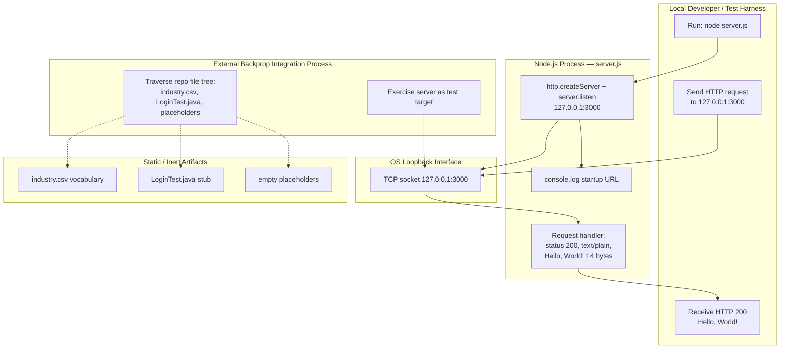

**User touchpoints.** There are exactly two: (1) the command line, where an operator runs `node server.js` (`server.js` lines 12–14), and (2) the loopback HTTP endpoint `http://127.0.0.1:3000/`, where any client issues a request and receives the fixed response. There is no UI, no CLI argument parsing, and no configuration surface — hostname `127.0.0.1` and port `3000` are hard-coded constants (`server.js` lines 3–4).

#### Server Bootstrap Process

Startup is the only phase that contains a genuine decision point: whether the process can bind port `3000` on loopback. Because `server.js` registers **no** `'error'` listener on the server object (verified by inspection of all 14 lines), a bind failure is not caught — it surfaces as an uncaught exception that terminates the process.

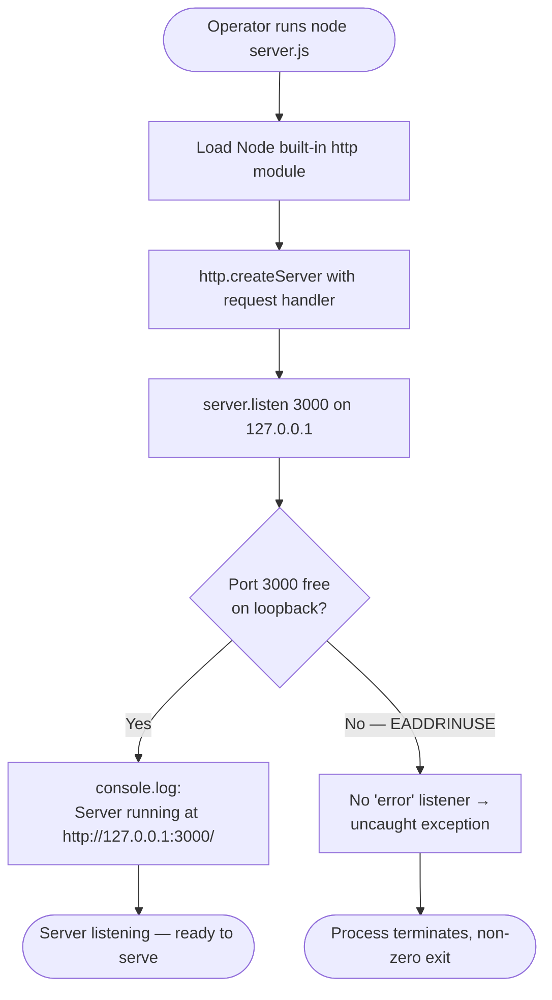

On success the process logs exactly `Server running at http://127.0.0.1:3000/` (`server.js` line 13) and enters the listening state. This is the "ready" signal a harness can wait on before issuing requests.

#### Request/Response Process (End-to-End Journey)

Once listening, every request follows an identical, unconditional path. The handler (`server.js` lines 6–10) sets the status code and content type and ends the response with the fixed body; it never inspects the request method, path, query string, headers, or body. Node's `http` layer performs protocol-level parsing and appends default response headers (`Date`, `Connection`, `Keep-Alive`, `Content-Length: 14`).

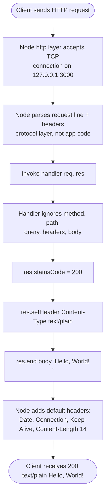

A short illustrative excerpt of the handler:

```javascript
res.statusCode = 200;
res.setHeader('Content-Type', 'text/plain');
res.end('Hello, World!\n');
```

**Decision points.** The table below enumerates every decision in the running system. The request-processing path contains **none** — the response is a compile-time constant.

| Decision Point | Location | Branches | Outcome |
|---|---|---|---|
| Port `3000` bindable on loopback? | Bootstrap (`server.listen`, `server.js` line 12) | Yes / No | Yes → listening; No → uncaught exception → process exit |
| Any per-request branching (method, path, auth, validation)? | Request handler (`server.js` lines 6–10) | None | Every request → HTTP `200`, `text/plain`, `Hello, World!\n` |

**Error handling paths.** The sole runtime error path is the startup bind failure shown above; there is no request-time error branch because the handler performs no I/O, parsing, or computation that could fail. Retry, fallback, notification, and recovery behavior are analyzed in detail in Section 4.3.2.

**Timing / SLA considerations.** No SLAs, KPIs, latency budgets, or throughput targets are defined anywhere in the repository (confirmed in Section 1.2.3). No explicit socket or request timeouts are set in `server.js`; Node.js runtime defaults apply, and no Node version is pinned (no `engines` field). The only observable timing proxy is that the handler performs no I/O and returns a constant response, so per-request work is effectively constant.

### 4.1.2 Integration Workflows

The integration surface is deliberately minimal. Per Section 2.3.2 there are exactly three integration points, and none of them is a networked service-to-service integration: the loopback HTTP endpoint, the npm manifest/lockfile tooling entry, and passive traversal of the repository file tree. The server binds to loopback only, so it is not exposed beyond the local host (Sections 1.2.1, 2.4.1).

| Integration Point | Provided By | Consumed By | Nature |
|---|---|---|---|
| Loopback HTTP endpoint `http://127.0.0.1:3000/` | F-001 (`server.js`) | Local harness; external "backprop" process | Live request/response; every request returns the fixed `200` `Hello, World!` payload |
| npm manifest / lockfile | F-002 (`package.json`, `package-lock.json`) | npm CLI (`install`, `ci`, `test`) | Declarative packaging; drives zero-dependency install and the by-design failing test |
| Repository file tree | F-003, F-004, F-005 (static files) | External "backprop" traversal process | Passive enumeration/read of named paths; no code-level API |

#### Data Flow Between Systems

The only live data flow is a single request/response pair over loopback: an inbound HTTP request (whose contents are ignored) and an outbound 14-byte `Hello, World!\n` body. There is no database read/write, no cache, no outbound call to any external service, and no inter-process message passing. The `industry.csv` vocabulary is **not** part of any data flow — no code in the repository reads it (Sections 2.1.4, 2.3.3); it is only ever read passively by an external traversal consumer.

#### API Interactions

The system presents one HTTP surface with no route table: every method (`GET`, `POST`, `DELETE`, …) and every path/query returns the identical response. The sequence below models a single client (or the backprop consumer) interacting with the server through the loopback socket.

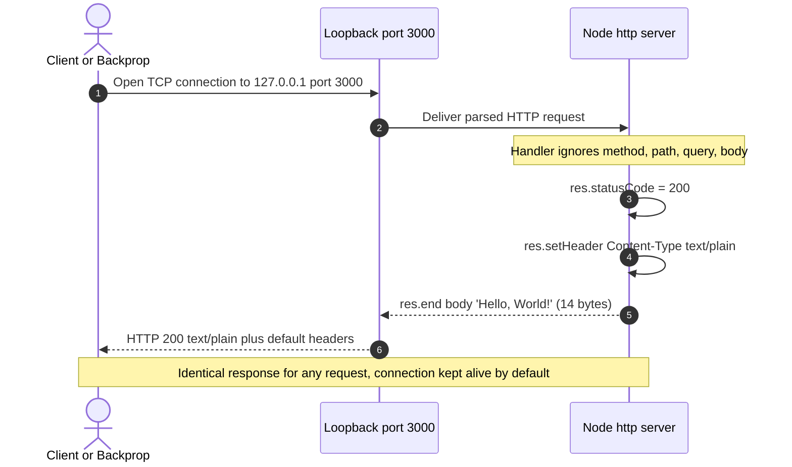

#### Event Processing Flows

**None exist.** `server.js` registers no custom event emitters or listeners beyond the two callbacks intrinsic to the `http` API (the per-request handler passed to `http.createServer` and the one-time listening callback passed to `server.listen`). There is no message broker, event bus, publish/subscribe channel, webhook, or queue anywhere in the repository (Sections 1.3.2, 2.3.2). No event-driven workflow can therefore be documented.

#### Batch Processing Sequences

**None exist** in the running application: there are no scheduled jobs, cron entries, worker queues, or bulk-data pipelines. The closest batch-like sequences are the npm tooling lifecycle and the external backprop file traversal, both of which are one-shot, non-runtime operations against the repository's static contents.

The npm lifecycle is fully declarative and deterministic — a zero-dependency install and a `test` script that fails by design (`package.json` line 7):

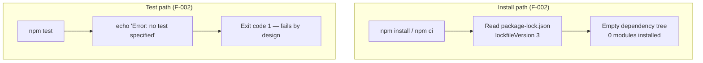

The external "backprop" process consumes the repository as a test target — exercising the HTTP endpoint and traversing the static file tree — without any code-level integration wiring:

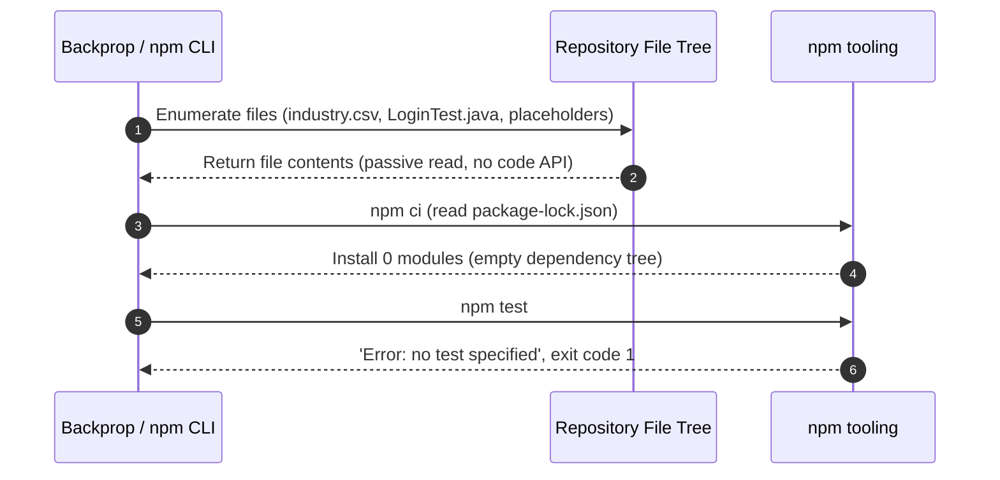

## 4.2 Flowchart Requirements and Validation Rules

This section defines the standard flowchart elements applied to every workflow in Section 4.1 and enumerates the validation rules that apply at each step. Because the running system is a single, unconditional response path with no request parsing, most conventional validation categories (authentication, input validation, compliance gating) have **no implementation**; this section records the controls that actually exist and explicitly notes the absent ones, consistent with the validation-rule findings in Sections 2.2.1–2.2.5.

### 4.2.1 Workflow Element Legend and Coverage

All flowcharts in this section use a consistent visual vocabulary. The legend below maps each required workflow element to its Mermaid shape convention and meaning.

| Workflow Element | Mermaid Shape | Meaning in this specification |
|---|---|---|
| Start / End point | Stadium `([ ])` | Process entry (operator/client action) or terminal state (listening, response sent, terminated) |
| Process step | Rectangle `[ ]` | A concrete operation in `server.js` or the npm/Node runtime |
| Decision | Diamond `{ }` | A branch in control flow (the only genuine one is the startup port bind) |
| Error state | Parallelogram `[/ /]` | An error condition (e.g., uncaught exception on bind failure) |
| System boundary | `subgraph` | The Node.js process or the loopback interface enclosing the steps |
| User touchpoint | Stadium node labeled "User touchpoint" | The command line and the loopback HTTP endpoint |

The following annotated flowchart demonstrates every element type within the actual F-001 workflow — from the operator touchpoint through the startup decision, the error/recovery path, and the request-serving path — all enclosed in the Node.js process system boundary.

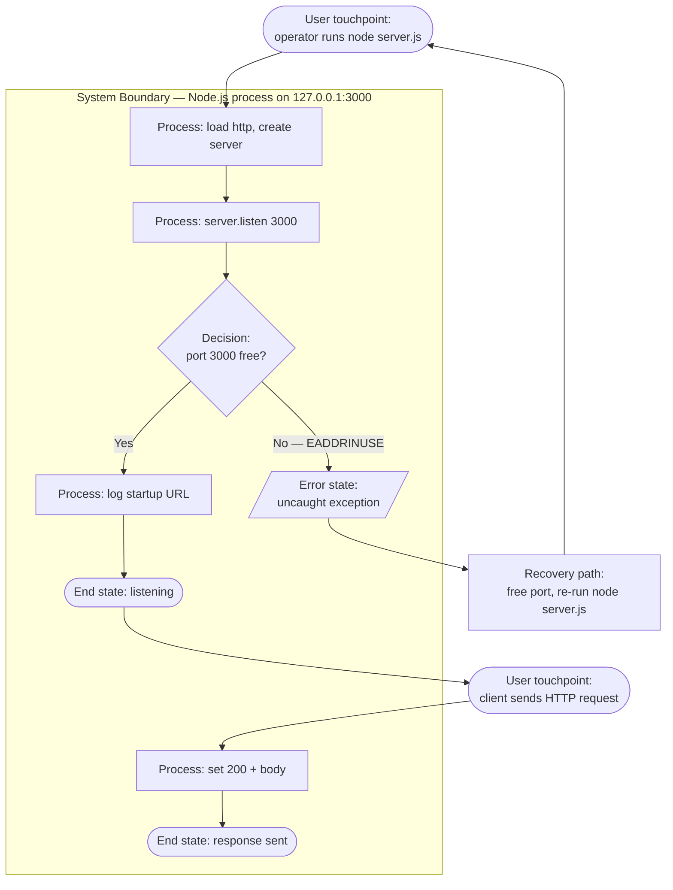

**Element coverage across the system.** The table records where each required element actually appears, so that absent elements are not misrepresented as present.

| Required Element | Present? | Evidence / Location |
|---|---|---|
| Start & end points | Yes | Startup entry (`node server.js`); terminal states: listening, response sent, terminated (`server.js` lines 6–14) |
| Process steps | Yes | `require('http')`, `createServer`, `listen`, `statusCode`, `setHeader`, `end` (`server.js` lines 1–13) |
| Decision diamonds | Minimal | Exactly one: startup port bind. The request handler has zero branches (Section 4.1.1) |
| System boundaries | Yes | Node.js process and OS loopback interface (`127.0.0.1:3000`, `server.js` lines 3–4, 12) |
| User touchpoints | Yes | Command line (`node server.js`) and loopback HTTP endpoint |
| Error states & recovery | Minimal | Startup uncaught exception → manual restart (Section 4.3.2); no request-time error branch |
| Timing / SLA | None defined | No SLAs/KPIs/timeouts in the repository (Sections 1.2.3, 4.1.1); Node runtime defaults apply |

### 4.2.2 Validation Rules

The prompt anticipates validation at four levels — business rules, data validation, authorization checkpoints, and regulatory compliance. The tables below map each to the actual repository evidence. The recurring finding is that the runtime enforces essentially no validation: request input is accepted and ignored, and the fixed response is a constant.

**Business rules at each step.**

| Workflow Step | Business Rule | Evidence |
|---|---|---|
| Startup bind | Bind loopback `127.0.0.1:3000` only (no configurable host/port) | Hard-coded constants (`server.js` lines 3–4) |
| Response generation | Every request yields the constant `200` / `text/plain` / `Hello, World!\n` (14 bytes); stability governed by "Do not touch!" | `server.js` lines 7–9; `README.md` line 2 |
| Package identity | `main` nominally `index.js`, though `index.js` is absent (a documented inconsistency, not an enforced rule) | `package.json` line 5; Section 2.6 |
| Reference vocabulary | `industry.csv` defines an allowed set of 43 categories with `Other` as catch-all — a latent controlled vocabulary that **no code enforces** | `industry.csv`; Section 2.2.3 |

**Data validation requirements.**

| Data Path | Validation Performed | Evidence |
|---|---|---|
| Inbound HTTP request (method, path, query, headers, body) | None — input is neither parsed nor validated; it is accepted and ignored | `server.js` handler lines 6–10 |
| `industry.csv` values | None programmatic — values are not validated, de-duplicated, or enforced by any code; observed as 43 well-formed non-empty rows | Section 2.2.3 |
| npm manifest / lockfile | Structural only — both files must be well-formed JSON for npm to parse them (they are) | `package.json`, `package-lock.json`; Section 2.2.2 |

**Authorization checkpoints.**

| Checkpoint | Status | Evidence |
|---|---|---|
| Authentication / login | None — despite the name `LoginTest.java`, no login logic exists (only a stray `Web` token) | `LoginTest.java`; Sections 1.3.2, 2.2.4 |
| Authorization / access control | None — no roles, tokens, sessions, or API keys anywhere | `server.js`; Section 2.4.1 |
| Transport security | None — plain HTTP; no TLS/HTTPS | `server.js`; Section 2.2.1 |
| Implicit exposure control | Loopback-only binding (`127.0.0.1`) limits reach to the local host | `server.js` lines 3, 12; Section 1.2.1 |

**Regulatory compliance checks.**

| Compliance Concern | Status | Evidence |
|---|---|---|
| Compliance gating in workflow | None defined — no PII handling, consent, audit, or regulatory checks in any flow | Sections 2.2.1–2.2.5 |
| Licensing metadata | MIT license declared (the only compliance-relevant metadata present) | `package.json` line 10; `package-lock.json` line 10 |
| Data sensitivity | None — `industry.csv` is non-PII static reference data; placeholders are empty | Sections 2.4.3, 2.4.5 |

## 4.3 Technical Implementation Flows

This section documents how the running system manages state and handles errors. Both are minimal by design: the server holds no application state, persists nothing, and implements no error-handling code beyond what the Node.js runtime provides implicitly. These findings are grounded in a line-by-line reading of `server.js` (which contains no `try`/`catch`, no `server.on('error', …)`, no timeouts, no clustering, and no process hooks) and corroborated by Sections 2.4.1–2.4.2.

### 4.3.1 State Management

**State transitions.** The only stateful element is the Node.js process lifecycle. The server is created, transitions to *Listening* if the port binds, serves an unbounded number of stateless requests from that state, and reaches a terminal state only via a bind failure at startup or an external signal/crash. The request-serving self-loop carries no state between requests.

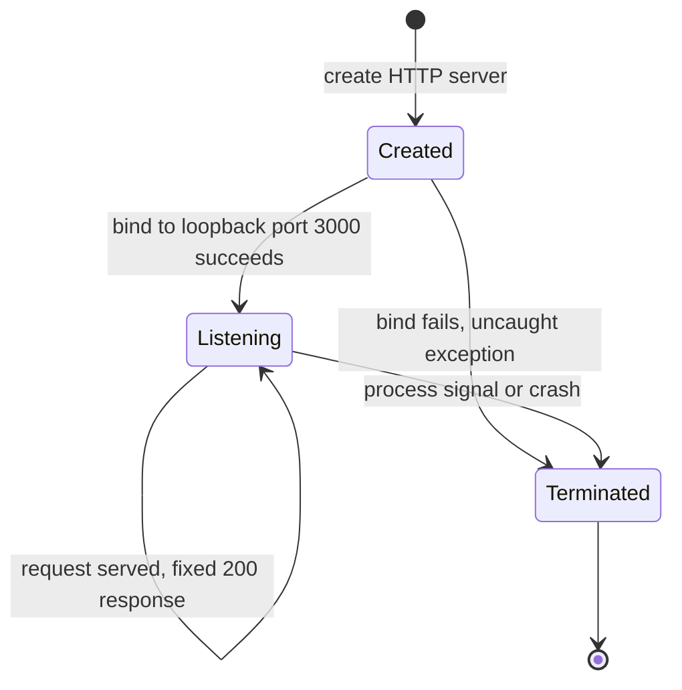

**Data persistence points.** There are **none**. The application performs no database reads or writes, no file writes, and no session or disk-backed state (Sections 1.3.2, 2.4.1). The `industry.csv` file is static data on disk that no code reads, so it is not a runtime persistence point. The response body is a compile-time constant, not derived from any stored state.

**Caching requirements.** There is **no application-level cache** (no in-memory store, no external cache such as Redis, and no HTTP caching headers — the handler sets only `Content-Type`, so no `Cache-Control`/`ETag`/`Last-Modified` are emitted by the code). The only reuse mechanism is transport-level: Node's `http` server keeps TCP connections alive by default (reflected by the default `Connection: keep-alive` header observed on responses), which is runtime behavior rather than a configured caching strategy.

**Transaction boundaries.** There are no persistent or multi-step transactions. Each request is an independent, self-contained unit: the handler synchronously sets the status and header and calls `res.end(...)`, with no shared mutable state, no locks, and no rollback semantics. The effective "transaction boundary" is the single request/response exchange, which either completes (`200` with the fixed body) or is severed at the socket level if the client disconnects — with no compensating action in code.

| State Concern | Implementation | Evidence |
|---|---|---|
| Persistence | None — no DB, file writes, or session state | `server.js`; Sections 1.3.2, 2.4.1 |
| Caching | None at app/HTTP layer; TCP keep-alive is a runtime default | `server.js` lines 7–9 (only `statusCode` + `Content-Type` set) |
| Transaction boundary | Single request/response; no shared state or rollback | `server.js` lines 6–10 |
| Application state | Stateless — response is a constant | `server.js` line 9 |

### 4.3.2 Error Handling

The application implements **no explicit error handling**. The consequences of this are deterministic and are modeled below: a startup bind failure crashes the process (there is no `'error'` listener to intercept it), and there is no request-time error branch because the handler performs no fallible work.

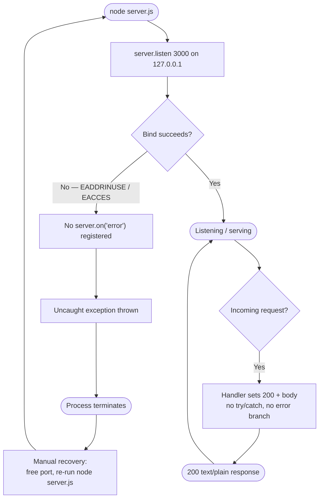

**Retry mechanisms.** None. There is no retry loop, backoff, or reconnection logic anywhere in the code. A failed startup is not retried programmatically; it terminates.

**Fallback processes.** None. There is no alternate response, degraded mode, circuit breaker, or default handler — the single response path is also the only path, so there is nothing to fall back to.

**Error notification flows.** The only console output is the **success** message `Server running at http://127.0.0.1:3000/` logged on successful bind (`server.js` line 13). There is no error logging, metrics emission, or alerting in the code. On a bind failure, the Node.js runtime — not the application — prints the uncaught exception (including the error stack) to `stderr` before the process exits; this is runtime behavior, not an implemented notification pipeline.

**Recovery procedures.** Recovery is entirely **manual**: an operator resolves the underlying condition (for example, frees port `3000` or stops the conflicting process) and re-runs `node server.js`. The repository contains no process supervisor, restart policy, or orchestration (no PM2/systemd unit, no `Dockerfile` or container restart policy, no CI/CD wiring — confirmed absent in Sections 1.3.2 and 2.4), so nothing restarts the process automatically.

| Error Handling Concern | Implementation | Evidence |
|---|---|---|
| Retry | None | `server.js` (no retry/backoff code) |
| Fallback | None (single response path) | `server.js` lines 6–10 |
| Error notification | Startup success `console.log` only; runtime prints uncaught exceptions to `stderr` | `server.js` line 13; absence of `on('error')`/`try` |
| Recovery | Manual restart; no supervisor/orchestration | Sections 1.3.2, 2.4.1 |

## 4.4 Required Diagram Coverage Summary

This sub-section provides a traceable index confirming that every diagram type required by the section prompt has been produced (using validated Mermaid.js syntax) and identifies where each appears. All diagrams were verified to render successfully before inclusion.

| Required Diagram Type | Produced? | Location | Diagram |
|---|---|---|---|
| High-level system workflow (swim lanes) | Yes | 4.1.1 | Swim-lane flowchart across five actor/system lanes |
| Detailed process flows for each core feature | Yes | 4.1.1, 4.1.2, 4.2.1 | Server bootstrap flow, request/response flow, npm lifecycle flow, annotated all-elements flow |
| Error handling flowcharts | Yes | 4.1.1, 4.3.2 | Bootstrap uncaught-exception path; consolidated error-handling flowchart |
| Integration sequence diagrams | Yes | 4.1.2 | HTTP request/response sequence; backprop-traversal + npm-lifecycle sequence |
| State transition diagrams | Yes | 4.3.1 | Node.js server-lifecycle state machine (`stateDiagram-v2`) |

**Coverage note on "each core feature."** The only feature with an executable, multi-step runtime flow is **F-001** (HTTP response service), which is modeled in depth (high-level, bootstrap, request/response, error, and state diagrams). **F-002** (packaging) is a declarative lifecycle, modeled by the npm install/test flow and sequence. **F-003** (`industry.csv`), **F-004** (`LoginTest.java`), and **F-005** (placeholder files) are static or non-executing artifacts with no runtime process of their own; their only "flow" is passive enumeration by an external consumer, which is represented in the high-level swim-lane diagram (4.1.1) and the backprop-traversal sequence (4.1.2). No process flow is fabricated for artifacts that do not execute.

## 4.5 References

The following repository files, folders, and previously authored specification sections were examined as evidence for the process flows documented in Section 4.

**Repository files**

- `server.js` — Established the sole runtime workflow: `require('http')` (line 1), hard-coded `127.0.0.1` / `3000` constants (lines 3–4), the `http.createServer` handler (line 6), `res.statusCode = 200` (line 7), `Content-Type: text/plain` (line 8), `res.end('Hello, World!\n')` = 14 bytes (line 9), `server.listen` with the startup log `Server running at http://127.0.0.1:3000/` (lines 12–14), and the confirmed absence of any `on('error')` listener, `try`/`catch`, timeout, clustering, or process hook.
- `package.json` — Established package identity, the `main` → `index.js` reference (line 5), the by-design failing `test` script `echo "Error: no test specified" && exit 1` (line 7), and the MIT license (line 10).
- `package-lock.json` — Established `lockfileVersion` 3, the empty dependency tree (zero installed modules), and the MIT license (line 10) that underpin the zero-dependency install flow.
- `README.md` — Established project identity (`hao-backprop-test`) and the "Do not touch!" stability constraint governing the fixed response (line 2).
- `LoginTest.java` — Established the non-compilable Java stub (`com.blitzyTest` package, `main` body containing only a stray `Web` token) and the absence of any login/authorization flow despite its name.
- `industry.csv` — Established the 43-category controlled vocabulary with `Other` as catch-all, used to document the latent (unenforced) validation data that no code reads.
- `test.py.txt`, `test.txt.txt` — Established the empty (0-byte) placeholder artifacts that carry no behavior and appear only as passive traversal targets.

**Repository folder**

- `` (repository root) — Confirmed the flat structure of 8 indexed source files with no subdirectories, defining the system boundary and the set of artifacts an external consumer traverses. (Three non-indexed binary artifacts — `100Pages.pdf`, `demo.jpg`, `sample.doc` — were noted as inert static assets with no processing code and thus no process flow.)

**Cross-referenced specification sections**

- `1.2 System Overview` — Actors/systems, loopback-only binding, and the confirmed absence of SLAs/KPIs.
- `1.3 Scope` — In-scope primary workflow (`node server.js` → HTTP GET) and the out-of-scope list (auth, routing, persistence, testing, TLS, CI/CD).
- `2.1 Feature Catalog` — Feature identifiers F-001 through F-005 referenced throughout the flows.
- `2.2 Functional Requirements` — Acceptance criteria and per-feature validation rules reflected in Section 4.2.
- `2.3 Feature Relationships` — The three integration points and the passive file-tree traversal relationship.
- `2.4 Implementation Considerations` — Technical constraints, security implications, and maintenance/recovery posture reflected in Sections 4.2 and 4.3.
- `2.6 Assumptions, Constraints, and Requirement Versioning` — The documented `main` → missing `index.js` inconsistency cited in the business-rules table.

**Diagram validation**

- All Mermaid.js diagrams in Section 4 were validated by rendering with the Mermaid CLI (`mmdc`) prior to inclusion; each produced a valid diagram, confirming correct flowchart, sequence-diagram, and `stateDiagram-v2` syntax.

# 5. System Architecture

## 5.1 High-Level Architecture

The `hao-backprop-test` repository implements a single-process, standard-library-only HTTP service whose entire runtime behavior lives in the 14-line `server.js` file. This section describes the system's architecture style and rationale, enumerates its constituent components, documents the single live data flow it exhibits, and characterizes its deliberately minimal external integration surface. Every statement below is grounded in the repository's source and corroborated by the already-authored Sections 1.2 (System Overview), 2.3 (Feature Relationships), 3.5 (Databases & Storage), 3.6 (Development & Deployment), 4.1 (System Workflows), and 4.3 (Technical Implementation Flows).

### 5.1.1 System Overview

**Overall architecture style and rationale.** The system is a **single-process, single-responsibility HTTP service** built exclusively on the Node.js standard library. It is a minimal monolith in the strictest sense — one runtime unit (`server.js`), one hard-coded listening socket, and one unconditional response path. There is no layering (no controller/service/repository tiers), no framework, no message bus, no data tier, and no cross-language orchestration; the Java, CSV, and placeholder files coexist in the same flat directory without any code-level relationship to the server. This style is a direct consequence of the repository's purpose: `README.md` identifies it as a *"test project for backprop integration"* carrying a *"Do not touch!"* instruction, and Section 1.2.3 establishes that the artifact's value derives from **determinism, reproducibility, and stability** rather than feature richness. A single fixed response path with zero dependencies is the simplest structure that satisfies those goals, so the minimalism is intentional rather than incidental.

**Key architectural principles and patterns.** The following principles are directly observable in the source:

- **Radical minimalism / zero dependencies** — `package-lock.json` records an empty dependency tree and `server.js` imports only the Node.js built-in `http` module, so the process runs with nothing more than a Node.js runtime present.
- **Standard-library-only construction** — no web framework (no Express/Koa/Fastify), no ORM, and no third-party middleware; protocol handling is delegated entirely to Node's core `http` layer.
- **Stateless request handling** — no state is carried between requests; the response body is a compile-time constant, not derived from any stored or accumulated state.
- **Deterministic single-path execution** — the request handler contains no branching on method, path, query, headers, or body, so every request produces an identical `200 text/plain` result.
- **Loopback-only network isolation** — the server binds exclusively to `127.0.0.1`, so it is reachable only from the same host and is never exposed to a network.
- **Convention-free, hard-coded configuration** — hostname and port are inline constants (`server.js` lines 3–4); there is no environment-variable, CLI-argument, or config-file surface.
- **Co-located but independent artifacts** — the mixed-language files are enumerated by an external consumer but never invoke one another (Section 2.3.3).

**System boundaries and major interfaces.** The system boundary is a **single local host**: because the listener binds to loopback, nothing crosses a network boundary. Within that boundary the system exposes four interfaces, only the first of which is a live runtime API:

- **Loopback HTTP endpoint** `http://127.0.0.1:3000/` — the single runtime request/response interface served by `server.js`.
- **Command-line entry point** — an operator launches the process with `node server.js` (there is no build step; Section 3.6.5).
- **npm tooling entry** — `package.json` / `package-lock.json` drive the `install`/`ci`/`test` lifecycle for the npm CLI.
- **Repository file tree** — the flat set of files that the external "backprop" process traverses passively as a test target.

### 5.1.2 Core Components

The table below enumerates the repository's architectural components using the canonical feature identifiers established in Section 2.1. Only `F-001` executes at runtime; the remaining entries are declarative metadata or inert on-disk artifacts. (The table is limited to four columns per the section's formatting standard; per-component critical considerations follow as bullets.)

| Component | Primary Responsibility | Key Dependencies | Integration Points |
|---|---|---|---|
| **F-001 HTTP Response Service** (`server.js`) | Serve a fixed `HTTP 200` / `text/plain` / `Hello, World!\n` response to every request | Node.js built-in `http` module only (no third-party packages) | Loopback HTTP endpoint `http://127.0.0.1:3000/`; CLI launch `node server.js` |
| **F-002 Package Identity & Zero-Dependency Baseline** (`package.json`, `package-lock.json`) | Declare the `hello_world` package identity and pin an empty dependency set | npm CLI (v7+; `lockfileVersion: 3`) | `npm install` / `npm ci` (zero modules); by-design failing `npm test` |
| **F-003 Industry Classification Vocabulary** (`industry.csv`) | Provide a 43-value controlled-vocabulary reference list | None (static file; not read by any code) | Passive file-tree traversal by the external backprop process |
| **F-004 Java Login Entry-Point Stub** (`LoginTest.java`) | Placeholder `main` entry point in `com.blitzyTest` (non-functional) | Would require a JDK + build tooling (both absent) | Passive file-tree traversal by the external backprop process |
| **F-005 Placeholder Artifacts** (`test.py.txt`, `test.txt.txt`) | Named, empty (0-byte) file-tree entries | None | Passive file-tree traversal by the external backprop process |
| **Static binary/document artifacts** (`100Pages.pdf`, `demo.jpg`, `sample.doc`) | Inert sample data at rest; no runtime role | None (not processed by any code) | Passive file-tree traversal by the external backprop process |

**Critical considerations per component:**

- **F-001** — hostname `127.0.0.1` and port `3000` are hard-coded; the handler performs no routing, request parsing, or error handling, and registers no `'error'` listener, so a bind failure crashes the process (Section 4.3.2). Only one instance can bind port `3000` per host, and there is no clustering or load balancing (Section 2.4.1).
- **F-002** — the `main` field points to a non-existent `index.js` (the runnable file is `server.js`), the `test` script fails by design, and no `engines` field pins a Node.js version (Section 2.4.2).
- **F-003** — not consumed by any code; several values contain `/`, so a future consumer must treat each line as a single field rather than splitting on `/` (Section 2.4.3).
- **F-004** — non-compilable (a stray `Web` token in `main`); no `pom.xml`/`build.gradle`, so it is not part of any build step (Section 2.4.4).
- **F-005 and the static binary/document artifacts** — inert; they define no behavior, dependencies, or configuration and participate in no data flow (Sections 2.4.5, 3.5.2).

### 5.1.3 Data Flow Description

**Primary data flow.** The system exhibits exactly **one** live data flow: a single, synchronous request/response exchange over the loopback interface. A client (or the external backprop consumer) opens a TCP connection to `127.0.0.1:3000`; Node's `http` layer accepts the connection and parses the request line and headers; the application handler is invoked, ignores every attribute of the request, sets the status code to `200` and the `Content-Type` to `text/plain`, and ends the response with the fixed 14-byte body `Hello, World!\n`. There is no database read/write, no cache lookup, no outbound call to any external service, and no inter-process message passing anywhere in the flow (Sections 4.1.2, 4.3.1).

**Integration patterns and protocols.** Three integration patterns are present, and only one is a runtime protocol exchange: (1) **synchronous HTTP/1.1 request/response** over a loopback TCP socket for `F-001`; (2) **declarative packaging** through `package.json`/`package-lock.json`, consumed by the npm CLI with no network fetch because the dependency tree is empty; and (3) **passive file-tree enumeration**, in which the external backprop process reads named paths with no code-level API. The server presents no route table — every HTTP method and path returns the identical response — so there is no request-routing or content-negotiation layer.

**Data transformation points.** There are **none**. The response body is a compile-time string constant, not a value derived, mapped, serialized, or otherwise transformed from request input or stored data. Because the handler never inspects the request payload, no parsing, validation, marshalling, or enrichment step exists in the pipeline (Sections 4.1.1, 4.3.1).

**Key data stores and caches.** There are **no data stores and no caches**. No database, ORM, connection string, or storage SDK exists anywhere in the repository (Section 3.5), and the server holds no in-memory state between requests. The only "data at rest" is the set of static files on the local filesystem (`industry.csv`, the binary/document artifacts, and the empty placeholders), which are managed through Git and are never read or written by the running server (Section 3.5.2). The sole reuse mechanism observed at runtime is **transport-level TCP keep-alive**, which Node's `http` server enables by default (reflected by the default `Connection: keep-alive` response header); this is runtime transport behavior, not a configured application or HTTP cache — the handler emits no `Cache-Control`, `ETag`, or `Last-Modified` headers (Section 4.3.1).

### 5.1.4 External Integration Points

The system integrates with **no networked third-party services** — there are no external APIs, authentication providers, message brokers, cloud services, or databases anywhere in the repository, and the loopback bind guarantees the process is unreachable beyond the local host (Sections 2.3.2, 3.4, 3.5.4). The "external" touchpoints listed below are therefore all local-host actors or local tooling rather than remote systems. The table is limited to four columns per the section's formatting standard; the "Data Exchange Pattern" and "Protocol/Format" concerns are combined into a single column.

| External Actor / System | Integration Type | Exchange Pattern & Protocol | SLA Requirements |
|---|---|---|---|
| Local client / test harness | Inbound runtime request | Synchronous request → fixed response; HTTP/1.1 `text/plain` over loopback TCP | None defined (Section 1.2.3) |
| External "backprop" integration process | Test-target consumption | HTTP request/response **plus** passive file-tree reads; no code-level API | None defined (Section 1.2.3) |
| npm CLI (with npm registry) | Build/tooling lifecycle | Declarative manifest/lockfile; zero-dependency install performs no registry fetch | None defined (Section 1.2.3) |

No SLAs, KPIs, latency budgets, or throughput targets are defined for any of these touchpoints; the repository declares none, and Section 1.2.3 confirms their absence. Any performance or availability expectation would have to be supplied by the external consumer, not by this repository.

## 5.2 Component Details

This subsection decomposes the `hao-backprop-test` fixture into its constituent components and specifies, for each, its purpose and responsibilities, the technologies and frameworks it relies on, its key interfaces and APIs, its data-persistence characteristics, and its scaling considerations. The components correspond one-to-one with the feature catalog established in Section 2.1 (F-001 through F-005), plus the git-tracked static binary artifacts.

A defining property of this system is that **only one component executes**: F-001, the Node.js HTTP response service in `server.js`. Every other component is a passive, on-disk artifact — a packaging manifest, static reference data, a non-compilable language stub, or an inert placeholder/binary file. Consequently, the "runtime" dimensions (interfaces, persistence, scaling) are substantive only for F-001; for the remaining components those dimensions are reported honestly as *not applicable* rather than being invented.

The following table orients the reader to each component's runtime role before the detailed specifications that follow.

| Component | Runtime Role | Source Artifact(s) |
|-----------|--------------|--------------------|
| F-001 HTTP "Hello, World!" Response Service | Executable — the entire live system | `server.js` |
| F-002 Package Identity & Zero-Dependency Baseline | Build/packaging metadata (not executed) | `package.json`, `package-lock.json` |
| F-003 Industry Classification Reference Vocabulary | Static reference data at rest | `industry.csv` |
| F-004 Java Login Entry-Point Stub | Non-compilable source stub (isolated) | `LoginTest.java` |
| F-005 Placeholder & Static Binary Artifacts | Inert file-tree fixtures | `test.py.txt`, `test.txt.txt`, `100Pages.pdf`, `demo.jpg`, `sample.doc` |

### 5.2.1 F-001 — HTTP "Hello, World!" Response Service

`server.js` is the sole executable component and therefore constitutes the entire runtime system.

| Architecture Dimension | Detail |
|------------------------|--------|
| Purpose & Responsibilities | Bind a TCP listener on loopback `127.0.0.1:3000` and return a fixed `HTTP 200` response with `Content-Type: text/plain` and the body `Hello, World!\n` (exactly 14 bytes) to **every** inbound request — irrespective of method, path, query string, headers, or body. Emit a single startup confirmation line to stdout. |
| Technologies & Frameworks | Node.js runtime (Google V8 engine) with the CommonJS module system (`require`). The **only** dependency is the Node.js built-in `http` core module; there are zero third-party frameworks or libraries (no Express, Koa, Fastify, etc.). |
| Key Interfaces & APIs | **Inbound:** a single HTTP/1.1 endpoint at `http://127.0.0.1:3000/`. There are no sub-routes — the entire URL space collapses to one response. **Outbound:** one `console.log` line to stdout at startup (`Server running at http://127.0.0.1:3000/`). The script exports nothing; it is an executable entry point, not an importable module. |
| Data Persistence | None. The service is fully stateless: no database, no file writes, no session store, and no cache. The response body is a compile-time constant string held in memory only. |
| Scaling Considerations | Not designed to scale. It runs as a single process on a single JavaScript execution thread, bound to one hard-coded port on the loopback interface (and therefore unreachable from off-host). There is no clustering (`cluster`/`worker_threads`), no load balancer, no reverse proxy, and no horizontal replication. At most one instance can run per host per port 3000 — a second bind to 3000 yields `EADDRINUSE`, which surfaces as an uncaught exception (see Section 5.4). Per-request work is constant-time with no I/O, so throughput is governed entirely by Node's event-loop defaults; no timeouts or limits are configured in code. |

The complete request-handling logic is the following three-line callback body, which sets the status, header, and body unconditionally:

```javascript
res.statusCode = 200;
res.setHeader('Content-Type', 'text/plain');
res.end('Hello, World!\n');
```

Because the handler never inspects `req.method`, `req.url`, or the request body, all HTTP verbs and paths are functionally identical. The Node.js `http` layer transparently supplies default response headers (`Date`, `Connection`, `Keep-Alive`, `Content-Length`) and handles HTTP protocol framing beneath the application code.

### 5.2.2 F-002 — Node.js Package Identity & Zero-Dependency Baseline

`package.json` and `package-lock.json` together declare the package's identity and pin an empty dependency graph.

| Architecture Dimension | Detail |
|------------------------|--------|
| Purpose & Responsibilities | Declare package metadata (`name: hello_world`, `version: 1.0.0`, `description: Hello world in Node.js`, `license: MIT`, `author: hxu`) and pin a fully empty dependency graph. Define the `test` script, which is deliberately non-functional (`echo "Error: no test specified" && exit 1`). |
| Technologies & Frameworks | The npm packaging format. `package-lock.json` declares `lockfileVersion: 3`, which is emitted by npm v7 and later. There is no `engines` field, so no Node.js version is pinned by the repository. |
| Key Interfaces & APIs | Consumed by the npm CLI during `npm install` / `npm ci` (which install nothing, given the empty tree) and `npm test` (which always exits 1). The `main` field references `index.js`, a file that **does not exist** in the repository — a documented mismatch, since the actual entry point is `server.js`, executed directly with `node server.js`. |
| Data Persistence | On-disk JSON manifests only; no runtime persistence. |
| Scaling Considerations | Not applicable (this is build/packaging metadata, not an executing component). The empty dependency tree eliminates third-party supply-chain surface and makes installation deterministic and effectively instantaneous. |

### 5.2.3 F-003 — Industry Classification Reference Vocabulary

`industry.csv` is a static, controlled vocabulary.

| Architecture Dimension | Detail |
|------------------------|--------|
| Purpose & Responsibilities | Provide a controlled vocabulary of 43 industry categories under a single header column `Industry` (ranging from `Accounting/Finance` to an `Other` catch-all). It is reference/lookup data. |
| Technologies & Frameworks | Plain single-column CSV — 749 bytes across 44 lines (1 header + 43 values). No parser, schema, or library accompanies it. |
| Key Interfaces & APIs | None programmatic. The file is **not** read by `server.js` or by any other code in the repository; there are no consumers. Because several category values embed a `/` character (e.g., `Accounting/Finance`), any future consumer must treat each line as a single opaque field rather than splitting on `/`. |
| Data Persistence | A static file at rest; it is never mutated by any runtime process. |
| Scaling Considerations | Not applicable (static data, no execution). |

### 5.2.4 F-004 — Java Login Entry-Point Stub

`LoginTest.java` is a non-functional Java skeleton isolated from the runtime.

| Architecture Dimension | Detail |
|------------------------|--------|
| Purpose & Responsibilities | Present a Java class skeleton — `package com.blitzyTest;` with a `public class LoginTest` and a `public static void main(String[] args)` entry point. The method body contains only a stray `Web` token, so the file is **not valid, compilable Java**. Despite its name, it implements no login or authentication logic. |
| Technologies & Frameworks | Java source language. However, there is **no Java build tooling** in the repository (no `pom.xml`, no `build.gradle`, no `Makefile`) and no JDK present in the environment, so the file cannot be compiled or executed as-is. |
| Key Interfaces & APIs | None. The stub is entirely isolated from the Node.js runtime — there are no cross-language calls, shared build, or inter-process links between it and F-001. |
| Data Persistence | None. |
| Scaling Considerations | Not applicable (non-compilable stub, never executed). |

### 5.2.5 F-005 — Placeholder Files & Static Binary Artifacts

This component groups the inert, non-code files that exist purely as fixtures in the repository file tree.

| Architecture Dimension | Detail |
|------------------------|--------|
| Purpose & Responsibilities | Populate the repository file tree with named, inert artifacts. `test.py.txt` and `test.txt.txt` are empty (0-byte) placeholders with literal double-extension names and no defined behavior. `100Pages.pdf` (~9.4 MB), `demo.jpg` (~2.1 MB), and `sample.doc` (~98 KB) are git-tracked binary document/image artifacts. |
| Technologies & Frameworks | None — plain text placeholders and standard binary document/image formats (PDF, JPEG, DOC). |
| Key Interfaces & APIs | None. None of these files is referenced, opened, or consumed by `server.js` or any other code in the repository. |
| Data Persistence | Static files at rest; never read or written by any runtime process. |
| Scaling Considerations | Not applicable (inert fixtures, never executed). |

### 5.2.6 Component Interaction Diagram

The diagram below shows how the components relate at runtime. Only F-001 participates in live request/response interaction over the loopback socket; the manifests declare the package for the runtime, and the inert artifacts are reachable only by passive file-system reads performed by the external backprop process. All interaction is confined to a single local host.

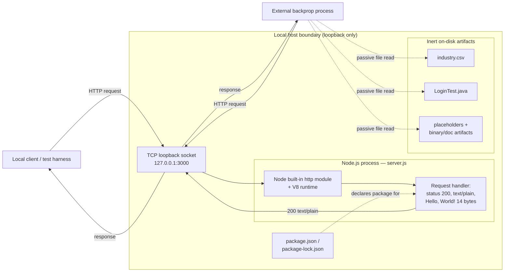

### 5.2.7 Runtime State Transition Diagram

F-001 is the only component with a runtime lifecycle. Its state machine is intentionally minimal: the process starts, attempts to bind the loopback port, and either enters a long-lived `Listening` state (self-looping as it serves each fixed response) or terminates. There is no programmatic recovery path — a failed bind or a crash leads directly to termination.


### 5.2.8 Key Flow Sequence Diagram

The single key flow is the request/response cycle handled by F-001. The sequence below traces a request from the client (or the external backprop process) through the loopback socket and the Node.js `http` layer into the application handler, emphasizing that the handler ignores all request attributes and always produces the same 14-byte response.

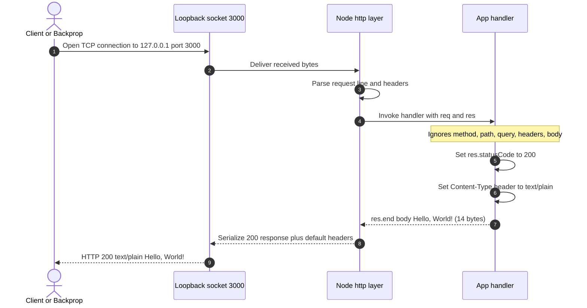


## 5.3 Technical Decisions

This subsection documents and justifies the architecturally significant decisions embodied by the `hao-backprop-test` fixture. Because the repository is a deliberately minimal test target, most decisions are decisions *not* to adopt a capability (a framework, a database, a cache, an authentication layer, a build pipeline). Each such decision is reported honestly as an observed characteristic of the code, together with the rationale that best fits the system's evident purpose — providing a deterministic, reproducible, zero-dependency HTTP endpoint for an external "backprop" integration process. No decision below asserts a capability that is absent from the repository.

The following summary maps each decision area to the choice actually made and its primary rationale. Detailed prose and tradeoff analysis follow in 5.3.1–5.3.5, a decision tree in 5.3.6, and formal Architecture Decision Records in 5.3.7.

| Decision Area | Decision Taken | Primary Rationale |
|---------------|----------------|-------------------|
| Architecture style | Single-process, single-file, standard-library-only monolith | Maximize determinism and reproducibility; minimize surface area |
| Communication pattern | Synchronous HTTP/1.1 request/response over loopback | Simplest testable contract; no coordination needed |
| Data storage | None (stateless constant response) | No state to persist; nothing to store |
| Caching | None at application level (Node TCP keep-alive default only) | Response is a fixed in-memory constant; caching adds no value |
| Security | Loopback-only network isolation | Not exposed off-host; no sensitive data or multi-tenant access |
| Delivery | Direct `node server.js` execution; no build/CI/CD/containers | One file, zero dependencies; nothing to compile or orchestrate |

### 5.3.1 Architecture Style Decisions and Tradeoffs

The system adopts a **single-process, single-responsibility, standard-library-only monolith**. The entire runtime lives in `server.js` (~14 lines), which uses only the Node.js built-in `http` module and holds no third-party dependencies (the dependency tree in `package-lock.json` is empty). This is the smallest viable HTTP service architecture and is chosen because the system's job is to be an unchanging, trivially reproducible target rather than a feature-bearing application.

The style trades away extensibility and operational richness in exchange for determinism, near-zero supply-chain surface, and instantaneous startup. The following table makes the tradeoff explicit.

| Dimension | Benefit of the Minimal Choice | Accepted Tradeoff |
|-----------|------------------------------|-------------------|
| Dependencies | Empty tree → no supply-chain risk, deterministic install | No framework conveniences (routing, middleware, validation) |
| Footprint | ~14 lines, instant startup, trivially auditable | No feature growth path without re-architecting |
| Behavior | Identical 200 response every time → perfectly reproducible | Cannot exercise varied request handling or edge cases |
| Operations | Nothing to configure; one command to run | No health checks, metrics, graceful shutdown, or clustering |

An explicit consequence of this style is a small set of deliberately unaddressed defects that are consistent with a throwaway fixture: `package.json` names `index.js` as `main` although that file does not exist (the real entry is `server.js`), and the `npm test` script fails by design. These are documented rather than treated as bugs to fix.

### 5.3.2 Communication Pattern Choices

The sole communication pattern is **synchronous HTTP/1.1 request/response** over a TCP loopback socket. A client (or the external backprop process) opens a connection to `127.0.0.1:3000`, the Node.js `http` layer parses the request and invokes the handler, and the handler immediately returns a complete response with no downstream calls. There is no asynchronous messaging, no event bus, no queue, no streaming, and no service-to-service networking — the handler performs no I/O of its own, so every exchange completes in a single, self-contained round trip. This pattern is chosen because a request/response endpoint is the simplest contract an external test harness can assert against, and because the system has no collaborators that would justify asynchronous coordination.

### 5.3.3 Data Storage Solution Rationale

The decision is to use **no data storage of any kind**. There is no database, no file-backed store, no session store, and no ORM or data-access layer; the response body is a compile-time constant string served from memory. This is justified directly by the absence of any state: the service produces the same output for every input, so there is nothing to read, write, or persist. Notably, this is a conscious departure from the broader backprop platform's default stack, which specifies MongoDB as a database — that component is deliberately *not* present here (as recorded in Section 3.5), because the fixture has no persistence requirement. The lone data-bearing artifact in the repository, `industry.csv`, is static reference data that no code consumes.

### 5.3.4 Caching Strategy Justification

The decision is to implement **no application-level caching**. There is no in-memory cache library, no external cache (e.g., Redis is absent), and no HTTP cache-control headers are set — the handler explicitly sets only the status code and `Content-Type`. Caching is unnecessary because the response is a fixed 14-byte constant computed with no I/O or CPU cost; there is no expensive result whose reuse a cache could accelerate. The only reuse present at all is transport-level **TCP keep-alive**, which is a Node.js `http` runtime default rather than a configured caching strategy, and it affects connection reuse only, not response content.

### 5.3.5 Security Mechanism Selection

The single, deliberate security control is **network isolation via loopback binding**: the server binds exclusively to `127.0.0.1`, making it unreachable from other hosts. Beyond that, no security mechanisms are implemented — there is no authentication or authorization (despite the unrelated, non-compilable `LoginTest.java` stub), no TLS/HTTPS, no input validation, no rate limiting, and no secrets management. This selection is appropriate for the observed context: a local, non-exposed test fixture that serves a constant public string and handles no sensitive or user-specific data. The empty dependency tree further contributes to security posture by eliminating third-party supply-chain exposure. These are honest statements of the system's minimal posture, not recommendations for a production deployment.

### 5.3.6 Decision Tree

The decision tree below reconstructs the reasoning that yields this minimal architecture. At each junction the system's requirements answer "No," selecting the minimal branch (CHOSEN); the corresponding "Yes" branch names the richer alternative that was rejected — including the platform defaults (MongoDB, Docker/CI-CD) that this fixture deliberately omits.

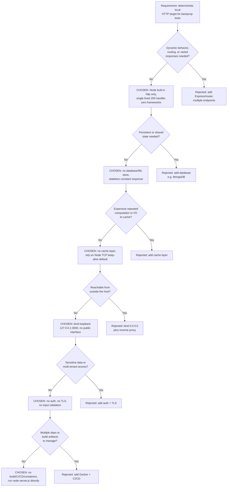

### 5.3.7 Architecture Decision Records (ADRs)

The following records capture each significant decision in a consistent Context / Decision / Consequences form. All are in **Accepted** status, reflecting the state of the committed code.

#### ADR-001 — Standard-Library-Only Single-Process HTTP Server

- **Context:** A deterministic, easily reproducible HTTP endpoint is needed as a backprop integration test target.
- **Decision:** Implement the server in a single `server.js` file using only the Node.js built-in `http` module, with zero third-party frameworks or dependencies.
- **Consequences:** Instantaneous, deterministic install and startup with no supply-chain surface; auditability is trivial. The tradeoff is the absence of framework features (routing, middleware, validation) and no straightforward path to feature growth without re-architecting.

#### ADR-002 — Synchronous HTTP Request/Response as the Sole Communication Pattern

- **Context:** The service must present a contract an external harness can assert against, but it has no downstream collaborators.
- **Decision:** Serve every request synchronously with a single, self-contained HTTP/1.1 response; adopt no asynchronous messaging, queues, or streaming.
- **Consequences:** The simplest possible testable contract, with no coordination complexity. The system cannot participate in event-driven or multi-service workflows.

#### ADR-003 — No Persistence Layer

- **Context:** The service produces identical output for every request and holds no state.
- **Decision:** Use no database or file-backed store; serve a constant in-memory string. Explicitly omit the platform-default MongoDB.
- **Consequences:** Zero data-tier operational burden and perfect reproducibility. There is no capacity to store, query, or evolve data.

#### ADR-004 — No Application Caching Layer

- **Context:** The response is a fixed 14-byte constant produced with no I/O or meaningful CPU cost.
- **Decision:** Implement no application or external cache and set no HTTP cache-control headers; rely only on Node's default TCP keep-alive for connection reuse.
- **Consequences:** No caching machinery to maintain or invalidate. There is no mechanism to accelerate expensive results, but none exist to accelerate.

#### ADR-005 — Loopback-Only Network Isolation as the Sole Security Control

- **Context:** A local, non-exposed test fixture serving a constant public string, handling no sensitive or user-specific data.
- **Decision:** Bind exclusively to `127.0.0.1:3000`; implement no authentication, authorization, TLS, input validation, or rate limiting.
- **Consequences:** The endpoint is unreachable off-host, which is sufficient for the test context, and the empty dependency tree minimizes exposure. The posture is explicitly unsuitable for any exposed or production deployment.

#### ADR-006 — Direct Execution with No Build, CI/CD, or Containerization

- **Context:** The deliverable is a single dependency-free script.
- **Decision:** Run the service directly with `node server.js`; provide no build system, no containerization (no Dockerfile/compose), and no CI/CD pipeline. Explicitly omit the platform-default Docker/Terraform/GitHub Actions delivery tooling.
- **Consequences:** Nothing to compile or orchestrate and a trivial run model. There is no automated packaging, image build, or continuous verification (and `npm test` fails by design).


## 5.4 Cross-Cutting Concerns

This subsection addresses the cross-cutting concerns typically expected of a production service — observability, logging/tracing, error handling, authentication/authorization, performance/SLAs, and disaster recovery — as they actually exist in the `hao-backprop-test` fixture. Consistent with the system's radically minimal design, most of these concerns are implemented only to the degree inherent in the Node.js runtime, or are absent entirely. Each is reported factually below; no monitoring stack, tracing pipeline, SLA, or recovery automation is claimed that the repository does not contain.

The summary table records the status of each concern and the mechanism actually observed.

| Concern | Status | Observed Mechanism / Note |
|---------|--------|---------------------------|
| Monitoring & observability | Not implemented | No metrics, health checks, or alerting; one startup log line only |
| Logging & tracing | Minimal | Single `console.log` to stdout at startup; no request logs or trace IDs |
| Error handling | Runtime default only | No error listener/try-catch; failures become uncaught exceptions |
| Authentication & authorization | Not implemented | No auth of any kind; loopback binding is the only access control |
| Performance & SLAs | None defined | No SLA/KPI in repo; constant-time handler, no configured timeouts |
| Disaster recovery | Manual only | No supervisor or auto-restart; recovery is re-running `node server.js` |

### 5.4.1 Monitoring and Observability

The system implements **no monitoring or observability tooling**. There are no metrics counters or gauges, no `/health` or readiness endpoint, no Prometheus/StatsD exporter, and no alerting integration anywhere in the repository. The only externally observable signals are behavioral: whether the process is running and listening, and whether a request receives the fixed `200`/`text/plain`/`Hello, World!\n` response. These behavioral proxies (established in Section 1.2.3) are the sole means of confirming health; there is no dashboard, no scrape target, and no telemetry emission.

### 5.4.2 Logging and Tracing Strategy

The logging strategy is a **single stdout line emitted once at startup** — `Server running at http://127.0.0.1:3000/` — produced by the `console.log` call inside the `server.listen` callback. There is no per-request access log, no structured (JSON) logging, no log levels, and no log file or log shipping. Distributed tracing is entirely absent: there are no correlation/trace identifiers, no spans, and no tracing library. The only additional diagnostic output arises from the **Node.js runtime itself**, which prints an uncaught-exception stack trace to stderr if the process fails (see 5.4.3); this is runtime behavior, not application logging.

### 5.4.3 Error Handling Patterns

Error handling is limited to **Node.js runtime defaults**; the application code registers no error handling of its own. Specifically, `server.js` attaches no `'error'` listener to the server, wraps nothing in `try`/`catch`, and defines no retry, fallback, circuit-breaker, or error-notification logic. The consequences are:

- **Startup bind failure** — if port 3000 is already in use, the `listen` call raises `EADDRINUSE`; with no `'error'` listener registered, this propagates as an **uncaught exception** that terminates the process (with a stack trace printed to stderr by the runtime).
- **Runtime faults or signals** while listening likewise terminate the process, since there is no handler to intercept them.
- **Malformed HTTP** at the protocol layer is managed by Node's built-in `http` parser beneath the application; the application handler is only ever invoked for well-formed requests and, once invoked, cannot fail on request content because it ignores all request attributes.

There is no automated recovery from any of these conditions — restoration is manual (see 5.4.6). The diagram below traces the error-handling flow from startup through the serving loop to termination and manual recovery.

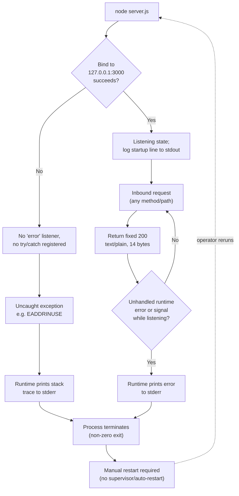

### 5.4.4 Authentication and Authorization Framework

There is **no authentication or authorization framework**. No credentials, tokens, sessions, API keys, roles, or access-control checks exist anywhere in the codebase, and every request is served identically without any notion of identity. The presence of `LoginTest.java` is incidental — it is a non-compilable, isolated stub (Section 5.2.4) that implements no login logic and is unconnected to the Node.js runtime. The only access control in effect is the network-level **loopback binding** (`127.0.0.1`), which restricts reachability to processes on the same host, as discussed in Section 5.3.5.

### 5.4.5 Performance Requirements and SLAs

**No performance requirements, SLAs, KPIs, or latency/throughput targets are defined anywhere in the repository** (corroborated by Section 1.2.3). The code sets no explicit socket or request timeouts, so only Node.js runtime defaults apply, and no version is pinned that would fix those defaults. The performance characteristics that can be stated factually derive from the handler's structure rather than from any specification:

- The handler performs **no I/O and no computation** beyond setting a status code, one header, and a constant body, so its per-request work is effectively constant-time.
- The response body is a fixed **14 bytes** (`Hello, World!\n`).
- Throughput and concurrency behavior are governed entirely by Node's single-threaded event loop; there is no clustering, connection pooling configuration, or backpressure handling in the code.

These are observed properties, not commitments; the fixture makes no availability or latency guarantee.

### 5.4.6 Disaster Recovery Procedures

Disaster recovery is **manual and minimal**. There is no process supervisor (no PM2, `systemd` unit, or container-orchestrator restart policy), no automatic restart, no health-check-driven remediation, and no redundancy or failover — the single Node.js process is a single point of failure. Because the service is entirely **stateless** (Section 5.2.1) and holds no persisted data, there is correspondingly nothing to back up or restore; the only recovery action after a crash or termination is for an operator to re-run `node server.js`. The dashed "operator reruns" edge in the 5.4.3 diagram depicts precisely this manual recovery loop.


## 5.5 References

This subsection lists every repository artifact, cross-referenced Technical Specification section, and external fact cited as evidence for Section 5.

**Repository files examined and cited:**

- `server.js` - Established the sole runtime component (F-001): built-in `http` module only, loopback `127.0.0.1:3000`, fixed `200`/`text/plain`/`Hello, World!\n` (14-byte) response, no routing/parsing/error-listener; basis for 5.1–5.4 and all three 5.2 diagrams and the 5.4.3 error-flow diagram.
- `package.json` - Established package identity (F-002): `name hello_world`, `version 1.0.0`, MIT, `main: index.js` (nonexistent file), deliberately failing `test` script, no dependencies/engines.
- `package-lock.json` - Confirmed the empty dependency tree and `lockfileVersion: 3` (npm v7+), underpinning the zero-dependency and storage/caching decisions.
- `README.md` - Established project identity/purpose ("test project for backprop integration. Do not touch!") and the external backprop consumer relationship.
- `LoginTest.java` - Established F-004: non-compilable, isolated Java stub with no login logic; cited in 5.2.4 and 5.4.4.
- `industry.csv` - Established F-003: static 43-category controlled vocabulary, unconsumed by any code; cited in 5.2.3.
- `test.py.txt`, `test.txt.txt` - Established the empty (0-byte) placeholder members of F-005; cited in 5.2.5.
- `100Pages.pdf`, `demo.jpg`, `sample.doc` - Established the inert, git-tracked binary/document artifacts grouped under F-005; cited in 5.2.5.
- Repository root (flat structure, `.git` only subdirectory; no `.blitzyignore`, no CI/CD, Dockerfile, `.env`, or config files) - Established the single-process, no-build/no-container architecture and the absence of external integrations.

**Technical Specification sections cross-referenced for consistency:**

- [spec] Section 1.2 System Overview - Corroborated the internal test-fixture identity, loopback-only exposure, and the absence of defined SLAs/KPIs.
- [spec] Section 1.3 Scope - Corroborated in-scope runtime behavior and out-of-scope items (auth, persistence, TLS, build/containerization).
- [spec] Section 2.1 Feature Catalog - Provided the canonical F-001..F-005 feature identifiers reused throughout Section 5.
- [spec] Section 2.3 Feature Relationships - Corroborated the three integration points and the absence of service-to-service networking.
- [spec] Section 2.4 Implementation Considerations - Corroborated per-component constraints, non-scalability, and absent security controls.
- [spec] Section 3.5 Databases & Storage - Confirmed the deliberate absence of a database (including the platform-default MongoDB); basis for 5.3.3.
- [spec] Section 3.6 Development & Deployment - Confirmed no build system/containerization/CI-CD (including default Docker/Terraform/GitHub Actions); basis for 5.3.7/ADR-006.
- [spec] Section 4.1 System Workflows - Corroborated the request/response and integration workflows depicted in the 5.2 diagrams.
- [spec] Section 4.3 Technical Implementation Flows - Corroborated the Created→Listening→Terminated state machine and the uncaught-exception error semantics reused in 5.2.7 and 5.4.3.

**External facts (version context only; not pinned in the repository):**

- [web] npm `lockfileVersion` mapping - Confirmed that `lockfileVersion: 3` is emitted by npm v7 and later; used only as version context in 5.2.2, not as a repository-pinned requirement.


# 6. SYSTEM COMPONENTS DESIGN

## 6.1 Core Services Architecture

### 6.1.1 Applicability Assessment

This section evaluates whether the `hao-backprop-test` repository exhibits the microservices, distributed, or multi-service characteristics that a Core Services Architecture is intended to describe.

**Core Services Architecture is not applicable for this system.**

The repository's entire runtime is a **single Node.js process** defined in the 14-line `server.js` file, which binds one hard-coded loopback socket (`127.0.0.1:3000`) and returns a fixed `HTTP 200` / `text/plain` / `Hello, World!\n` response to every request. This is a **minimal monolith** — one deployable unit with one responsibility — as established in Sections 5.1.1 and 5.2.1. There are no independently deployable services, no inter-service communication, no service registry, no load balancer, no message broker, and no orchestration platform anywhere in the repository (Sections 5.1.1, 3.6.3, 3.6.4). Because a Core Services Architecture presupposes a set of distinct, communicating service components, its constituent concerns — service boundaries between peers, inter-service protocols, discovery, load balancing, circuit breaking, and cross-service retry/fallback — have no substrate on which to exist here.

The minimalism is deliberate rather than incidental. `README.md` identifies the repository as a *"test project for backprop integration"* carrying a *"Do not touch!"* instruction, and Section 1.2.3 establishes that its value derives from **determinism, reproducibility, and stability** rather than feature richness or scale. A single, dependency-free response path is the simplest structure that satisfies those goals, so the absence of a service architecture is an intentional design outcome.

The table below evaluates each prerequisite of a Core Services Architecture against the repository's observed contents.

| Core Services Architecture Prerequisite | Present? | Evidence |
|---|---|---|
| Multiple independently deployable services | No | One runtime unit (`server.js`); flat repository with no service directories (Sections 5.1.1, 5.2) |
| Inter-service communication (REST/RPC/messaging/events) | No | A single synchronous loopback request/response; no message bus or IPC (Sections 5.1.3, 1.2.1) |
| Service discovery / registry | No | Endpoint hard-coded to `127.0.0.1:3000` (`server.js` lines 3–4); no registry or lookup (Section 2.4.1) |
| Load balancer / reverse proxy | No | Single process on one port — "no load balancer, no reverse proxy" (Sections 5.2.1, 2.4.1) |
| Container / orchestration platform | No | No Dockerfile, Compose, Kubernetes, or CI/CD manifests (Sections 3.6.3, 3.6.4) |
| Distributed or shared data tier | No | Stateless service; no database, cache, or persisted state (Sections 5.1.3, 5.2.1) |

Every prerequisite evaluates to "No," confirming the non-applicability determination.

**Diagram 6.1.1 — Core Services Architecture Applicability Decision.** The evaluation path below shows how the non-applicability determination is reached from the observed evidence.

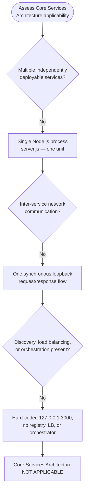

For completeness, traceability, and clear cross-referencing, the remaining subsections document each area enumerated for a Core Services Architecture and record, with evidence, why each is not applicable to this single-process system: **6.1.2 Service Components** (boundaries, communication, discovery, load balancing, circuit breaking, retry/fallback), **6.1.3 Scalability Design** (horizontal/vertical scaling, auto-scaling, resource allocation, performance optimization, capacity planning), and **6.1.4 Resilience Patterns** (fault tolerance, disaster recovery, data redundancy, failover, service degradation). The accompanying diagrams depict the system's actual minimal topology rather than any hypothetical multi-service design.

### 6.1.2 Service Components

In a Core Services Architecture, this subsection would define the boundaries and responsibilities of each service, the protocols by which services communicate, how they discover one another, how traffic is balanced across them, and how they protect themselves with circuit breakers and retry/fallback logic. **None of these apply to `hao-backprop-test`, because the system comprises exactly one runtime component** — the F-001 HTTP "Hello, World!" Response Service in `server.js` — and it makes no outbound calls to any peer (Sections 5.1.1, 5.2.1). Each concern is addressed below with the observed reality.

| Service-Component Concern | Status | Observed Reality in `hao-backprop-test` | Evidence |
|---|---|---|---|
| Service boundaries & responsibilities | Single component | One executable unit (F-001, `server.js`) owns bind, request handling, and response; the sole boundary is the local host (loopback) | Sections 5.1.1, 5.2.1 |
| Inter-service communication patterns | Not applicable | No second service exists; one synchronous HTTP/1.1 request/response over a loopback socket; no message bus, RPC, or event stream | Sections 5.1.3, 1.2.1 |
| Service discovery mechanisms | Not applicable | Endpoint hard-coded as constants `hostname='127.0.0.1'` / `port=3000`; no registry, DNS-SD, or environment lookup | `server.js` (lines 3–4); Section 2.4.1 |
| Load balancing strategy | Not present | Single process binds one port; "no load balancer, no reverse proxy"; a second bind to port 3000 yields `EADDRINUSE` | Sections 5.2.1, 2.4.1 |
| Circuit breaker patterns | Not present | No downstream dependency to protect; the code "defines no ... circuit-breaker ... logic" | Section 5.4.3 |
| Retry & fallback mechanisms | Not present | The handler is a single unconditional path; the code defines "no retry, fallback ... logic" | Sections 5.4.3, 5.1.1 |

#### 6.1.2.1 Service Boundaries and Responsibilities

The system's only boundary is the **local host**, enforced by the loopback bind (`127.0.0.1`), so no request ever crosses a network boundary (Section 5.1.1). Within that boundary a single component holds all responsibilities: F-001 accepts a TCP connection, delegates HTTP framing to Node's built-in `http` module, and unconditionally emits the fixed 14-byte body regardless of method, path, query, headers, or body (Section 5.2.1). There is no controller/service/repository layering and no decomposition into cooperating services; the "system" and the "service" are the same single process.

#### 6.1.2.2 Communication, Discovery, and Load Balancing

Because there is only one process, there is **no inter-service communication** — the repository exhibits exactly one live data flow (the inbound request/response) and no inter-process message passing (Section 5.1.3). Consequently there is nothing to discover: the listening address is a compile-time constant, not resolved through a registry or configuration service. Traffic distribution is likewise absent — a single process listening on a single hard-coded port cannot be load-balanced, and no reverse proxy is present (Sections 5.2.1, 2.4.1). The only external actors are a **local client / test harness** and the **external "backprop" process**, both of which reach the same single endpoint; the backprop process additionally performs passive file-tree reads that involve no code-level API (Section 1.2.1).

#### 6.1.2.3 Circuit Breaking, Retry, and Fallback

Circuit breakers, retries, and fallbacks are resilience mechanisms for calls between services or to external dependencies. This system makes **no outbound calls of any kind**, so these mechanisms have nothing to guard. Section 5.4.3 confirms that `server.js` registers no `'error'` listener, wraps nothing in `try`/`catch`, and "defines no retry, fallback, circuit-breaker, or error-notification logic." The single request handler cannot fail on request content because it ignores all request attributes, so no compensating path is present or required.

**Diagram 6.1.2 — Service Interaction (Actual System).** The diagram shows the single service, its two inbound actors over the loopback socket, and the explicit absence of any peer services, brokers, registries, or load balancers downstream of the handler.

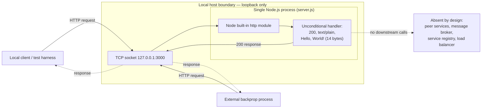

### 6.1.3 Scalability Design

A Core Services Architecture would describe how services scale horizontally and vertically, what triggers auto-scaling, how resources are allocated, which performance optimizations apply, and how capacity is planned. **`hao-backprop-test` is explicitly not designed to scale.** Section 2.4.1 states it is "Not designed to scale — one process, one hard-coded port, loopback-only bind, with no clustering or load balancing," and that "determinism is prioritized over throughput." Each scalability concern is recorded below against the observed implementation.

| Scalability Concern | Status | Observed Reality in `hao-backprop-test` | Evidence |
|---|---|---|---|
| Horizontal scaling approach | Not supported | No clustering (`cluster` / `worker_threads`), no replication; a second instance on port 3000 fails with `EADDRINUSE` | Sections 5.2.1, 2.4.1 |
| Vertical scaling approach | Not leveraged in code | Single-threaded event loop; no worker threads spawned, so extra CPU cores are not utilized by the process | Sections 5.2.1, 5.4.5 |
| Auto-scaling triggers & rules | Not applicable | No orchestrator, no metrics, and no autoscaler; there is no build/containerization/CI-CD to drive scaling | Sections 3.6.3, 3.6.4, 5.4.1 |
| Resource allocation strategy | None configured | No CPU/memory limits, no socket/request timeouts, and no connection-pool configuration; Node.js runtime defaults apply | Sections 5.4.5, 2.4.1 |
| Performance optimization techniques | Inherent only | Constant-time handler, no I/O, fixed 14-byte body; transport-level TCP keep-alive is a Node default (no configured app/HTTP cache) | Sections 5.1.3, 5.4.5 |
| Capacity planning guidelines | None defined | No SLAs, KPIs, latency budgets, or throughput targets are declared anywhere in the repository | Sections 1.2.3, 2.4.1 |

#### 6.1.3.1 Horizontal and Vertical Scaling

The runtime is a **single Node.js process on a single JavaScript execution thread, bound to one hard-coded port** (Section 5.2.1). Horizontal scaling is structurally precluded: there is no clustering, no reverse proxy or load balancer to fan requests across replicas, and "at most one instance can run per host per port 3000 — a second bind to 3000 yields `EADDRINUSE`" (Section 5.2.1). Vertical scaling is not leveraged either — because the process uses neither the `cluster` module nor `worker_threads`, additional CPU cores on a larger host would not be utilized; only a faster single core or more memory could marginally help, and neither is configured or required for the constant-time handler.

#### 6.1.3.2 Auto-Scaling, Resource Allocation, and Capacity Planning

There are **no auto-scaling triggers or rules** because there is no platform to enforce them: the repository contains no containerization, no Kubernetes/HPA, and no CI/CD (Sections 3.6.3, 3.6.4), and it emits no metrics that an autoscaler could consume (Section 5.4.1). Resource allocation is left entirely to Node.js defaults — the code sets no explicit socket or request timeouts, no memory/CPU ceilings, and no connection-pool sizing, so "throughput and concurrency behavior are governed entirely by Node's single-threaded event loop" (Section 5.4.5). Capacity planning is undefined: **no SLAs, KPIs, latency budgets, or throughput targets exist** in the repository, and any performance expectation would have to be supplied by the external consumer rather than by this artifact (Sections 1.2.3, 2.4.1).

#### 6.1.3.3 Performance Optimization

The only performance characteristics that can be stated factually derive from the handler's structure, not from any tuning or specification. The handler "performs no I/O and no computation beyond setting a status code, one header, and a constant body, so its per-request work is effectively constant-time," and the response body is a fixed 14 bytes (Section 5.4.5). The sole runtime reuse mechanism is **transport-level TCP keep-alive**, which Node's `http` server enables by default; this is runtime transport behavior, not a configured application or HTTP cache, and the handler emits no `Cache-Control`, `ETag`, or `Last-Modified` headers (Section 5.1.3). No further optimization technique (caching layer, compression, pooling, or batching) is present.

**Diagram 6.1.3 — Scalability Architecture (Actual vs. Absent Mechanisms).** The left grouping is the entire deployed reality; the right grouping enumerates the scaling mechanisms that are absent by design. The `EADDRINUSE` path shows why a naïve second instance adds no capacity.

```mermaid
flowchart TB
    subgraph Present["Present — actual runtime"]
        Host["Single host"]
        Proc["1 Node.js process<br/>1 event-loop thread"]
        Port["1 hard-coded port<br/>127.0.0.1:3000"]
        Host --> Proc
        Proc --> Port
    end
    subgraph Absent["Absent — no scaling mechanisms"]
        LB["Load balancer /<br/>reverse proxy"]
        Cluster["Process cluster /<br/>worker_threads"]
        Replicas["Horizontal replicas /<br/>autoscaler"]
        Metrics["Scaling metrics /<br/>autoscale triggers"]
    end
    Second["Second instance<br/>attempts port 3000"]
    Fail["EADDRINUSE →<br/>process exits;<br/>no capacity added"]
    Port -.->|"second bind"| Second
    Second -.-> Fail
```

### 6.1.4 Resilience Patterns

A Core Services Architecture would document fault tolerance, disaster recovery, data redundancy, failover, and service-degradation policies across its services. **`hao-backprop-test` implements none of these patterns**; consistent with its role as a deterministic test fixture, resilience exists only to the degree inherent in the Node.js runtime (Section 5.4). The single process is a **single point of failure**, and recovery is manual (Section 5.4.6). Each concern is recorded below.

| Resilience Concern | Status | Observed Reality in `hao-backprop-test` | Evidence |
|---|---|---|---|
| Fault tolerance mechanisms | Not implemented | No `'error'` listener and no `try`/`catch`; faults become uncaught exceptions that terminate the process | Section 5.4.3; `server.js` |
| Disaster recovery procedures | Manual only | No supervisor (PM2/`systemd`/orchestrator), no auto-restart; recovery is re-running `node server.js` | Section 5.4.6 |
| Data redundancy approach | Not applicable | Fully stateless; no database, cache, or persisted data, so there is nothing to replicate or back up | Sections 5.2.1, 5.4.6 |
| Failover configuration | None | Single process is a single point of failure; no standby, replica, or health-check remediation | Section 5.4.6 |
| Service degradation policies | None | Binary up/down behavior; no graceful degradation, rate limiting, or back-pressure; response is constant under any load | Sections 5.4.5, 2.4.1 |

#### 6.1.4.1 Fault Tolerance and Failover

Error handling is limited to **Node.js runtime defaults** — the application code registers none of its own (Section 5.4.3). A startup bind failure (for example `EADDRINUSE` when port 3000 is already in use) propagates as an **uncaught exception that terminates the process**, and unhandled runtime faults or signals while listening likewise terminate it, because no handler intercepts them (Section 5.4.3). There is no failover: the single Node.js process is a single point of failure, with no standby instance, no replica, and no health-check-driven remediation (Section 5.4.6). Malformed HTTP at the protocol layer is managed by Node's built-in `http` parser beneath the application, and once the handler is invoked it cannot fail on request content because it ignores all request attributes (Section 5.4.3).

#### 6.1.4.2 Disaster Recovery and Data Redundancy

Disaster recovery is **manual and minimal**: there is no process supervisor, no automatic restart, and no orchestrator restart policy, so "the only recovery action after a crash or termination is for an operator to re-run `node server.js`" (Section 5.4.6). Data redundancy does not apply — the service is **fully stateless and holds no persisted data**, so "there is correspondingly nothing to back up or restore" (Sections 5.2.1, 5.4.6). The only data at rest is the set of static files on disk (managed through Git), which the running server never reads or writes.

#### 6.1.4.3 Service Degradation Policies

There is **no service-degradation policy**. The system's availability is binary — the process is either listening and returning the fixed `200` response, or it has terminated — with no intermediate degraded mode, no shedding of load, no rate limiting, and no back-pressure handling in the code (Sections 5.4.5, 2.4.1). Because the handler performs constant-time work and returns a compile-time constant, its response does not vary with load; there is no fallback content or reduced-functionality path to fall back to.

**Diagram 6.1.4 — Resilience Pattern Implementations (Actual Posture).** The diagram traces the process lifecycle: a successful bind leads to a serving loop; any fault terminates the single-point-of-failure process, and — with no failover or auto-restart — recovery depends on a manual operator restart.

```mermaid
flowchart TD
    Run["node server.js"]
    Bind{"Bind 127.0.0.1:3000<br/>succeeds?"}
    Listen["Listening — single process<br/>(single point of failure)"]
    Serve["Serve fixed 200 response"]
    Fault{"Uncaught exception,<br/>signal, or EADDRINUSE?"}
    Crash["Process terminates<br/>no error listener / no try-catch"]
    NoFailover["No standby, no replica,<br/>no auto-restart, no failover"]
    Manual["Operator manually re-runs<br/>node server.js"]
    Run --> Bind
    Bind -->|Yes| Listen
    Bind -->|No| Crash
    Listen --> Serve
    Serve --> Fault
    Fault -->|No| Serve
    Fault -->|Yes| Crash
    Crash --> NoFailover
    NoFailover --> Manual
    Manual -.->|"manual recovery loop"| Run
```

### 6.1.5 References

The following repository artifacts and previously authored specification sections were examined as evidence for this section.

**Repository files and folders inspected:**

- `server.js` — Established the single-process runtime: built-in `http` module only, hard-coded loopback bind (`127.0.0.1:3000`), one unconditional `200`/`text/plain`/`Hello, World!\n` handler, and the absence of any `'error'` listener, retry, circuit-breaker, or clustering logic.
- `package.json` — Confirmed a zero-dependency package (`hello_world` v1.0.0) with a by-design failing `test` script and no service frameworks or libraries.
- `package-lock.json` — Confirmed an empty dependency tree (`lockfileVersion` 3), i.e., no third-party service, messaging, or orchestration libraries.
- `README.md` — Established project identity and purpose: a "test project for backprop integration" with a "Do not touch!" stability constraint.
- `LoginTest.java` — Confirmed a non-compilable Java stub (stray `Web` token) that is not a service and does not communicate with the Node.js process.
- Repository root (`/`) — Confirmed a flat repository with no service, orchestration, or configuration directories (verified via folder listing and a semantic search that returned no orchestration/load-balancer/message-queue/service-discovery artifacts).

**Cross-referenced Technical Specification sections:**

- `1.2 System Overview` — Internal test-artifact positioning, single HTTP-server capability, absence of external integrations, and the determinism/reproducibility/stability success criteria (no SLAs/KPIs).
- `1.3 Scope` — System boundary as "a single Node.js process bound to loopback"; explicit out-of-scope exclusion of routing, persistence, TLS, containerization, external services/APIs/message brokers, and production/public-network use.
- `2.4 Implementation Considerations` — "Not designed to scale — one process, one hard-coded port, loopback-only bind, with no clustering or load balancing"; determinism prioritized over throughput.
- `3.6 Development & Deployment` — Absence of build system, containerization, and CI/CD; single local Node.js process deployment model with no automation.
- `5.1 High-Level Architecture` — "Single-process, single-responsibility HTTP service"/"minimal monolith"; one live data flow; no message bus, data tier, or networked third-party services.
- `5.2 Component Details` — Component decomposition (F-001–F-005) and F-001 scaling considerations: single thread/port, no clustering, no load balancer, no reverse proxy, no replication; `EADDRINUSE` on second bind.
- `5.4 Cross-Cutting Concerns` — Runtime-default-only error handling ("no retry, fallback, circuit-breaker, or error-notification logic"); manual-only disaster recovery; single point of failure; stateless (nothing to back up).

## 6.2 Database Design

### 6.2.1 Applicability Assessment

This subsection evaluates whether the `hao-backprop-test` repository contains — or requires — a database, persistent datastore, or managed storage tier that a Database Design would describe.

**Database Design is not applicable to this system.**

The repository contains no database of any kind (relational, document, key-value, graph, or embedded), no object- or cloud-storage service, and no caching store. Its only functional runtime is the minimal `server.js`, a single Node.js process that requires only the built-in `http` module (`server.js` line 1), binds loopback `127.0.0.1:3000` (`server.js` lines 3–4), and returns a fixed `HTTP 200` / `text/plain` / `Hello, World!\n` (14-byte) response to every request while holding no state and performing no reads or writes. The dependency tree is empty — `package.json` declares no `dependencies`, and `package-lock.json` (`lockfileVersion` 3) records zero installed modules — so no database driver, ORM, query builder, migration tool, or cache client (for example `pg`, `mysql`, `mongodb`, `sqlite3`, `redis`, `sequelize`, `typeorm`, `prisma`, `mongoose`, or `knex`) is present. The repository is flat, containing no `db/`, `models/`, `migrations/`, `schema/`, or `config/` directories.

These findings are corroborated by three already-authored sections. Section 3.5 (Databases & Storage) states the repository uses "no database and no caching or storage service"; Section 6.1.4.2 records that the service is "fully stateless and holds no persisted data," so "there is correspondingly nothing to back up or restore"; and Section 1.3.2 (Out-of-Scope) explicitly excludes "Data persistence, databases, or programmatic consumption of `industry.csv` (no code in the repository reads the file)."

The only "data at rest" the repository owns is a small set of static files tracked in Git — most notably `industry.csv`, a 749-byte controlled-vocabulary list — none of which is opened by any code at runtime (Section 3.5.2). This is version-controlled reference and sample data, not a live datastore.

The absence is deliberate rather than incidental. `README.md` identifies the repository as a "test project for backprop integration" carrying a "Do not touch!" instruction, and Section 1.2.3 establishes that the fixture's value derives from determinism, reproducibility, and stability rather than feature richness. A stateless, dependency-free response path is the simplest structure that preserves those properties, so a persistence tier would add nothing.

The table below evaluates each prerequisite of a Database Design against the repository's observed contents; every prerequisite evaluates to "No."

| Database-Design Prerequisite | Present? | Evidence |
|---|---|---|
| Database engine (RDBMS / NoSQL / embedded) | No | Empty dependency tree; no driver in `package-lock.json`; Section 3.5.1 "Databases — None" |
| Database driver / ORM / query builder | No | `package.json` declares zero dependencies; `server.js` requires only `http` |
| Schema, data-model, or entity definitions (DDL / models) | No | Flat repo — no `models/`, `schema/`, or DDL files |
| Migration / seeding tooling | No | No Flyway / Liquibase / Knex / Prisma / Sequelize / Alembic; no `migrations/` directory |
| Connection configuration (string / pool / host) | No | No `.env` or config files (Section 3.6.1); `server.js` opens no connection |
| Caching or storage service (Redis, S3, etc.) | No | Sections 3.5.3 "Caching — None" and 3.5.4 "Storage Services — None" |
| Runtime persistent read/write of data | No | `server.js` performs no `fs` or DB I/O; every request returns a constant response |

**Diagram 6.2.1 — Database Design Applicability Decision.** The evaluation path below shows how the non-applicability determination is reached from the observed evidence.

```mermaid
flowchart TD
    Start(["Assess Database Design applicability"])
    Q1{"Any database engine or driver<br/>in the dependency tree?"}
    Empty["Empty dependency tree<br/>package-lock.json: 0 modules"]
    Q2{"Any schema, model, or<br/>migration artifacts?"}
    Flat["Flat repo — no db/, models/,<br/>migrations/, or schema files"]
    Q3{"Does runtime code read or<br/>write persistent data?"}
    Stateless["server.js requires only 'http';<br/>constant response, no I/O"]
    Q4{"Any cache or storage<br/>service integrated?"}
    NoStore["No cache / object store<br/>(Sections 3.5.3, 3.5.4)"]
    Result["Database Design<br/>NOT APPLICABLE"]
    Start --> Q1
    Q1 -->|No| Empty
    Empty --> Q2
    Q2 -->|No| Flat
    Flat --> Q3
    Q3 -->|No| Stateless
    Stateless --> Q4
    Q4 -->|No| NoStore
    NoStore --> Result
```

For completeness and traceability, the remaining subsections document each area a Database Design would normally cover — 6.2.2 Schema Design, 6.2.3 Data Management, 6.2.4 Compliance Considerations, and 6.2.5 Performance Optimization — and record, with evidence, why each is not applicable to this stateless, storage-free system. The required schema (ERD), data-flow, and replication diagrams accordingly depict the system's actual data landscape — a handful of static, code-inert files under version control — rather than any hypothetical database design.

### 6.2.2 Schema Design

Because the system has no database (Section 6.2.1), it defines no relational, document, or object schema — there are no tables, collections, entities, keys, indexes, constraints, partitions, or replicas. This subsection documents each schema-design concern enumerated for a Database Design and records, with evidence, why it is not applicable. The single item of genuinely *structured* data in the repository is the static `industry.csv` controlled-vocabulary file (Section 1.3.1); it is modelled below for completeness, with the explicit caveat that it is a version-controlled flat file — not a database object — and is never loaded by any code (Section 3.5.2).

| Schema-Design Concern | Status | Evidence |
|---|---|---|
| Entity relationships | None | No datastore; one standalone static file with no foreign keys or joins (Section 3.5.1) |
| Data models & structures | Flat file only | Single-column CSV vocabulary; no DB schema or typed models (Section 3.5.2) |
| Indexing strategy | Not applicable | No engine to index; a consumer would linearly scan the 749-byte file |
| Partitioning approach | Not applicable | Single 749-byte file; no shard/partition key (Section 2.4) |
| Replication configuration | None | No datastore to replicate; only Git history/clones (Section 3.6.1) |
| Backup architecture | Git only | No DB backup/snapshot/PITR; version control is the sole copy mechanism (Section 6.1.4.2) |

#### 6.2.2.1 Entity Relationships and Data Models

There are no entities or relationships in the database sense because there is no database. The only structured data domain is the industry-classification vocabulary in `industry.csv` — a single column headed `Industry` followed by 43 category values, 21 of which contain a `/` character (for example `Accounting/Finance` and `Government/Military`). It has no primary key, no foreign keys, no relationships to any other artifact, and no code that reads it (Sections 3.5.2, 1.3.2). Modelled as a degenerate single-"entity" reference vocabulary purely to visualise its shape, it appears as follows; the accompanying binaries (`100Pages.pdf`, `demo.jpg`, `sample.doc`) are unstructured, and the placeholders (`test.py.txt`, `test.txt.txt`) are empty, so none of them carries a schema.

**Diagram 6.2.2 — Reference-Data "ERD" (Sole Structured Domain).** This entity-relationship diagram represents the static `industry.csv` file, not a database table: it has one field, no key, no index, no constraint, and no relationship to any other entity.

```mermaid
erDiagram
    INDUSTRY_VOCABULARY {
        string industry_category "43 fixed values; header row 'Industry'; 21 contain a slash; no key, no index, no constraint"
    }
```

#### 6.2.2.2 Indexing, Partitioning, and Constraints

The output requirements call for all indexes and constraints to be documented; for this system the complete and accurate statement is that there are none. With no database engine there is no index structure of any kind — no primary-key index, secondary index, composite index, unique index, full-text index, or covering index — and nothing that could build or maintain one. Likewise there are no integrity constraints (no `PRIMARY KEY`, `FOREIGN KEY`, `UNIQUE`, `NOT NULL`, `CHECK`, or `DEFAULT`), because constraints are properties of a schema that does not exist. The `industry.csv` values function as a latent controlled vocabulary with an implicit `Other` catch-all, but nothing in the repository enforces membership (Sections 2.4, 1.3.2). Partitioning and sharding are equally inapplicable: the sole structured file is 749 bytes in one physical file, so there is no partition key, no shard map, no range/hash/list partitioning, and no tablespace layout to describe.

The tables below make the "documented indexes and constraints" explicit.

| Index Type | Defined? |
|---|---|
| Primary-key / clustered index | None — no database |
| Secondary / composite / unique index | None — no database |
| Full-text / covering / partial index | None — no database |

| Constraint Type | Defined? |
|---|---|
| PRIMARY KEY / FOREIGN KEY | None — no schema |
| UNIQUE / NOT NULL / CHECK / DEFAULT | None — no schema |
| Application-enforced vocabulary constraint | None — `industry.csv` is not read or validated by code |

#### 6.2.2.3 Replication and Backup Architecture

There is no data-tier replication. Because no database, cache, or persisted runtime state exists (Section 6.1.4.2), there is no primary/replica topology, no replica set or quorum, no streaming or logical replication, and no read-replica fan-out. The only redundancy mechanism that touches the repository's files is **version control**: the working tree is tracked in Git as a single commit (`508d41a`, "Add files via upload") on branches including `main` and `windows-Container-06-july-branch`, and any `git clone` / `git push` produces additional full-history copies (Section 3.6.1). That is source-control distribution, not database replication, and it applies to static files rather than to live data.

Backup architecture is correspondingly minimal. There is no database backup tooling — no logical dumps (`pg_dump` / `mysqldump` / `mongodump`), no physical snapshots, and no point-in-time recovery — because there is no datastore to capture. The static files' only "backup" is their Git history and any remote clones; the running server holds nothing to back up or restore (Section 6.1.4.2).

**Diagram 6.2.3 — Replication Posture (Version Control vs. Absent Database Replication).** The left grouping is the only copy mechanism that exists (Git version control of static files); the right grouping enumerates the database-replication mechanisms that are absent by design.

```mermaid
flowchart TB
    Note["server.js is stateless —<br/>no datastore exists to replicate"]
    subgraph Present["Present: version control only (NOT data-tier replication)"]
        Work["Single working-tree copy<br/>of static files on local disk"]
        GitLocal["Local Git repository<br/>single commit 508d41a"]
        Remote["Git remote / clones<br/>full-history copies"]
        Work --> GitLocal
        GitLocal -.->|"git push / clone"| Remote
    end
    subgraph Absent["Absent: no database replication"]
        Primary["Primary / writer node"]
        Replica["Read replica / hot standby"]
        RSet["Replica set / quorum"]
        Stream["Streaming / logical replication"]
    end
    Note --> Work
    Note -.->|"none configured"| Primary
```

### 6.2.3 Data Management

Data management concerns the movement, versioning, retention, and retrieval of data over time. Because the system persists no data and reads none at runtime (Sections 6.2.1, 3.5.2), these concerns reduce to how the repository's static files are managed on disk and under version control. Each item is recorded below.

| Data-Management Concern | Status | Evidence |
|---|---|---|
| Migration procedures | Not applicable | No schema to migrate; no migration tool or `migrations/` directory (Section 3.6.2) |
| Versioning strategy | Git only | Files versioned in Git; package pinned at v1.0.0; no schema/data versioning (Section 3.6.1) |
| Archival policies | None | No archival tier, TTL, or cold storage; static files retained in Git indefinitely |
| Data storage & retrieval | Static files | Local-disk files managed by Git; not read or written by the server (Section 3.5.2) |
| Caching policies | None | No cache layer; constant response; no cache headers (Sections 3.5.3, 6.1.3.3) |

#### 6.2.3.1 Migration, Versioning, and Archival

There are no database migration procedures because there is no schema to evolve. The repository contains no migration framework or directory — no Flyway, Liquibase, Alembic, Knex, Prisma Migrate, or Sequelize migrations — and no build or bootstrap step that would apply one (Section 3.6.2). The `npm test` script is a placeholder that fails by design, and no runnable entry point beyond `server.js` exists (the `main` field points to a missing `index.js`), so there is no lifecycle hook where a migration could run.

Versioning is handled entirely by **Git**, the only development infrastructure present (Section 3.6.1): the tree sits in a single commit (`508d41a`) across branches `main` and `windows-Container-06-july-branch`. There is no schema versioning, no data-format version field, and no migration history; the only declared version is the package identity `hello_world` `1.0.0` in `package.json`. The `industry.csv` vocabulary is itself unversioned data — any change to it would be tracked as an ordinary file diff in Git, not through a data-versioning mechanism.

Archival is likewise absent. There is no archival tier, no time-to-live (TTL), no retention window, no cold-storage export, and no purge or rotation job. The static files — `industry.csv`, the inert binaries (`100Pages.pdf`, `demo.jpg`, `sample.doc`), and the empty placeholders (`test.py.txt`, `test.txt.txt`) — simply remain in the working tree and Git history indefinitely; nothing ages them out or moves them to a separate store.

#### 6.2.3.2 Data Storage, Retrieval, and Caching

The storage model is **static files on the local filesystem, managed through version control** (Section 3.5.2). No runtime storage engine is involved: `server.js` performs no `fs` operations and opens no file, so there is no read path, no write path, and no query path. If a future consumer ever needed the industry vocabulary, the retrieval mechanism would be a whole-file read of the 749-byte CSV followed by line-wise parsing (treating each line as one field, since 21 values contain `/`) — but no such consumer exists in the repository today (Sections 3.5.2, 1.3.2).

Caching policies are equally absent. There is no in-memory cache, no HTTP response cache, and no external cache service such as Redis or Memcached (Section 3.5.3). The handler returns a compile-time constant and emits no `Cache-Control`, `ETag`, or `Last-Modified` headers, so nothing is cached at the application or protocol layer; the only reuse present is transport-level TCP keep-alive, which is a Node.js default rather than a configured cache (Section 6.1.3.3). Caching is examined further as a performance concern in Section 6.2.5.

**Diagram 6.2.4 — Data Flow (Stateless Runtime vs. Code-Inert Files at Rest).** The runtime path is entirely in-process; the static files are tracked in Git but are never read or written by the server, so there is no persistence edge between them.

```mermaid
flowchart LR
    Client["Local client /<br/>backprop process"]
    subgraph Runtime["Runtime path — volatile, in-process only"]
        HTTP["Node built-in<br/>http module"]
        Handler["Handler: 200, text/plain,<br/>Hello World (14 bytes)"]
        HTTP --> Handler
    end
    subgraph AtRest["Data at rest — static files (Git-tracked, code-inert)"]
        CSV["industry.csv (749 B)"]
        Bin["100Pages.pdf, demo.jpg,<br/>sample.doc (inert binaries)"]
        Empty["test.py.txt, test.txt.txt (0 B)"]
    end
    Client -->|"HTTP request"| HTTP
    Handler -.->|"200 response"| Client
    Handler -.->|"no read / no write"| CSV
```

### 6.2.4 Compliance Considerations

Compliance considerations for a Database Design address how stored data is retained, protected, kept private, audited, and access-controlled. This system stores no application data in any datastore, collects no personal data, and exposes no data-access surface (Sections 6.2.1, 5.4.4), so there are no data-tier compliance controls to configure. Each concern is recorded below against the observed reality, with the file-level and network-level mechanisms that do exist noted for accuracy.

| Compliance Concern | Status | Evidence |
|---|---|---|
| Data retention rules | None defined | No datastore and no PII; static reference data kept indefinitely in Git |
| Backup & fault tolerance | Git / manual only | Stateless service — nothing to back up; single point of failure, manual restart (Section 6.1.4) |
| Privacy controls | Not required | No personal data collected or stored; server processes no request content (Section 5.4.4) |
| Audit mechanisms | Minimal | One startup `console.log`; no data-access log; Git history is the only change trail (Section 5.4.2) |
| Access controls | Network + OS only | No DB users/roles/grants; loopback bind + OS file permissions are the only controls (Section 5.4.4) |

#### 6.2.4.1 Data Retention and Privacy

There are no data-retention rules because there is no data tier and no personal or transactional data to retain. The server keeps nothing between requests, and the only data at rest is static, non-personal reference content (`industry.csv`) plus inert sample binaries; these are kept indefinitely in the Git working tree with no retention schedule, expiry, or deletion policy. No regulated data categories (PII, PHI, PCI, and the like) are present, so no retention obligation attaches.

Privacy controls are correspondingly unnecessary. The system collects, processes, and stores no personal data: the request handler ignores all request attributes (method, path, query, headers, body) and returns a constant response, so no user input is captured, logged, or persisted (Section 5.4.4). There is no encryption-at-rest configuration, no field-level masking, no tokenisation, and no consent or subject-access machinery — none is required because there is neither personal data nor a datastore. The `industry.csv` vocabulary is public, non-personal classification data.

#### 6.2.4.2 Backup, Fault Tolerance, and Audit

Backup and fault-tolerance policies at the data tier do not exist because the service is stateless and holds no persisted data — "there is correspondingly nothing to back up or restore" (Section 6.1.4.2). The static files' only durability mechanism is Git history and any remote clones. For availability, the single Node.js process is a single point of failure with no supervisor, auto-restart, replica, or failover; recovery after a crash is a manual re-run of `node server.js` (Section 6.1.4). No fault-tolerance guarantees, RPO/RTO targets, or backup schedules are declared anywhere in the repository.

Audit mechanisms are minimal and are not data-oriented. The application emits exactly one log line at startup — `Server running at http://127.0.0.1:3000/` via `console.log` — and produces no per-request access log, no structured (JSON) audit records, no correlation/trace identifiers, and no data-change log (Section 5.4.2). The only change-audit trail for the repository's contents is the **Git commit history** (a single commit, `508d41a`, "Add files via upload"), which records file changes rather than runtime data access. There is no tamper-evident logging, log retention, or SIEM integration.

#### 6.2.4.3 Access Controls

There are no database access controls — no database users, roles, grants, row-/column-level security, or schema privileges — because there is no database. Authentication and authorization are absent from the application entirely: there are no credentials, tokens, sessions, API keys, or role checks anywhere in the codebase, and every request is served identically without any notion of identity (Section 5.4.4). The presence of `LoginTest.java` is incidental — it is a non-compilable stub that implements no login logic (Section 5.4.4).

The only access controls actually in effect sit outside the (absent) data tier:

| Control Layer | Mechanism | Evidence |
|---|---|---|
| Network reachability | Loopback bind `127.0.0.1:3000` limits access to same-host processes | Section 5.4.4; `server.js` lines 3–4 |
| Filesystem access | Ordinary OS file permissions on the static files (mode `0644`) | Repository file inspection |
| Data-tier authorization | None — no database, so no roles or grants exist | Section 6.2.1 |

### 6.2.5 Performance Optimization

Performance optimization for a Database Design concerns how queries, connections, and workloads against a datastore are tuned. This system issues no queries, opens no connections to any datastore, and processes no data workloads (Section 6.2.1), so none of these optimizations apply. For accuracy, the runtime performance characteristics that *do* exist are stated as observed properties — not as commitments — since no SLAs, KPIs, latency budgets, or throughput targets are defined anywhere in the repository (Sections 5.4.5, 1.2.3).

| Performance Concern | Status | Evidence |
|---|---|---|
| Query optimization patterns | Not applicable | No query engine and no queries; nothing to plan, index, or tune (Section 6.2.1) |
| Caching strategy | None | No app/HTTP cache; only Node-default TCP keep-alive; no cache headers (Section 6.1.3.3) |
| Connection pooling | None | No datastore connections to pool; no pool sizing configured (Section 6.1.3.2) |
| Read/write splitting | Not applicable | No datastore reads/writes; no primary/replica to route across (Section 6.2.2) |
| Batch processing approach | None | No batch/ETL/bulk jobs; single synchronous request/response (Section 4.1) |

#### 6.2.5.1 Query, Caching, and Connection Strategies

Query optimization has no substrate: with no database there are no SQL or NoSQL queries, no execution plans, no query cache, no index tuning, no denormalization decisions, and no N+1 concerns to mitigate. The only "lookup" the domain could involve — resolving an industry category from `industry.csv` — is not implemented in any code (Section 3.5.2); were it added, it would be a linear scan of a 749-byte file rather than an optimizable query.

Caching strategy is likewise empty at every layer. There is no application cache, no query/result cache, no distributed cache (Redis/Memcached), and no HTTP response cache; the handler returns a compile-time constant and sets no `Cache-Control`, `ETag`, or `Last-Modified` headers (Sections 3.5.3, 6.1.3.3). The single reuse mechanism present is transport-level **TCP keep-alive**, which Node's `http` server enables by default — a runtime transport behavior, not a configured cache.

Connection pooling does not apply because there are no outbound connections to manage: the server opens no database, cache, or third-party connections and configures no pool size, acquisition timeout, or idle-eviction policy (Section 6.1.3.2). Inbound TCP concurrency is governed entirely by Node's single-threaded event loop with runtime-default socket handling; no connection limits or timeouts are set in code (Section 5.4.5).

#### 6.2.5.2 Read/Write Splitting and Batch Processing

Read/write splitting is inapplicable on two counts: the application performs no datastore reads or writes at all, and there is no primary/replica topology across which traffic could be routed (Sections 6.2.1, 6.2.2). There is no read-replica endpoint, no write-master routing, no CQRS separation, and no eventual-consistency handling — none of the structures that read/write splitting presupposes exist.

Batch processing is equally absent. The system's only workload is a single synchronous HTTP request/response that returns a fixed 14-byte body (Section 4.1); there are no batch jobs, ETL pipelines, bulk-load/`COPY` operations, scheduled cron tasks, queue workers, or stream processors. Each request is handled independently in constant time with no accumulation, buffering, or deferred processing, so there is no batching window or throughput-oriented bulk path to optimize.

### 6.2.6 References

The following repository artifacts and previously authored specification sections were examined as evidence for this section.

**Repository files and folders inspected:**

- `server.js` — Established the stateless runtime: sole `require('http')` (line 1), hard-coded loopback bind `127.0.0.1:3000` (lines 3–4), and one constant `200`/`text/plain`/`Hello, World!\n` (14-byte) response. Confirmed no `fs` or database I/O, no connection handling, and no persisted state.
- `package.json` — Confirmed zero declared dependencies and the package identity `hello_world` v1.0.0 (no database driver, ORM, migration tool, or cache client), plus the by-design failing `test` script and the `main` → missing `index.js` mismatch.
- `package-lock.json` — Confirmed an empty dependency tree (`lockfileVersion` 3, no installed modules), i.e., no persistence, caching, or query libraries anywhere in the graph.
- `industry.csv` — Established the only structured data domain: a 749-byte single-column vocabulary headed `Industry` with 43 category values (21 containing `/`), with no key/index/constraint/relationship and no runtime consumer.
- `LoginTest.java` — Confirmed a non-compilable Java stub (stray `Web` token) with no JDBC/JPA or database access; incidental to the (absent) access-control discussion.
- `README.md` — Established the fixture's identity and intent: a "test project for backprop integration" with a "Do not touch!" stability constraint.
- `100Pages.pdf`, `demo.jpg`, `sample.doc` — Confirmed inert, unstructured binary artifacts at rest that carry no schema and are not read by any code.
- `test.py.txt`, `test.txt.txt` — Confirmed empty (0-byte) placeholder files with no data or schema.
- Repository root (`/`) — Confirmed a flat repository with no `db/`, `models/`, `migrations/`, `schema/`, or `config/` directories and no `.env`, verified via recursive directory listing.

**Cross-referenced Technical Specification sections:**

- `1.2 System Overview` — Determinism, reproducibility, and stability as the success criteria, with no SLAs/KPIs that a data tier would serve.
- `1.3 Scope` — Section 1.3.1 identifies the `industry.csv` vocabulary as the only data domain; Section 1.3.2 explicitly places "Data persistence, databases, or programmatic consumption of `industry.csv`" out of scope.
- `2.4 Implementation Considerations` — "Not designed to scale"; no persistence; the industry vocabulary is a latent, unenforced controlled list.
- `3.5 Databases & Storage` — "No database and no caching or storage service"; static flat-file persistence model; "Databases — None," "Caching — None," and "Storage Services — None."
- `3.6 Development & Deployment` — Git as the only development infrastructure (single commit `508d41a`; branches `main` and `windows-Container-06-july-branch`); no build system, containerization, CI/CD, or `.env`.
- `4.1 System Workflows` — The single synchronous HTTP request/response workflow returning a fixed 14-byte body, used to establish the absence of batch/bulk data workloads.
- `5.4 Cross-Cutting Concerns` — Logging limited to one startup `console.log`; no authentication/authorization (loopback is the only network control); no SLAs; manual-only disaster recovery; stateless with nothing to back up.
- `6.1 Core Services Architecture` — Stateless single-point-of-failure design; "no database, cache, or persisted state"; "nothing to back up or restore"; no connection-pool configuration; only Node-default TCP keep-alive (no application/HTTP cache).

## 6.3 Integration Architecture

### 6.3.1 Integration Architecture Applicability

This section evaluates whether the `hao-backprop-test` repository integrates with any external systems or services — the precondition for an Integration Architecture. The determination is made from the repository's complete source (a flat set of files with no subdirectories) and is corroborated by the already-authored Sections 3.3 (Open Source Dependencies), 3.4 (Third-Party Services), 5.1 (High-Level Architecture), 5.4 (Cross-Cutting Concerns), and 6.1 (Core Services Architecture).

**Integration Architecture is not applicable for this system.**

The repository's entire runtime is a **single Node.js process** defined in `server.js`, which imports only the Node.js built-in `http` module (`server.js` line 1), binds one hard-coded loopback socket (`127.0.0.1:3000`; `server.js` lines 3–4), and returns a fixed `HTTP 200` / `text/plain` / `Hello, World!\n` response to every request while ignoring all request attributes (`server.js` lines 6–10). It **makes no outbound network calls**, holds no API keys or credentials, and integrates with no external API, authentication provider, message broker, cloud service, or database (Section 3.4). The dependency tree is **empty** — `package.json` declares no `dependencies`/`devDependencies` and `package-lock.json` records only the root package (Section 3.3) — so there is no third-party client library through which an integration could even occur.

Because the loopback-only bind makes the process reachable only from the same host, and because the handler neither calls out nor differentiates between requests, the system has **no integration surface in either direction**: it neither consumes an external service nor exposes a differentiated API contract to remote consumers. The concerns an Integration Architecture is meant to document — API design for external consumers, message/event processing across systems, and third-party/legacy connectivity — therefore have no substrate on which to exist here.

This minimalism is deliberate rather than incidental. `README.md` identifies the repository as a *"test project for backprop integration"* carrying a *"Do not touch!"* instruction, and Section 1.2.3 establishes that the artifact's value derives from **determinism, reproducibility, and stability** rather than connectivity. Notably, the single external relationship named anywhere in the repository — "backprop" — is **inverted** relative to a normal integration: the external backprop process *consumes this repository as a test target* rather than the repository calling a backprop service, and no client code, endpoint URL, or credential wires the code to it (Section 3.4.2).

The table below evaluates each prerequisite of an Integration Architecture against the repository's observed contents.

| Integration Prerequisite | Present? | Evidence |
|---|---|---|
| Outbound calls to external systems/APIs | No | `server.js` imports only `http`; no HTTP client, SDK, or outbound request (Section 3.4) |
| Inbound integration API (routes / contracts) | No | Single unconditional endpoint; no route table or content negotiation (Section 5.1.3) |
| Message broker / event / stream / batch | No | No broker, queue, stream, or batch code or configuration (Sections 3.4.1, 1.3.2) |
| Authentication / authorization / API keys | No | No auth of any kind; loopback bind is the only access control (Section 5.4.4) |
| API gateway / reverse proxy / load balancer | No | Single process on one port; none present (Sections 6.1, 5.2.1) |
| Third-party runtime dependencies | No | Empty dependency tree (`package.json`, `package-lock.json`; Section 3.3) |

Every prerequisite evaluates to "No," confirming the non-applicability determination.

**The single network-facing interface.** The one interface that does exist is the loopback HTTP endpoint `http://127.0.0.1:3000/` served by the `F-001` HTTP Response Service (`server.js`). It is a **self-contained request/response surface, not an integration**: it performs no routing, calls no downstream system, and returns a compile-time constant. A runtime check confirms that `GET`, `POST`, and `DELETE` to any path all yield the identical `200 text/plain` 14-byte body, so the endpoint exposes no resource model, versioned contract, or content negotiation that an external system could integrate against.

**Diagram 6.3.1 — Integration Landscape (Actual System).** The diagram shows the sole loopback interface, the inbound local actors, the inverted (passive) backprop touchpoint, the zero-fetch npm tooling path, and the integration mechanisms that are absent by design.

```mermaid
flowchart LR
    Client["Local client / test harness"]
    Backprop["External backprop process<br/>(consumes repo as test target)"]
    NPM["npm CLI + npm registry<br/>(build/tooling)"]
    Files["Repository file tree"]
    Manifest["package.json / package-lock.json"]
    subgraph Host["Local host boundary — loopback only"]
        Socket["TCP socket<br/>127.0.0.1:3000"]
        subgraph Proc["Single Node.js process (server.js)"]
            HTTP["Node built-in http module"]
            Handler["Unconditional handler:<br/>200, text/plain,<br/>Hello, World! (14 bytes)"]
        end
    end
    Absent["Absent by design:<br/>API gateway, auth server,<br/>message broker, third-party APIs,<br/>outbound service calls"]
    Client -->|"HTTP/1.1 request"| Socket
    Backprop -->|"HTTP/1.1 request"| Socket
    Backprop -.->|"passive file-tree reads<br/>(no code-level API)"| Files
    Socket --> HTTP
    HTTP --> Handler
    Handler -->|"200 response"| Socket
    NPM -.->|"zero-dependency install<br/>(no registry fetch)"| Manifest
    Handler -.->|"no outbound integration"| Absent
```

For completeness, traceability, and clear cross-referencing, the remaining subsections document each area enumerated for an Integration Architecture and record, with evidence, why each is not applicable to this single-process system: **6.3.2 API Design**, **6.3.3 Message Processing**, and **6.3.4 External Systems**. The accompanying diagrams depict the system's actual minimal interface rather than any hypothetical integrated design.

### 6.3.2 API Design

An API Design describes how external consumers discover, authenticate to, invoke, and version a service's endpoints. `hao-backprop-test` exposes exactly one HTTP interface, and it is deliberately contract-free: every request receives the same fixed response. There is consequently **no designed API in the conventional sense** — no resource model, no authentication, no versioning, and no published specification. Each API-design aspect enumerated for this section is recorded below against the observed implementation.

| API Design Aspect | Status | Observed Reality / Evidence |
|---|---|---|
| Protocol specification | Present (implicit) | HTTP/1.1 via Node built-in `http`; single loopback endpoint (`server.js`) |
| Authentication methods | None | No credentials/tokens/sessions; loopback bind only (Section 5.4.4) |
| Authorization framework | None | No roles/scopes/access checks; identical response to all (Section 5.4.4) |
| Rate limiting strategy | None | No throttling/quotas; no configured timeouts (Section 5.4.5) |
| Versioning approach | None | No route table, version prefix, or header; single path (Section 5.1.3) |
| Documentation standards | None | No OpenAPI/Swagger; `README.md` documents no endpoints (Section 1.2) |

#### 6.3.2.1 Protocol Specification and Endpoint Contract

The protocol is **HTTP/1.1 over a loopback TCP socket**, handled entirely by Node's built-in `http` module (`server.js` line 1); there is no web framework, no HTTPS/TLS, and no application-level protocol layered on top of HTTP (Section 5.1.1). The server presents **no route table**: the request handler (`server.js` lines 6–10) never inspects the method, path, query, headers, or body, so every request produces an identical result — a runtime check confirms that `GET`, `POST`, and `DELETE` against any path all return the same `200` / `text/plain` / 14-byte body. The only response fields set by application code are the status code, the `Content-Type` header, and the body; the remaining response headers (`Date`, `Connection`, `Keep-Alive`, `Content-Length`) are supplied by Node's `http` layer, and transport-level TCP keep-alive is enabled by default (Section 5.1.3).

The single endpoint's effective contract is summarized below (limited to three columns per the section's formatting standard).

| Endpoint Attribute | Specification | Evidence |
|---|---|---|
| Base URL | `http://127.0.0.1:3000/` (loopback only) | `server.js` lines 3–4, 12–14 |
| Transport / protocol | HTTP/1.1 over TCP (Node built-in `http`) | `server.js` lines 1, 6 |
| Methods accepted | Any method (never inspected) | `server.js` lines 6–10; runtime GET/POST/DELETE check |
| Path / routing | None — every path returns the same response | `server.js` lines 6–10 |
| Request body handling | None (body never read) | `server.js` lines 6–10 |
| Response status | `200 OK` (fixed) | `server.js` line 7 |
| Response Content-Type | `text/plain` | `server.js` line 8 |
| Response body | `Hello, World!\n` (14 bytes) | `server.js` line 9 |
| Default headers | `Date`, `Connection`, `Keep-Alive`, `Content-Length` (Node defaults) | Node `http` runtime (Section 5.1.3) |

**Diagram 6.3.2 — API Architecture (Layered View).** The diagram shows the local-only consumers, the loopback transport, Node's `http` core performing protocol handling, and the single application handler that emits the fixed response.

```mermaid
flowchart TB
    subgraph Consumers["API consumers (local host only)"]
        C1["Local client / test harness"]
        C2["External backprop process"]
    end
    subgraph Transport["Transport layer"]
        Loop["Loopback interface 127.0.0.1"]
        TCP["TCP socket :3000<br/>(TCP keep-alive default)"]
    end
    subgraph Runtime["Node.js runtime"]
        Core["Built-in http module<br/>(HTTP/1.1 parsing and framing)"]
        App["server.js request handler<br/>(single unconditional path)"]
    end
    Resp["Fixed response:<br/>200 OK, Content-Type text/plain,<br/>body Hello, World! (14 bytes)"]
    C1 --> Loop
    C2 --> Loop
    Loop --> TCP
    TCP --> Core
    Core --> App
    App --> Resp
    Resp --> TCP
```

**Diagram 6.3.3 — Request/Response Sequence (Key Flow).** The sequence traces a single request from a local consumer through the loopback socket and Node's `http` layer to the handler, which ignores all request attributes and returns the constant body.

```mermaid
sequenceDiagram
    participant Client as Local client or backprop
    participant Sock as Loopback socket 127.0.0.1 3000
    participant Http as Node built-in http module
    participant App as server.js handler
    Client->>Sock: Open TCP connection and send HTTP request
    Sock->>Http: Deliver bytes for HTTP parsing
    Http->>App: Invoke handler for any method or path
    Note over App: Request attributes are ignored
    App->>App: Set status 200 and Content-Type text/plain
    App-->>Http: res.end with Hello, World! body of 14 bytes
    Http-->>Sock: Serialize HTTP/1.1 response
    Sock-->>Client: 200 text/plain response
```

#### 6.3.2.2 Authentication, Authorization, and Rate Limiting

There is **no authentication and no authorization framework** of any kind: no credentials, tokens, sessions, API keys, roles, or access-control checks exist anywhere in the codebase, and every request is served identically without any notion of identity (Section 5.4.4). The presence of `LoginTest.java` is incidental — it is a non-compilable, isolated stub (a stray `Web` token in `main`) that implements no login logic and is unconnected to the Node.js runtime (Section 5.4.4). The only access control in effect is the **network-level loopback binding** (`127.0.0.1`), which restricts reachability to processes on the same host.

There is likewise **no rate-limiting strategy** — no throttling, quotas, connection caps, or back-pressure handling — and the code configures no socket or request timeouts, so only Node.js runtime defaults apply (Section 5.4.5). This absence is acceptable precisely because the loopback-only binding keeps the server unreachable from any network and the artifact is explicitly not intended for production or public-network use (Section 3.4.3).

#### 6.3.2.3 Versioning and Documentation Standards

No **API versioning approach** exists. Because there is a single unconditional response path and no route table, there is no URI version prefix (e.g., `/v1`), no version request header, and no media-type versioning or deprecation policy; the only version present anywhere is the package version `1.0.0` declared in `package.json`, which identifies the artifact rather than an API contract (Sections 5.1.3, 2.6). No **API documentation standard** is applied either: the repository contains no OpenAPI/Swagger specification, no API reference, and no schema, and `README.md` is two lines of project identity and handling instruction that document no endpoints (Section 1.2). The behavioral contract is therefore defined solely by the `server.js` source rather than by any published specification.

### 6.3.3 Message Processing

Message Processing describes how a system handles asynchronous work — events, queued messages, streams, and batch jobs — together with the error-handling strategy around them. `hao-backprop-test` performs **only synchronous, in-process request/response handling** and contains no asynchronous messaging infrastructure whatsoever. Each aspect enumerated for this section is recorded below against the observed implementation.

| Message-Processing Aspect | Status | Observed Reality / Evidence |
|---|---|---|
| Event processing patterns | None | Only the inline HTTP request callback; no pub/sub or event bus (`server.js`) |
| Message queue architecture | None | No broker/queue client or config; empty dependency tree (Sections 3.4.1, 3.3) |
| Stream processing design | None | Fixed constant response; no data transformation points (Section 5.1.3) |
| Batch processing flows | None | No scheduled/cron/batch jobs; `industry.csv` never read by code (Section 6.2) |
| Error handling strategy | Runtime defaults only | No error listener/try-catch/retry/fallback (Section 5.4.3) |

#### 6.3.3.1 Event, Queue, Stream, and Batch Processing

The system exhibits exactly **one live data flow** — a single synchronous HTTP request/response exchange over loopback — with no database read/write, no cache lookup, no outbound call, and no inter-process message passing anywhere in the flow (Section 5.1.3). Consequently:

- **Event processing patterns** — There is no event bus, publish/subscribe mechanism, or domain-event model. The only "event" is Node's per-connection HTTP request callback (`server.js` lines 6–10), which is handled inline and synchronously; the code registers no additional event listeners (not even an `'error'` listener) (Section 5.4.3).
- **Message queue architecture** — There is no message broker or queue (no Kafka, RabbitMQ, SQS, Redis, or comparable) client or configuration anywhere in the repository, and the empty dependency tree precludes one (Sections 3.4.1, 3.3).
- **Stream processing design** — There is no stream-processing pipeline. The response body is a compile-time constant, not a transformation of any input or data stream, and there are **no data transformation points** in the flow (Section 5.1.3).
- **Batch processing flows** — There are no scheduled, cron, or batch jobs. The static `industry.csv` vocabulary is never read by any code and participates in no batch pipeline (Sections 6.2, 1.3.2).

**Diagram 6.3.4 — Message Flow (Synchronous Only).** The diagram shows the sole synchronous request → handler → response path and the asynchronous messaging infrastructure that is absent by design.

```mermaid
flowchart LR
    In["Inbound HTTP/1.1 request<br/>(synchronous)"]
    Handler["server.js handler<br/>(constant-time, stateless)"]
    Out["Synchronous 200 response:<br/>Hello, World! (14 bytes)"]
    Absent["Absent messaging infrastructure:<br/>message queue/broker, event bus/pub-sub,<br/>stream processor, batch/scheduled jobs"]
    In --> Handler
    Handler --> Out
    Handler -.->|"no publish / enqueue / emit"| Absent
```

#### 6.3.3.2 Error Handling Strategy

Because there is no message processing, there is no message-level error-handling strategy — no dead-letter queue, no redelivery, and no compensating transaction. The error-handling posture that does exist governs the single synchronous request path and is limited to **Node.js runtime defaults**: `server.js` attaches no `'error'` listener, wraps nothing in `try`/`catch`, and defines no retry, fallback, circuit-breaker, or error-notification logic (Section 5.4.3). The consequences are:

- A **startup bind failure** (for example `EADDRINUSE` when port 3000 is already in use) propagates as an uncaught exception that terminates the process (Section 5.4.3).
- **Malformed HTTP** at the protocol layer is handled by Node's built-in `http` parser beneath the application; once the handler is invoked it cannot fail on request content because it ignores all request attributes (Section 5.4.3).
- **Recovery is manual** — there is no process supervisor or auto-restart, so an operator re-runs `node server.js` after a crash or termination (Section 5.4.6).

### 6.3.4 External Systems

External Systems documents how the repository connects to third parties, legacy systems, gateways, and formal service contracts. As established in Sections 3.4 and 5.1.4, the system integrates with **no networked third-party services** — there are no external APIs, authentication providers, message brokers, cloud services, or databases anywhere in the repository, and the loopback bind guarantees the process is unreachable beyond the local host. Each external-systems aspect enumerated for this section is recorded below.

| External-Systems Aspect | Status | Observed Reality / Evidence |
|---|---|---|
| Third-party integration patterns | None | Zero third-party services; no SDK or HTTP client (Section 3.4) |
| Legacy system interfaces | None | No adapters/connectors; `LoginTest.java` is an isolated stub (Section 5.4.4) |
| API gateway configuration | None | No gateway, reverse proxy, or load balancer (Sections 6.1, 5.2.1) |
| External service contracts | None | No proto/OpenAPI/WSDL; nothing to version or secure (Section 3.4.3) |

**External dependency inventory.** For completeness, all external touchpoints — none of which are runtime service integrations — are documented below (limited to three columns per the section's formatting standard).

| External Touchpoint | Nature | Integration Depth / Evidence |
|---|---|---|
| Local client / test harness | Inbound HTTP/1.1 request over loopback | Runtime; synchronous request → fixed response (Section 5.1.4) |
| External backprop process | Test-target consumption (inverted) plus passive file reads | No code-level API; intent-only linkage in `README.md` (Sections 3.4.2, 5.1.4) |
| npm CLI + npm registry | Build/tooling lifecycle | Declarative manifest; zero-dependency install performs no registry fetch (Section 5.1.4) |
| Runtime third-party dependencies | None | Empty dependency tree (`package-lock.json`; Section 3.3) |

**Diagram 6.3.5 — External Systems Context (Inverted Relationship).** The diagram emphasizes the direction of the sole external relationship: backprop drives the repository (as a test target) and reads its files passively, npm tooling touches only the manifests with no network fetch, and the server itself has no external egress.

```mermaid
flowchart TD
    subgraph Repo["hao-backprop-test repository (test target)"]
        Server["server.js — loopback HTTP endpoint<br/>127.0.0.1:3000"]
        Tree["Static file tree<br/>(industry.csv, LoginTest.java, placeholders)"]
        Pkg["package.json / package-lock.json<br/>(zero dependencies)"]
    end
    Backprop["External backprop process"]
    NPM["npm CLI + npm registry"]
    NoEgress["No external egress"]
    Backprop -->|"drives HTTP requests<br/>(consumes as test target)"| Server
    Backprop -->|"passive file-tree reads<br/>(no code-level API)"| Tree
    NPM -.->|"install: zero deps,<br/>no registry fetch"| Pkg
    Server -.->|"no outbound calls to<br/>third-party / legacy / gateway"| NoEgress
```

#### 6.3.4.1 Third-Party Integration Patterns and the Inverted "backprop" Relationship

There are **no third-party integration patterns** — no API client, SDK, adapter, or connector — because `server.js` imports only the built-in `http` module and the dependency tree is empty (Sections 3.4, 3.3). The only external relationship named anywhere in the repository is "backprop", and it is **inverted** relative to a normal service integration: as established in Section 3.4.2, the external backprop process *consumes this repository as a test target* rather than the repository calling out to a backprop service. There is no client code, endpoint URL, credential, or configuration that wires the code to backprop; the linkage exists only at the level of intent expressed in `README.md` (*"test project for backprop integration"*), and the backprop process itself is out of scope for this repository. Backprop's interaction is limited to (a) driving HTTP requests against the loopback endpoint and (b) passively reading the repository file tree, neither of which invokes a code-level integration API (Section 5.1.4).

A second, build-time touchpoint is the **npm CLI and npm registry**. This is a tooling-lifecycle relationship, not a runtime integration: `package.json`/`package-lock.json` declare a zero-dependency package, so `npm install`/`npm ci` performs no registry fetch and installs no modules (Sections 5.1.4, 3.3).

#### 6.3.4.2 Legacy System Interfaces, API Gateway, and Service Contracts

There are **no legacy system interfaces**. The repository contains no adapters, bridges, file-drop exchanges, or protocol shims to any legacy system. `LoginTest.java` — the only non-JavaScript source with runnable intent — is a non-compilable, isolated stub that implements no logic and is unconnected to the Node.js runtime (Sections 5.4.4, 6.1); it is not a legacy interface.

There is **no API gateway configuration**, and no reverse proxy or load balancer: the system is a single process bound directly to one hard-coded port, with no gateway, routing tier, or edge layer in front of it (Sections 6.1, 5.2.1). Requests reach `server.js` directly over the loopback socket.

Finally, there are **no external service contracts**. The repository defines no Protobuf/gRPC `.proto` files, no OpenAPI/Swagger documents, and no WSDL/XSD schemas, and it consumes none. As Section 3.4.3 concludes, because there are no third-party integrations there are no inter-service contracts to version or secure — a determination that eliminates the entire class of contract-management, compatibility, and credential-rotation concerns an Integration Architecture would otherwise address.

### 6.3.5 References

The following repository artifacts and previously authored specification sections were examined as evidence for this section.

**Repository files and folders inspected:**

- `server.js` — Established the single loopback HTTP interface: built-in `http` module only (line 1), hard-coded `127.0.0.1:3000` bind (lines 3–4), one unconditional `200` / `text/plain` / `Hello, World!\n` handler that ignores all request attributes (lines 6–10), and the absence of any routing, authentication, rate limiting, outbound call, or `'error'` listener.
- `package.json` — Confirmed the `hello_world` v1.0.0 package with **no `dependencies`/`devDependencies`**, i.e., no HTTP client, SDK, broker, or gateway library; the `1.0.0` value is the artifact version, not an API contract version.
- `package-lock.json` — Confirmed an empty dependency tree (`lockfileVersion` 3, root package only), precluding any third-party integration or messaging client.
- `README.md` — Established project identity and the intent-only, **inverted** "backprop" relationship (*"test project for backprop integration. Do not touch!"*).
- `LoginTest.java` — Confirmed a non-compilable, isolated Java stub (stray `Web` token) that implements no authentication or integration logic and is not a legacy interface.
- `industry.csv` — Confirmed a static controlled-vocabulary file never read by any code, participating in no batch or stream pipeline.
- `test.py.txt`, `test.txt.txt` — Confirmed empty placeholder artifacts with no integration role.
- Repository root — Confirmed a flat repository with no API gateway, reverse proxy, message-broker, service-contract, or integration-configuration directories (verified via folder listing and semantic searches that returned no API/auth/queue/gateway/external-integration artifacts).

**Cross-referenced Technical Specification sections:**

- `1.2 System Overview` — Internal test-artifact positioning; determinism/reproducibility/stability success criteria; absence of external integrations.
- `1.3 Scope` — Explicit out-of-scope exclusion of external services, APIs, message brokers, routing, TLS, and authentication.
- `2.6 Assumptions, Constraints, and Requirement Versioning` — Package version `1.0.0` as the artifact baseline.
- `3.3 Open Source Dependencies` — Empty dependency tree (zero third-party/OSS libraries).
- `3.4 Third-Party Services` — No third-party services of any kind; the inverted "backprop" relationship (Section 3.4.2); no inter-service contracts to version or secure (Section 3.4.3).
- `5.1 High-Level Architecture` — Single live synchronous data flow; the three integration patterns; External Integration Points; no route table; default TCP keep-alive (Section 5.1.3, 5.1.4).
- `5.2 Component Details` — Single process on one port; no reverse proxy or load balancer.
- `5.4 Cross-Cutting Concerns` — No authentication/authorization (Section 5.4.4); no rate limiting or configured timeouts (Section 5.4.5); runtime-default-only error handling (Section 5.4.3); manual recovery (Section 5.4.6).
- `6.1 Core Services Architecture` — Single-process minimal monolith; no gateway, broker, or inter-service communication.
- `6.2 Database Design` — No persistence or batch processing; `industry.csv` never read at runtime.

## 6.4 Security Architecture

### 6.4.1 Security Architecture Applicability Assessment

This subsection evaluates whether the `hao-backprop-test` repository implements — or requires — the authentication, authorization, and data-protection controls that a Security Architecture is intended to describe.

**Detailed Security Architecture is not applicable for this system.**

The repository's entire runtime is a **single Node.js process** defined in the 14-line `server.js`, which imports only the Node.js built-in `http` module (`server.js` line 1), binds one hard-coded loopback socket (`127.0.0.1:3000`; `server.js` lines 3–4), and returns a fixed `HTTP 200` / `text/plain` / `Hello, World!\n` (14-byte) response to every request while ignoring all request attributes (`server.js` lines 6–10). There is **no authentication, authorization, session management, token handling, password logic, or cryptography anywhere in the codebase**: a targeted search for the encrypted-transport (`https`), `tls`, and `crypto` core modules and for common security libraries (`bcrypt`, `jsonwebtoken`, `passport`, `helmet`, `express-session`) returns no matches. This confirms and extends Section 5.4.4, which records that "there is no authentication or authorization framework" and that "the only access control in effect is the network-level loopback binding."

The name of `LoginTest.java` is a red herring: despite it, the class implements no login functionality. It is a non-compilable, isolated Java stub whose `main` method contains only a stray `Web` token, it is unconnected to the Node.js runtime, and it contributes no security behavior whatsoever (Sections 5.4.4, 6.3.4.2).

The absence of a security architecture is deliberate rather than incidental. `README.md` identifies the repository as a *"test project for backprop integration"* carrying a *"Do not touch!"* instruction, and Section 1.2.3 establishes that its value derives from **determinism, reproducibility, and stability** rather than feature richness. Consistent with that intent, Section 1.3.2 explicitly places "HTTPS/TLS, sessions, or any security controls" **out of scope**, and Section 3.4.3 confirms the artifact is **not intended for production or public-network use**. Because a Security Architecture presupposes identities to authenticate, resources to authorize, and sensitive data to protect — none of which exist here — its constituent concerns have no substrate on which to exist.

The table below evaluates each prerequisite of a Security Architecture against the repository's observed contents.

| Security Architecture Prerequisite | Present? | Evidence |
|---|---|---|
| Identity store / user accounts / credentials | No | No identity provider or credential store; handler ignores all request attributes (`server.js` lines 6–10; Section 5.4.4) |
| Authentication mechanism (login, MFA, tokens, sessions) | No | No credentials, tokens, sessions, or API keys anywhere in the codebase (Section 5.4.4) |
| Authorization model (roles, permissions, policies) | No | No roles, scopes, or access-control checks; identical response to every caller (Section 5.4.4) |
| Cryptography (TLS, hashing, encryption, key management) | No | `server.js` requires only `http`; no `https`/`tls`/`crypto` module or crypto library present |
| Protected / sensitive data (PII, PHI, PCI, secrets) | No | Stateless service persists no data; only static, non-personal `industry.csv` at rest (Sections 6.2.1, 6.2.4.1) |
| Security tooling (WAF, IAM, secrets manager, SIEM) | No | Zero dependencies, no configuration, no CI/CD; single local process (Sections 3.3, 3.6) |

Every prerequisite evaluates to "No," confirming the non-applicability determination.

**Standard baseline security practices in effect.** Although no application-level security architecture exists, the fixture is not without a security posture. The following standard, defense-in-depth baseline practices are inherently in effect and constitute the controls the system relies on **instead of** a bespoke security architecture. Each is an observed property of the runtime, operating-system, network, and supply-chain posture rather than a claimed feature.

| Baseline Practice | Mechanism In Effect | Evidence |
|---|---|---|
| Network isolation (least exposure) | Loopback-only bind `127.0.0.1:3000` makes the process unreachable beyond the local host | `server.js` lines 3–4; Section 5.4.4 |
| Filesystem access control | Ordinary OS file permissions (mode `0644`) on all static files | Repository file inspection; Section 6.2.4.3 |
| Minimal supply-chain attack surface | Zero third-party dependencies — no external code to exploit or patch | `package.json`, `package-lock.json`; Section 3.3 |
| Least functionality | Constant handler reads no input and performs no I/O, so there is no injection or parsing surface | `server.js` lines 6–10; Section 5.4.4 |
| Source integrity / change audit | Git version control is the sole change-audit trail (commit `508d41a`) | Sections 3.6.1, 6.2.4.2 |
| Data minimization | No personal or transactional data is collected, processed, or stored | Sections 6.2.1, 6.2.4.1 |

**Consolidated security control matrix.** The matrix below summarizes the status of every control domain examined across the remainder of this section; the referenced subsections provide the supporting detail.

| Security Control Domain | Status | Control In Effect / Note |
|---|---|---|
| Authentication (identity, MFA, sessions, tokens, passwords) | Not implemented | Every request served anonymously and identically (Section 6.4.2) |
| Authorization (RBAC, permissions, resource authz, PEP) | Not implemented | No access-control decision point exists (Section 6.4.3) |
| Encryption in transit (TLS/HTTPS) | Not implemented | Plain HTTP on loopback; TLS out of scope (Sections 1.3.2, 6.4.4) |
| Encryption at rest / key management | Not applicable | No datastore or secrets; nothing to encrypt or key (Sections 6.2, 6.4.4) |
| Data masking / tokenization | Not applicable | No sensitive data to mask (Sections 6.2.4.1, 6.4.4) |
| Audit / security logging | Minimal | One startup `console.log`; no access or security log (Sections 5.4.2, 6.4.3) |
| Network access control | In effect | Loopback binding limits reach to same-host processes (Section 5.4.4) |
| Compliance controls (PII/PHI/PCI regimes) | None required | No regulated data; not production (Sections 6.2.4.1, 6.4.4) |

**Diagram 6.4.1 — Security Architecture Applicability Decision.** The evaluation path below shows how the non-applicability determination is reached from the observed evidence.

```mermaid
flowchart TD
    Start(["Assess Security Architecture applicability"])
    Q1{"Any identities, accounts,<br/>or credentials to authenticate?"}
    NoId["No identity store; handler<br/>ignores all request attributes"]
    Q2{"Any roles, permissions,<br/>or resources to authorize?"}
    NoAuthz["Identical response to every<br/>caller; no access checks"]
    Q3{"Any cryptography or<br/>sensitive data present?"}
    NoCrypto["Only built-in http; no https/tls/crypto;<br/>stateless, no sensitive data"]
    Baseline["Rely on baseline controls:<br/>loopback isolation, OS file perms,<br/>zero-dependency surface, Git integrity"]
    Result["Detailed Security Architecture<br/>NOT APPLICABLE"]
    Start --> Q1
    Q1 -->|No| NoId
    NoId --> Q2
    Q2 -->|No| NoAuthz
    NoAuthz --> Q3
    Q3 -->|No| NoCrypto
    NoCrypto --> Baseline
    Baseline --> Result
```

**Diagram 6.4.2 — Security Zone Diagram (Actual Trust Boundaries).** The diagram depicts the system's real trust zones: an untrusted external network that the loopback bind renders unreachable, the local-host trust boundary, the single Node.js process zone (plain HTTP with no authentication or authorization), and the data-at-rest zone protected only by OS file permissions.

```mermaid
flowchart TB
    subgraph External["Untrusted external network zone"]
        Remote["Remote / Internet clients"]
    end
    subgraph LocalHost["Local host trust boundary — same machine only"]
        Actors["Local client / test harness<br/>+ external backprop process"]
        Loop["Loopback interface<br/>127.0.0.1:3000<br/>(sole network access control)"]
        subgraph Proc["Node.js process security zone (server.js)"]
            HTTP["Built-in http module<br/>plain HTTP — no TLS"]
            Handler["Anonymous request handler<br/>200 / text/plain / 14 bytes<br/>no authN, no authZ"]
        end
        subgraph Rest["Data-at-rest zone — OS file permissions 0644"]
            Files["Static files: industry.csv,<br/>README.md, LoginTest.java, binaries"]
        end
    end
    Remote -.->|"no route — not externally bound"| Loop
    Actors -->|"HTTP/1.1 request over loopback"| Loop
    Loop --> HTTP
    HTTP --> Handler
    Handler -.->|"never reads or writes"| Files
```

For completeness and traceability, the remaining subsections document each area a Security Architecture would normally cover — **6.4.2 Authentication Framework**, **6.4.3 Authorization System**, and **6.4.4 Data Protection** — and record, with evidence, why each is not applicable to this anonymous, stateless, loopback-only system. The required authentication-flow and authorization-flow diagrams in those subsections depict the system's actual "no-op" security path rather than any hypothetical control design.

### 6.4.2 Authentication Framework

An Authentication Framework establishes how principals are identified, how additional factors strengthen that identity, and how the resulting authenticated state is carried and protected across requests. The section prompt enumerates five concerns — identity management, multi-factor authentication, session management, token handling, and password policies. **None of these are implemented in `hao-backprop-test`.** Every request reaching the loopback endpoint is served anonymously and identically, because `server.js`'s handler never inspects the request (`server.js` lines 6–10) and no credential, session, or token machinery exists anywhere in the codebase (Section 5.4.4). Each concern is recorded below against the observed implementation.

| Authentication Concern | Status | Evidence |
|---|---|---|
| Identity management | Not implemented | No user/account model, registration, or identity provider; requests are anonymous (Section 5.4.4) |
| Multi-factor authentication (MFA) | Not implemented | No primary factor exists, so no second factor; no OTP/TOTP/WebAuthn code or library |
| Session management | Not implemented | No cookies, session identifiers, or session store; handler is stateless (Sections 5.4.4, 6.2.1) |
| Token handling | Not implemented | No JWT/opaque/bearer tokens or API keys; no `jsonwebtoken` dependency (Section 3.3) |
| Password policies | Not implemented | No password field, storage, or hashing; no `bcrypt`/`scrypt`/`argon2`/PBKDF2 usage found |

**Diagram 6.4.3 — Authentication Flow (Actual — Anonymous, No Authentication).** The flow shows that the only gate a caller passes is loopback reachability; once the handler is invoked, no credential is extracted and no verification occurs before the fixed response is returned. The dashed branch enumerates the authentication steps that are absent by design.

```mermaid
flowchart TD
    Start["Inbound HTTP/1.1 request<br/>(any method / path / headers)"]
    Loop{"Reachable via loopback<br/>127.0.0.1:3000?"}
    Blocked["Unreachable — process not bound<br/>to any external interface"]
    Handler["server.js handler invoked"]
    NoCred["No credential / token / session<br/>extracted (request attributes ignored)"]
    NoVerify["No identity lookup, no MFA,<br/>no verification step"]
    Serve["Serve 200 / text/plain /<br/>Hello, World! anonymously"]
    Absent["Absent by design:<br/>login, MFA challenge, session issuance,<br/>token validation, password check"]
    Start --> Loop
    Loop -->|No| Blocked
    Loop -->|Yes| Handler
    Handler --> NoCred
    NoCred --> NoVerify
    NoVerify --> Serve
    NoVerify -.->|"no such steps exist"| Absent
```

#### 6.4.2.1 Identity Management and Multi-Factor Authentication

The system performs **no identity management**. There is no user or account model, no registration or enrolment flow, no directory or identity-provider integration (no LDAP/Active Directory, OpenID Connect, SAML, or social login), and no credential store of any kind. Because the `server.js` handler never inspects the request's method, path, headers, query, or body, it cannot extract, parse, or evaluate any principal or credential; every caller is treated as an identical, unnamed, anonymous client (Section 5.4.4). Identity is therefore neither asserted nor established at any point in the request lifecycle.

**Multi-factor authentication is correspondingly absent and structurally impossible**: MFA exists to strengthen a primary authentication step, and there is no primary authentication step to strengthen. No one-time-password (OTP/TOTP), push-approval, SMS/email challenge, hardware-key/WebAuthn/FIDO2, or backup-code mechanism is present, and no library that could provide one is installed — the dependency tree is empty (Section 3.3). The loopback binding (`127.0.0.1`) is the only gate a caller must satisfy, and it is a **network-reachability constraint, not an identity assertion** (Section 5.4.4).

#### 6.4.2.2 Session Management, Token Handling, and Password Policies

**Session management is absent.** The service is fully stateless (Section 6.2.1): it issues no session identifiers, sets no cookies (the handler sets only the `Content-Type` header at `server.js` line 8 and emits no `Set-Cookie`), maintains no server-side session store, and enforces no idle or absolute session timeout, session-fixation protection, or logout. Each request is handled independently with no continuity or shared state between requests.

**Token handling is absent.** The system neither issues nor validates tokens of any kind — there are no JSON Web Tokens (JWT), opaque bearer tokens, refresh tokens, API keys, or CSRF tokens — and no `Authorization` header is ever read, because the handler ignores all request headers (`server.js` lines 6–10). No token library such as `jsonwebtoken` appears in the dependency tree (Section 3.3), so there is no signing key, token expiry/rotation, audience/issuer validation, or revocation list to manage.

**Password policies do not exist because there are no passwords.** The repository defines no password field, no credential input, and no password hashing or storage — a search for `bcrypt`, `scrypt`, `argon2`, and PBKDF2 usage found none — and therefore no complexity, length, history, rotation, lockout, or breached-password rules. The MIT-licensed `hello_world` package (`package.json`) contains no secret material of any kind.

For accuracy, the only repository artifact whose name implies authentication, `LoginTest.java`, implements none: its `main` method holds a stray `Web` token, it does not compile, and it is disconnected from the running Node.js service (Sections 5.4.4, 6.3.4.2). It contributes no identity, session, token, or password behavior.

### 6.4.3 Authorization System

An Authorization System governs what an authenticated principal is permitted to do — through roles, permissions, resource-level checks, and the policy enforcement points that apply them — and records those decisions for audit. Because `hao-backprop-test` establishes no identity (Section 6.4.2) and exposes no distinguishable resources, **there is no authorization system**: every request follows a single unconditional code path and receives the identical response (`server.js` lines 6–10; Section 5.4.4). Each concern enumerated by the section prompt is recorded below.

| Authorization Concern | Status | Evidence |
|---|---|---|
| Role-based access control (RBAC) | Not implemented | No roles, groups, or scopes; no principal to bind a role to (Section 5.4.4) |
| Permission management | Not implemented | No permission/entitlement model, ACLs, or admin surface to grant/revoke |
| Resource authorization | Not applicable | No route table or protected resource; every path returns the same response (Section 6.3.2.1) |
| Policy enforcement points (PEP) | None | No decision/enforcement point in the path; handler is unconditional (`server.js` lines 6–10) |
| Audit logging | Minimal | One startup `console.log`; no access or authorization-decision log (Section 5.4.2) |

**Diagram 6.4.4 — Authorization Flow (Actual — No Policy Enforcement).** In a conventional design a policy enforcement point would intercept the request and consult a policy decision point against the principal's role and the target resource before allowing or denying access. Here no such point exists: the handler performs an unconditional "allow" and returns the fixed response. The dashed branch enumerates the authorization constructs that are absent by design.

```mermaid
flowchart TD
    Req["Request enters server.js handler<br/>(already anonymous — see 6.4.2)"]
    PEP{"Policy enforcement point<br/>in request path?"}
    NonePEP["None — handler is a single<br/>unconditional code path"]
    Decision["No role / permission / resource<br/>evaluation performed"]
    Allow["Unconditional allow:<br/>serve 200 / text/plain / 14 bytes"]
    Absent["Absent by design:<br/>RBAC roles, permission grants,<br/>PDP/PEP, resource ACLs, deny path"]
    Req --> PEP
    PEP -->|No| NonePEP
    NonePEP --> Decision
    Decision --> Allow
    Decision -.->|"no policy engine"| Absent
```

#### 6.4.3.1 Role-Based Access Control and Permission Management

There is **no role-based access control**. The system defines no roles, groups, scopes, or privilege tiers, and — because no identity is ever established (Section 6.4.2.1) — there is no principal to which a role could be bound. Consequently there is no role hierarchy, no role assignment or delegation, and no separation-of-duties model.

**Permission management is equally absent.** There is no permission or entitlement model, no access-control list (ACL), no capability grants, and no administrative surface through which permissions could be defined, granted, revoked, or reviewed. Every caller has, in effect, the identical and only capability — to receive the fixed `Hello, World!` response — so no privilege distinction between callers can exist (Sections 5.4.4, 6.3.2.2). Because the response is a compile-time constant returned unconditionally, there is nothing an authorization decision could vary.

#### 6.4.3.2 Resource Authorization and Policy Enforcement Points

**Resource authorization does not apply** because the system exposes no distinguishable resources. `server.js` presents no route table and never inspects the request method, path, or query, so a runtime check confirms that `GET`, `POST`, and `DELETE` against any path all return the identical `200` / `text/plain` / 14-byte body (Section 6.3.2.1). There is no object-, record-, or field-level authorization, no ownership check, and no multi-tenancy boundary, because there is no addressable resource to protect and no data to scope.

**There is no policy enforcement point (PEP) and no policy decision point (PDP).** The request path contains a single unconditional code branch (`server.js` lines 6–10); nothing intercepts the request to evaluate a policy, and there is no policy language, rule engine, or externalized authorization service (such as OPA or XACML) present. The only "decision" anywhere in the path is made at the network layer *before* the application is reached: the loopback binding admits same-host connections and rejects all others (Section 5.4.4). This is a **coarse network-reachability control, not an application authorization decision**, and it applies uniformly rather than per-principal or per-resource.

#### 6.4.3.3 Audit Logging

Authorization audit logging is effectively absent because there are no authorization events to audit. The application emits exactly **one log line, at startup** — `Server running at http://127.0.0.1:3000/` via `console.log` (`server.js` lines 12–14) — and produces no per-request access log, no authentication/authorization decision log, no structured (JSON) audit records, and no correlation or trace identifiers (Section 5.4.2). There is no security-event pipeline, no tamper-evident logging, no log retention or rotation, and no SIEM integration. The audit coverage that exists is summarized below.

| Audit Dimension | Status | Evidence |
|---|---|---|
| Startup event | Logged (one line) | `console.log` startup message (`server.js` lines 12–14) |
| Per-request access log | None | Handler writes no logs (`server.js` lines 6–10; Section 5.4.2) |
| AuthN / AuthZ decision log | None | No auth decisions occur, so none are recorded (Section 5.4.4) |
| Source-change audit | Git history | Single commit `508d41a` records file changes, not runtime access (Section 6.2.4.2) |

The only change-audit trail associated with the repository is its **Git commit history** — a single commit `508d41a` ("Add files via upload") across branches `main` and `windows-Container-06-july-branch` — which records file-level changes to the source rather than runtime access or authorization activity (Section 6.2.4.2).

### 6.4.4 Data Protection

Data Protection concerns how data is encrypted in transit and at rest, how cryptographic keys are managed, how sensitive fields are masked, how communication is secured, and which compliance controls apply. Because `hao-backprop-test` transmits only a fixed public greeting over a loopback socket and persists no data (Sections 6.2.1, 5.4.4), **it applies no cryptography and has no sensitive data to protect.** Each concern is recorded below against the observed implementation.

| Data-Protection Concern | Status | Evidence |
|---|---|---|
| Encryption standards (in transit / at rest) | Not implemented | No `crypto`/`tls` usage; plain HTTP on loopback; stateless — no data at rest to encrypt (Sections 1.3.2, 6.2.1) |
| Key management | Not applicable | No keys, certificates, or secrets; no keystore/KMS/HSM (Section 3.3) |
| Data masking rules | Not applicable | No sensitive/PII fields; constant response contains no variable data (Section 6.2.4.1) |
| Secure communication | Not implemented | HTTP/1.1 without TLS over loopback; no HTTPS/mTLS/certificate (Sections 1.3.2, 6.3.2.1) |
| Compliance controls | None required | No regulated data (PII/PHI/PCI); not production (Sections 6.2.4.1, 3.4.3) |

#### 6.4.4.1 Encryption Standards and Key Management

**No encryption standards are applied — in transit or at rest.** In transit, `server.js` uses the built-in `http` module (`server.js` line 1), i.e., cleartext HTTP/1.1; there is no HTTPS, no TLS/SSL termination, no cipher-suite or protocol-version configuration, and no HSTS or certificate handling — a search for the `https`, `tls`, and `crypto` core modules returned no matches. Section 1.3.2 places HTTPS/TLS explicitly out of scope, and the loopback-only binding means traffic never leaves the host in any case. At rest, the service is stateless and persists nothing (Section 6.2.1); the only bytes on disk are static, non-sensitive files (`industry.csv` and inert binaries) that no code reads and that carry no at-rest encryption, because none is warranted (Section 6.2.4.1).

**Key management does not apply** because there are no keys, secrets, or certificates to manage. There is no symmetric or asymmetric key material, no TLS certificate or private key, no signing key, and no API secret, and therefore no keystore, no cloud KMS or HSM integration, and no key generation, rotation, escrow, or revocation process. The dependency tree is empty, so no cryptographic library is available to create or consume key material (Section 3.3), and no environment variables or `.env` files hold secrets (Section 3.6.1).

#### 6.4.4.2 Data Masking and Secure Communication

**Data masking and related privacy transformations are not applicable** because there is no sensitive data to mask. The response body is the compile-time constant `Hello, World!\n` (`server.js` line 9), which contains no personal, financial, or otherwise sensitive information; there are no dynamic fields, and because the handler ignores all request input it never echoes, logs, or persists user-supplied values (Section 5.4.4). Consequently there is no field-level masking, redaction, tokenization, pseudonymization, or format-preserving encryption — and none is needed. The static `industry.csv` vocabulary is public, non-personal classification data (Section 6.2.4.1).

**Secure communication is limited to what the loopback transport provides.** The single interface is HTTP/1.1 over a `127.0.0.1` TCP socket handled entirely by Node's built-in `http` module (Section 6.3.2.1); it is not wrapped in TLS, offers no HTTPS endpoint, and performs no mutual-TLS or certificate pinning. The confidentiality and integrity properties that do exist derive from the **network topology rather than cryptography**: because the server binds only to the loopback interface, its traffic is confined to the local host and never traverses an untrusted network (Section 5.4.4). This posture is acceptable precisely because the artifact is not intended for production or public-network use (Sections 1.3.2, 3.4.3); exposing it beyond loopback would require adding TLS, which is explicitly out of scope.

#### 6.4.4.3 Compliance Controls

**No regulatory or industry compliance controls apply to this system**, because it processes and stores no regulated data and is not deployed to any production or networked environment. The request handler collects no input, the service persists no records, and the only data at rest is static, public, non-personal reference content; no categories of regulated data (PII, PHI, cardholder/PCI data, or comparable) are present (Sections 6.2.4.1, 5.4.4). There is likewise no data-retention schedule, consent mechanism, subject-access/erasure workflow, or breach-notification process, because there is no personal-data lifecycle to govern.

The compliance requirements evaluated for completeness are recorded below; each is not applicable for the stated reason.

| Compliance Requirement | Applicability | Basis |
|---|---|---|
| GDPR / general data-privacy | Not applicable | No personal data collected, processed, or stored (Section 6.2.4.1) |
| PCI-DSS (cardholder data) | Not applicable | No payment or cardholder data anywhere in the system (Section 6.2.4.1) |
| HIPAA (protected health information) | Not applicable | No health data; the service persists nothing (Sections 6.2.1, 6.2.4.1) |
| SOC 2 / ISO 27001 (service controls) | Not applicable | Local test fixture, not a hosted/delivered service; not production (Section 3.4.3) |
| Data-residency / retention obligations | Not applicable | Loopback-only; no networked data domain; static files retained in Git (Sections 1.3.1, 6.2.4.1) |

The controls that do exist are **operational baselines rather than compliance controls**: network isolation via the loopback bind, OS file permissions (mode `0644`) on static files, and Git version history as the source-change record (Sections 5.4.4, 6.2.4.2, 6.2.4.3). Should the fixture ever be productionized or exposed beyond loopback, the out-of-scope items in Section 1.3.2 — TLS, authentication, and session/security controls — would first need to be introduced, at which point the corresponding compliance obligations would require reassessment.

### 6.4.5 References

The following repository artifacts and previously authored specification sections were examined as evidence for this section.

**Repository files and folders inspected:**

- `server.js` — Primary security evidence: the sole `require('http')` (line 1, i.e., cleartext HTTP with **no** `https`/`tls`/`crypto`), the hard-coded loopback bind `127.0.0.1:3000` (lines 3–4) that is the only access control in effect, the anonymous unconditional `200` / `text/plain` / `Hello, World!\n` (14-byte) handler that ignores all request attributes (lines 6–10), and the single startup `console.log` (lines 12–14) that is the only log emitted. Confirmed via source inspection that no authentication, authorization, session, token, password, or cryptographic logic exists.
- `package.json` — Confirmed the `hello_world` v1.0.0, MIT-licensed package declares **zero dependencies**, i.e., no security library (`bcrypt`, `scrypt`, `argon2`, `jsonwebtoken`, `passport`, `helmet`, `express-session`) and no secret material.
- `package-lock.json` — Confirmed an empty dependency tree (`lockfileVersion` 3, root package only), i.e., no cryptographic, authentication, or token library anywhere in the graph and a minimal supply-chain attack surface.
- `README.md` — Established the fixture's identity and intent — a *"test project for backprop integration"* with a *"Do not touch!"* stability constraint — which underpins the non-applicability determination.
- `LoginTest.java` — Confirmed the only artifact whose name implies authentication is a non-compilable, isolated Java stub (stray `Web` token in `main`) that implements no login logic and is disconnected from the Node.js runtime.
- `industry.csv` — Established the only structured data at rest: a static, public, non-personal 43-category vocabulary (749 bytes) never read by any code, confirming the absence of sensitive/regulated data to protect or mask.
- `100Pages.pdf`, `demo.jpg`, `sample.doc` — Confirmed inert binary assets at rest that carry no sensitive data and are not read by any code.
- `test.py.txt`, `test.txt.txt` — Confirmed empty (0-byte) placeholder files with no security role.
- Repository root (`/`) — Confirmed a flat repository with no `config/`, `.env`, secrets, security-tooling, or CI/CD directories (verified via directory listing). File-permission inspection confirmed static files at mode `0644` (the OS-level access control), and a keyword search confirmed no `crypto`/`tls`/`auth`/`session`/`token` usage in source.

**Cross-referenced Technical Specification sections:**

- `1.2 System Overview` — Determinism, reproducibility, and stability as the success criteria; no SLAs/KPIs that a security architecture would serve.
- `1.3 Scope` — Section 1.3.2 explicitly places "HTTPS/TLS, sessions, or any security controls" out of scope; system boundary is a single loopback-bound process; `industry.csv` is the only data domain (Section 1.3.1).
- `3.3 Open Source Dependencies` — Empty dependency tree (zero third-party/OSS libraries), precluding any security, crypto, or token client.
- `3.4 Third-Party Services` — No third-party services; Section 3.4.3 confirms the artifact is not intended for production or public-network use.
- `3.6 Development & Deployment` — Git as the only development infrastructure (single commit `508d41a`; branches `main` and `windows-Container-06-july-branch`); no `.env`/secrets, containerization, or CI/CD.
- `5.4 Cross-Cutting Concerns` — Section 5.4.2 (logging limited to one startup `console.log`; no request/audit logs, no trace IDs) and Section 5.4.4 (no authentication or authorization framework; loopback binding is the only access control; `LoginTest.java` is an incidental stub).
- `6.2 Database Design` — Stateless service with no data at rest; Section 6.2.4.1 (no PII/PHI/PCI; no encryption-at-rest or masking required), Section 6.2.4.2 (Git history as the only change-audit trail), and Section 6.2.4.3 (loopback bind + OS file permissions `0644` as the only access controls).
- `6.3 Integration Architecture` — Section 6.3.2.1 (single loopback HTTP/1.1 interface, no route table, no HTTPS/TLS), Section 6.3.2.2 (no authentication/authorization or rate limiting; loopback is the only control), and Section 6.3.4.2 (`LoginTest.java` is a non-compilable, isolated stub, not a security interface).

## 6.5 Monitoring and Observability

### 6.5.1 Monitoring and Observability Applicability Assessment

The `hao-backprop-test` repository is evaluated here against the monitoring and observability capabilities a production service is normally expected to provide — metrics collection, log aggregation, distributed tracing, alert management, and dashboards, together with health checks, SLA/capacity tracking, and incident-response tooling.

**Detailed Monitoring Architecture is not applicable for this system.**

The entire runtime is a single `server.js` Node.js process that binds one hard-coded loopback socket (`127.0.0.1:3000`) and returns a fixed `HTTP 200` / `text/plain` / `Hello, World!\n` response to every request. It has **zero third-party dependencies** — `package.json` declares none and `package-lock.json` records an empty tree at `lockfileVersion` 3 — so no metrics client, logging framework, tracing SDK, or monitoring agent is installed or importable. As established in Section 5.4.1, the system implements "no monitoring or observability tooling": there are no metrics counters or gauges, no `/health` or readiness endpoint, no Prometheus/StatsD exporter, and no alerting integration anywhere in the repository. The only telemetry the application deliberately emits is a **single `console.log` line at startup** (Section 5.4.2), and the only additional diagnostic output is the uncaught-exception stack trace the Node.js runtime prints to stderr on failure (Section 5.4.3).

This minimalism is deliberate rather than incidental. `README.md` identifies the repository as a "test project for backprop integration" bearing a "Do not touch!" instruction, and Section 1.2.3 establishes that its value derives from **determinism, reproducibility, and stability** rather than operational scale — so its health is confirmed by behavioral proxies (whether the process listens; whether a request receives the fixed response) rather than by an instrumentation stack. Because a Monitoring Architecture presupposes emitted telemetry, a collection/storage backend, and consumers such as dashboards and alert routers, its constituent concerns have no substrate on which to exist here.

The table below evaluates each prerequisite of a monitoring and observability architecture against the repository's observed contents.

| Monitoring/Observability Prerequisite | Present? | Evidence |
|---|---|---|
| Metrics instrumentation or exporter | No | No `prom-client`/StatsD/OpenTelemetry; zero dependencies (`package-lock.json`); Section 5.4.1 |
| Logging framework / log aggregation | No | One `console.log` to stdout; no structured logs, log files, or shipping (Section 5.4.2) |
| Distributed tracing | No | No tracer, spans, or correlation IDs; a single in-process request path (Section 5.4.2) |
| Alerting / notification integration | No | No alert manager, routing rules, or channels anywhere in the repository (Section 5.4.1) |
| Dashboards / visualization | No | No Grafana/Kibana/APM UI, no scrape target, no time-series store (Section 5.4.1) |
| Dedicated health/readiness endpoint | No | Every path (including `/health`) returns the same fixed 200; no purpose-built probe (`server.js`) |
| SLA/KPI or capacity targets | No | No SLAs, KPIs, latency budgets, or throughput targets defined (Sections 5.4.5, 1.2.3) |

Every prerequisite evaluates to "No," confirming the non-applicability determination.

**Diagram 6.5.1 — Monitoring & Observability Applicability Decision.** The evaluation path below shows how the non-applicability determination is reached from the observed evidence.

```mermaid
flowchart TD
    Start(["Assess Monitoring &<br/>Observability applicability"])
    Q1{"Metrics or logging<br/>framework present?"}
    NoInstr["Built-in http only;<br/>one console.log line;<br/>zero dependencies"]
    Q2{"Health endpoint, tracing,<br/>or alerting integration?"}
    NoObs["No /health endpoint,<br/>no tracer, no alert manager"]
    Q3{"Dashboards, SLAs,<br/>or KPIs defined?"}
    NoTargets["No dashboards;<br/>no SLA or KPI in repository"]
    Result["Detailed Monitoring<br/>Architecture NOT APPLICABLE"]
    Start --> Q1
    Q1 -->|No| NoInstr
    NoInstr --> Q2
    Q2 -->|No| NoObs
    NoObs --> Q3
    Q3 -->|No| NoTargets
    NoTargets --> Result
```

Although no monitoring architecture exists, two behavioral observability primitives are inherent in the running system, and a small set of basic operational practices apply in place of an instrumentation stack. These are recorded in the two tables that follow and are the practices this fixture relies on instead of a monitoring platform.

| Observability Primitive Present | Mechanism | Evidence |
|---|---|---|
| Startup confirmation | One `console.log` to stdout: `Server running at http://127.0.0.1:3000/` | `server.js` (lines 12–14); Section 5.4.2 |
| Implicit liveness signal | Any HTTP request returns `200` / `text/plain` / 14-byte body | `server.js` (lines 6–10); smoke test |
| Fault visibility | Node.js runtime prints an uncaught-exception stack trace to stderr | Section 5.4.3; `EADDRINUSE` on second bind |

| Basic Practice Followed Instead | How It Is Performed | Evidence |
|---|---|---|
| Manual liveness verification | Operator issues an HTTP request to `127.0.0.1:3000` and checks for the fixed 200 response | `server.js`; Section 1.2.3 |
| Console/stderr observation | Operator watches the process console for the startup line and any crash trace | Sections 5.4.2, 5.4.3 |
| Process/port inspection | External OS tooling confirms the process is running and the port is bound (not configured in-repo) | Section 5.4.1 |
| Change auditing | Git history (single commit `508d41a`) records every source change | Section 3.6.1 |

**Diagram 6.5.2 — Current-State Monitoring Architecture.** The diagram depicts the actual observability topology: two inbound actors reach the single process over the loopback socket, the process emits one startup line to stdout and (on fault) a stack trace to stderr, and a human operator reads the console. The metrics/log/tracing/alert/dashboard tier is absent by design.

```mermaid
flowchart LR
    Client["Local client /<br/>test harness"]
    Backprop["External backprop<br/>process"]
    subgraph Host["Local host boundary — loopback only"]
        Port["TCP socket<br/>127.0.0.1:3000"]
        Handler["server.js handler:<br/>200, text/plain,<br/>Hello, World! (14 bytes)"]
        Runtime["Node.js runtime<br/>default fault handling"]
        Stdout["stdout:<br/>one startup line"]
        Stderr["stderr:<br/>crash stack trace"]
    end
    Operator["Human operator<br/>reads console"]
    Absent["Absent by design:<br/>metrics exporter, log aggregator,<br/>tracing backend, alert manager, dashboards"]
    Client -->|"HTTP request"| Port
    Backprop -->|"HTTP request"| Port
    Port --> Handler
    Handler -->|"200 response"| Port
    Handler -->|"console.log at startup"| Stdout
    Runtime -->|"on uncaught fault"| Stderr
    Stdout --> Operator
    Stderr --> Operator
    Handler -.->|"no telemetry emitted"| Absent
```

For completeness, traceability, and clear cross-referencing, the remaining subsections document each area enumerated for a monitoring and observability capability and record, with evidence, why each is not applicable to this single-process fixture — while stating the basic practice that applies instead: **6.5.2 Monitoring Infrastructure** (metrics collection, log aggregation, distributed tracing, alert management, dashboard design); **6.5.3 Observability Patterns** (health checks, performance metrics, business metrics, SLA monitoring, capacity tracking); and **6.5.4 Incident Response** (alert routing, escalation, runbooks, post-mortems, improvement tracking). The accompanying diagrams depict the system's actual minimal observability posture rather than any hypothetical monitoring design.

### 6.5.2 Monitoring Infrastructure

In a monitoring architecture this subsection would define how metrics are collected, how logs are aggregated, how requests are traced across services, how alerts are managed, and how dashboards are designed. **None of these are implemented in `hao-backprop-test`**, because the runtime is a single dependency-free process whose only emitted signals are one stdout line and, on failure, a runtime stack trace (Sections 5.4.1, 5.4.2). Each infrastructure concern is recorded below with the observed reality and the basic practice that applies instead.

| Monitoring Infrastructure Concern | Status | Observed Reality | Evidence |
|---|---|---|---|
| Metrics collection | Not implemented | No counters/gauges/histograms; no exporter or scrape endpoint | Section 5.4.1; `package-lock.json` |
| Log aggregation | Not implemented | One stdout startup line; no files, shipping, or aggregator | Section 5.4.2 |
| Distributed tracing | Not applicable | Single in-process path; no spans or correlation IDs | Section 5.4.2 |
| Alert management | Not implemented | No alert manager, rules, or notification channels | Section 5.4.1 |
| Dashboard design | Not implemented | No visualization UI; console is the sole operational view | Section 5.4.1 |

#### 6.5.2.1 Metrics Collection

There is **no metrics collection**. The application defines no counters, gauges, or histograms, exposes no `/metrics` scrape endpoint, and installs no client library (`prom-client`, StatsD, OpenTelemetry) — consistent with the empty dependency tree in `package-lock.json` (`lockfileVersion` 3) and confirmed in Section 5.4.1. The handler performs no I/O and does constant-time work, so no request-timing or resource metric is derived or recorded (Section 5.4.5). The only quantities observable at all are external, process-level facts (whether the process is alive, whether port 3000 is bound, whether a request is answered), and none are instrumented within the repository. The table below defines those observable signals and their current instrumentation status; it constitutes the complete metric surface of the system.

| Metric / Signal | Source | Instrumentation Status |
|---|---|---|
| Process liveness (up/down) | OS process table / port bind on `127.0.0.1:3000` | Not instrumented; externally observable only |
| Endpoint reachability | HTTP request to `127.0.0.1:3000` returning fixed `200` | Not instrumented; manual probe only |
| Startup confirmation | `console.log` line to stdout | Emitted once at startup (`server.js` lines 12–14) |
| Fault occurrence | Uncaught-exception stack trace on stderr | Runtime default only (Section 5.4.3) |
| Request rate / latency / error count | Would require in-code instrumentation | Absent — not collected |

#### 6.5.2.2 Log Aggregation

There is **no log aggregation**. Logging consists of a single `console.log` statement that writes one line to stdout when the server begins listening — `Server running at http://127.0.0.1:3000/` — with no per-request access log, no structured (JSON) logging, no log levels, and no log file or log-shipping pipeline (Section 5.4.2). Because output flows to the process's stdout/stderr streams, the basic practice that applies instead is **stream capture**: whatever supervises the process (an interactive terminal, or a redirect that appends stdout/stderr to a file) retains the startup line and any runtime stack trace. No aggregation, indexing, retention policy, or search layer (for example ELK or Loki) exists in the repository.

#### 6.5.2.3 Distributed Tracing

Distributed tracing is **not applicable**. Tracing correlates a request as it traverses multiple services or asynchronous hops; this system has exactly one synchronous in-process request path and makes no outbound calls (Sections 5.4.2, 6.1.2). There are no trace or correlation identifiers, no spans, and no tracing library, and there is no second component to trace to. The single request/response is therefore fully described by the behavioral facts already documented — a fixed `200` with a 14-byte body.

#### 6.5.2.4 Alert Management

There is **no alert management**. The repository contains no alert manager, no alerting rules or thresholds, no severity definitions, and no notification channels such as email, chat, or paging (Section 5.4.1). No component evaluates any condition and no signal is emitted to be alerted upon, so there are no alert thresholds to configure. The alert-flow implications and the manual detection path that operate in place of automated alerting — together with the alert threshold matrix — are documented in Section 6.5.4 (Incident Response).

#### 6.5.2.5 Dashboard Design

There is **no dashboard design**. No visualization tool (Grafana, Kibana, an APM UI), scrape target, or time-series store exists (Section 5.4.1), so there is no place to render panels and nothing to render. The **sole operational view is the process console** — the terminal (or captured stream) showing the single startup line and any stderr crash trace, supplemented by the output of a manual liveness request. Diagram 6.5.3 depicts this single-pane layout and contrasts it with the dashboard tiles a monitored service would normally present, all of which are absent here.

**Diagram 6.5.3 — Operational View / Dashboard Layout (Actual vs. Absent).** The connected grouping is the entire visualization reality — three console panes fed by the process; the standalone group enumerates the dashboard tiles that are not implemented.

```mermaid
flowchart TB
    View["Sole operational surface:<br/>operator console / terminal (stdout + stderr)"]
    subgraph Console["Console panes actually available"]
        P1["Startup pane —<br/>Server running at 127.0.0.1:3000/"]
        P2["Fault pane —<br/>stderr stack trace on crash"]
        P3["Manual liveness pane —<br/>curl returns 200 Hello, World!"]
    end
    Absent["Absent dashboard tiles (not implemented):<br/>request-rate, latency percentiles,<br/>error-rate, CPU/memory/capacity"]
    View --> P1
    View --> P2
    View --> P3
    P1 -.->|"no metrics feed"| Absent
```

### 6.5.3 Observability Patterns

Observability patterns describe how a service is inspected in operation — health checks, performance metrics, business metrics, SLA monitoring, and capacity tracking. For `hao-backprop-test` these reduce to the behavioral proxies established in Section 1.2.3: whether the process listens and whether a request receives the fixed response. Each pattern is recorded below with the observed reality and the basic practice that applies instead.

| Observability Pattern | Status | Observed Reality | Evidence |
|---|---|---|---|
| Health checks | Implicit only | No `/health` endpoint; any request returns a fixed 200 usable as a liveness probe | `server.js`; smoke test |
| Performance metrics | Not collected | Constant-time handler, fixed 14-byte body; no timings recorded | Section 5.4.5 |
| Business metrics | Not applicable | No business logic or domain events; constant response | Sections 1.2.2, 5.4.1 |
| SLA monitoring | None defined | No SLA/SLO/KPI or latency/availability target in repository | Sections 5.4.5, 1.2.3 |
| Capacity tracking | Not tracked | Single process/thread/port; no capacity metric or limit | Sections 6.1.3, 5.4.5 |

#### 6.5.3.1 Health Checks

The system provides **no dedicated health or readiness endpoint**. However, because the handler answers every request identically with `200` / `text/plain` / `Hello, World!\n`, any HTTP request functions as an **implicit liveness check** — a first-hand smoke test confirmed that `GET /`, `POST /anything`, `DELETE /x?q=1`, and even `GET /health` all return the same 200 with a 14-byte body (the `/health` path is not special-cased; it is ignored like every other path). The basic health-check practice this fixture relies on is therefore an **external liveness probe**: an operator or script issues an HTTP request to `127.0.0.1:3000` and treats a `200` reply as "up" and a connection refusal or timeout as "down."

| Health Signal | How Checked | Interpretation |
|---|---|---|
| Liveness (process up) | HTTP request to `127.0.0.1:3000` (any path/method) | `200` + 14-byte body = up; connection refused/timeout = down |
| Startup readiness | Presence of the `Server running at ...` stdout line | Line printed = listening and ready (`server.js` lines 12–14) |
| Crash indication | Uncaught-exception stack trace on stderr | Trace present (e.g., `EADDRINUSE`) = process terminated (Section 5.4.3) |

#### 6.5.3.2 Performance Metrics

**No performance metrics are collected.** As documented in Section 5.4.5, the handler performs no I/O and no computation beyond setting a status code, one header, and a constant body, so its per-request work is effectively constant-time, and the response body is a fixed 14 bytes. No latency, throughput, percentile, or resource-utilization measurement is captured, and no timing instrumentation exists. These are observed structural properties, not measured commitments — the fixture "makes no availability or latency guarantee" (Section 5.4.5). Throughput and concurrency are governed entirely by Node's single-threaded event loop, with no configured timeouts or connection-pool sizing (Sections 5.4.5, 6.1.3.2).

#### 6.5.3.3 Business Metrics

**Business metrics are not applicable.** The system has no business or domain logic to measure: it exposes one capability — returning a constant greeting string — and records no users, transactions, conversions, or domain events (Sections 1.2.2, 5.4.1). Because the response never varies with input, there is no meaningful business quantity to count. The static `industry.csv` vocabulary is not read by the running server (Section 1.3), so it produces no runtime business signal either.

#### 6.5.3.4 SLA Monitoring

**No SLAs, SLOs, or KPIs are defined anywhere in the repository, so there is nothing to monitor against** (Sections 5.4.5, 1.2.3). This is consistent with the project's stated value of determinism, reproducibility, and stability rather than measured availability or latency. To satisfy the requirement to document SLA requirements, the matrix below records each conventional SLA dimension together with its status in this repository; every target is undefined by design, and no numeric objective has been fabricated.

| SLA Dimension | Defined Target | Status / Evidence |
|---|---|---|
| Availability / uptime | None | No uptime objective; single process, manual restart (Section 5.4.6) |
| Response latency | None | No latency budget; constant-time handler (Section 5.4.5) |
| Throughput / request rate | None | No throughput target; single event-loop thread (Section 6.1.3.1) |
| Error budget | None | No error-rate objective; no error accounting exists (Section 5.4.1) |
| Recovery time (RTO/RPO) | None | No formal objective; stateless, re-run `node server.js` (Section 5.4.6) |

#### 6.5.3.5 Capacity Tracking

**Capacity is not tracked.** The runtime is a single Node.js process on a single JavaScript execution thread bound to one hard-coded port, and "at most one instance can run per host per port 3000 — a second bind to 3000 yields `EADDRINUSE`" (Section 6.1.3.1), a behavior confirmed first-hand. No capacity metric (concurrent connections, memory, CPU, saturation) is collected, no limit or quota is configured, and no capacity-planning guideline exists — "no SLAs, KPIs, latency budgets, or throughput targets exist in the repository" (Section 6.1.3.2). The only capacity-relevant facts are structural: one process, one thread, one port. Any capacity assessment would have to be performed externally against the host, not via any signal this repository emits.

### 6.5.4 Incident Response

Incident response describes how failures are detected, routed, escalated, remediated, and learned from. `hao-backprop-test` has **no incident-response tooling or process**: there is no alert manager, on-call rotation, ticketing, or post-mortem template in the repository, and disaster recovery is "manual and minimal" (Section 5.4.6). What exists in their place is a single manual loop — an operator notices the process is down and re-runs it. Each area is recorded below.

| Incident-Response Area | Status | Observed Reality | Evidence |
|---|---|---|---|
| Alert routing | Not implemented | No automated alerts; detection is manual (console/probe) | Sections 5.4.1, 5.4.6 |
| Escalation procedures | None | No on-call, severities, or escalation tiers defined | Section 5.4.6 |
| Runbooks | Implicit, minimal | Start/verify/recover reduce to `node server.js` plus one probe | Sections 5.4.6, 3.6.5 |
| Post-mortem processes | None | No incident record, template, or review process | Section 5.4.6 |
| Improvement tracking | Git only | Change history in Git; "Do not touch!" freezes scope | Sections 3.6.1, 6.1.1 |

#### 6.5.4.1 Alert Routing

There is **no alert routing**, because no alerts are generated (Section 5.4.1). No condition is evaluated, no severity is assigned, and no notification is dispatched to any channel or recipient. Detection therefore happens only through the manual signals documented in Section 6.5.3.1 — an operator observing the console/stderr, or an external liveness probe failing to receive the fixed 200. Diagram 6.5.4 traces this current-state flow from fault to manual recovery, showing where an automated alert path would sit if one existed.

**Diagram 6.5.4 — Incident Alert Flow (Current State).** With no alert manager configured, a fault produces no automated notification; detection is manual, leading to manual triage and a `node server.js` restart.

```mermaid
flowchart TD
    Fault["Fault occurs:<br/>crash, EADDRINUSE,<br/>or unresponsive port"]
    Auto{"Automated alert<br/>configured?"}
    NoAuto["No alert manager,<br/>no routing, no on-call,<br/>no notification channel"]
    Detect["Detection is manual only"]
    D1["Operator observes<br/>stderr / console"]
    D2["External manual liveness<br/>probe fails (curl)"]
    Triage["Manual triage:<br/>read stack trace,<br/>retry request"]
    Restart["Manual recovery:<br/>re-run node server.js"]
    Resume["Service resumes<br/>fixed 200 responses"]
    Fault --> Auto
    Auto -->|"No — none exists"| NoAuto
    NoAuto --> Detect
    Detect --> D1
    Detect --> D2
    D1 --> Triage
    D2 --> Triage
    Triage --> Restart
    Restart --> Resume
```

Because no automated thresholds exist, the alert threshold matrix below documents the conditions an operator watches for, the effective threshold (any occurrence), and the manual response; there are no configured numeric thresholds to record.

| Watched Condition | Effective Threshold | Manual Response |
|---|---|---|
| Process not listening / connection refused | Any occurrence | Re-run `node server.js` (Section 5.4.6) |
| `EADDRINUSE` on startup | Any occurrence | Free port 3000 or choose another host, then restart |
| Uncaught-exception stack trace on stderr | Any occurrence | Read trace, correct the condition, restart |
| Non-200 or missing response to a probe | Any occurrence | Inspect process/console; restart if terminated |

#### 6.5.4.2 Escalation Procedures

There are **no escalation procedures**. The repository defines no on-call rotation, no severity levels, no response-time commitments, and no escalation tiers or contacts (Section 5.4.6). Consistent with a single-operator test fixture, the only responder is whoever runs the process; there is no second line to escalate to and no paging integration to route to one. The README "Do not touch!" instruction (Section 6.1.1) further signals that operational ownership is deliberately narrow and controlled.

#### 6.5.4.3 Runbooks

No formal runbook document exists, but the operational procedures for this fixture are trivially small and are captured below as an **implicit runbook** grounded in the observed run model. Section 3.6.5 establishes that the reliable start command is `node server.js`, because `package.json` `main` points to a non-existent `index.js`. These are the complete lifecycle actions available.

| Procedure | Action | Success Signal |
|---|---|---|
| Start | Run `node server.js` | Stdout prints `Server running at http://127.0.0.1:3000/` |
| Verify | Issue an HTTP request to `127.0.0.1:3000` | `200` with 14-byte `Hello, World!` body |
| Recover | After a crash, re-run `node server.js` (no supervisor/auto-restart) | Startup line reappears; probe returns 200 |
| Stop | Terminate the process (e.g., Ctrl+C or a signal) | Port 3000 released; probe connection refused |

#### 6.5.4.4 Post-Mortem Processes

There is **no post-mortem process**. The repository contains no incident log, no post-mortem template, no root-cause-analysis record, and no review cadence. Because faults are surfaced only as an ephemeral stderr stack trace and recovery is a manual restart (Sections 5.4.3, 5.4.6), no incident artifact is retained unless an operator manually captures the console output (the stream-capture practice noted in Section 6.5.2.2). For a deterministic fixture whose failure modes are limited to "process not running" and `EADDRINUSE`, this absence is consistent with the system's scope.

#### 6.5.4.5 Improvement Tracking

Formal improvement tracking (an issue tracker, a backlog, or an SLO error-budget review) is **not present** in the repository. The only mechanism that records change over time is **Git version control** — the sole development infrastructure present, with a single commit `508d41a` on branches including `main` (Section 3.6.1). The README "Do not touch!" instruction and the fixture's determinism and stability goals (Sections 6.1.1, 1.2.3) intentionally freeze scope, so there is no active improvement pipeline; any future change would be tracked through ordinary Git history rather than a monitoring-driven feedback loop.

### 6.5.5 References

The following repository artifacts, first-hand verifications, and previously authored specification sections were examined as evidence for this section.

**Repository files and folders inspected:**

- `server.js` — Established the single-process observability surface: built-in `http` module only, hard-coded loopback bind (`127.0.0.1:3000`), one unconditional `200`/`text/plain`/`Hello, World!\n` handler with no `/health` endpoint, and a single `console.log` startup line with no other instrumentation and no `'error'` listener.
- `package.json` — Confirmed a zero-dependency package (`hello_world` v1.0.0) with no metrics/logging/tracing/APM libraries and a by-design failing `test` script; `main` points to a non-existent `index.js`, so the reliable run command is `node server.js`.
- `package-lock.json` — Confirmed an empty dependency tree (`lockfileVersion` 3): no `prom-client`, StatsD, OpenTelemetry, `winston`/`pino`, or monitoring agent is installed.
- `README.md` — Established project identity and governance: a "test project for backprop integration" with a "Do not touch!" stability constraint that narrows operational ownership.
- `industry.csv` — Confirmed a static reference vocabulary that the running server never reads, so it emits no runtime business metric.
- Repository root (`/`) — Confirmed a flat repository with no monitoring, alerting, dashboard, deployment, or CI/CD configuration (folder listing plus two semantic searches that returned no monitoring/logging/health-check or CI-CD/container artifacts).

**First-hand verification:**

- Executed the exact `server.js` logic locally and probed it: `GET /`, `POST /anything`, `DELETE /x?q=1`, and `GET /health` each returned `200`/`text/plain` with a 14-byte body (no dedicated health endpoint), the line `Server running at http://127.0.0.1:3000/` printed once at startup, and a second bind raised an uncaught `EADDRINUSE` error that terminated the process. All four Mermaid diagrams in this section were validated by rendering to SVG.

**Cross-referenced Technical Specification sections:**

- `1.2 System Overview` — Single HTTP-server capability (1.2.2); determinism/reproducibility/stability as success criteria with behavioral proxies and no SLAs/KPIs (1.2.3).
- `1.3 Scope` — `industry.csv` is not read by any code; persistence and operational tooling are out of scope.
- `3.6 Development & Deployment` — Git as the only development infrastructure (single commit `508d41a`, branch `main`); reliable start command `node server.js`.
- `5.4 Cross-Cutting Concerns` — "No monitoring or observability tooling" (5.4.1); single stdout startup line, no access/structured logs, no tracing (5.4.2); runtime-default error handling and the `EADDRINUSE` crash path (5.4.3); no SLAs/KPIs/timeouts (5.4.5); manual, minimal disaster recovery (5.4.6).
- `6.1 Core Services Architecture` — Applicability-assessment pattern mirrored here; single-process minimal monolith with no metrics for an autoscaler and undefined capacity planning (6.1.3); `EADDRINUSE` on second bind (6.1.3.1).

## 6.6 Testing Strategy

### 6.6.1 Testing Strategy Applicability Assessment

This section evaluates whether the `hao-backprop-test` repository requires the comprehensive testing strategy — unit, integration, and end-to-end test suites; mocking harnesses; coverage gates; and CI-driven automation — that a production system normally warrants.

**Detailed Testing Strategy is not applicable for this system.**

The repository contains **no automated tests and no testing infrastructure of any kind**. Its only executable artifact is the 14-line `server.js`, a single Node.js process that binds one hard-coded loopback socket (`127.0.0.1:3000`) and returns a fixed `HTTP 200` / `text/plain` / `Hello, World!\n` response to every request (Sections 1.2.2, 6.1.1). The package manifest declares exactly one `test` script, and it is the npm default placeholder — `echo "Error: no test specified" && exit 1` — which prints an error and exits with a non-zero status rather than executing any test (Section 3.6.2). Running it was confirmed first-hand to emit `Error: no test specified` and terminate with exit code `1`. Because `package.json` and `package-lock.json` (`lockfileVersion` 3) record an **empty dependency tree**, no test framework, assertion library, mocking library, coverage tool, or browser-automation driver is installed or importable (Sections 3.3, 3.6.2).

Artifacts whose names suggest testing are, on inspection, not tests. `LoginTest.java` is a non-compilable stub in package `com.blitzyTest` whose `main` method contains only a stray `Web` token, with no assertions and no test-framework annotations (Section 1.2.1); `test.py.txt` and `test.txt.txt` are empty (0-byte) placeholder files with no content (Section 1.2.1). None of these participate in any test run, and the Java package namespace `com.blitzyTest` denotes a testing *context* for the fixture rather than an executable test suite.

The minimalism is deliberate rather than incidental. `README.md` identifies the repository as a "test project for backprop integration" carrying a "Do not touch!" instruction, and Section 1.2.3 establishes that the fixture's value derives from **determinism, reproducibility, and stability** — a single, fixed, dependency-free response path — rather than from feature richness that would require a test pyramid. No SLAs, KPIs, latency budgets, or throughput targets are defined anywhere in the repository against which tests could assert (Sections 1.2.3, 6.5.3.4). Consequently, the constituent concerns of a testing strategy — test frameworks, mocking, coverage gates, integration and end-to-end scenarios, and CI automation — have no substrate on which to exist here.

The table below evaluates each prerequisite of a comprehensive testing strategy against the repository's observed contents.

| Testing Strategy Prerequisite | Present? | Evidence |
|---|---|---|
| Test files or test suites | No | No `*.test.js`/`*.spec.*` files and no `test`/`__tests__` directory; the two `test.*.txt` files are empty placeholders (Section 1.2.1) |
| Test framework or runner | No | Empty dependency tree — no Jest, Mocha, Jasmine, `node:test`, JUnit, or pytest declared (`package.json`, `package-lock.json`) |
| Executable `npm test` script | No | `test` is the default placeholder `echo "Error: no test specified" && exit 1`; verified to exit `1` (Section 3.6.2) |
| Code-coverage tooling | No | No `nyc`/`c8`/Istanbul/JaCoCo configuration or dependency anywhere in the repository (Section 3.3) |
| CI/CD test automation | No | No `.github/workflows/`, `.gitlab-ci.yml`, or other pipeline configuration (Section 3.6.4, verified absent) |
| Integration / E2E surface | No | One 14-line loopback server; no database, external service, message broker, or UI to test (Sections 6.1.1, 6.2.1, 6.3.1) |

Every prerequisite evaluates to "No," confirming the non-applicability determination.

**Diagram 6.6.1 — Testing Strategy Applicability Decision.** The evaluation path below shows how the non-applicability determination is reached from the observed evidence.

```mermaid
flowchart TD
    Start(["Assess Testing<br/>Strategy applicability"])
    Q1{"Any test files or<br/>test framework present?"}
    NoTests["No test suite; npm test is a<br/>placeholder that exits 1;<br/>zero dependencies"]
    Q2{"CI/CD or automated<br/>test runner configured?"}
    NoCI["No .github/workflows,<br/>no CI/CD, no coverage tooling"]
    Q3{"Multi-component system<br/>needing integration / E2E tests?"}
    NoScope["Single 14-line loopback<br/>server; deterministic fixture"]
    Result["Detailed Testing Strategy<br/>NOT APPLICABLE"]
    Start --> Q1
    Q1 -->|No| NoTests
    NoTests --> Q2
    Q2 -->|No| NoCI
    NoCI --> Q3
    Q3 -->|No| NoScope
    NoScope --> Result
```

In place of an automated test strategy, the fixture is validated by a **single manual smoke test**: an operator runs `node server.js`, confirms the `Server running at http://127.0.0.1:3000/` startup line, issues one HTTP request to the loopback endpoint, and confirms the fixed `200` / `text/plain` / 14-byte response (Sections 1.2.3, 6.5.3.1). This is the complete "basic unit testing approach" that this fixture uses, and it is documented in detail in the subsections that follow.

For completeness, traceability, and clear cross-referencing, the remaining subsections document each area enumerated for a testing strategy and record, with evidence, why each is not applicable to this single-process fixture — while stating the basic practice that applies instead: **6.6.2 Testing Approach** (unit, integration, and end-to-end testing), **6.6.3 Test Automation** (CI/CD integration, triggers, parallelization, reporting, and flaky-test management), and **6.6.4 Quality Metrics** (coverage targets, success-rate requirements, performance thresholds, and quality gates). The accompanying diagrams depict the system's actual verification posture rather than any hypothetical test architecture.

### 6.6.2 Testing Approach

A testing approach ordinarily defines how a system is exercised at the unit, integration, and end-to-end levels. For `hao-backprop-test` **no test code exists at any level**, and the only quality practice actually performed is a manual smoke test of the single loopback endpoint (Sections 6.6.1, 6.5.3.1). Each level is documented below with its observed status and the basic practice that applies instead; the two required diagrams that follow trace how a test run and its data actually flow today.

| Test Level | Status | Basic Practice Applied Instead | Evidence |
|---|---|---|---|
| Unit | Not implemented | Manual reasoning over a 14-line, branch-free handler | `server.js`; Section 3.6.2 |
| Integration | Not applicable | A single manual HTTP probe of `127.0.0.1:3000` | Sections 6.1.2, 6.3.2 |
| End-to-end | Manual smoke only | `node server.js` + one request asserting the fixed `200` | Sections 1.2.3, 6.5.3.1 |

**Diagram 6.6.2 — Test Execution Flow (Current State).** The declared automated path (`npm test`) fails immediately by design and runs no test code; the manual verification path is what an operator actually uses to confirm correct behavior.

```mermaid
flowchart TD
    Dev["Developer / operator"]
    subgraph Automated["Declared automated test path"]
        NpmTest["npm test"]
        Script["Runs placeholder:<br/>echo Error: no test specified && exit 1"]
        Fail["stdout prints the error;<br/>process exits with code 1 (failure)"]
        NoRunner["No framework invoked, no test files,<br/>no assertions, no coverage report"]
    end
    subgraph Manual["Manual verification path used instead"]
        StartSrv["node server.js"]
        Listen["stdout: Server running at http://127.0.0.1:3000/"]
        Probe["Issue HTTP request to 127.0.0.1:3000"]
        Assert["Confirm 200 / text/plain / 14-byte body"]
    end
    Dev --> NpmTest
    NpmTest --> Script
    Script --> Fail
    Fail --> NoRunner
    Dev --> StartSrv
    StartSrv --> Listen
    Listen --> Probe
    Probe --> Assert
```

**Diagram 6.6.3 — Test Data Flow (Current State).** No test data flows into any test process, because no test runner exists. The static artifacts that could serve as test data are never loaded, and the request handler ignores all input and emits a constant response regardless of any data.

```mermaid
flowchart LR
    subgraph Static["Static repository artifacts"]
        CSV["industry.csv<br/>43-category vocabulary (749 B)"]
        PH["test.py.txt + test.txt.txt<br/>empty placeholders (0 B)"]
        JavaStub["LoginTest.java<br/>non-compilable stub"]
    end
    Server["server.js request handler<br/>ignores all request input"]
    Out["Fixed response:<br/>200 / text/plain / 14 bytes"]
    Absent["Absent by design:<br/>test runner, fixtures, factories,<br/>seed data, setup / teardown"]
    CSV -.->|"never read by code"| Server
    Server --> Out
    CSV -.->|"not loaded as fixture"| Absent
    PH -.->|"no content to feed"| Absent
    JavaStub -.->|"not compiled or executed"| Absent
```

#### 6.6.2.1 Unit Testing

There is **no unit-test suite**, and the npm `test` script is the placeholder that fails by design (Section 3.6.2). Because `server.js` is a single, branch-free handler that performs no I/O and always returns the same constant, its correctness is verified by direct manual reasoning and a smoke request rather than by unit assertions. Each unit-testing concern is recorded below with the practice that applies instead.

| Unit-Testing Concern | Status | Observed Reality / Practice Instead | Evidence |
|---|---|---|---|
| Frameworks and tools | None installed | Zero dependencies; the only dependency-free option is Node's built-in `node:test` + `node:assert`, which is not currently used | `package.json`; `package-lock.json` |
| Test organization structure | None | Flat repository with no `test/` or `__tests__/` directory; a co-located smoke check would be the natural home if added | Section 1.2.1 |
| Mocking strategy | Not needed | The handler has no collaborators, dependencies, or I/O to stub; nothing to mock (Section 6.1.2.3) | `server.js` |
| Code-coverage requirements | None defined | No `nyc`/`c8`/Istanbul tool or threshold; coverage is undefined (Section 6.6.4) | `package.json` |
| Test naming conventions | None | No tests exist; a `describe`/`it` or `test('...')` convention would be adopted only if tests were introduced | Section 1.2.1 |
| Test data management | Not applicable | No fixtures or factories; `industry.csv` is never read and the `.txt` placeholders are empty (Diagram 6.6.3) | Sections 1.3, 6.2.3 |

The single "basic unit testing approach that will be used" is therefore an assertion that the constant handler returns the expected response. Were a dependency-free unit test ever introduced, it would use Node's built-in runner against the running server, for example:

```javascript
// Illustrative only — not present in the repository
const http = require('http');
http.get('http://127.0.0.1:3000/', (res) =>
  console.assert(res.statusCode === 200, 'expected HTTP 200'));
```

#### 6.6.2.2 Integration Testing

Integration testing exercises the seams between components and between a service and its external dependencies. `hao-backprop-test` has **no such seams**: it is a single process with no peer services, no database, and no outbound calls, so there is nothing to integrate and nothing to test at this level (Sections 6.1.2, 6.2.1, 6.3.1). The one interface that exists — the loopback HTTP endpoint — is exercised only by the manual smoke probe.

| Integration Concern | Status | Observed Reality | Evidence |
|---|---|---|---|
| Service integration approach | Not applicable | One runtime unit; no inter-service communication to exercise | Section 6.1.2 |
| API testing strategy | Manual probe only | The sole `GET`/any-method endpoint returns a fixed `200`; verified by a manual HTTP request | Sections 6.3.2, 6.5.3.1 |
| Database integration testing | Not applicable | No database, ORM, or persistence layer exists in the repository | Section 6.2.1 |
| External service mocking | Not applicable | No outbound HTTP, queue, or third-party calls; nothing to mock or stub | Sections 6.1.2.3, 6.3.4 |
| Test environment management | Single local env | No separate test/staging tier; the only environment is one workstation (Diagram 6.6.4) | Section 3.6.5 |

#### 6.6.2.3 End-to-End Testing

The system's entire end-to-end behavior is a single scenario: start the process and confirm that one request receives the fixed response. This is covered by the manual smoke test rather than by an automated E2E harness, and the browser-, performance-, and data-oriented facets of E2E testing do not apply to a `text/plain` loopback fixture.

| E2E Concern | Status | Observed Reality | Evidence |
|---|---|---|---|
| E2E scenarios | One manual scenario | Start `node server.js`, probe `127.0.0.1:3000`, assert fixed `200`/14-byte body | Sections 1.2.3, 6.5.3.1 |
| UI automation approach | Not applicable | No UI/HTML/frontend; response is `text/plain`, so Cypress/Playwright/Selenium have nothing to drive | Section 1.2.2 |
| Test data setup / teardown | None needed | Stateless service; no fixtures to seed and nothing to tear down beyond stopping the process | Sections 6.2.1, 6.5.4.3 |
| Performance testing | Not defined | No latency/throughput thresholds or load tools (k6/JMeter/Artillery); constant-time handler | Sections 6.5.3.2, 6.5.3.4 |
| Cross-browser testing | Not applicable | A `text/plain` body has no browser-specific rendering; any HTTP client suffices | Section 1.2.2 |

The single end-to-end smoke scenario, which doubles as the fixture's liveness check, is recorded below.

| Scenario | Steps | Expected Result |
|---|---|---|
| Fixed-response smoke test | Run `node server.js`; issue any HTTP request to `127.0.0.1:3000` | `200` / `text/plain` / `Hello, World!\n` (14 bytes); startup line printed once |

### 6.6.3 Test Automation

Test automation ordinarily covers CI/CD integration, the triggers that launch test runs, parallel execution, result reporting, failure handling, and flaky-test management. **None of this exists in `hao-backprop-test`.** There is no CI/CD pipeline — no `.github/workflows/`, `.gitlab-ci.yml`, or equivalent configuration (Section 3.6.4) — so nothing ever invokes the (by-design failing) `npm test` placeholder automatically, and Git is the only development infrastructure present (Section 3.6.1). Each automation concern is recorded below with the observed reality.

| Automation Concern | Status | Observed Reality | Evidence |
|---|---|---|---|
| CI/CD integration | Not implemented | No workflow/pipeline config anywhere; Git is the sole dev infrastructure | Sections 3.6.4, 3.6.1 |
| Automated test triggers | None | No push/PR/merge/schedule/tag hooks; nothing runs tests automatically | Section 3.6.4 |
| Parallel test execution | Not applicable | No test suite to parallelize; single-threaded runtime, no clustering | Sections 6.6.2, 6.1.3.1 |
| Test reporting | None | No JUnit XML/HTML/coverage artifact; `npm test` emits only an error line + exit code | Sections 3.6.2, 6.5.2.5 |
| Failed test handling | Trivial | `npm test` always exits `1`, but no gate consumes that result | Section 3.6.2 |
| Flaky test management | Not applicable | No tests exist; the manual smoke test is deterministic | Sections 1.2.3, 6.6.2 |
| Security testing | Not configured | No SAST/DAST/`npm audit` gate; zero dependencies and loopback bind minimize surface | Sections 6.4, 3.3 |

**Diagram 6.6.4 — Test Environment Architecture (Current State).** The entire environment is one developer workstation running the Node.js process and issuing a manual loopback probe; the dedicated CI, staging, browser-grid, and service-instance tiers a test pipeline would use are absent by design.

```mermaid
flowchart TB
    subgraph Present["Present — single local environment"]
        Dev["Developer / operator workstation"]
        Node["Node.js runtime (V8)"]
        Server["server.js bound to 127.0.0.1:3000"]
        Probe["Manual HTTP probe (curl / browser)"]
        Dev --> Node
        Node --> Server
        Dev --> Probe
        Probe -.->|"loopback request"| Server
    end
    Absent["Absent by design:<br/>CI runners, staging / QA tiers,<br/>browser grid, ephemeral DB / service instances"]
    Server -.->|"no promotion / no CI wiring"| Absent
```

#### 6.6.3.1 CI/CD Integration and Automated Triggers

There is **no CI/CD integration and there are no automated test triggers**. The repository defines no continuous-integration workflow, no build step, and no containerization, so there is no automated build–test–deploy gating of any kind (Sections 3.6.2, 3.6.3, 3.6.4). No event — push, pull request, merge, tag, or schedule — is wired to run the `test` script, and because that script is the placeholder `echo "Error: no test specified" && exit 1`, even a manual `npm test` produces only an error and a non-zero exit rather than executing tests (Section 3.6.2). Change management is entirely manual through Git, which holds a single commit (`508d41a`, "Add files via upload") across branches including `main` and `windows-Container-06-july-branch` (Section 3.6.1); the README "Do not touch!" instruction deliberately freezes the fixture's scope (Section 6.1.1).

#### 6.6.3.2 Parallel Execution, Reporting, and Failure Handling

**Parallel execution does not apply** — there is no test suite to distribute across workers, and the runtime itself is a single-threaded process with no `cluster`/`worker_threads` usage (Sections 6.6.2, 6.1.3.1). **Test reporting is absent**: the `npm test` placeholder produces no JUnit XML, HTML report, or coverage artifact; its only output is the line `Error: no test specified` and exit code `1`, and the sole operational view is the process console (Sections 3.6.2, 6.5.2.5). **Failed-test handling is trivial**: the command fails deterministically, but since no CI pipeline or hook consumes its exit status, the failure gates nothing and triggers no retry, notification, or rollback (Section 3.6.2). **Flaky-test management is not applicable**, because no tests exist to be flaky; the manual smoke test is deterministic by construction, since the handler returns the same constant response to every request (Sections 1.2.3, 6.6.2).

#### 6.6.3.3 Security Testing

There is **no automated security testing** — no static analysis (for example CodeQL or Semgrep), no dynamic scanning (DAST), and no dependency-vulnerability gate such as `npm audit` in CI or Dependabot — consistent with the complete absence of a pipeline (Sections 3.6.4, 6.4). The fixture's posture reduces what such tooling would examine: the **empty dependency tree** means there is no third-party supply-chain surface to scan (an `npm audit` would have nothing to evaluate), the **loopback-only bind** (`127.0.0.1`) restricts reachability to the same host, and the handler ignores all request input, so it exposes no injection or parsing surface (Sections 6.4, 5.4.4, 3.3). There are no credentials, tokens, sessions, or TLS configuration to test, and the repository is explicitly not intended for production or public-network use (Sections 6.4, 1.3.2). These network-isolation and zero-dependency properties are the baseline security practices in effect in place of automated security testing.

### 6.6.4 Quality Metrics

Quality metrics ordinarily quantify testing effectiveness through coverage targets, test success rates, performance thresholds, and enforced quality gates. **No numeric quality targets are defined anywhere in the `hao-backprop-test` repository**, consistent with a deterministic fixture whose value is stability rather than measured performance and which declares no SLAs or KPIs (Sections 1.2.3, 6.5.3.4). The single quality signal that is actually evaluated is a **binary behavioral proxy**: whether the process starts and returns the fixed `200` / `text/plain` / 14-byte response. To satisfy the requirement to document quality metrics, each conventional dimension is recorded below with its status; no target has been fabricated.

| Quality Metric | Defined Target | Status / Evidence |
|---|---|---|
| Code coverage | None | No coverage tool or threshold, and no tests to measure (Sections 6.6.2.1, 3.3) |
| Test success rate | None (no suite) | `npm test` deterministically fails (exit `1`); the manual smoke test passes when the server answers `200` (Section 3.6.2) |
| Performance test threshold | None | No latency/throughput budget and no load tooling; the handler is constant-time (Sections 6.5.3.2, 6.5.3.4) |
| Quality gate | None enforced | No CI, coverage, or merge gate; the "Do not touch!" instruction freezes scope (Sections 3.6.4, 6.1.1) |
| Documentation requirement | Minimal | The 2-line `README.md` is the only in-repo doc; no test plan or coverage report exists (Section 1.2.1) |

Because no automated gate exists, the candidate quality gates below are all unenforced; the only effective check is the informal manual smoke test that an operator performs before relying on the fixture.

| Candidate Quality Gate | Enforced? | Effective Criterion in This Repository |
|---|---|---|
| Minimum coverage percentage | No | No coverage is measured and no threshold is configured |
| All tests pass before merge | No | No test suite and no merge automation; Git accepts any commit |
| Successful CI build | No | No CI or build stage exists (Section 3.6.4) |
| Manual smoke test passes | Informal only | Operator confirms the `200` / 14-byte response and the startup log line |

**Test success rate.** There are two distinct signals and neither is a percentage tracked over a suite: the declared `npm test` script has a **fixed 0% pass rate** because it always exits `1` by design (Section 3.6.2), while the manual smoke test is a **single binary pass/fail** that succeeds whenever the server is listening and returns the fixed response (Sections 1.2.3, 6.5.3.1). No historical success-rate trend is recorded, since no runner or reporting layer exists (Section 6.6.3.2).

**Documentation requirements.** The only documentation committed to the repository is `README.md`, which states the project identity and the "Do not touch!" handling instruction in two lines (Section 1.2.1); there is no test plan, test-case catalogue, or coverage report. The de facto quality documentation for the fixture is therefore this Technical Specification (Sections 6.6.1–6.6.3, plus the operational runbook in Section 6.5.4.3), and the change-audit trail is ordinary Git history (Section 3.6.1).

**Resource requirements for test execution.** The verification approach is intentionally inexpensive: it requires only a single workstation with a Node.js runtime and no external services, database, container, or browser grid (Diagram 6.6.4). Setup pulls in **zero dependencies** — `npm install` performs no registry fetch against the empty tree (Sections 3.3, 3.6.1) — so the complete cost of "running the tests" is starting `node server.js` and issuing one HTTP request to the loopback endpoint.

### 6.6.5 References

The following repository artifacts, first-hand verification, and previously authored specification sections were examined as evidence for this section.

**Repository files and folders inspected:**

- `package.json` — Established the sole `test` script as the npm default placeholder `echo "Error: no test specified" && exit 1`, and confirmed a zero-dependency package (`hello_world` v1.0.0) with no test framework, coverage, mocking, or E2E tooling declared.
- `package-lock.json` — Confirmed an empty dependency tree (`lockfileVersion` 3): no Jest/Mocha/JUnit/pytest, no `nyc`/`c8`/Istanbul, no Sinon/nock, and no Cypress/Playwright/Selenium is installed or importable.
- `server.js` — Established the single 14-line, branch-free loopback handler (`127.0.0.1:3000`, fixed `200`/`text/plain`/`Hello, World!\n`) that the manual smoke test verifies; it has no test hooks, no exported unit under test, and no collaborators to mock.
- `README.md` — Established project identity and governance: a "test project for backprop integration" with a "Do not touch!" instruction that freezes scope and precludes an evolving test suite.
- `LoginTest.java` — Confirmed a test-*named* but non-executable artifact: a non-compilable stub in package `com.blitzyTest` with only a stray `Web` token, no assertions, and no test-framework annotations.
- `industry.csv` — Confirmed a static 43-category vocabulary that is a candidate test-data artifact but is never read by any code, so it feeds no fixture or runner.
- `test.py.txt` and `test.txt.txt` — Confirmed empty (0-byte) placeholder files that, despite their "test" names, contain no test logic.
- Repository root (`/`) — Confirmed a flat repository with no `test/`, `__tests__/`, coverage, or CI/CD directories (folder listing plus two semantic searches that returned no test-suite and no CI/CD-pipeline artifacts).

**First-hand verification:**

- Replicated the exact `package.json` `test` script and executed `npm test` (Node.js v22.23.1, npm 11.1.0): it printed `Error: no test specified` to stdout and terminated with exit code `1`, confirming the placeholder fails by design and runs no test code, framework, or coverage. All four Mermaid diagrams in this section were validated by rendering to SVG with `mmdc` v11.16.0.

**Cross-referenced Technical Specification sections:**

- `1.2 System Overview` — Determinism/reproducibility/stability as success criteria, no SLAs/KPIs (1.2.3); the `npm test` placeholder fails by design and the test-named artifacts are non-functional (1.2.1).
- `1.3 Scope` — Automated testing, TLS/HTTPS, and persistence are out of scope; the fixture is not intended for production or public-network use (1.3.2).
- `3.3 Open Source Dependencies` — Empty dependency tree; no third-party test, coverage, or mocking libraries.
- `3.6 Development & Deployment` — No build system, containerization, or CI/CD (3.6.2–3.6.4); the failing `test` placeholder; Git as the only development infrastructure (3.6.1); reliable run command `node server.js` (3.6.5).
- `6.1 Core Services Architecture` — Single-process minimal monolith with no peer services to integration-test; single-threaded runtime with no clustering to parallelize (6.1.2, 6.1.3.1).
- `6.2 Database Design` — No database or persistence layer to integration-test.
- `6.3 Integration Architecture` — A single loopback endpoint and no external integrations, so nothing to mock or contract-test (6.3.1, 6.3.2).
- `6.4 Security Architecture` — No authentication, authorization, TLS, or secrets to security-test; loopback isolation and the zero-dependency supply chain form the baseline posture.
- `6.5 Monitoring and Observability` — The implicit-liveness behavioral proxy and manual runbook (6.5.3.1, 6.5.4.3); no SLAs/KPIs and a console-only output surface (6.5.3.4, 6.5.2.5).

# 7. User Interface Design

## 7.1 User Interface Applicability Assessment

> **Determination — No user interface required.**

The `hao-backprop-test` repository defines **no user interface** of any kind. A complete inspection of its eight root-level files (the repository is flat, with no sub-folders) found no web frontend, no server-rendered HTML, no single-page application, no native desktop or mobile GUI, and no interactive terminal/console interface. This finding is corroborated by the already-authored **Section 1.2 (System Overview)** and **Section 5.1 (High-Level Architecture)**, which independently characterize the system as a single-process, standard-library-only HTTP service whose sole runtime behavior is one fixed, non-interactive text response.

In accordance with this section's directive to record *"No user interface required"* whenever a project defines no UI, the standard User Interface Design topics — core UI technologies, UI use cases, UI/backend interaction boundaries, UI schemas, required screens, user interactions, and visual design considerations — are **Not Applicable** to this repository. The subsections below document the evidence so the assessment can be independently verified. No UI screens exist in the repository to reference.

### 7.1.1 Evidence Basis

Every file in the repository was examined for interface-bearing content. None defines, renders, or serves a user interface.

| File | Nature | UI-relevant finding |
|---|---|---|
| `server.js` | Node.js HTTP server (built-in `http` module only) | Returns `200` / `text/plain` / `Hello, World!\n` to every request; serves no HTML, CSS, JavaScript, images, or templates, and exposes no browser-renderable route |
| `package.json`, `package-lock.json` | npm manifest + lockfile | Empty dependency tree — no UI framework (React/Vue/Angular/Svelte), no view/templating engine (EJS/Pug/Handlebars), no CSS toolkit, and no frontend build tooling (webpack/Vite/Rollup) |
| `LoginTest.java` | Non-compilable Java stub | `main` body contains only a stray `Web` token; imports no GUI toolkit (`javax.swing`, `javafx.*`, `java.awt.*`) and declares no windows, widgets, forms, or event handlers |
| `industry.csv` | Single-column reference vocabulary (43 categories) | Static lookup data; no form, `<select>` control, or validation routine consumes it anywhere in the repository |
| `README.md` | Two-line project note | Documentation only ("test project for backprop integration. Do not touch!"); describes no UI |
| `test.py.txt`, `test.txt.txt` | Empty placeholders | 0-byte files; contribute no interface |

The server's entire response contract is the following interface-free path in `server.js`:

```javascript
res.statusCode = 200;
res.setHeader('Content-Type', 'text/plain');
res.end('Hello, World!\n');
```

Because the `Content-Type` is `text/plain` (not `text/html`) and the body is a fixed string with no markup, a browser pointed at `http://127.0.0.1:3000/` renders raw text rather than a formatted document — there is no presentation layer to design or style. The handler branches on nothing (method, path, query, headers, and body are all ignored), so there are no navigational states, views, or screens.

Targeted semantic searches for UI artifacts (HTML templates, views, screens, styling/CSS, SPA frameworks, dashboards) and for frontend/asset folders returned no results, and direct existence probes for a conventional web entry point (`index.html`) and an image-based screen (`demo.jpg`) confirmed neither is present in the current snapshot. Any static image, PDF, or document artifacts that may accompany the repository in other snapshots are classified by Section 5.1.2 as inert sample data at rest with no runtime role, and likewise constitute no interactive interface.

### 7.1.2 Applicability of Standard UI Design Topics

Because the system exposes no interface, each topic that a User Interface Design section would normally document is **Not Applicable (N/A)**. The rationale for each is grounded in the repository and the cross-referenced architecture sections.

| UI design topic | Status | Rationale (grounded in the repository) |
|---|---|---|
| Core UI technologies | N/A | No frontend or GUI technology is present; the only runtime technology is the Node.js built-in `http` module (Section 3.2). |
| UI use cases | N/A | The single use case is a programmatic HTTP request that yields a fixed text response (Section 1.2.2); there are no user-facing task flows. |
| UI / backend interaction boundaries | N/A | With no frontend, no UI-to-backend boundary exists; the only boundary is the loopback HTTP endpoint itself (Section 5.1.1). |
| UI schemas | N/A | No forms, view models, component props, or client-side data schemas are defined; the response payload is a constant string, not a structured schema. |
| Screens required | N/A | No screens, pages, views, or windows are defined or rendered anywhere in the repository. |
| User interactions | N/A | No clicks, text inputs, navigation, or gestures are handled; the request handler ignores all request attributes and branches on nothing. |
| Visual design considerations | N/A | No layout, typography, color, theming, or accessibility assets exist — there is no CSS, no design tokens, and no image/icon assets. |

For completeness, the system's only human/machine touchpoints are **non-graphical**: an HTTP client (or the external "backprop" process) issuing a request over loopback, and an operator launching the process from the command line with `node server.js`. These are programmatic and command-line touchpoints — not user interfaces — and are documented as runtime and integration concerns in Sections 5.1 and 3.6 rather than here.

## 7.2 References

The following repository artifacts, structural observations, searches, and cross-referenced specification sections were used as evidence for this section.

**Repository files examined**

- `server.js` — established that the sole runtime behavior is a fixed `200` / `text/plain` / `Hello, World!\n` response with no HTML or markup, i.e., no presentation layer
- `package.json` — established the absence of any UI framework, view/templating engine, or frontend build tooling among its (nonexistent) dependencies
- `package-lock.json` — established an empty dependency tree (zero installed modules), confirming no client-side or rendering libraries
- `LoginTest.java` — established a non-compilable stub with no GUI-toolkit imports or widgets, despite its "Login" name
- `industry.csv` — established a static, single-column reference vocabulary that no UI code in the repository consumes
- `README.md` — established the project's identity as a test artifact with no UI description
- `test.py.txt`, `test.txt.txt` — established empty (0-byte) placeholder files that contribute no interface

**Repository structure**

- `/` (repository root) — established a flat structure of eight files with no sub-folders, no static-asset directory, and no templates/views directory

**Searches and existence probes**

- Semantic file search for UI/frontend/HTML/screens/CSS artifacts — returned no results
- Semantic file search for SPA/React/Vue/Angular/dashboard artifacts — returned no results
- Semantic folder search for frontend/views/assets directories — returned no results
- Direct existence probes for `index.html` and `demo.jpg` — confirmed neither is present in the current snapshot

**Cross-referenced specification sections**

- `1.2 System Overview` — corroborated the single fixed-text HTTP capability and the absence of any UI
- `5.1 High-Level Architecture` — corroborated the standard-library-only, single-response-path design in which the only interfaces are the loopback HTTP endpoint, the CLI launch, npm tooling, and passive file-tree traversal; and classified any static binary/document artifacts as inert sample data with no runtime role

# 8. Infrastructure

## 8.1 Infrastructure Applicability Assessment

This section evaluates whether the `hao-backprop-test` repository requires the deployment infrastructure — provisioned compute and network, cloud services, containers, orchestration, CI/CD automation, and infrastructure monitoring — that an Infrastructure section is normally intended to describe.

**Detailed Infrastructure Architecture is not applicable for this system.**

The repository's entire runtime is a **single Node.js process** defined in the 14-line `server.js`, which imports only the Node.js built-in `http` module, binds one hard-coded loopback socket (`127.0.0.1:3000`), and returns a fixed `HTTP 200` / `text/plain` / `Hello, World!\n` (14-byte) response to every request. It has **zero third-party dependencies** (`package.json` declares none; `package-lock.json` records an empty tree at `lockfileVersion` 3), **runs directly from source** with `node server.js` and no build step, and defines **no build system, no containerization, and no CI/CD pipeline** — Git is the only development infrastructure actually present (Section 3.6). There is no provisioned host, no environment/configuration management, and no network exposure beyond loopback (Sections 3.6.5, 5.1.1).

The absence of a deployment infrastructure is deliberate rather than incidental. `README.md` identifies the repository as a *"test project for backprop integration"* carrying a *"Do not touch!"* instruction, and Section 1.2.3 establishes that its value derives from **determinism, reproducibility, and stability** rather than operational scale. Section 3.4.3 confirms the artifact is **not intended for production or public-network use**, and Section 1.3.2 places containerization, external services, and public-network deployment explicitly out of scope. Because a deployment infrastructure presupposes provisioned runtime environments to run in, an automated build-and-release pipeline to deliver artifacts, and multiple environments to promote across — none of which exist here — its constituent concerns have no substrate on which to exist.

In accordance with the guidance for a standalone application, the subsections that follow record, with evidence, why each conventional infrastructure domain (deployment environment, cloud services, containerization, orchestration, CI/CD, and infrastructure monitoring) is not applicable, and then document the **minimal build and distribution requirements** that do apply (consolidated in Section 8.6). The accompanying diagrams depict the system's actual minimal topology rather than any hypothetical infrastructure design.

### 8.1.1 System Classification

The system is a **standalone, single-process, standard-library-only local application** — a minimal monolith with one deployable unit and one responsibility (Sections 5.1.1, 6.1.1). It is executed directly on a developer workstation and is never provisioned onto managed infrastructure. The table below classifies the system across the dimensions that determine infrastructure applicability.

| Classification Dimension | Determination |
|---|---|
| Application type | Standalone local HTTP demo/test fixture (single Node.js process, `server.js`) |
| Deployability | Runs in place via `node server.js`; no packaged, versioned deployable artifact |
| Distribution model | Source distribution through Git/GitHub; no registry publish, image, or installer |
| Runtime environment count | One — a single local host; no dev/staging/prod tiers to promote across |
| Network exposure | Loopback only (`127.0.0.1:3000`); unreachable beyond the local host |

### 8.1.2 Determination and Rationale

The table below evaluates each prerequisite of a deployment infrastructure against the repository's observed contents. Each "No" was verified by direct inspection of the repository (a flat file set with no infrastructure artifacts) and corroborated by the cross-referenced sections.

| Infrastructure Prerequisite | Present? | Evidence |
|---|---|---|
| Provisioned/managed compute (cloud, on-prem, VMs) | No | Runs as a local Node.js process bound to loopback; no host provisioning (Sections 3.6.5, 5.1.1) |
| Infrastructure as Code (Terraform/CloudFormation/Pulumi/Ansible) | No | No IaC or configuration-management files exist; Git is the only infrastructure present (Section 3.6) |
| Container image / runtime (Docker/OCI) | No | No `Dockerfile`, `docker-compose.yml`, or container manifest (Section 3.6.3) |
| Orchestration platform (Kubernetes/ECS/Nomad/Swarm) | No | No manifests, Helm charts, or orchestrator config; single process (Section 6.1.1) |
| CI/CD pipeline (GitHub Actions/GitLab CI/Jenkins) | No | No `.github/workflows/`, `.gitlab-ci.yml`, or `Jenkinsfile` (Section 3.6.4) |
| Multiple runtime environments to promote across | No | One local execution context; host/port hard-coded, no `process.env`/`.env` (Sections 5.1.1, 3.6.1) |
| Infrastructure monitoring / observability stack | No | No metrics/agent/dashboards; one `console.log` startup line (Section 6.5) |
| Managed or paid cloud / third-party services | No | Zero dependencies; no cloud SDK or service configuration (Sections 3.3, 3.4) |

Every prerequisite evaluates to "No," confirming the non-applicability determination.

### 8.1.3 Minimal Local Runtime Topology

The system's actual "infrastructure" is a single local host running one Node.js process, with source acquired manually from GitHub via Git. There is no network tier, no compute cluster, and no managed service. The diagram below depicts this actual minimal topology; the standalone grouping enumerates the infrastructure layers that are absent by design.

```mermaid
flowchart TB
    subgraph GitHub["Source hosting — GitHub (free tier)"]
        Repo["Git repository<br/>branches: main + working branch<br/>single commit 508d41a"]
    end
    subgraph Host["Single local host / developer workstation — sole runtime environment"]
        Clone["Working copy on local filesystem<br/>OS file permissions 0644"]
        Node["Node.js runtime (V8)<br/>version not pinned; zero dependencies"]
        subgraph Proc["Single Node.js process (node server.js)"]
            Handler["Unconditional handler<br/>200 / text/plain /<br/>Hello, World! (14 bytes)"]
        end
        Loop["Loopback TCP socket<br/>127.0.0.1:3000"]
        Client["Local client / test harness<br/>+ external backprop process"]
        Clone --> Node
        Node --> Handler
        Handler --> Loop
        Client -->|"HTTP/1.1 request"| Loop
        Loop -->|"200 response"| Client
    end
    Absent["Absent by design:<br/>cloud / on-prem servers, containers,<br/>orchestration, CI/CD, monitoring stack"]
    Repo -->|"git clone / pull (manual)"| Clone
    Handler -.->|"no external infrastructure"| Absent
```

The topology has three noteworthy properties, all grounded in the source. First, the **only runtime environment is the local host**, because the listener binds to `127.0.0.1` and is therefore unreachable across any network boundary (Section 5.1.1). Second, **provisioning is manual** — an operator clones or pulls the repository and runs `node server.js`; there is no automation between source control and execution (Section 3.6.5). Third, the **executable footprint is negligible** (the code and manifests total 840 bytes; see Section 8.6), so no compute provisioning decision is required beyond having a Node.js runtime available.

## 8.2 Deployment Environment

Although a full deployment infrastructure is not applicable (Section 8.1), the section prompt's Deployment Environment concerns are documented here against the system's actual, minimal reality: a single local host running one Node.js process. No cloud, on-premises server, hybrid, or multi-cloud environment is provisioned or required.

### 8.2.1 Target Environment Assessment

**Environment type.** The target environment is a **single developer workstation / local host** — the same machine on which `node server.js` is invoked. Because `server.js` binds exclusively to the loopback interface `127.0.0.1:3000`, the process is reachable only from that host and is never placed on a cloud, on-premises server, hybrid, or multi-cloud platform (Sections 5.1.1, 3.6.5). This is an intentional consequence of the fixture's determinism/stability goals and its explicit exclusion from production or public-network use (Sections 1.2.3, 3.4.3, 1.3.2).

**Geographic distribution.** There are **no geographic distribution requirements**. The system is a single process on a single host with no replication, no multi-region footprint, no CDN, and no DNS/geo-routing; a second instance cannot even coexist on the same host because a second bind to port 3000 yields `EADDRINUSE` (Section 6.1.3.1).

**Resource requirements.** The repository defines **no resource limits or requirements** — it sets no CPU/memory ceilings, no socket/request timeouts, and no connection-pool sizing, so Node.js runtime defaults apply (Section 6.1.3.2). The guidelines below are therefore sizing *guidance* for running a single bare Node.js process, not constraints declared by the repository; the executable code and manifests total only 840 bytes and the handler performs constant-time work with a fixed 14-byte body (Sections 6.1.3.3, 6.5.3.2).

| Resource | Sizing Guideline | Evidence |
|---|---|---|
| Compute (CPU) | 1 vCPU is sufficient; extra cores are unused (single-threaded event loop, no `cluster`/`worker_threads`) | Sections 6.1.3.1, 6.1.3.3 |
| Memory (RAM) | Baseline Node.js runtime footprint plus a negligible constant application allocation; no in-repo limit | Sections 6.1.3.2, 5.1.3 |
| Storage (disk) | ~11.14 MB working payload (dominated by binary assets) / ~22 MB incl. `.git`; runtime writes nothing | Section 8.6; repository inspection |
| Network | One inbound TCP port (`3000`) on loopback; no outbound/egress calls; no inter-process traffic | Sections 5.1.3, 5.1.4 |

**Compliance and regulatory requirements.** No regulatory or industry compliance regime applies. The service collects no input, persists no data, and the only data at rest is static, public, non-personal content, so no PII/PHI/PCI-class data exists to govern (Section 6.4.4.3). The sole formal compliance metadata is the **MIT license** declared in `package.json`/`package-lock.json`. Should the fixture ever be productionized or exposed beyond loopback, the out-of-scope items in Section 1.3.2 (TLS, authentication, and session/security controls) would first need to be introduced and the corresponding compliance obligations reassessed (Section 6.4.4.3).

### 8.2.2 Environment Management

**Infrastructure as Code (IaC).** There is **no IaC approach**. No Terraform, CloudFormation, Pulumi, Ansible, or other provisioning/configuration-management artifact exists in the repository (verified absent); Git is the only infrastructure-adjacent tooling present (Section 3.6). Environment setup is a manual, documented act — install a Node.js runtime, obtain the source, and run `node server.js`.

**Configuration management strategy.** Configuration is **static and hard-coded in source**. The hostname (`127.0.0.1`) and port (`3000`) are inline constants in `server.js`, with no environment-variable surface (no `process.env` usage), no CLI arguments, no config file, and no `.env` (Sections 5.1.1, 3.6.1). Changing the bind address or port therefore requires editing the source file; there is no externalized or environment-specific configuration to manage.

**Environment promotion strategy.** There is **no dev/staging/production promotion path**, because only one runtime environment exists (the local host). There are no separate environment definitions, no per-environment configuration, and no gated progression between tiers. The only progression that exists is at the source level, through ordinary Git branches (`main` and the working branch `windows-Container-06-july-branch`) and manual `git` operations (Section 3.6.1); this is documented as the environment-promotion flow in Section 8.4.2.

**Backup and disaster recovery.** Backup and disaster recovery are **manual and minimal**, consistent with Sections 5.4.6 and 6.1.4.2. Because the service is fully stateless and persists no runtime data, there is nothing to back up or restore at runtime — the only data at rest is the static file set, which is protected solely by its presence in Git version control (the source-of-record backup, replicated to the GitHub remote). Recovery from a crash or termination is a single manual action — re-running `node server.js` — as there is no process supervisor (PM2/`systemd`), no auto-restart, no orchestrator restart policy, no standby, and no failover (Sections 6.1.4.1, 6.1.4.2). The single process is therefore a single point of failure whose recovery time depends entirely on operator intervention.

**Network architecture.** The network topology is a single loopback-bound port with no external reachability and no egress. The diagram below shows the actual network boundary: same-host clients reach the process over the loopback interface, while any remote/LAN/Internet client is unreachable because the listener is not bound to an externally routable interface.

```mermaid
flowchart TB
    subgraph External["Untrusted external network — unreachable by design"]
        Remote["Remote / LAN / Internet clients"]
    end
    subgraph Host["Local host — network boundary (same machine only)"]
        subgraph Loopback["Loopback interface (lo, 127.0.0.1)"]
            Port["TCP port 3000<br/>bound by server.js (plain HTTP/1.1, no TLS)"]
        end
        Local["Local client / test harness<br/>+ external backprop process"]
        Proc["Node.js process (server.js)<br/>constant 200 / 14-byte response"]
        Local -->|"HTTP request to :3000"| Port
        Port --> Proc
        Proc -->|"200 response"| Port
    end
    Remote -.->|"no route — not bound to any external interface"| Port
    Proc -.->|"makes no outbound connections"| External
```

As the diagram makes explicit, the loopback bind is simultaneously the system's only network-access control (Section 6.4.4.2) and the reason no firewall, load balancer, reverse proxy, VPC, subnet, or security-group configuration exists or is required.

## 8.3 Cloud, Containerization, and Orchestration Assessment

The section prompt requires that each of Cloud Services, Containerization, and Orchestration either be documented or, where the system does not use it, be explicitly declared non-applicable with a reason. All three are **not applicable** to `hao-backprop-test`. The summary below records each domain and the primary evidence; the subsections that follow give the detail.

| Infrastructure Domain | Status | Primary Reason (Evidence) |
|---|---|---|
| Cloud services | Not applicable | Zero dependencies; no cloud SDK/config; loopback-only, local process (Sections 3.4, 5.1.4) |
| Containerization | Not applicable | No `Dockerfile`/`docker-compose.yml`; runs as an ordinary Node.js process (Section 3.6.3) |
| Orchestration | Not applicable | Single process; not designed to scale; no clustering/LB/orchestrator (Section 6.1) |

### 8.3.1 Cloud Services (Not Applicable)

**Cloud services are not used by this system.** The repository contains no cloud-provider SDK, credentials, service configuration, or IaC of any kind, and its dependency tree is empty (`package.json`, `package-lock.json`; Section 3.3). There are **no networked third-party services** anywhere in the system — no external APIs, authentication providers, message brokers, cloud services, or databases — and the loopback bind guarantees the process never leaves the local host (Sections 3.4, 5.1.4). Consequently, the cloud-services concerns enumerated by the prompt have nothing to describe: there is no **cloud provider selection** to justify, no **core services with versions** to list, no **high-availability design**, no **cloud cost** to optimize, and no cloud **security/compliance** posture to document.

The only externally hosted service associated with the repository is **GitHub, used solely for source hosting** (the Git remote), not as a runtime platform — no build, compute, storage, or managed service runs there for this project, and a repository of this size (~22 MB including `.git`; Section 8.6) sits within GitHub's free tier. Because no cloud runtime exists, the cloud infrastructure cost attributable to this system is **$0** (see the cost estimates in Section 8.6).

### 8.3.2 Containerization (Not Applicable)

**Containerization is not used by this system.** No `Dockerfile`, `docker-compose.yml`, `.dockerignore`, or any other container/OCI manifest exists in the repository (verified absent; Section 3.6.3). The server is expected to run as an ordinary Node.js process on a host, launched with `node server.js`, rather than inside a container image (Section 3.6.5). Accordingly, every containerization concern the prompt enumerates is non-applicable:

- **Container platform selection** — none; there is no container runtime (Docker, containerd, Podman) in use.
- **Base image strategy** — none; no base image (e.g., `node:*-alpine`) is referenced because no image is built.
- **Image versioning approach** — none; there are no image tags or registries. Versioning exists only at the package level (`hello_world` v1.0.0 in `package.json`) and in Git history.
- **Build optimization techniques** — none; there is no build step at all (no multi-stage builds, layer caching, or image-size tuning), consistent with the "no build system" finding (Section 3.6.2).
- **Security scanning requirements** — none; with no image and zero dependencies, there is no image or dependency scan surface (the supply-chain attack surface is minimal per Section 6.4).

Should containerization ever be desired, it is explicitly out of scope for this fixture (Section 1.3.2) and would be an additive change rather than a modification of existing infrastructure.

### 8.3.3 Orchestration (Not Applicable)

**Orchestration is not required by this system.** The runtime is a single Node.js process on a single JavaScript execution thread bound to one hard-coded port, and the system is explicitly **not designed to scale** — "one process, one hard-coded port, loopback-only bind, with no clustering or load balancing" (Sections 6.1.3.1, 2.4.1). There is no Kubernetes, ECS, Nomad, Docker Swarm, Helm, or any orchestrator manifest in the repository (Sections 3.6.4, 6.1.1). Each orchestration concern the prompt enumerates is therefore non-applicable:

- **Orchestration platform selection** — none; there is no cluster manager or scheduler.
- **Cluster architecture** — none; a single process on a single host, with a second bind to port 3000 failing with `EADDRINUSE` (Section 6.1.3.1).
- **Service deployment strategy** — none managed by an orchestrator; "deployment" is the manual `node server.js` invocation documented in Section 8.4.2.
- **Auto-scaling configuration** — none; there is no autoscaler, no scaling metrics, and no platform to enforce scaling rules (Section 6.1.3.2).
- **Resource allocation policies** — none; no CPU/memory requests or limits are defined, and Node.js runtime defaults apply (Section 6.1.3.2).

The absence of orchestration is consistent with the system's identity as a deterministic single-process test fixture whose value is stability rather than elastic scale (Section 1.2.3).

## 8.4 CI/CD Pipeline

There is **no automated CI/CD pipeline** in this repository: no `.github/workflows/`, `.gitlab-ci.yml`, `Jenkinsfile`, or other continuous-integration/continuous-delivery configuration exists (verified absent; Section 3.6.4). Combined with a `test` script that fails by design, this means there is no automated build, test, or deployment gating — consistent with the repository's role as a hand-managed, "Do not touch!" fixture (Section 2.6.2). This subsection documents the **actual, manual build and deployment reality** against the Build-Pipeline and Deployment-Pipeline concerns the prompt enumerates, and provides the required deployment-workflow and environment-promotion diagrams.

### 8.4.1 Build Pipeline

The "build pipeline" is a manual, single-command run of the source; there is no build server, no compilation, transpilation, or bundling, and no automated trigger (Section 3.6.2). The table records each build concern against the observed reality.

| Build Concern | Status | Observed Reality (Evidence) |
|---|---|---|
| Source control triggers | None | No workflows or webhooks; all Git operations are manual (Section 3.6.4) |
| Build environment requirements | Minimal | A Node.js runtime only (not version-pinned); npm optional; no build agent/container (Section 3.6.1) |
| Dependency management | No-op | `npm install`/`npm ci` installs nothing — empty tree, `lockfileVersion` 3 (Sections 3.3, 3.6.1) |
| Artifact generation and storage | None | No build artifact is produced; source is the deliverable; no registry/artifact store (Section 3.6.2) |
| Quality gates | Failing placeholder | `test` = `echo "Error: no test specified" && exit 1`; no lint/coverage/scan gate (Sections 2.4.2, 6.5) |

**Source control triggers.** None exist. There is no CI service watching the repository and no push/PR/tag trigger; changes reach a runtime only when an operator manually pulls and re-runs the process (Section 3.6.4).

**Build environment requirements.** The only requirement is an installed Node.js runtime (which provides the built-in `http` module and the V8 engine); the repository pins no version (no `engines` field, no `.nvmrc`) and requires no build toolchain, container image, or CI agent (Section 3.6.1). The Java stub `LoginTest.java` would require a JDK to compile, but no build configuration exists, so it is not part of any build (Sections 3.6.2, 5.1.2).

**Dependency management.** The dependency tree is empty, so `npm install` and `npm ci` are effectively no-ops that fetch nothing; `package-lock.json` (`lockfileVersion` 3) indicates npm v7+ tooling produced the lockfile (Sections 3.3, 3.6.1). No dependency resolution, vulnerability audit, or license-check step is configured.

**Artifact generation and storage.** No artifact is generated — there is no bundle, image, tarball, or compiled output, and nothing is published to a package registry or artifact store. The distributable *is* the source tree itself, distributed through Git/GitHub (Sections 3.6.2, 8.6).

**Quality gates.** There is no passing quality gate. The single npm script fails by design (exit 1), and there is no linter, formatter, test suite, coverage threshold, or security scan configured anywhere in the repository (Sections 2.4.2, 6.5). The only implicit "gate" is a manual post-run smoke test (Section 8.4.2).

### 8.4.2 Deployment Pipeline

"Deployment" is a manual, in-place launch of the process on the local host; there is no automated release mechanism and no progressive-delivery strategy (Section 3.6.5). The table records each deployment concern against the observed reality.

| Deployment Concern | Status | Observed Reality (Evidence) |
|---|---|---|
| Deployment strategy | Manual, in-place | `node server.js` on the local host; no blue-green/canary/rolling (Section 3.6.5) |
| Environment promotion workflow | Single environment | Git branches only (`main` + working branch); no dev/staging/prod tiers (Section 8.2.2) |
| Rollback procedures | Git revert + restart | Check out a prior commit and re-run; stateless, so no data rollback (Section 6.1.4.2) |
| Post-deployment validation | Manual smoke test | Startup log line + an HTTP probe returning `200` / 14 bytes (Section 6.5.3.1) |
| Release management | Package version + Git | `hello_world` v1.0.0; single commit `508d41a`; **0** tags/releases (README, `package.json`) |

**Deployment strategy.** No blue-green, canary, or rolling strategy applies, because there is exactly one process on one host and no orchestrator to coordinate replicas (Sections 3.6.5, 6.1.3.1). Deployment is the operator action of running `node server.js`; the reliable command is the direct invocation, because `package.json` `main` points to a non-existent `index.js` (Section 3.6.5). The deployment workflow is shown below.

```mermaid
flowchart TD
    Start(["Operator initiates deployment"])
    Clone["git clone / git pull<br/>+ checkout branch (GitHub source)"]
    Install["npm install / npm ci<br/>(optional, no-op: zero dependencies)"]
    NoBuild["No build / compile / bundle step"]
    Run["node server.js"]
    Bind{"Bind 127.0.0.1:3000<br/>succeeds?"}
    Fail["Error (e.g., EADDRINUSE):<br/>free port 3000 or fix, then re-run"]
    Startup["Startup log printed:<br/>Server running at http://127.0.0.1:3000/"]
    Verify["Manual smoke test:<br/>HTTP request returns 200 / 14 bytes"]
    Serve(["Serving fixed 200 responses"])
    Start --> Clone
    Clone --> Install
    Install --> NoBuild
    NoBuild --> Run
    Run --> Bind
    Bind -->|No| Fail
    Fail --> Run
    Bind -->|Yes| Startup
    Startup --> Verify
    Verify --> Serve
```

**Environment promotion workflow.** There is only one runtime environment (the local host), so promotion is limited to the source level: edits are made on the working branch `windows-Container-06-july-branch`, and changes reach the canonical `main` branch (the remote's default) through ordinary Git operations before an operator manually pulls and re-runs (Sections 3.6.1, 8.2.2). There are no gated dev → staging → production transitions.

```mermaid
flowchart LR
    Dev["Edit source on working branch<br/>windows-Container-06-july-branch"]
    Commit["git commit<br/>(currently single commit 508d41a)"]
    Main["main branch<br/>(origin default / HEAD)"]
    LocalEnv["Single runtime environment:<br/>local host — node server.js"]
    NoTiers["No dev / staging / prod tiers;<br/>no gated promotion; no CD"]
    Dev --> Commit
    Commit -->|"manual merge / push"| Main
    Main -->|"manual git pull + node server.js"| LocalEnv
    Main -.-> NoTiers
```

**Rollback procedures.** Rollback is a source-level Git operation followed by a restart: check out a previous commit (or revert), then re-run `node server.js`. Because the service is stateless and persists no data, there is no data migration or state rollback to perform (Sections 6.1.4.2, 5.1.3). At present the history contains a single commit (`508d41a`), so there is no earlier application state to roll back to within this repository.

**Post-deployment validation.** Validation is manual and consists of the two behavioral checks established in Sections 6.5.3.1 and 6.5.4.3: confirming the `Server running at http://127.0.0.1:3000/` line prints at startup, and issuing an HTTP request to `127.0.0.1:3000` and confirming a `200` response with the fixed 14-byte body. A connection refusal or timeout indicates the process is down.

**Release management process.** Release management is minimal and Git-based. The package version is `1.0.0` in `package.json`; version history is tracked through Git (a single commit `508d41a`, "Add files via upload") with **no release tags or GitHub Releases** (0 tags observed). The README "Do not touch!" instruction intentionally freezes scope, so there is no active release cadence; any future change would be managed through ordinary Git history rather than a formal release pipeline (Section 6.5.4.5).

## 8.5 Infrastructure Monitoring

There is **no infrastructure monitoring stack** for this system, because there is no infrastructure to monitor and no telemetry emitted beyond a single startup log line. The application-level monitoring and observability posture is documented in full in Section 6.5 ("Detailed Monitoring Architecture is not applicable for this system"); this subsection records the *infrastructure*-oriented monitoring concerns the prompt enumerates — resource, performance, cost, security, and compliance monitoring — against the observed reality. The table summarizes each dimension; the prose that follows adds detail.

| Infrastructure Monitoring Dimension | Status | Practice In Effect / Evidence |
|---|---|---|
| Resource monitoring | Not instrumented | External OS tooling only (process table, port bind); no agent (Section 6.5.2.1) |
| Performance metrics collection | Not collected | Constant-time handler, fixed 14-byte body; no timing instrumentation (Section 6.5.3.2) |
| Cost monitoring and optimization | Not applicable | $0 runtime infrastructure; no billed resources to monitor (Sections 8.3.1, 8.6) |
| Security monitoring | Not implemented | Loopback isolation is the only control; console/stderr only; no IDS/SIEM (Sections 6.4, 6.5.2.4) |
| Compliance auditing | Git only | Git history (commit `508d41a`) as change-audit trail; MIT license; no regulated data (Sections 6.4.4.3, 6.5.4.5) |

**Resource monitoring approach.** No resource-monitoring agent, exporter, or collection endpoint exists (no CPU/memory/disk/connection metrics are gathered), consistent with the empty dependency tree and the absence of any monitoring tooling (Section 6.5.2.1). The only way to observe resource usage is **externally, via ordinary operating-system tooling** on the host (the process table and a port-bind check), which is not configured within the repository. Process liveness and endpoint reachability are observable only as external facts — whether the process is alive, whether port 3000 is bound, and whether an HTTP request is answered (Section 6.5.2.1).

**Performance metrics collection.** No performance metrics are collected. The handler performs no I/O and constant-time work with a fixed 14-byte body, and no latency, throughput, percentile, or utilization measurement is captured (Section 6.5.3.2). There are no SLAs, KPIs, latency budgets, or throughput targets anywhere in the repository against which infrastructure performance could be evaluated (Sections 6.5.3.4, 6.1.3.2).

**Cost monitoring and optimization.** Cost monitoring is **not applicable** because the system incurs no metered infrastructure cost: it runs as a local process on an existing workstation, uses no cloud/paid services, and stores its source on GitHub within the free tier (Sections 8.3.1, 8.6). There are no billed compute, storage, network, or license charges to monitor or optimize; the itemized cost estimate is provided in Section 8.6.

**Security monitoring.** There is no security monitoring — no intrusion-detection system, no SIEM, no audit-log pipeline, and no alerting (Sections 6.5.2.4, 6.4.3.3). The system's security posture rests on **network isolation** (the loopback-only bind is the sole access control), a **zero-dependency supply chain**, and **OS file permissions** on static files (Section 6.4). The only security-relevant signals available are the single `console.log` startup line on stdout and, on failure, an uncaught-exception stack trace on stderr, both of which an operator must observe manually (Sections 6.5.2.2, 6.5.4.1).

**Compliance auditing.** No automated compliance-auditing tooling exists, and no regulated data is present, so there is no PII/PHI/PCI audit obligation to satisfy (Section 6.4.4.3). The only auditing mechanism is **Git version control**: the commit history (a single commit `508d41a`, "Add files via upload") records file-level changes to the source and serves as the change-audit trail, while the sole formal compliance metadata is the MIT license declared in the package manifests (Sections 6.5.4.5, 6.4.3.3). Should the fixture ever be productionized, the compliance obligations noted in Section 6.4.4.3 would require reassessment and appropriate auditing would need to be introduced.

## 8.6 Minimal Build and Distribution Requirements

Because a full deployment infrastructure is not applicable (Section 8.1), this subsection documents the **minimal build and distribution requirements** that do apply — the complete set of steps, prerequisites, artifacts, dependencies, costs, and maintenance actions needed to obtain and run the system.

### 8.6.1 Source Acquisition and Version Control

The system is distributed as **source through Git**, hosted on **GitHub** (the configured remote `origin`). An operator acquires it with `git clone` (or `git pull` for updates) and checks out a branch. The repository is Git-tracked with a single commit (`508d41a`, "Add files via upload") on the branches `main` (the remote default) and `windows-Container-06-july-branch`, with **no release tags** (Section 8.4.2). Git is the only development/versioning infrastructure present (Section 3.6.1). The package and its source are MIT-licensed (`package.json`, `package-lock.json`).

### 8.6.2 Runtime Prerequisites, Build, and Dependency Management

The only hard prerequisite is an installed **Node.js runtime**; there is **no build step** and **no dependency installation** needed. `server.js` imports only the Node.js built-in `http` module, so it runs on any maintained Node.js line without third-party packages, and the repository pins no version (no `engines` field, no `.nvmrc`) (Sections 3.1, 3.6.1). The table records the prerequisites and their status.

| Prerequisite | Requirement | Notes / Evidence |
|---|---|---|
| Node.js runtime | Required; any maintained line (repo pins none) | Provides the built-in `http` module and V8; runs `server.js` (Sections 3.1, 3.6.1) |
| npm | Optional (v7+, per `lockfileVersion` 3) | `install`/`ci` are no-ops; not needed to run the server (Sections 3.3, 3.6.1) |
| Build toolchain | None | No compile/transpile/bundle step; runs source directly (Section 3.6.2) |
| Operating system | Any OS with Node.js | Loopback bind is OS-agnostic; no platform-specific code |
| Disk space | ~22 MB (incl. `.git`) / ~11 MB payload | Working-tree footprint (Section 8.1.3) |

Dependency management is trivial: the dependency tree is empty, so `npm install`/`npm ci` fetch and install nothing, and there is no vulnerability-audit or license-check step to run (Sections 3.3, 3.6.1). The Java stub `LoginTest.java` would require a JDK to compile, but it is non-compilable as written (a stray `Web` token) and is not part of any build (Sections 3.6.2, 5.1.2).

### 8.6.3 Execution and Local Invocation

The system is launched with a single command and exposes one loopback endpoint. The reliable run command is the **direct invocation** `node server.js`, because `package.json` `main` points to a non-existent `index.js` and no `npm start` script is defined (Section 3.6.5). The lifecycle actions below reproduce the implicit runbook established in Section 6.5.4.3.

| Procedure | Action | Success Signal |
|---|---|---|
| Start | Run `node server.js` | Stdout prints `Server running at http://127.0.0.1:3000/` |
| Verify | Issue an HTTP request to `127.0.0.1:3000` | `200` with the fixed 14-byte `Hello, World!` body |
| Recover | After a crash, re-run `node server.js` (no supervisor/auto-restart) | Startup line reappears; probe returns `200` |
| Stop | Terminate the process (e.g., Ctrl+C) | Port `3000` released; probe connection refused |

### 8.6.4 Distribution Artifacts and External Dependencies

The distributable **is the source tree itself** — no packaged, compiled, or containerized artifact is produced (Section 8.4.1). The table inventories the files that make up the distribution; only `server.js` (with the two package manifests) is required at runtime, and the executable code plus manifests total just **840 bytes**. The bulk of the payload is inert binary sample assets that no code reads.

| File / Artifact | Size | Role |
|---|---|---|
| `server.js` | 342 B | The runtime — the single HTTP server (required to run) |
| `package.json` / `package-lock.json` | 251 B / 247 B | Package identity and empty-dependency lockfile |
| `README.md` | 73 B | Project identity and "Do not touch!" governance note |
| `industry.csv` | 749 B | Static 43-category reference vocabulary (not read by any code) |
| `LoginTest.java` | 128 B | Non-compilable Java stub (no runtime role) |
| `test.py.txt` / `test.txt.txt` | 0 B / 0 B | Empty placeholder files |
| `100Pages.pdf` / `demo.jpg` / `sample.doc` | 9.02 MB / 2.02 MB / 96 KB | Inert binary sample assets (not processed by any code) |

**External dependencies** are limited to external *tooling*; the application itself has **zero third-party/runtime dependencies** (Section 3.3). The table documents every external dependency of the build/distribution process.

| External Dependency | Type | Required? / Notes |
|---|---|---|
| Node.js runtime | External tool (runtime) | Required to execute `server.js`; version not pinned |
| npm | External tool (packaging) | Optional; `install`/`ci` are no-ops (empty tree) |
| Git | External tool (versioning) | Used for source acquisition and version control |
| GitHub | External service (source hosting) | Hosts the remote repository (free tier); not a runtime dependency |
| JDK (Java) | External tool (optional) | Only relevant if compiling `LoginTest.java`; not required for the Node.js service |
| Application/npm packages | Third-party libraries | **None** — empty dependency tree (Sections 3.3, 6.4) |

### 8.6.5 Infrastructure Cost Estimates

The system incurs **no recurring infrastructure cost**. It runs as a local process on an existing workstation, uses no cloud or paid third-party services, and stores its source on GitHub within the free tier. The estimate below itemizes each conventional cost category; every category is $0 for the observed configuration.

| Cost Category | Estimated Cost | Basis |
|---|---|---|
| Compute (runtime) | $0 | Single local process on an existing workstation (Section 8.2.1) |
| Storage | $0 | ~22 MB on local disk; GitHub free-tier source hosting (Section 8.1.3) |
| Network / bandwidth | $0 | Loopback only; no egress (Section 8.2.1) |
| Cloud / third-party services | $0 | None used (Section 8.3.1) |
| CI/CD & build infrastructure | $0 | No pipeline configured (Section 8.4) |
| Monitoring & tooling | $0 | No monitoring stack (Section 8.5) |
| Licensing | $0 | MIT license; zero paid dependencies |
| **Total (recurring)** | **$0** | No metered or licensed infrastructure exists |

### 8.6.6 Maintenance Procedures

Maintenance is intentionally minimal and is constrained by the README "Do not touch!" instruction, which freezes scope (Sections 6.1.1, 6.5.4.5). The procedures that apply are:

- **Runtime patching** — keep the host's Node.js runtime on a patched, maintained line; the application requires no dependency updates because it has none to patch (Sections 3.3, 6.4).
- **Source integrity and change tracking** — all changes are made and tracked through Git; the commit history is the sole change-audit trail, replicated to the GitHub remote (Sections 6.4.3.3, 8.6.1).
- **Recovery** — after a crash or termination, the only maintenance action is to re-run `node server.js`; there is no supervisor, auto-restart, or failover (Sections 6.1.4.2, 8.6.3).
- **Optional packaging remediation** — if manifest-driven launch (`npm start`) is ever required, reconcile `package.json` `main` with the actual entry point or add an `index.js`, per the recommendation in Section 3.6.5.
- **Reassessment on scope change** — if the fixture were ever productionized or exposed beyond loopback, the out-of-scope security controls (TLS, authentication, sessions) and the corresponding compliance obligations would need to be introduced and reassessed (Sections 1.3.2, 6.4.4.3).

## 8.7 References

The following repository artifacts, first-hand verifications, and previously authored specification sections were examined as evidence for this section.

**Repository files and folders inspected:**

- `server.js` — Established the single-process runtime and its infrastructure implications: built-in `http` module only, hard-coded loopback bind (`127.0.0.1:3000`) with no `process.env`/config surface, no build step, and no `'error'` listener (single point of failure requiring manual restart).
- `package.json` — Confirmed the zero-dependency `hello_world` v1.0.0 (MIT) package, the by-design failing `test` script (no quality gate), the absence of an `engines` field / build or start script, and the `main` → non-existent `index.js` packaging defect.
- `package-lock.json` — Confirmed an empty dependency tree (`lockfileVersion` 3, npm v7+), i.e., no runtime infrastructure libraries and a no-op `install`/`ci`.
- `README.md` — Established the fixture's identity ("test project for backprop integration") and the "Do not touch!" governance constraint that freezes scope.
- `industry.csv` — Confirmed a 749-byte static reference vocabulary that no code reads (inert distribution artifact).
- `LoginTest.java` — Confirmed a non-compilable Java stub with no build configuration and no runtime/infrastructure role.
- `test.py.txt`, `test.txt.txt` — Confirmed empty (0-byte) placeholder files with no infrastructure role.
- `100Pages.pdf`, `demo.jpg`, `sample.doc` — Confirmed inert binary sample assets (9.02 MB / 2.02 MB / 96 KB) that dominate the on-disk payload but carry no runtime role.
- Repository root (`/`) — Confirmed a flat repository whose only subdirectory is `.git`, with **no** infrastructure artifacts of any kind (no `Dockerfile`/`docker-compose.yml`, IaC, `.github/workflows/`, `.gitlab-ci.yml`, `Jenkinsfile`, `Makefile`, shell scripts, `.env`, or cloud/orchestration configuration).

**First-hand verification (repository working copy):**

- Exhaustively searched the working tree for infrastructure/CI-CD/cloud/container/orchestration/monitoring artifacts and keywords; the only match was the `server.listen(...)` call in `server.js`, confirming zero infrastructure surface and no `process.env`-based configuration.
- Inspected Git metadata: remote `origin` is GitHub-hosted; branches are `main` and `windows-Container-06-july-branch`; history is a single commit `508d41a` ("Add files via upload") with **0** tags/releases.
- Measured the on-disk footprint: ~11.14 MB working payload (dominated by binary assets), ~22 MB including `.git`, and only 840 bytes of executable code plus manifests.
- All Mermaid diagrams in this section (infrastructure architecture, network architecture, deployment workflow, and environment-promotion flow) were validated on insertion.

**Cross-referenced Technical Specification sections:**

- `1.2 System Overview` — Determinism/reproducibility/stability as the value driver; no SLAs/KPIs.
- `1.3 Scope` — Containerization, external services, HTTPS/TLS, and public-network deployment placed out of scope.
- `2.4 Implementation Considerations` / `2.6 Assumptions, Constraints, and Requirement Versioning` — "Not designed to scale"; hand-managed "Do not touch!" fixture; packaging/test defects.
- `3.1 Programming Languages` / `3.3 Open Source Dependencies` — Node.js standard-library-only construction; empty dependency tree.
- `3.4 Third-Party Services` — No third-party/cloud services; not intended for production or public-network use (3.4.3).
- `3.6 Development & Deployment` — No build system, containerization, or CI/CD; Git as the only development infrastructure; single local Node.js process deployment model; `node server.js` as the reliable run command.
- `5.1 High-Level Architecture` / `5.4 Cross-Cutting Concerns` — Single local-host boundary and four interfaces; runtime-default error handling; manual disaster recovery; no monitoring.
- `6.1 Core Services Architecture` — Single-process minimal monolith; not scalable; `EADDRINUSE` on second bind; manual recovery; no auto-scaling/resource limits.
- `6.4 Security Architecture` — Loopback isolation as the only access control; no TLS; zero-dependency supply chain; OS file permissions; no regulated data; compliance reassessment on productionization.
- `6.5 Monitoring and Observability` — No monitoring/observability tooling; one startup `console.log`; Git as the only change-audit trail; undefined SLA dimensions; implicit runbook.

# 9. Appendices

## 9.1 Additional Technical Information

This appendix consolidates cross-cutting technical facts about the `hao-backprop-test` repository that are referenced across the body of this specification but not gathered into a single quick-reference elsewhere. Every value below was verified by direct inspection of the repository (the Git index and file contents) and is consistent with the technology and architecture determinations established in Sections 1 through 8. No behavior, metric, or version is asserted beyond what the repository actually contains.

### 9.1.1 Consolidated Repository File Manifest

The repository is flat (no application subdirectories; the only subdirectory is `.git`). A plain folder listing surfaces eight entries, which is why some earlier sections describe the working set as "eight files" (for example the System Overview in Section 1.2.2 and the language diagram in Section 3.1). The authoritative Git index (`git ls-files`) tracks **eleven** files; the three-file difference is a set of inert binary assets (`100Pages.pdf`, `demo.jpg`, `sample.doc`) that a folder listing omits but that Sections 3.1, 5.1, 6.2, 6.4, and 6.5 do enumerate as "inert binary assets at rest." The complete, authoritative manifest with exact byte sizes is recorded below.

| File | Size (bytes) | Type | Runtime Role / Status |
|---|---|---|---|
| `100Pages.pdf` | 9,456,545 | PDF binary | Inert sample data at rest; read by no code |
| `demo.jpg` | 2,123,398 | JPEG binary | Inert sample data at rest; read by no code |
| `sample.doc` | 98,304 | MS Word binary | Inert sample data at rest; read by no code |
| `industry.csv` | 749 | CSV data | Static reference vocabulary (43 categories); read by no code |
| `server.js` | 342 | JavaScript (CommonJS) | The only executable program (HTTP server) |
| `package.json` | 251 | JSON manifest | Package identity `hello_world` 1.0.0; zero dependencies |
| `package-lock.json` | 247 | JSON lockfile | `lockfileVersion` 3; empty dependency tree |
| `LoginTest.java` | 128 | Java source | Non-compilable stub (stray `Web` token, line 7) |
| `README.md` | 73 | Markdown | Project identity + "Do not touch!" instruction |
| `test.py.txt` | 0 | Empty text | Named placeholder (0 bytes) |
| `test.txt.txt` | 0 | Empty text | Named placeholder (0 bytes) |

**Footprint composition.** The tracked payload is dominated almost entirely by the three inert binaries; the executable and packaging surface is under a kilobyte. This is the concrete basis for the "radical minimalism" characterization in Section 1.2.2 and the size figures cited in Sections 8.3 and 8.6.

| Footprint Segment | Size | Basis |
|---|---|---|
| Three inert binaries | 11,678,247 bytes (≈ 11.1 MiB) | `100Pages.pdf` + `demo.jpg` + `sample.doc` (99.98% of payload) |
| Executable code + manifests | 840 bytes | `server.js` (342) + `package.json` (251) + `package-lock.json` (247) |
| All 11 tracked files | 11,680,037 bytes (≈ 11.1 MiB / 11.7 MB) | `git ls-files` total |
| Working tree incl. `.git` | ≈ 22 MiB (`.git` ≈ 11 MiB) | Matches the "~22 MB including `.git`" figure in Section 8.3.1 |

**File-count reconciliation.** For traceability: the authoritative tracked-file count is **11**. Sections that frame the repository as "8 files" (1.2, 3.1, and the user-interface assessment in Section 7) reflect a folder-listing or functional-surface view that omits the three binaries; sections that enumerate all 11 (3.1.1, 5.1, 6.2, 6.4, 6.5) treat the binaries explicitly as code-inert data at rest. Both views are correct for their purpose; this appendix records 11 as the definitive Git-tracked count.

### 9.1.2 Known Discrepancies and Packaging Defects

The repository is deliberately minimal and partly unfinished (Section 1.2.1). The following observed discrepancies are consolidated here as a single reference; each is grounded in a specific file and cross-referenced to the body section that analyzes it. None is a runtime fault of the functional server itself — the Node.js server runs correctly — but each affects packaging integrity, buildability, or the accuracy of the repository's self-description.

| Discrepancy | Evidence | Effect |
|---|---|---|
| Package name differs from project name | `package.json` name `hello_world` vs. `README.md` project `hao-backprop-test` | Two identities for one repository; cosmetic, can confuse tooling/readers (Section 1.2.1) |
| Manifest `main` points to a missing file | `package.json` `"main": "index.js"`; no `index.js` exists | Manifest-driven launch (`npm start`) is unreliable; the reliable command is `node server.js` (Section 3.6.5) |
| Test script fails by design | `"test": "echo \"Error: no test specified\" && exit 1"` | `npm test` always exits 1; provides no build or real coverage (Section 3.6.2) |
| Java stub does not compile | `LoginTest.java` line 7 contains a stray `Web` token | The class cannot be built as-is and contributes no behavior (Section 3.1.3) |
| Placeholder files are empty | `test.py.txt` and `test.txt.txt` are 0 bytes | Named surfaces with no content; the `.py` is part of a `.txt` filename, not Python (Section 3.1.4) |
| Three language surfaces, one runnable | JavaScript (`server.js`), Java (stub), `.py`-named placeholder | Only the Node server executes; there is no cross-language integration or shared build (Section 1.2.2) |

### 9.1.3 Runtime Configuration and HTTP Response Contract

All configuration is static and hard-coded in `server.js`; the repository contains no `process.env` usage, no `.env` file, and no command-line flags (verified by source inspection), so the host and port cannot change without editing source. This is why Sections 5 and 8 note the absence of twelve-factor / externalized configuration. The complete observable contract of the running server is summarized below.

| Property | Value / Behavior | Evidence |
|---|---|---|
| Bind host | `127.0.0.1` (loopback), hard-coded | `server.js` line 3 |
| Bind port | `3000`, hard-coded | `server.js` line 4 |
| Configuration source | Static literals only; no `process.env` / `.env` / flags | `server.js` (grep confirmed no `process.env`) |
| HTTP status | `200` for every request | `server.js` line 7 |
| Content-Type | `text/plain` | `server.js` line 8 |
| Response body | `Hello, World!\n` — exactly 14 bytes | `server.js` line 9 |
| Method / path / body handling | Ignored; identical response to all requests, including `/health` | `server.js` lines 6–10 (Section 6.5.3.1) |
| Startup log | One line: `Server running at http://127.0.0.1:3000/` | `server.js` lines 12–14 |
| Second bind to port 3000 | `EADDRINUSE` → uncaught exception → process crash (no `'error'` listener) | Section 6.5.3.5 |
| Transport reuse | Node-default TCP keep-alive only; no `Cache-Control` / `ETag` / `Last-Modified` | Section 6.2.3.2 |
| File permissions | All 11 tracked files are mode `0644` | Repository file inspection |

### 9.1.4 External Version Context (Not Pinned in the Repository)

The repository pins **no** language or runtime version: there is no `engines` field in `package.json`, no `.nvmrc` or `.node-version`, and no Java build configuration (`pom.xml` / `build.gradle` are absent). The facts below are external context that explains the observed tooling markers; they are **not** repository constraints and are presented exactly in the spirit of Section 3.1.2, which records the same distinction.

| Item | External Fact (context only) | Repository Status |
|---|---|---|
| npm lockfile schema | `lockfileVersion: 3` is produced by npm v7 and later (npm v9-class tooling) | Present in `package-lock.json`; no npm version pinned (Section 3.6.1) |
| Node.js release lines (mid-2026) | Node.js 24 Active LTS, 22 Maintenance LTS, 26 Current | No Node version pinned; `server.js` uses only long-stable core APIs (Section 3.1.2) |
| JavaScript engine | Node.js is built on Google's V8 engine | Inherited from whichever Node.js runs the file; not configured in-repo (Section 3.1.2) |
| HTTP implementation | Node's `http` is a core (standard-library) module requiring no install | Sole `require` in `server.js` (Section 3.1.2) |

### 9.1.5 Industry Classification Controlled Vocabulary (Full Enumeration)

`industry.csv` is the only structured data domain in the repository (Section 6.2.2.1). It is a single-column file with the header `Industry` followed by **43** category values, of which **21 contain a `/` character**; it is version-controlled reference data that no code in the repository reads (Sections 1.3.2, 3.5.2). Because Section 6.2 models it only as a degenerate single-field vocabulary, the full list is reproduced here for reference, in file order:

Header `Industry`, then: Accounting/Finance; Advertising/Public Relations; Aerospace/Aviation; Arts/Entertainment/Publishing; Automotive; Banking/Mortgage; Business Development; Business Opportunity; Clerical/Administrative; Construction/Facilities; Consumer Goods; Customer Service; Education/Training; Energy/Utilities; Engineering; Government/Military; Green; Healthcare; Hospitality/Travel; Human Resources; Installation/Maintenance; Insurance; Internet; Job Search Aids; Law Enforcement/Security; Legal; Management/Executive; Manufacturing/Operations; Marketing; Non-Profit/Volunteer; Pharmaceutical/Biotech; Professional Services; QA/Quality Control; Real Estate; Restaurant/Food Service; Retail; Sales; Science/Research; Skilled Labor; Technology; Telecommunications; Transportation/Logistics; Other.

The trailing `Other` functions as an implicit catch-all, but nothing in the repository enforces membership in this vocabulary (Section 6.2.2.2).

### 9.1.6 Version Control and Licensing Facts

Git is the only development infrastructure actually present (Section 3.6.1). The working tree is captured in a **single commit `508d41a` ("Add files via upload")** across two local branches — `main` and `windows-Container-06-july-branch` (the current branch) — with the remote head tracking `origin/main`. A single "Add files via upload" commit is consistent with a GitHub web-UI upload rather than an engineered commit history, which reinforces the "snapshot fixture" framing used throughout Sections 1 and 8. The repository is hosted on GitHub for **source hosting only** (the Git remote); no build, compute, storage, or managed service runs there for this project (Section 8.3.1). The project is MIT-licensed, declared identically in both manifests.

| Attribute | Value |
|---|---|
| Version control system | Git (the only development infrastructure present) |
| Commit history | Single commit `508d41a` — "Add files via upload" |
| Branches | `main`; `windows-Container-06-july-branch` (current); remote head → `origin/main` |
| Remote hosting | GitHub — source hosting only (no runtime, build, or managed service) |
| License | MIT (declared in `package.json` and `package-lock.json`) |
| Declared author | `hxu` (`package.json`) |
| Package identity | `hello_world` version `1.0.0` |

## 9.2 Glossary of Terms

The terms below appear throughout this specification and are defined as they apply to the `hao-backprop-test` repository specifically. Definitions are grounded in observed repository behavior and are cross-referenced to the body section that establishes each concept; where a term has a broad industry meaning, the definition given here is the narrow, evidence-based sense used in this document.

| Term | Definition (as used in this document) |
|---|---|
| Applicability Assessment | The recurring evaluation pattern (Sections 6.2, 6.4, 6.5, 7.1, 8.1, 8.3) that determines whether a capability applies to this system and, where it does not, records a "Not Applicable" determination with supporting evidence. |
| Backprop / backprop integration | The external process named in `README.md` that consumes this repository as a test target. The relationship is inverted — the external process uses the repository — and no code in the repository wires itself to backprop (Section 1.2.1). |
| CommonJS | The Node.js module system used by `server.js`, which imports dependencies with `require()` (here, `require('http')`) rather than ES-module `import` (Section 3.1.2). |
| Controlled vocabulary | A fixed, closed list of permitted values; here the 43 industry categories in `industry.csv`, with a trailing `Other` catch-all that no code enforces (Sections 6.2.2.1–6.2.2.2). |
| Data at rest / inert artifact | Static files stored in the repository that no runtime code opens or reads — `industry.csv` and the three binaries (`100Pages.pdf`, `demo.jpg`, `sample.doc`) — carrying no runtime role (Sections 6.2.3, 6.4.4.1). |
| Determinism | A critical success factor: `server.js` follows a single fixed response path with no branching, so output never varies with input (Section 1.2.3). |
| Disaster recovery | Here manual and minimal — recovery after a crash is a manual re-run of `node server.js`, with no supervisor, replica, or failover (Sections 5.4.6, 6.5.4.3). |
| Entry point | The file a runtime starts from; `package.json` `main` names `index.js`, which does not exist, so the actual and reliable entry point is `server.js` (Section 3.6.5). |
| Fixture (test fixture) | The repository's role: a stable, deterministic artifact used as a target for external integration testing rather than a deliverable product (Sections 1.2.1, 1.2.3). |
| hao-backprop-test | The project name declared in `README.md`, distinct from the npm package name. |
| hello_world | The npm package identity declared in `package.json` and `package-lock.json` (version 1.0.0), distinct from the project name (Section 1.2.2). |
| Loopback interface (127.0.0.1) | The host-local network interface to which `server.js` binds; it confines all traffic to the same machine and is the only network access control in effect (Sections 5.4.4, 6.4.1). |
| lockfileVersion | The npm lockfile schema field; the value `3` indicates npm v7+ tooling and here records an empty dependency tree (Sections 3.3, 3.6.1). |
| Minimal monolith | The system's architecture: one Node.js process on a single thread bound to one port, with no clustering, load balancing, or scaling (Sections 5.1, 6.1.3.1). |
| Node.js | The JavaScript runtime (built on Google's V8 engine) that executes `server.js` using its built-in `http` module (Section 3.1.2). |
| npm | The Node.js package manager; it produced `package-lock.json` and defines the by-design failing `test` script (Section 3.6.1). |
| Placeholder file | A named file with no functional content; `test.py.txt` and `test.txt.txt` are 0-byte placeholders (Section 3.1.4). |
| Radical minimalism | The repository's core technical approach — a zero-dependency, standard-library-only server with no frameworks, build step, or configuration (Section 1.2.2). |
| Reproducibility | A critical success factor: with no dependencies to resolve, the server runs identically wherever a Node.js runtime is present (Section 1.2.3). |
| Single point of failure | The single Node.js process, which has no redundancy, supervisor, or failover; if it stops, the service is unavailable until manually restarted (Sections 6.1.4, 6.2.4.2). |
| Smoke test | A minimal check that the server starts and returns its fixed `200` response; used as the implicit liveness verification in place of a test suite (Sections 3.1.2, 6.5.3.1). |
| Stability | A critical success factor reinforced by the `README.md` "Do not touch!" instruction, which preserves the fixture unchanged (Section 1.2.3). |
| Stateless | The property that the service holds no state between requests, persists nothing, and performs no reads or writes (Sections 6.2.1, 6.4.4.1). |
| Stub | A non-functional skeleton; `LoginTest.java` is a non-compilable Java stub whose name implies a login capability it does not implement (Sections 3.1.3, 6.4.2.2). |
| TCP keep-alive | A transport-level connection-reuse behavior enabled by default in Node's `http` server; it is the only reuse mechanism present (there is no application or HTTP cache) (Section 6.2.3.2). |
| V8 | Google's JavaScript engine on which Node.js is built; it is inherited from whichever Node.js runs the file and is not configured by the repository (Section 3.1.2). |
| Zero-dependency baseline | The property that `package.json` declares no dependencies and `package-lock.json` records an empty tree, so `npm install` installs nothing (Sections 3.3, 6.4.1). |

## 9.3 Acronyms

The acronyms below are expanded as they are used throughout this specification. Many appear in the "Not Applicable" and out-of-scope determinations of Sections 6, 7, and 8 — that is, they name capabilities the repository is documented as **not** having (for example, the security, database, and infrastructure acronyms) — rather than technologies present in `hao-backprop-test`. They are listed here for completeness because the term appears in the document.

| Acronym | Expanded Form |
|---|---|
| ACL | Access Control List |
| ADR | Architecture Decision Record |
| APM | Application Performance Monitoring |
| API | Application Programming Interface |
| AWS | Amazon Web Services |
| CI/CD | Continuous Integration / Continuous Delivery (or Deployment) |
| CPU | Central Processing Unit |
| CQRS | Command Query Responsibility Segregation |
| CSRF | Cross-Site Request Forgery |
| CSV | Comma-Separated Values |
| DDL | Data Definition Language |
| ECS | Elastic Container Service (Amazon) |
| ELK | Elasticsearch, Logstash, and Kibana (log stack) |
| ERD | Entity-Relationship Diagram |
| ETL | Extract, Transform, Load |
| FIDO2 | Fast Identity Online 2 |
| GDPR | General Data Protection Regulation |
| HIPAA | Health Insurance Portability and Accountability Act |
| HSM | Hardware Security Module |
| HSTS | HTTP Strict Transport Security |
| HTTP | Hypertext Transfer Protocol |
| HTTPS | Hypertext Transfer Protocol Secure |
| IaC | Infrastructure as Code |
| IAM | Identity and Access Management |
| IDE | Integrated Development Environment |
| ISO | International Organization for Standardization (as in ISO 27001) |
| JDBC | Java Database Connectivity |
| JDK | Java Development Kit |
| JPA | Java Persistence API (Jakarta Persistence) |
| JSON | JavaScript Object Notation |
| JWT | JSON Web Token |
| KMS | Key Management Service |
| KPI | Key Performance Indicator |
| LB | Load Balancer |
| LDAP | Lightweight Directory Access Protocol |
| LTS | Long-Term Support |
| MFA | Multi-Factor Authentication |
| MIT | Massachusetts Institute of Technology (as in the MIT License) |
| mTLS | Mutual Transport Layer Security |
| NoSQL | Not only SQL |
| OCI | Open Container Initiative |
| OPA | Open Policy Agent |
| OS | Operating System |
| OSS | Open Source Software |
| OTP | One-Time Password |
| PBKDF2 | Password-Based Key Derivation Function 2 |
| PCI | Payment Card Industry |
| PCI-DSS | Payment Card Industry Data Security Standard |
| PDP | Policy Decision Point |
| PEP | Policy Enforcement Point |
| PHI | Protected Health Information |
| PII | Personally Identifiable Information |
| PITR | Point-In-Time Recovery |
| QA | Quality Assurance |
| RBAC | Role-Based Access Control |
| RDBMS | Relational Database Management System |
| RPO | Recovery Point Objective |
| RTO | Recovery Time Objective |
| S3 | Simple Storage Service (Amazon) |
| SAML | Security Assertion Markup Language |
| SDK | Software Development Kit |
| SIEM | Security Information and Event Management |
| SLA | Service-Level Agreement |
| SLO | Service-Level Objective |
| SOC 2 | System and Organization Controls 2 |
| SQL | Structured Query Language |
| SSL | Secure Sockets Layer |
| SVG | Scalable Vector Graphics |
| TCP | Transmission Control Protocol |
| TLS | Transport Layer Security |
| TOTP | Time-based One-Time Password |
| TTL | Time-To-Live |
| UI | User Interface |
| URL | Uniform Resource Locator |
| WAF | Web Application Firewall |
| XACML | eXtensible Access Control Markup Language |

## 9.4 References

The following repository artifacts, first-hand verifications, and previously authored specification sections were examined as evidence for this Appendices section.

**Repository files and folders inspected:**

- `server.js` — Source of the runtime configuration and HTTP response-contract facts in Section 9.1.3: hard-coded `127.0.0.1:3000` (lines 3–4), the constant `200` / `text/plain` / `Hello, World!\n` (14-byte) handler (lines 6–10), and the single startup `console.log` (lines 12–14). A `grep` confirmed no `process.env`, `https`, `tls`, or `crypto` usage.
- `package.json` — Confirmed the `hello_world` v1.0.0 identity, `main: index.js` (the missing-entry defect), the by-design failing `test` script, MIT license, and author `hxu`; size 251 bytes.
- `package-lock.json` — Confirmed `lockfileVersion` 3 and an empty dependency tree (root package only); size 247 bytes.
- `README.md` — Established the `hao-backprop-test` project name, the "Do not touch!" stability instruction, and the external "backprop integration" relationship; size 73 bytes.
- `LoginTest.java` — Confirmed the non-compilable Java stub (package `com.blitzyTest`, stray `Web` token on line 7); size 128 bytes.
- `industry.csv` — Source of the full 43-value controlled-vocabulary enumeration in Section 9.1.5 (header `Industry`; 21 values contain `/`); size 749 bytes.
- `100Pages.pdf`, `demo.jpg`, `sample.doc` — The three inert binary assets consolidated in Section 9.1.1 (9,456,545, 2,123,398, and 98,304 bytes respectively); read by no code.
- `test.py.txt`, `test.txt.txt` — Confirmed 0-byte named placeholder files.
- Repository root and Git index (`git ls-files`) — Established the authoritative 11-file count and total of 11,680,037 tracked bytes, uniform `0644` file permissions, the single commit `508d41a` ("Add files via upload"), the branches `main` and `windows-Container-06-july-branch` (current) with `origin/HEAD → origin/main`, `.git` ≈ 11 MiB, and a working tree of ≈ 22 MiB. The remote is GitHub, used for source hosting only.

**Cross-referenced Technical Specification sections:**

- `1.2 System Overview` — The "eight files" framing reconciled in Section 9.1.1; determinism, reproducibility, and stability as critical success factors; the backprop relationship; radical minimalism; and the absence of SLAs/KPIs.
- `1.3 Scope` — `industry.csv` is not programmatically consumed (out of scope), underpinning Section 9.1.5.
- `3.1 Programming Languages` — CommonJS, Node.js/V8, the non-pinned language versions, and the external Node.js LTS context reused in Sections 9.1.4 and 9.2.
- `3.3 Open Source Dependencies` — The zero-dependency baseline referenced in Sections 9.1.4 and 9.2.
- `3.5 Databases & Storage` — No database, cache, or storage service, supporting the static-file characterization.
- `3.6 Development & Deployment` — Git as the only development infrastructure, the `lockfileVersion` 3 → npm v7+ marker, the `main` → `index.js` defect, and the `node server.js` run command (Sections 9.1.2, 9.1.4, 9.1.6).
- `5.1 High-Level Architecture` — The minimal-monolith characterization and the classification of the binaries as inert data at rest.
- `5.4 Cross-Cutting Concerns` — Single-`console.log` logging, no authentication/authorization, single point of failure, and manual disaster recovery (Section 9.2).
- `6.1 Core Services Architecture` — The single-process SPOF design and the `EADDRINUSE` behavior on a second bind (Sections 9.1.3, 9.2).
- `6.2 Database Design` — The stateless runtime, the `industry.csv` shape (749 bytes, 43 categories, 21 with `/`), TCP keep-alive as the only reuse mechanism, and Git-only versioning (Sections 9.1.3, 9.1.5, 9.2).
- `6.4 Security Architecture` — No authentication/authorization/cryptography; loopback and `0644` permissions as the only controls; the binaries as non-sensitive data at rest (Sections 9.1.3, 9.2, 9.3).
- `6.5 Monitoring and Observability` — The uniform `/health` handling, the `EADDRINUSE` crash path, the `node server.js` runbook, and the absence of SLAs/KPIs (Sections 9.1.3, 9.2).
- `7.1 User Interface Applicability Assessment` — Confirms no user interface and reflects the eight-file working-set view reconciled in Section 9.1.1.
- `8.3 Cloud, Containerization, and Orchestration Assessment` — The "~22 MB including `.git`" size figure and the "GitHub for source hosting only" determination reused in Sections 9.1.1 and 9.1.6.
- `8.6 Minimal Build and Distribution Requirements` — The distribution-size context corroborating the footprint figures in Section 9.1.1.

**External references (context only, not repository constraints):**

- [web] npm and Node.js official release documentation — External context reused in Sections 9.1.4 and 3.1.2 for the `lockfileVersion` 3 → npm v7+ (npm v9-class) mapping and the mid-2026 Node.js release status (24 Active LTS, 22 Maintenance LTS, 26 Current); Node.js is built on Google's V8 engine. No Node.js or npm version is pinned in the repository.

